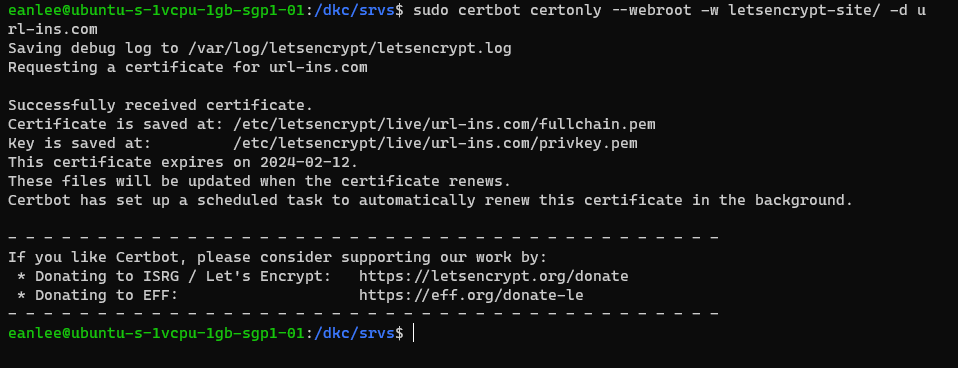
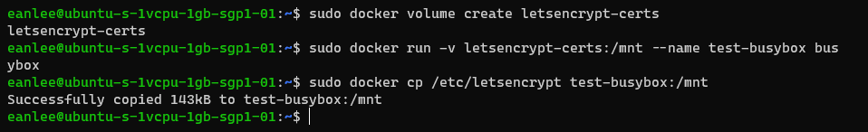
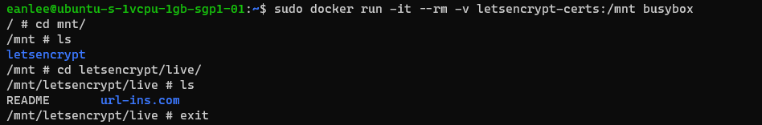

---
title: Docker | 縮網址服務實作記錄 (2) - 基於 Docker 的 Let's Encrypt 申請與設定
description: 本文介紹如何在 Docker 環境中，使用 Let's Encrypt 與 Certbot 申請免費 SSL/TLS 憑證，並設定 Nginx 支持 HTTPS。主要內容包括直接在 Ubuntu 主機使用 Certbot 配合 volume 掛載申請憑證、使用 Certbot 官方 Docker Image 的申請流程。適合需要在 Docker 容器中設定 HTTPS 的網站管理員或開發者參考。
date: 2023-11-17T16:38:06+08:00
lastmod: 2023-11-29T11:25:48+08:00
tags:
  - Docker
  - Nginx
  - Traefik
categories:
  - 架構
  - 軟體開發
keywords:
  - Docker
  - Nginx
  - Let's Encrypt
  - Traefik
  - certbot
slug: shorten-2-lets-encrypt-setting
series: 縮網址服務實作記錄
---

> 縮網址服務為 <https://url-ins.com/shorten/> ，有任何想法或回饋，可以在 [SurveyCake](https://www.surveycake.com/s/wgveX) 留下寶貴的意見。(為了維持主機的維運，在頁面內放入 Google Adsense 廣告。)

在 [縮網址服務實作記錄(1) - 基於 Docker 容器技術的網站服務架構實踐](../shorten-1-build-service-base-on-container/index.md) 中，已經完成基本服務的建立。

為了確保服務站台的可靠性與提升 SEO。接下來，就是要為服務站台增加 HTTPS 的 SSL/TLS 憑證保護。

`Let's Encrypt` 提供的免費的 SSL/TLS 憑證，雖然說有 3 個月的時間限制。但只要配合 `Certbot` 來協助 SSL/TLS 憑證申請與更新，就可以為站台提供更可靠的保護。

有趣的是，在研究與尋找如何進行 Ngnix 與 Let's Encrypt 設定的過程，無意中發現 [`Traefik`](https://traefik.io/)。一套高度支援 Dockr ，與 Ngnix 相似的反向代理工具(Reverse Proxy)，後續有機會使用，也會隨手記錄操作筆記。

> 在本篇文章中，主要是在討論以下的項目
>
> - 如何為 Container 內的 NGINX 進行 Let's Encrypt 的設定。
> - 使用 Certbot 官方提供的 docker Image 來申請 SSL/TLS 憑證。
> - Docker 的 Volume 的用法。

<!--more-->

在完成服務的架設後，已經可以使用 HTTP ，經由 Domain 連線到服務站台。再進一步，我們要藉由 SSL/TLS 憑證來提升服務站台的可靠性與安全性。

當然，我們可以選擇收費的憑證頒發機構(Certificate Authority, CA)，例如 TWCA、Sectigo、Certum 等等。在成本的考量下，選擇使用 [Let's Encrypt](https://letsencrypt.org/zh-tw/) 提供的 SSL/TLS 憑證。

在 Let's Encrypt 的[官方文件](https://letsencrypt.org/zh-tw/docs/client-options/)，也推薦使用 `Certbot` 來協助取得與安裝憑證。若是不符合需求，也有列出其他類型的工具。

額外補充，只要有實作 `ACME` ([Automatic Certificate Management Environment](https://en.wikipedia.org/wiki/Automated_Certificate_Management_Environment)) 協定的工具，都可以跟 Let's Encrypt 申請 SSL/TLS 憑證。

ACME 的驗證方式，可以進一步查看 Let's Encrypt 提供的 [ACME 驗證方式](https://letsencrypt.org/zh-tw/docs/challenge-types/) 說明。

當 Nginx 直接安裝在 Ubuntu 主機，可以參考 [NGINX 官方 Blog 說明](https://www.nginx.com/blog/using-free-ssltls-certificates-from-lets-encrypt-with-nginx/)，直接依據下列步驟，進行 Certbot 的安裝與 SSL/TLS 憑證的申請。

另外，由於 Certbot 已經整合 NGNX，可以使用 `certbot --nginx` 指令，自動更新 Nginx 組態，請求證書。也可以加上 `certonly` 參數，讓 certbot 只是單純申請 SSL/TLS 憑證，

```shell
# 安裝 Certbot
sudo apt-get update
sudo apt-get install certbot
sudo apt-get install python3-certbot-nginx

# 使用 Certbot 自動進行 NGINX 設定
sudo certbot --nginx -d example.com -d www.example.com
```

certbot 跟 Let's Encrypt 申請的 SSL/TLS 憑證，會存放在 `/etc/letsencrypt/live/{網域}`。

但是...

在將 NGINX 與靜態網站打包為 Docker Image 的前提下，若是在 Container 進行上述的設定，當更新 Docker Image 的版本時，會再建立一組新的 Container。此時需要再重新進行一次設定。

在接下來，我會記錄使用 Docker Mount/Volume 機制來保存 SSL/TLS 憑證，或是直接使用 Certbot 類似，但已經被包為 Docker Image 的工具，來協助進行設定。

## 基於 NGINX 的憑證申請與設定

### 1. 使用 `Certbot --webroot` 配合 Mount 來設定 SSL/TLS 憑證

首先，在 Ubuntu 主機安裝 certbot 套件。

```shell
# 安裝 Certbot
sudo apt-get update
sudo apt-get install certbot
sudo apt-get install python3-certbot-nginx
```

使用 `--webroot` 進行 Let's Encrypt 憑證申請，需要指定網站的根目錄。

為此，需要調整 `docker-compose.yaml` 與 `nginx.conf` 兩個部份。

1. 調整 docker-compose.yaml 檔內 `volumes` 的設定, 增加 `certbot --webroot` 使用的資料夾與 Container 內的目錄對應。

雖然我們是用 `--webroot` 的方法，但在 docker-compose.yml 千萬不要直接指定站台根目錄。這會導制站台直接出現 404 錯誤。

我們建立了一個 `letsencrypt-site` 的資料夾，以便 Certbot 存放 Let's Encrypt 驗證用的資料檔案。並讓它對應到 Container 內的 `/user/share/nginx/html/acme`，

```yaml
version: '3'

services:

  web:
    image: registry.gitlab.com/url-insight/url-insight/web:latest
    restart: always
    ports:
      - 80:80
      - 443:443
    volumes:
      - ./nginx.conf:/etc/nginx/nginx.conf:ro
      - ./letsencrypt-site:/usr/share/nginx/html/acme # --webroot 使用
    networks:
      -  gateway-web

networks:
  gateway:
    external: true
```

2. 設定 `nginx.conf`，讓 `/.well-known/acme-challenge` 可以指向 Container 內，存放 Let's Encrypt 驗證資料的檔案目錄。

```nginx.conf
server {
    listen 80;
    listen [::]:80;
    server_name url-ins.com;

    location ~ /.well-known/acme-challenge {
        allow all;
        root /usr/share/nginx/html/acme;
    }

    root /usr/share/nginx/html;
    index index.html;
}
```

再完成上述的兩個設定後，就可以使用 `certbot certonly --webroot` 來申請憑證。

```shell
# 使用 --webroot 的方式
sudo certbot certonly --webroot -w ./letsencrypt-site -d url-ins.com
```



此時，`fullchain.pem` 與 `privkey.pem` 是存放在 Ubuntu 主機的 `/etc/letsencrypt/live` 目錄下。

#### 將 SSL/TLS 憑證掛載到 Container

接下來，就是進行 HTTPS 的 SSL/TLS 憑證設定了。

為了讓 Container 可以使用剛剛申請的憑證，就必須將憑證所在的資訊夾，掛載到 Container 中。

有兩種作法可以選擇。

- 直接將 `/etc/letsencrypt/live` 目錄掛載到 Container 。
- 將憑證先放到 `volume` 之中，再把掛載 volume 到 Container。

##### 直接掛載 `/etc/letsencrypt/live` 內 SSL/TLS 憑證。

```yaml
version: '3'

services:

  web:
    image: registry.gitlab.com/url-insight/url-insight/web:latest
    restart: always
    ports:
      - 80:80
      - 443:443
    volumes:
      - ./nginx.conf:/etc/nginx/nginx.conf:ro
      - ./letsencrypt-site:/usr/share/nginx/html/acme
      - /etc/letsencrypt:/etc/letsencrypt # 直接掛載 for Let's Encrypt certificates
    networks:
      -  gateway-web

networks:
  gateway:
    external: true
```

##### 將 SSL/TLS 憑證放到 Docker Volume 後再掛載

- 增加 Docker Volume 來存放 certbot 順利取回的 SSL/TLS 憑證。

```shell
# 建立 Docker Volume
sudo docker volume create {volume_name}
```

接著把 SSL/TLS 憑證放到 volume 之中。

此時，我們需要先掛載 volume，才能把 SSL/TLS 憑證放到 volume。可以直接把 volume 掛到 `docker-compose.yml` 後，進行複制 SSL/TLS 憑證的動作。

不過，為了方便理解，使用 busybox 掛載剛剛建立出來的 volume。

```shell
# 建立 Volume
sudo docker volume create letsencrypt-certs

# 掛載 volume 到 busybox 內
sudo docker run -v letsencrypt-certs:/mnt --name test-busybox busybox

# 複製 /etc/letsencrypt/ 目錄到 busybox Container 的根目錄
sudo docker cp /etc/letsencrypt test-busybox:/mnt
```

簡單說明上述的指令。

- 使用 `docker volume create` 來建立一個空的 Docker volume。
- 在 `docker run` 時，使用 `-v` 來掛載 Docker volume，並宣告建立出來的 Container name 為 testbusybox
- 最後，使用 `docker cp` 來進行資料夾的複製。



當然，如果要確認 volume 是否有資料，可以再建一個臨時 Container 來進行查看。

```shell
sudo docker run -it --rm -v letsencrypt-certs:/mnt busybox
```



再完成將 `*.pem` 複製到 volume 的動作後，就是把 volume 掛載到 NGINX 所在的 Container 中。

調整後的 `docker-compose.yml` 如下。

```yaml
version: '3'

services:

  web:
    image: registry.gitlab.com/url-insight/url-insight/web:latest
    restart: always
    ports:
      - 80:80
      - 443:443
    volumes:
      - ./nginx.conf:/etc/nginx/nginx.conf:ro
      - ./letsencrypt-site:/usr/share/nginx/html/acme # --webroot 使用
      - letsencrypt-certs:/etc/letsencryptexit # for Let's Encrypt certificates
    networks:
      -  gateway-web

volumes:
	letsencrypt-certs: # Define the volume for Let's Encrypt certificates
		external: true

networks:
  gateway:
    external: true
```

#### 進行 `nginx.conf` 的 HTTPS 設定

在完成 SSL/TLS 憑證申請後，接下來就是進行 `nginx.conf` 的調整，加入 443 的 HTTPS 設定。並將 HTTP 的請求，永久轉址到 HTTPS。

```nginx.conf

http {
 server{
    listen 80;
    listen [::]:80;

    server_name url-ins.com www.url-ins.com;
    server_tokens off;

    location / {
      return 301 https://$host$request_uri;
    }
  }

  server {
    listen 443 default_server ssl http2;
    listen [::]:443 ssl http2;

    server_name url-ins.com www.url-ins.com;

    ssl_protocols   TLSv1.2 TLSv1.3;
    ssl_certificate /etc/letsencrypt/live/url-ins.com/fullchain.pem;
    ssl_certificate_key /etc/letsencrypt/live/url-ins.com/privkey.pem;

}
```

在完成設定後，別忘了讓 NGINX 重新載入 `nginx.conf` 的設定。

### 2. 使用 Certbox 官方的 Docker Image

若是不想要在 Ubuntu 主機內，安裝 `certbot`，也可以選擇使用 Docker Hub 的 [certbot/certbot](https://hub.docker.com/r/certbot/certbot/) 來協助申請 SSL/TLS 憑證。

在 Certbot 的官方說明文件 [Get Certbot — running-with-docker](https://eff-certbot.readthedocs.io/en/latest/install.html#running-with-docker) 也有詳細的操作說明。

```shell
sudo docker run -it --rm --name certbot \
            -v "/etc/letsencrypt:/etc/letsencrypt" \
            -v "/var/lib/letsencrypt:/var/lib/letsencrypt" \
            certbot/certbot certonly
```

簡單說明一下上述的指令意思。

- 使用 `certbot/certbot` 的 Docker Image，建立一個用完就刪除的 Container。
- 啟動 Container 時，同時傳入 `certonly` 的參數。
- 掛載 `/etc/letsencrypt` 與 `/var/lib/letsencrypt` 對應的資料夾。

`/var/lib/letsencrypt` 用於存放 `.well-known/acme-challenge` 的所有 HTTP 請求，而 `/etc/letsencrypt` 則是存放 Let's Encrypt 發放的 SSL/TLS 憑證。

在 [How to handle HTTPS using Nginx, Let's encrypt and Docker - Mindsers Blog](https://mindsers.blog/en/post/https-using-nginx-certbot-docker/) 這篇，作者直接使用 docker compose 來完成 certbox 與 nginx 的整合。內容寫的還滿清楚的，值得一看。

不過，因為我個人想要維持 dokcer-compose.yml 的單純，所以把 `Certbot` Docker Image 的操作拆分。

動作步驟如下。

- 建立 `Certbot` 與 docker-compose.yml 共用的 docker volume。
- 調整 docker-compose.yml 中，掛載 docker volume。
- 調整 NGINX 使用的 nginx.conf。
- 建立並運行 `Certbot` 的 Container。

首先，建立存放 Let's Encrypt `.well-known/acme-challenge` 驗證資料與發送 SSL/TLS 憑證的 docker volume。

```shell
# 存放 Let's Encrypt 發放的 SSL/TLS 憑證
sudo docker volume create letsencrypt-certs

# 存放 Let's Encrypt acme-challenge 驗證資料
sudo docker volume create letsencrtpt-acme
```

接著，調整 docker-compose.yml，將 `letsencrypt-certs` 與 `letsencrtpt-acme` 兩個 docker volume 掛上去。

```yml
version: '3'

services:

  web:
    image: registry.gitlab.com/url-insight/url-insight/web:latest
    restart: always
    ports:
      - 80:80
      - 443:443
    volumes:
      - ./nginx.conf:/etc/nginx/nginx.conf:ro
      - letsencrtpt-acme:/usr/share/nginx/html/acme # --webroot 使用
      - letsencrypt-certs:/etc/letsencrypt # for Let's Encrypt certificates
    networks:
      -  gateway-web

volumes:
	letsencrypt-certs: # Define the volume for Let's Encrypt certificates
		external: true
	letsencrtpt-acme:
		external: true

networks:
  gateway:
    external: true
```

調整完 docker-compose.yml 後，接著來調整 NIGIX 的設定。

在這邊，`ssl_certificate` 與 `ssl_certificate_key` 預設使用 Let's Encrypt SSL/TLS 的資料夾位置。實務上，可以依自行規劃進行調整指定的位置。

```nginx.conf
http {
 server{
    listen 80;
    listen [::]:80;

    server_name url-ins.com www.url-ins.com;
    server_tokens off;

    location / {
      return 301 https://$host$request_uri;
    }
  }

  server {
    listen 443 default_server ssl http2;
    listen [::]:443 ssl http2;

    server_name url-ins.com www.url-ins.com;

    ssl_protocols   TLSv1.2 TLSv1.3;
    ssl_certificate /etc/letsencrypt/live/url-ins.com/fullchain.pem;
    ssl_certificate_key /etc/letsencrypt/live/url-ins.com/privkey.pem;
}
```

完成前面的設定後，就是使用 `docker compose up` 把 NGINX 站台啟動。

接著啟動 Certbot 的 Containr，進行 Let's Encrypt 的 SSL/TLS 憑證申請。

```shell
sudo docker run -it --rm --name certbot \
            -v "letsencrypt-certs:/etc/letsencrypt" \
            -v "letsencrypt-acme:/var/lib/letsencrypt" \
            certbot/certbot certonly --webroot \
            -w "/var/lib/letsencrypt" \
            -d url-ins.com
```

完成後，就完成了 SSL/TLS 憑證的申請作業了。

## 補充資料

▶ 站內文章

- [縮網址服務實作記錄(1) - 基於 Docker 容器技術的網站服務架構實踐](../shorten-1-build-service-base-on-container/index.md)

▶ 外部文章

中文資源

- [不合理的要求是磨練：Docker 架站 | Jonny Huang 的學習筆記](https://jonny-huang.github.io/docker/docker_03/)
- [設定 Let's Encrypt HTTPS nginx certbot SSL 憑證自動更新 教學](https://blog.hellojcc.tw/setup-https-with-letsencrypt-on-nginx/)

英文資源

- [User Guide — Certbot 2.7.0.dev0 documentation](https://eff-certbot.readthedocs.io/en/latest/using.html#where-certs)
- [Using Free Let’s Encrypt SSL/TLS Certificates with NGINX](https://www.nginx.com/blog/using-free-ssltls-certificates-from-lets-encrypt-with-nginx/)
- [How to handle HTTPS using Nginx, Let's encrypt and Docker - Mindsers Blog](https://mindsers.blog/en/post/https-using-nginx-certbot-docker/)
- [Nginx and Let’s Encrypt with Docker in Less Than 5 Minutes | by Philipp | Medium](https://pentacent.medium.com/nginx-and-lets-encrypt-with-docker-in-less-than-5-minutes-b4b8a60d3a71)
- [How To Secure Nginx with Let's Encrypt on Ubuntu 20.04 | DigitalOcean](https://www.digitalocean.com/community/tutorials/how-to-secure-nginx-with-let-s-encrypt-on-ubuntu-20-04)
