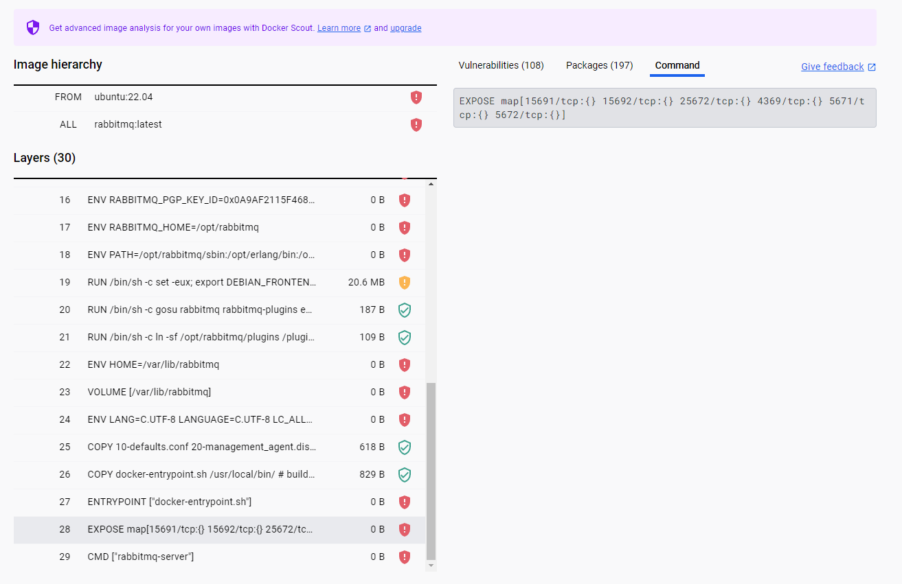
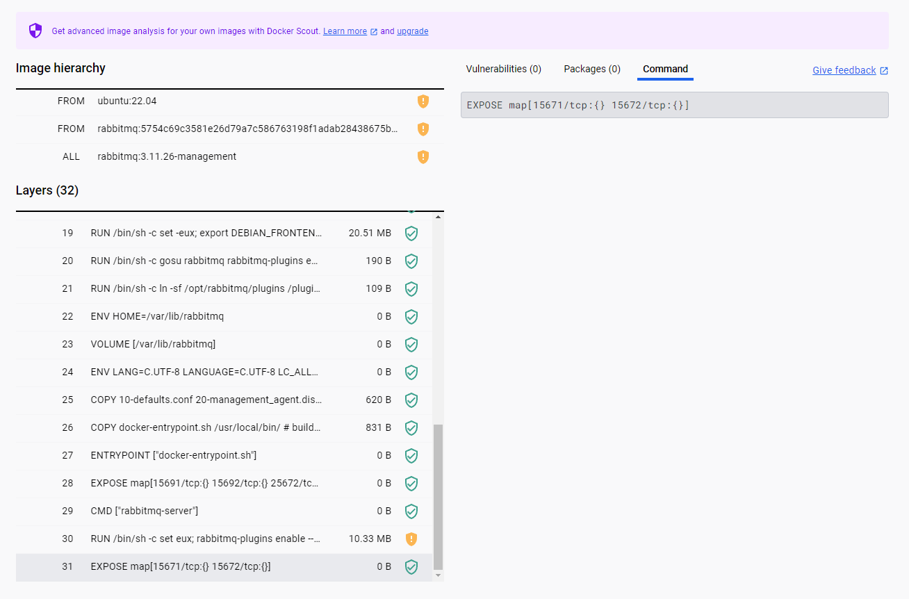
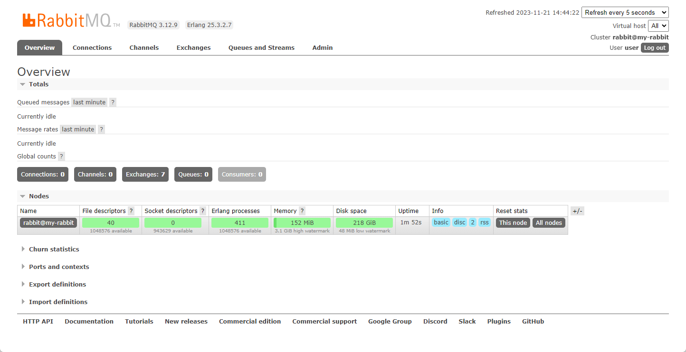
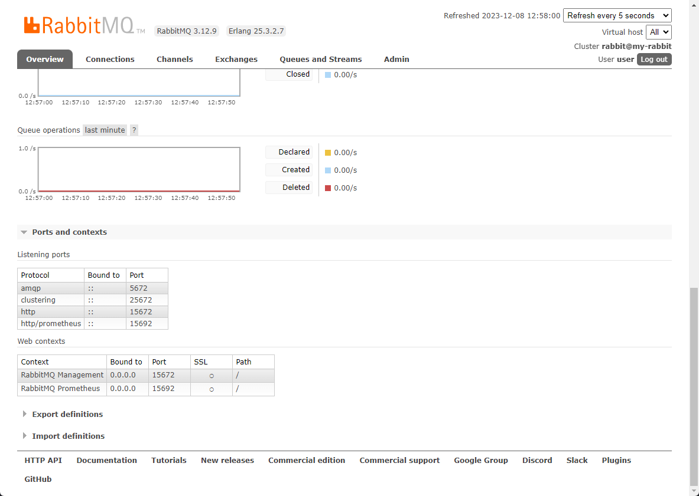
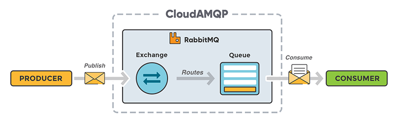
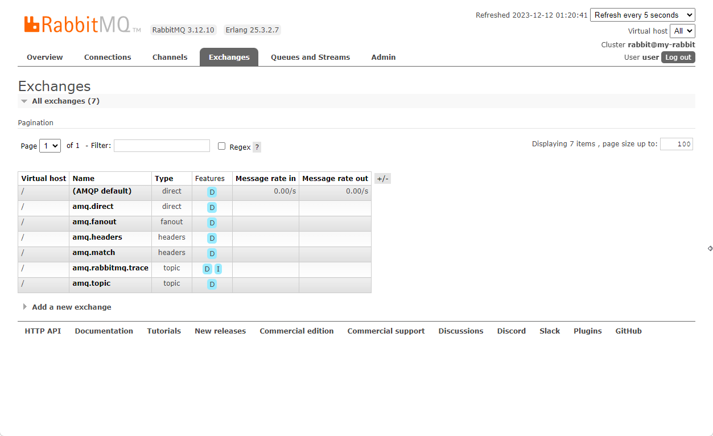
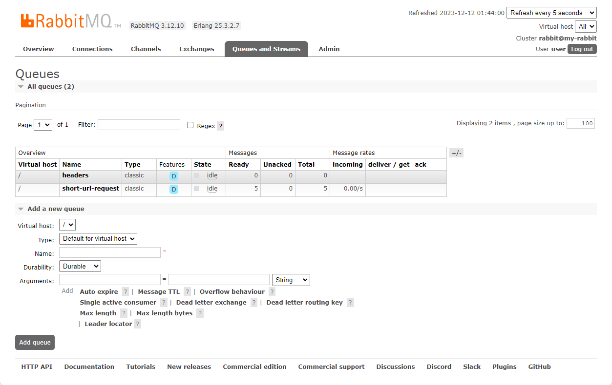

---
title: 縮網址服務實作記錄(3) - 使用 RabbitMQ 以事件驅動的方式分析縮網址的資訊來源
description: 使用 RabbitMQ 來建立一個 Event-Driven 的縮網址點擊分析的功能。透過生產者與消費者模型，讓服務與數據分析的行為解耦。避免後續增修數據分析功能時，影響到原本正常的功能。
date: 2023-12-12
lastmod: 
tags:
  - Docker
  - RabbitMQ
  - Event-Driven
categories:
  - 軟體開發
  - 系列文章
keywords:
  - RabbitMQ
  - .NET Core
  - Event-Driven
  - Docker
slug: shorten-use-rabbitmq-process-analysis-event
series: 縮網址服務實作記錄
---

> 縮網址服務為 https://url-ins.com/shorten/ ，有任何想法或回饋，可以在 [SurveyCake](https://www.surveycake.com/s/wgveX) 留下寶貴的意見。(為了維持主機的維運，在頁面內放入 Google Adsense 廣告。)

在完成短網址的轉址服務，接下來，就要開始針對轉址的請求來源與動作，進行數據的統計。

數據的統計，往往會依需求開始無限的延展。從最簡單的總訪問次數，時段訪問次數，訪問來源地區等等。

最快的方式，當然是直接寫成現成轉址的 API 中，但個人覺得這種作法，對後續開發/維運都不是一種好的方式。

其一、直接在 Web API 內實作數據統計的情境。每當只是增加一種訪問數據分析，就要去異常到穩定運行服務。此方式的修改成本包含但不限於：改 A 壞 B 的風險、再測驗的 QA 成本、部署的成本、等等。

其二、轉址用的 API 的 HTTP Method 為 GET，在 GET 的行為內，夾雜著 INSERT/UPDATE 的行為。在後續維護、盤查、或調整程式時，都有很大機率遺漏這個地方。

設計架構時，由於已確定訪問數據分析會有多次調整。為了減少後續的開發維護成本，透過[生產者與消費者模型(producer-consumers pattern)](../../../Pattern/producer-consumers/index.md)，讓服務與數據分析的行為解耦。且數據分析結果無須即時呈現。

最終採用 Message Queue 的機制，並使用 RabbitMQ 作為 Message Queue 的解決方案。

> 這一篇文章的內容，主要的內容包含以下項目。
>
> - RabbitMQ 的安裝設定、與基本使用說明。
> - 在 ASP.NET Core Web API 中發送事件。
> - 使用 .NET Core Console 串接 RabbitMQ 事件。

## 開發環境

開發框架: .NET 8 SDK
解決方案: RabbitMQ 3.12.9

## RabbitMQ 的安裝、設定與使用

現行的 Message Queue 解決方案有很多，例如 RabbitMQ、Apache ActiveMQ、Apache RocketMQ 等等，但在這邊，基於使用情境的考量，選擇使用 RabbitMQ。

### 運行 RabbitMQ 的 Container

RabbitMQ 的 Docker Image 可以直接從 [Docker Hub](https://hub.docker.com/_/rabbitmq) 取得。

在這邊，我們選擇使用 `rabbitmq:3-management` 這個 Tag 版本，方便使用 RabbitMQ 提供的 Web 管理站台。

若依 RabbitMQ 在 Docker Hub 的 Overview 內的文件，直接使用官方的範例，只會得到一個無法進入使用者操作介面的 Container。

```shell
docker run -d --hostname my-rabbit --name some-rabbit -e RABBITMQ_DEFAULT_USER=user -e RABBITMQ_DEFAULT_PASS=password rabbitmq:3-management
```

這是因為範例中，並沒有指定 Bind 的 Port，而且在 Docker Hub 的 Overview 內的文件，並沒有詳細的說明使用 PORT。

當進一步查看 RabbitMQ Tag 為 `latest` 內容時，可以看到 RabbitMQ 的 `Expose` 設定。它開放 15691/TCP、15692/TCP、25672/TCP、4369/TCP、5671/TCP、5672/TCP 這 6 個 PORT。


如果是使用含有管理 UI 的 `rabbitmq:3-management` 時，除了原本的 PORT 之外，會再增加 15671/TCP 與 15672/TCP 。


當我們到 RabbitMQ 提供的官方文件([Networking and RabbitMQ](https://www.rabbitmq.com/networking.html#ports)) 查看資料後，就可以知道各 Port 的用途。

- 15671: 用於 HTTP API clients, 管理介面與 rabbitmqadmin 使用。HTTPS(TLS)
- 15672: 用於 HTTP API clients, 管理介面與 rabbitmqadmin 使用。HTTP(no-TLS)
- 15691: 提供 Prometheus metrics 使用。HTTPS(TLS)
- 15692: 提供 Prometheus metrics 使用。HTTP(no-TLS)
- 25672: RabbitMQ Node 內部通訊使用。
- 4369: 用於 RabbitMQ Node 與 CLI Tools。
- 5671: AMQP 1.0 用戶端，TLS 加密
- 5672: AMQP 0-9-1 用戶端，不加密。

除了使用 AMQP 0-9-1 收發訊息外，同時使用使用介面。因此指定 5672 與 15672 兩個 PORT。

```shell
docker run -d --hostname my-rabbit --name some-rabbit -p 5672:5672 -p 15672:15672 -e RABBITMQ_DEFAULT_USER=user -e RABBITMQ_DEFAULT_PASS=password rabbitmq:3-management
```



回到 RabbitMQ 的使用概念。

在 [CloudAMQP](https://www.cloudamqp.com) 提供的流程圖，當 Producer 準備發送訊息給 RabbitMQ 時，首先會建立一個 `channel`，並在 channel 內指定使用的 `Exchange` 與 `RouteKey`。訊息會依不同 `Exchange` 類型，來判斷要派發到那一個 `Queue`。

而 Consumer 要從 Queue 取得訊息時，也需要先建立 `channel`，並告知要從那一個 Queue 取得訊息。



### Exchange 交換器

首先，來聊聊 Exchange，它是訊息的路由器，負責接收 Producer 訊息，並依 Exchange Type 與 Route Key 來決定將訊息派發到某個 Queue 之中。

Exchange Type 共有 `Direct`、`Fanout`、`Topic`、`Header` 四種類型。

| Exchange type | Default pre-declared names              | 說明                                                      |
| ------------- | --------------------------------------- | --------------------------------------------------------- |
| Direct        | (Empty string) and amq.direct           | 最簡單的使用方式，直接使用 Route Key 來派發到對應的 Queue |
| Fanout        | amq.fanout                              | 將訊息發到所有 Bind 此 Exchange 的 Queue                  |
| Topic         | amq.topic                               | 通常用於 publish/subscribe pattern 的使用情境             |
| Headers       | amq.match (and amq.headers in RabbitMQ) | 會忽略 Route Key，使用 Header 內的多個屬性來進行路由。    |



從 RabbitMQ Management 的 Exchange 頁面，可以看預設的 Exchange。

如果預設的 Exchange 不符合使用，可以直接在 `Add a new exchange` 區塊進行設定，也可以直接在程式中宣告。

```csharp
// 宣告一個 name = logs-direct 且 Direct type 的 exchange
channel.ExchangeDeclare("logs-direct", ExchangeType.Direct);
```

### Queue 佇列

Queue 是訊息的暫存區，用來存放訊息，直到 Consumer 前來處理。一個 Queue 可以綁定到一個或多個 Exchange。


除了在 RabbitMQ Management 上直接建立 Queue 外，當然也可以直接在程式中設定。

```csharp
channel.QueueDeclare(queue: "task_queue",
                     durable: true,
                     exclusive: false,
                     autoDelete: false,
                     arguments: null);
```

在宣告 Queue 時，使用的參數如下

| 參數名稱   | 說明                                                         |
| ---------- | ------------------------------------------------------------ |
| durable    | 當重新啟動 RabbitMQ 後，Queue 是否還存在                     |
| exclusive  | 獨佔模式，只能給一個連線使用，當該連線關閉後，自行刪除 Queue |
| autoDelete | 當最後一個 Consumer 離開 Queue 後，Queue 會自行刪除          |
| arguments  | 選項，可用於設定訊息的長度限制、TTL 等等                     |

### Channel 通道

Channel 是實際進行訊息發布、消費的通道。Connection 下可以開啟多個 Channel 進行操作。

```csharp
var channel = connection.CreateModel(); // 建立 channel
channel.BasicPublish(...);
```

實際應用時，若 Queue 使用預設 Direct 的 Exchange, 在使用時，直接指定 `BasicPublish` 內的 exchange 為空字串即可。

```csharp
var channel = connection.CreateModel();

channel.QueueDeclare("queue1", true, false, false, null);

channel.BasicPublish(exchange: "", routingkey: "routingKey", null, body);
```

若是要使用其他的 Exchange，則需先宣告 Exchange 和 Queue，並進行綁定。

```csharp
var channel = connection.CreateModel();

channel.ExchangeDeclare("logs-direct", ExchangeType.Direct);

channel.QueueDeclare("queue1", true, false, false, null);
channel.QueueBind("queue1", "logs-direct", "routingKey");

channel.BasicPublish("logs-direct", "routingKey", null, body);
```

## Producer: 從 ASP.NET Core Middleware 發送事件

ASP.NET Core Web API 作為 Event 的發送端，我們需要決定在什麼時機點進行 Event 訊息的發送。

考量只有呼叫轉址 API 的當下，才觸發分析事件，所以將發送 Event 訊息的時機點，定在 ApiControler 之中。

首先，先安裝 `RabbitMQ.Client` 的 Nuget 套件。

```shell
dotnet add package RabbitMQ.Client --version 6.7.0
```

接下來，我們希望使用 RabbitMQ.Client 時，可以使用 DI 的方式，直接取得 RabbitMQ 的 `Connection`。

在 `Program.cs` 中，進行 `RabbitMQ.Client.IConnection` 的 DI 注入。

```csharp
services.AddSingleton<RabbitMQ.Client.IConnection>(sp =>
{
    var factory = new RabbitMQ.Client.ConnectionFactory() { HostName = "localhost" };
    return factory.CreateConnection();
});
```

最後，就可以到 API Controller 中，進行 Event 訊息的發送。

此時，我們將請求來源的 IP 與 id 作為 Event 的 payload，發送到 `redirect-event` 的 RabbitMQ Queue 之中。

```csharp
private readonly IConnection _connection;

public MyController(IConnection connection)
{
    this._connection = connection;

}

[HttpGet("{id}")]
public IActionResult Redirect(string id)
{
	var model = new
	{
	    Id = id,
	    IP = this.HttpContext.Connection.RemoteIpAddress?.ToString()
	};
    var body = Encoding.UTF8.GetBytes(JsonSerializer.Serialize(model));

	var channel = connection.CreateModel();

	// 宣告 Queue
	channel.QueueDeclare(routingKey,
						 durable: true,
						 exclusive: false,
						 autoDelete: false,
						 arguments: null);

	// 發送訊息
    channel.BasicPublish(exchange: "",
						 routingKey: "redirect-event",
						 basicProperties: null,
						 body: body);
	channel.close();

    return Ok();
}
```

當外部呼叫 API 時，就會將 ID 與 IP 資料物件，轉為 JSON 發送到 `redirect-event` 的 RabbitMQ Queue。

## Consumer: 使用 .NET Core Console 監控並處理分析事件

完成了 Event 訊息的發送到後，接下來就要來要實作 Consumer，負責處理 Event 事件。

而 Consumer 的部份，選擇使用 Console Application 開發。

老樣子，先安裝 `RabbitMQ.Client` 的 Nuget 套件，接著 `Program.cs` 內，進行 RabbitMQ Customer 的設定，以便接收 Event。

RabbitMQ 官方很貼心的提供了 Example，調整 Example Code 的內容，就可以直接使用。

```csharp
// 設定 connection 與 channel
var factory = new ConnectionFactory { HostName = "localhost" };
using var connection = factory.CreateConnection();
using var channel = connection.CreateModel();

// 設定 channel 一次只能取一筆訊息
channel.BasicQos(prefetchSize: 0, prefetchCount: 1, global: false);

// 設定 consumer
var consumer = new EventingBasicConsumer(channel);
consumer.Received += (model, ea) =>
{
	// 取得 Body 資料，並轉為字串
    byte[] body = ea.Body.ToArray();
    var message = Encoding.UTF8.GetString(body);

	// import: 實作處理資料的區塊
	Process(message);

    // here channel could also be accessed as ((EventingBasicConsumer)sender).Model
    // 回報 RabbitMQ, 特定 delivery Tag 的 Event 處理完成。
    channel.BasicAck(deliveryTag: ea.DeliveryTag, multiple: false);
};

// 開始接收訊息
channel.BasicConsume(queue: "task_queue",
                     autoAck: false,
                     consumer: consumer);

Console.ReadLine();
```

要注意的是，如果指定的 Queue Name 不存在，在運行到 `channel.BasicConsume` 時，會出現以下的錯誤訊息

```plaintext
RabbitMQ.Client.Exceptions.OperationInterruptedException: The AMQP operation was interrupted: AMQP close-reason, initiated by Peer, code=404, text='NOT_FOUND - no queue 'task_queue' in vhost '/'', classId=60, methodId=20
```

## 使用 docker compose 建立一個完整服務

我們分別將 Web API、RabbitMQ、Console App 三個服務包為 Docker Image，透過 docker-compose 整合，達到 Web API 發送訊息，Console App 處理訊息的流程。

下述 docker-compose.yml 為本機環境的設定檔。提供參考。

```yaml
version: '3'

services:
  webapi:
    image: registry.gitlab.com/url-insight/url-insight/api:latest
    restart: always
    expose: 
      - 80
      - 443
    environment:
      - ASPNETCORE_ENVIRONMENT=Production
      - ConnectionStrings:${DB_ConnctionString}
    networks:
      - backend-api
    depends_on:
      - postgres
  
  postgres:
    image: postgres:16
    restart: always
    environment:
      - POSTGRES_USER=${PSG_USER}$
      - POSTGRES_PASSWORD=${PSG_PWD}
    expose:
      - 5432
    volumes:
      - postgres-data:/var/lib/postgresql/data
    networks:
      - backend

  rabbit:
    image: rabbitmq:3-management
    restart: always
    ports:
      - 15672:15672
      - 5672:5672
    networks:
      - backend-api

  event-proc:
    image: url-insight/event-processor:latest
    restart: always
    environment:
      - ConnectionStrings:${DB_ConnctionString}
      - RabbitMQ:Host=rabbit
    networks:
      - backend-api
    depends_on:
      - rabbit

networks:
  backend-api:

volumes:
  postgres-data:
```

## 補充資料

▶ 延伸閱讀

- [縮網址服務實作記錄(1) - 基於 Docker 容器技術的網站服務架構實踐](../shorten-1-build-service-base-on-container/index.md)
- [縮網址服務實作記錄(2) - 基於 Container 的 Let's Encrypt 申請與設定](../shorten-2-lets-encrypt-setting/index.md)

▶ 外部文章

- [RabbitMQ container with Docker Compose | Change(b)log](https://zgadzaj.com/development/docker/docker-compose/containers/rabbitmq)
- [Implement RabbitMQ on Docker in 20 minutes - Architect.io](https://www.architect.io/blog/2021-01-19/rabbitmq-docker-tutorial/)
- [.NET Core 使用 RabbitMQ - 晓晨 Master - 博客园](https://www.cnblogs.com/stulzq/p/7551819.html)
- [CloudAMQP - Queue starts here.](https://www.cloudamqp.com/)
- [Produce and consume messages with RabbitMQ and .NET Core API | by Šimo Matijević | Medium](https://medium.com/@simo.matijevic/produce-and-consume-messages-with-rabbitmq-and-net-core-api-9d733f93c145)

