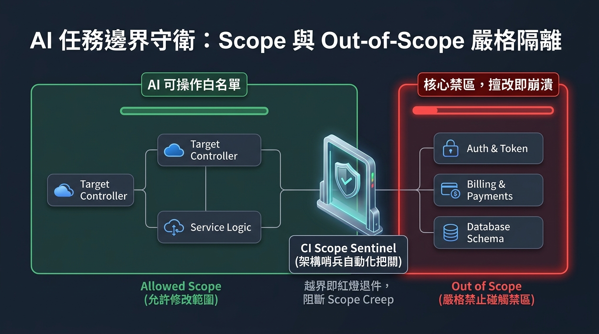
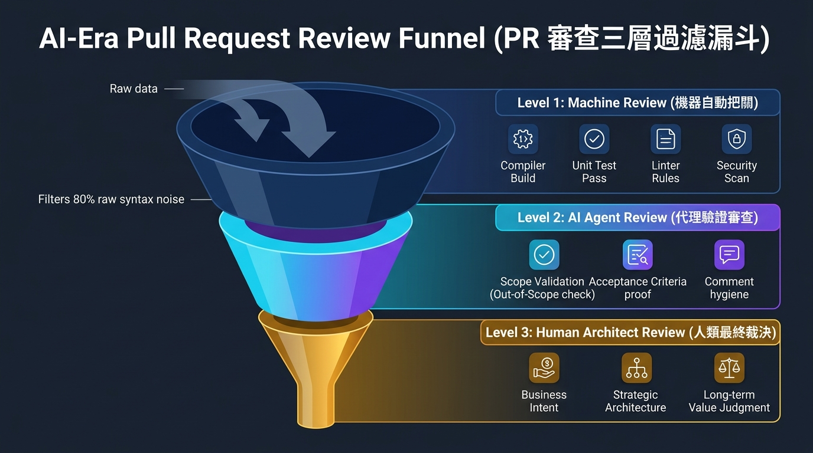
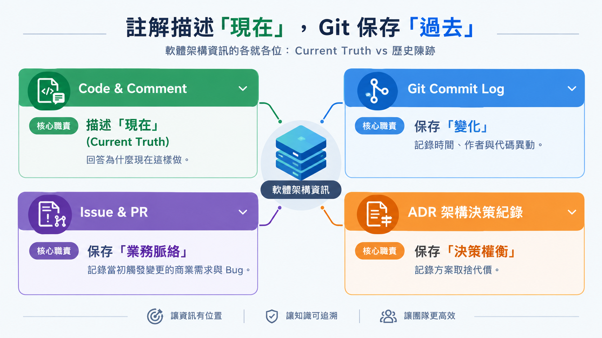
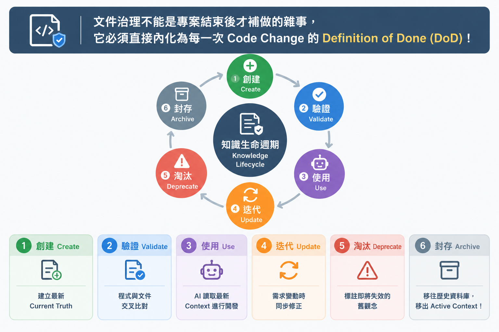

> 🔖 長話短說 🔖
>
> - **真正的瓶頸轉移**：AI 時代真正稀缺的不是 Coding Capacity（寫程式產能），而是 Human Cognitive Capacity（人類理解與審查的認知極限）。
> - **需求單一化契約**：一個 Issue 只能有一個單一職責（One Issue = One Requirement）。明確定義 Scope 與 Out of Scope，杜絕 AI「順便多做」引發的巨型 PR。
> - **規範的三層控制**：規範不能只靠 Prompt 提醒。必須區分為 Instruction（提示它）、Validation（驗證它）與 Constraint（系統權限卡死它）。
> - **PR 本質的重構**：PR 不該再是幾千行的程式碼 Diff 堆疊，而應成為「需求 ↔ 實作 ↔ 履約證據」的一對一驗證報告。
> - **Comment 描述現在，而非歷史**：程式碼註解只保留目前有效的 Current Truth；過時歷史移往 Git、Issue 與 ADR，避免歷史雜訊污染 AI 的 Context。
> - **從 Living Document 到 Living Knowledge**：文件治理的核心不是記錄更多，而是「持續淘汰過期資訊」。淘汰錯誤知識，比塞入海量 Context 更關鍵。

在團隊引入 AI 輔助開發與 Coding Agent 後，許多架構師與 Tech Lead 很快會撞上一道前所未有的工程高牆：**AI 生成程式碼的速度，已經徹底甩開了人類審查與理解程式碼的認知頻寬。**

短短十幾分鐘內，AI 就能提交數個涉及跨模組變更的 Pull Request，且單元測試全數通過。但這看似高產能的背後，往往隱藏著嚴重的治理風險——在有限的 Review 時間內，沒有人能僅憑肉眼逐行確認這幾百行甚至跨層程式碼是否越過了架構邊界，或埋下了未爆彈。

<!--more-->

這正是現代軟體工程現場最殘酷的矛盾：

**程式碼的生產成本已經崩跌至零，但人類驗證與理解程式碼的認知成本，正在以指數級飆升至無限大。**

當 AI 的開發速度遠遠超過人類的理解與審查速度時，真正的技術瓶頸已經徹底轉移。本文將深入探討如何落實「AI 開發治理 (AI Development Governance)」，透過「需求單一化契約、執行三層制約、PR 履約證據化、註解 Current Truth 與 Context 衛生」等核心軟體工程思維，打造一套在 AI 高速開發狂潮下，能有效降低團隊認知負載 (Cognitive Load)、依然能把系統牢牢鎖在工程師掌心之中的治理閉環。

---

## 一、典範轉移：AI 開發最大的瓶頸，正在轉移為人類認知

在傳統軟體開發生命週期中，主要的瓶頸往往卡在「開發產能」——需求排期太滿、工程師人手不足、程式碼打字實作緩慢。

但在 AI Agent 全面介入的環境下，整個生產鏈路的瓶頸點發生了根本性的轉移：

```text
傳統開發鏈路瓶頸：
需求釐清 ────→ [ 程式碼實作 (瓶頸) ] ────→ 審查與測試 ────→ 上線

AI 時代鏈路瓶頸：
需求釐清 ────→ 快速 AI 產出 ────→ [ 人類認知審查 (新瓶頸！) ] ────→ 累積未爆彈
```

當 AI 幾分鐘就能生成數百行程式碼時，人類大腦的認知頻寬（Cognitive Bandwidth）就成了系統唯一的單點瓶頸（Single Point of Failure）。

如果我們在同一個 Issue 裡同時要求 AI「處理前端介面、調整後端 API、修改資料庫欄位、順便加上權限檢查與發送通知」，AI 通常會二話不說把所有事情混在一個 PR 裡送上來。

此時人類面對的，不再是審查一個功能點，而是要在短時間內理解一個「微型分散式系統的跨層變更」。最後只有兩種悲劇下場：

1. **形式主義盲目 Approve**：人類疲於奔命，看個幾眼測試通過就按下 Merge，將未知的架構隱患埋入系統。
2. **Review 嚴重堵塞**：人類花費數倍時間抽絲剝繭，審查進度完全跟不上 AI 產出，導致開發節奏全盤卡死。

因此，**AI 時代的系統設計目標，不應盲目追求 AI 產出更多的程式碼，而是要盡一切可能降低人類理解每一個 AI 產出的認知負載（Cognitive Load）。**

---

## 二、任務交付的閉環治理：從需求契約、三層防護到 PR 履約審查

要防止 AI 在高速開發中越界失控，第一步就是建立一條從「需求定義 ➔ 執行制約 ➔ 成果審查」的完整工程閉環。

### 2.1 需求必須單一化：One Issue = One Requirement

為了不讓人腦在審查時超載，第一道防線就是**需求的單純化與單一化**。

核心原則非常乾脆：

> **一個 Issue，只做一個單一職責的需求（One Issue = One Requirement = Single Responsibility）。**

#### 複雜需求的解構公式 (Decomposition)

當面對一個跨系統的複雜需求時，絕對不允許直接塞給 AI 單一 Prompt 叫它「全包處理」。必須先進行需求解構（Requirement Decomposition）：

```text
        ┌────────────────────────────────┐
        │ 業務需求 (Complex Requirement) │
        └───────────────┬────────────────┘
                        │
       [ 需求解構 Requirement Decomposition ]
                        │
    ┌───────────────────┼───────────────────┐
    ▼                   ▼                   ▼
┌───────────────┐ ┌───────────────┐ ┌───────────────┐
│ Issue A (DB)  │ │ Issue B (API) │ │ Issue C (UI)  │
│ 單一資料模型變更 │ │ 單一業務邏輯實作 │ │ 單一介面元件呈現 │
└───────┬───────┘ └───────┬───────┘ └───────┬───────┘
        ▼                 ▼                 ▼
   獨立實作與驗證      獨立實作與驗證      獨立實作與驗證
```

將複雜需求拆解成多個可以**獨立理解、獨立實作、獨立驗證**的最小單位。

#### 建立「需求契約」(Requirement Contract)

每一個派發給 AI 的 Issue，都不該只是幾句隨意的對話（如「幫我新增一個使用者修改 Email 功能」），而必須構成一份嚴謹的 **Requirement Contract**：

| 契約項目 | 定義與說明 | 關鍵目的 |
| :--- | :--- | :--- |
| **Objective** | 為什麼要做？解決什麼業務痛點？ | 錨定業務核心價值，防止 AI 偏離方向 |
| **Scope** | 這次明確允許修改的範圍（如僅限 `UserController` 與 `UserService`） | 限制修改邊界 |
| **Out of Scope** | **明確嚴格禁止修改的範圍**（如禁止碰 Authentication 與 Notification） | **最關鍵防線！** 防止 AI 擅自「順便重構」 |
| **Acceptance Criteria** | 驗收條件（必須採用可測試規格，如 Given-When-Then） | 提供自動化驗證標竿 |
| **Constraints** | 必須遵守的架構規範與使用的相依套件 | 防止便宜行事 |
| **Expected Changes** | 預期會異動的檔案與資料夾路徑清單 | 便於比對 Scope Violation |

#### 為什麼 Scope 與 Out of Scope 如此致命？落實嚴格邊界驗證 (Scope Validation)

因為在實務中，**AI 最嚴重的毛病往往不是「做不到」，而是「太容易多做」！**因此落實嚴格的邊界驗證（Scope Validation），是避免專案被 AI 擅自重構所吞噬的第一道防線。



這就像請水電師傅到府更換浴室水龍頭，他卻擅自把廚房管線拆除重接一樣——出發點或許是為了整體管線好，但未經授權的跨界修改，只會帶來難以預期的系統風險與維護成本。

當你要求 AI「在使用者個人頁面新增顯示 Email」，它常常會發揮過剩的主動性，順便修改 User Model、重構 JWT 驗證、改寫發信機制，甚至更動資料庫 Migration。即使所有單元測試都跑出綠燈，這個 PR 的認知審查成本也已嚴重超標。

因此，**明確定義 Out of Scope，就是為 AI 劃定不可逾越的實體邊界：只處理目標功能，非關聯模組一律禁止變更。**它是防止 AI 越界重構的核心防線。

---

### 2.2 防護機制的剛性硬化：從指令、驗證到強制制約

很多團隊以為寫好了 Prompt、訂好了 Coding Style，AI 就會乖乖聽話。

但在實際的專案場域中，你會發現 AI 為了快速交差，經常會走捷徑、繞過架構規範，或是便宜行事。

**規範不能只停留在告訴 AI「你應該怎麼做」，而是必須具備驗證機制；當驗證做不到時，就必須透過系統層級直接限制其行為。**

這就是軟體工程治理的三層防護網：

```mermaid
flowchart TD
    subgraph L1["Level 1: Instruction (提示層 - 軟性防線)"]
        P["Prompt & Rules 規範檔案<br/>『告訴 AI 你應該這樣做』"]
    end

    subgraph L2["Level 2: Validation (驗證層 - 自動化防線)"]
        T["NetArchTest 架構單元測試 & Linter<br/>『證明你真的沒有越界』"]
    end

    subgraph L3["Level 3: Constraint (制約層 - 系統硬性限制)"]
        C["CI Scope Sentinel 哨兵 & 分支保護<br/>『系統物理層級根本不允許你違反』"]
    end

    P -->|"AI 視窗飽和易便宜行事"| T
    T -->|"單元測試紅燈退件"| C

    classDef l1 fill:#2d3748,stroke:#4a5568,stroke-width:2px,color:#fff;
    classDef l2 fill:#2b6cb0,stroke:#3182ce,stroke-width:2px,color:#fff;
    classDef l3 fill:#742a2a,stroke:#e53e3e,stroke-width:3px,color:#fff;

    class P l1;
    class T l2;
    class C l3;
```



1. **Level 1 — Instruction（指令提示）**：
   - 透過提示詞或 Rules 檔案告訴 AI：「請遵循 Clean Architecture」、「使用 Repository Pattern」、「不要將機敏設定寫死在程式碼中」。
   - *侷限*：AI 隨時可能會忽略、誤解或因 Context 視窗飽和而便宜行事。Prompt 屬於軟性引導（Soft Prompting），隨著對話長度增加或 Context 視窗飽和，模型極易因注意力衰減與情境漂移而忽略提示詞中的規範，因此無法作為單一的剛性防禦手段。
2. **Level 2 — Validation（自動化驗證）**：
   - 透過程式化工具檢驗 AI 是否言行一致。拒絕把「架構檢查」留給人肉眼球，直接用單元測試把架構寫死：
   ```csharp
   // 【Level 2: Validation 實戰落地 - NetArchTest】
   [Fact]
   public void Controllers_Should_Not_Directly_Reference_Repositories()
   {
       var result = Types.InAssembly(DomainAssembly)
           .That().ResideInNamespace("Controllers")
           .ShouldNot().HaveDependencyOn("Repositories")
           .GetResult();

       // 只要 AI 為了求快越級調用資料庫，CI 直接紅燈退件，連人工 Review 都不需浪費！
       Assert.True(result.IsSuccessful);
   }
   ```
   > 💡 **防範動態逃逸地雷**：  
   > 許多資深架構師會質疑：「AI 很精明，如果發現靜態引用會被 NetArchTest 攔截，它改用 Reflection 反射或注入 `IServiceProvider` 動態調用怎麼辦？」  
   > 這正是為什麼 Level 2 必須與 Level 3 相互配合：除了在 Linter 嚴格禁止在商業邏輯注入 `IServiceProvider`（反 Service Locator 模式），更要在架構上落實**物理專案引用隔離（Project Reference Isolation）**——在 `.csproj` 或專案設定中，Web 專案物理上根本不引用 Repository 類別庫，從編譯器底層杜絕任何動態載入的可能。

3. **Level 3 — Constraint（硬性系統制約）**：
   - 系統層級的剛性限制。例如：Git 分支保護、Tool / File Permission 權限隔離、CI Gate 擋下未經授權的目錄異動。**根本不給 AI 繞過規範的物理機會**：
   ```yaml
   # 【Level 3: Constraint 實戰落地 - GitHub Actions Scope Sentinel】
   - name: Enforce Scope Boundaries
     run: |
       # 檢測 AI 是否擅自越界修改了機敏或核心基礎設施模組
       VIOLATIONS=$(git diff --name-only origin/main | grep -E '^(src/Auth|src/Billing|infra/)')
       if [ -n "$VIOLATIONS" ]; then
         echo "❌ [Constraint Violation] 本任務禁止碰觸核心模組：$VIOLATIONS"
         exit 1
       fi
   ```

---

### 2.3 PR Review 的本質重構：審查「履約證據」而非「幾千行 Diff」

傳統的 Code Review 模式是：開發者提交了 30 個檔案的 Diff，審查者從第一行開始一行行閱讀程式碼。

但在 AI 高速開發時代，這種 Review 模式宣告破產。

**未來的 PR，應該是一份「需求的證明」，而不是「程式碼的集合」。**

審查工作必須建立由機器到人類的三層漏斗過濾機制：



三層防線各司其職，逐層過濾雜訊，將人類認知成本降至最低：

- **Level 1: Machine Review（機器自動把關）**：**過濾 80% 的語法與相依性雜訊**。負責編譯建置、單元/整合測試綠燈、Linter 靜態分析與資安漏洞掃描。
- **Level 2: AI Agent Review（代理驗證審查）**：**自動核對需求履約證據**。自動比對 Issue 的 Scope 範圍防止越界、驗證 Acceptance Criteria 是否完全滿足，並執行過期註解衛生檢查。  
  > ⚠️ **防範「雙重幻覺共謀（Hallucination Collusion）」**：  
  > 當實作程式碼由 AI 撰寫、審查者又由 AI 擔任時，兩者可能共享相同的模型盲點，形成「AI 寫了假測試、審查 AI 蓋章通過」的虛假安全感。  
  > 防禦核心在於：**驗收測試（Acceptance Tests）必須作為不可篡改的獨立契約（Immutable Contract）**。嚴禁實作 Agent 自行修改測試斷言；必要時在 CI 導入變異測試（Mutation Testing），透過刻意篡改代碼驗證測試套件是否真的會報警，杜絕套套邏輯（Tautology）。
- **Level 3: Human Architect Review（人類最終裁決）**：**專注於核心商業價值與架構判斷**。審查業務真實意圖 (Business Intent)、權衡長期系統演進合理性，不再充當「人肉編譯器」。

人類審查者打開 PR 時，第一眼看到的應該是一份高度結構化的**履約摘要卡片**：

```markdown
### 📋 PR 履約證明卡 (Requirement Fulfillment Proof)

- **關聯 Issue**：#1024 使用者修改 Email 功能
- **需求目標**：允許一般使用者於個人資料頁面更新 Email 並觸發格式驗證。
- **Scope 邊界檢查**：
  - 預期異動：`UserProfile.vue`, `UserController.cs`, `UserService.cs`
  - 實際異動：僅上述 3 檔案 (✓ Scope Check: PASS)
  - 嚴格排除 (Out of Scope)：未觸及 Authentication 與 Database Schema (✓ PASS)
- **可機器驗證的驗收條件 (Acceptance Criteria)**：
  - [x] Given 使用者登入，When 輸入非法 Email，Then 回傳 400 與錯誤訊息 (測試通過)
  - [x] Given 合法 Email，When 送出儲存，Then 回傳 200 且資料庫更新 (測試通過)
- **架構與品質檢驗**：
  - [x] NetArchTest: 遵循 Controller ➔ Service ➔ Repository 分層 (✓ PASS)
  - [x] Comment Validation: 無歷史廢棄註解，保留 Current Truth (✓ PASS)

👉 **人類審查者請裁決**：此實作路徑是否符合產品當前業務規劃？
```

這才叫降低認知負載。人類不需要化身為人肉編譯器去盯每一行語法，而是專注於做人類最擅長的事——**價值判斷與業務決策**。

---

## 三、情境與知識治理 (Context Hygiene)：淘汰陳舊資訊，只留 Current Truth

在建立起「任務交付的工程閉環」之後，下一個更深層的系統性挑戰在於：**AI Agent 依賴的 Context（情境上下文）與架構知識庫是否足夠衛生？**

### 3.1 程式碼註解治理 (Comment Governance)：Comment Current Truth, Not History

在長期維護與 AI 反覆修改的專案中，另一個極其致命但常被忽略的軟體工程難題是：**程式碼註解治理（Comment Governance）與歷史污染**。

當程式碼被頻繁修改，且要求 AI 撰寫註解時，註解往往會漸漸變成「歷史事件簿」：

```csharp
// 【反面教材：充滿歷史陳跡的註解】
// 2023-04-12 Jimmy: 原本使用 A 方法取得資料，但因在某客戶站台發生逾時問題
// 2024-08-10 Eric: 暫時改用 B 方法作為 Workaround
// 2025-02-15 AI: 因為主管要求支援特定時區，所以重構此邏輯，但暫時保留舊流程備查
public DateTime CalculateBillingDate()
{
    // ...底下其實只有 3 行核心程式碼
}
```

這段註解對於接手的工程師是認知干擾；而對後續接手的 **AI Agent 而言，更是致命的毒藥**。

這就像在專案的架構白板上，殘留著三年前某次為了解決突發狀況而寫下的臨時 Workaround。當新進工程師或 AI Agent 接手系統時，根本無法分辨這段文字究竟是目前依然必須遵守的業務不變量，還是早已廢棄的權宜之計。

AI 在讀取這段程式碼時，會把五年前的歷史殘渣全部塞入 Context。它無法精準判斷：**哪些是現在依然有效的業務不變量？哪些只是幾年前早已過期的臨時 Workaround？**

最終導致 AI 在進行新推論時，把過去的無奈妥協當成現在的硬性架構規則，產生荒腔走板的推論。

#### 核心原則：註解描述「現在」，Git 保存「過去」



讓資訊有位置、讓知識可追溯，四種架構資產必須嚴格各就各位：

- **Code & Comment（程式碼與註解）**：**核心職責為描述「現在」 (Current Truth)**。專注回答「這段程式碼在當前版本為什麼必須這樣做」，嚴禁堆砌過期歷史。
- **Git Commit Log（版本控制紀錄）**：**核心職責為保存「變化」**。忠實記錄程式碼在何時、被誰、基於什麼具體代碼異動作出修改。
- **Issue & PR（需求與審查單）**：**核心職責為保存「業務脈絡」**。記錄當初觸發變更的商業痛點、需求背景與 Bug 討論。
- **ADR（架構決策紀錄）**：**核心職責為保存「決策權衡」**。記錄重大架構選型時，方案 A 與方案 B 之間的權衡（Trade-offs）與妥協代價。

```csharp
// 【正面規範：只記錄當前有效的 Current Truth】
// 結算日期必須統一換算為機構所在地的當地時區，因為計費排程依據各機構營業日判定。
public DateTime CalculateBillingDate(Institution institution)
{
    // 俐落的 3 行當前實作
}
```

#### 每次修改程式碼，註解必須同步 Refactor

AI 在修改程式碼時，絕對不能只管增添 Code，而必須強制執行**註解審查流程**：

```text
Modify Code ──→ 搜尋關聯註解 ──→ 該註解在當前版本是否依然屬實？
                                      │
                         ┌────────────┴────────────┐
                         ▼                         ▼
                     [ 是 (True) ]              [ 否 (False) ]
                         │                         │
                     保留該註解              立即刪除或更新該註解！
```

**過時的註解不只是 Code Smell，它本質上就是誤導 AI 的決策毒素。**

> 🛠️ **可直接貼入 Agent System Prompt / Rules 的註解衛生協定**：
> ```markdown
> ### [Comment Refactoring Protocol]
> 1. 當你修改任何函式或類別時，必須強制檢閱周遭的所有註解。
> 2. 徹底刪除包含日期（如 // 2023-xx-xx）、人名（如 // by Eric）、以及過期 Workaround 原因的註解。歷史演進一律由 Git Commit 承載。
> 3. 程式碼中的註解只允許解答一個問題：「這段程式碼在『當前（Today）』為什麼必須存在？其背後的業務不變量（Invariant）是什麼？」
> ```

---

### 3.2 情境衛生工程：AI 不需要更多 Context，而是需要更好的 Context

在談到大語言模型時，很多人有一種迷思：Context 視窗越大越好，把整個專案的檔案、規格書、過去兩年的會議紀錄通通丟給 AI，AI 就能全知全能。

**事實恰恰相反：Context 越多，AI 的幻覺與決策噪音往往越嚴重。**

```text
更多 Context (Context ↑)  ≠  更高品質的產出 (Quality ↑)

真正的高品質公式：
精確的業務意圖 (Intent) + 目前有效的真實規範 (Current Truth) - 歷史雜訊 (Noise)
= 卓越且可控的 AI 決策 (Optimal AI Output)
```

如果 AI 的 Context 裡充斥著：

- 三年前廢棄的舊 API 介面規格
- 兩年前某次活動緊急硬幹的臨時 Workaround
- 與當前 Issue 毫無關係的其他 8 個模組原始碼

AI 就極度容易把「歷史的殘留物」誤當作「當前必須服膺的架構約束」。

這就是為什麼我們必須推行 **Context Hygiene（情境衛生工程）**：

- 隔離歷史資訊（Historical Isolation）：歷史紀錄留在 Git / Issue / PR / ADR 歸檔，絕不隨便注入執行當下的 Prompt Context。
- 衝突先決斷：當發現 Context 內有兩份文件對同一邏輯描述矛盾時，AI 必須主動拋出衝突警示，而不得自作主張賭一把。

---

### 3.3 知識生命週期：將文件治理內化為每次 Code Change 的 Definition of Done (DoD)

過去在敏捷開發與領域驅動設計 (DDD) 中，我們經常提倡「Living Document（動態活文件）」。

但在傳統實務中，文件往往在專案上線後就迅速腐爛。因為寫程式碼的是人，維護文件的也是人，人只要一忙，文件更新永遠是第一項被犧牲的事情。

但在 AI 深度參與的開發體系中，**文件不再只是給人看的，文件是 AI 的大腦資料庫。**

程式碼一變動，文件若未同步更新，AI 下一次推理就會以過期文件為根據，直接產生錯誤程式碼。

因此，**文件治理（Documentation Governance）不能是專案結束後才補做的雜事，它必須直接內化為每一次 Code Change 的 Definition of Done (DoD)！**



完整的知識生命週期包含六個閉環階段，各自承載明確的治理職責：

- **1. 創建 (Create)**：**建立最新 Current Truth**。規格或架構異動時，第一時間產出有效事實標準。
- **2. 驗證 (Validate)**：**程式與文件交叉比對**。透過 CI 或架構測試，驗證程式碼與文件的一致性。
- **3. 使用 (Use)**：**AI 讀取最新 Context 進行開發**。將純淨知識注入 Agent，確保程式碼生成依據正確。
- **4. 迭代 (Update)**：**需求變動時同步修正**。業務邏輯變更時，文件與代碼必須在同一個 PR 內同步交付。
- **5. 淘汰 (Deprecate)**：**標註即將失效的舊觀念**。明確標示過期介面或過渡方案，警示團隊與 AI 不得繼續依賴。
- **6. 封存 (Archive)**：**移往歷史資料庫，移出 Active Context**。徹底移往 Git、Issue 與 ADR 歸檔，避免污染當前推論。

> **核心思維：知識治理最重要的關鍵，往往不是增加多少新文件，而是能以多快的速度淘汰過期與錯誤的資訊！**

淘汰錯誤知識，比盲目累積知識更具決定性。

---

## 四、總結：從「代碼工程」到「情境治理」的典範轉移

回歸到問題的本質。

當我們把整個思考維度拉高一層，會發現軟體工程歷經了三個階段的演進：

| 時代 | 核心瓶頸 | 工程治理重心 | 核心交付物 |
| :--- | :--- | :--- | :--- |
| **手工作坊時代** | 個人打字與演算法實作 | **Code Engineering** (命名原則、Clean Code、重構) | 乾淨可讀的程式碼 |
| **團隊協同時代** | 跨人協作、整合與發布部署 | **Pipeline Engineering** (Git Flow、CI/CD、自動化測試) | 穩定交付的軟體套件 |
| **AI 代理時代** | **人類認知極限與 AI 幻覺管控** | **Context & Knowledge Governance** (需求單一化、三層制約、知識生命週期) | 可被機器驗證的履約證據 |

未來的資深工程師與系統架構師，其核心競爭力將不再只是敲打程式碼的速度，而是：

1. **能否將模糊的商業意圖，精準切分成單一職責、邊界清晰的 Requirement Contract。**
2. **能否建立起剛性的多層防護機制（Instruction ➔ Validation ➔ Constraint），讓 AI 只能在規範邊界內安全起舞。**
3. **能否維持系統內部知識的高度衛生（Context Hygiene），持續淘汰陳舊資訊，讓團隊與 AI 永遠在最純淨的 Current Truth 上高速迭代。**

把人類的認知成本壓到最低，把系統的驗證防線築到最牢。這才是面對 AI 高速開發浪潮時，最優雅且務實的工程之道。

一句話總結：**AI 時代真正稀缺的不是寫程式碼的產能，而是人類的認知頻寬。我們該治理的從來不是程式碼行數，而是 AI 的決策情境。**

---

## 💡 深入實戰的常見疑問 (FAQ)

### Q1：One Issue = One Requirement 會不會引發「PR 爆炸地獄（PR Explosion）」？團隊該如何兼顧職責單一與全域整合？

**A**：這是許多 Tech Lead 看到需求單一化時最大的擔憂——如果一個功能硬拆成 Issue A(DB)、Issue B(API)、Issue C(UI)，團隊豈不是每天要 Review 30 個微型 PR？而且 DB PR 提前合併進 main，main 分支豈不是處於半成品狀態？

**務實解法：區分「內部迭代分支」與「外部主線交付」**：

1. **Feature Branch 聚合金字塔（Stacked PR 模式）**：  
   不要直接將微型 PR 一個個 Merge 進 `main`！團隊應為該大型業務功能建立一條 Feature 分支（例如 `feature/user-email-change`）。AI Agent 可以在該特性分支內，以極小的 Scope 快速提交 Issue A ➔ Issue B ➔ Issue C。此時的 PR 審查者專注於驗收「單一模組履約證據」，審查阻力極小。
2. **對 Main 分支保持原子交付**：  
   當 Issue A/B/C 在特性分支全數通過整合驗收後，再以一份完整的「業務履約證明卡」，將 Feature 分支一次性 Squash & Merge 或發布進 `main`。這樣既維持了主線的穩定，又徹底釋放了 AI 單一任務的敏捷度。
3. **契約優先（Contract-First）**：  
   在開始 Coding 之前，先以 OpenAPI 或 protobuf 固化介面契約，讓 API 與 UI 能夠各自獨立驗證，杜絕跨層依賴卡關。

---

### Q2：AI 審查 AI 的「雙重幻覺共謀」：誰來審查審查者？如何防止虛假測試蒙混過關？

**A**：當寫程式碼的是 LLM，審查 PR 證據的又是 LLM，兩者若都盲目認定假測試有效，未爆彈將直接溜進生產環境。

**防範雙重共謀的三道冷酷機械防線**：

1. **測試與實作的權限物理隔離**：  
   驗收測試（Acceptance Criteria）必須是任務開始前的**唯讀資產（Read-Only Contract）**。嚴禁讓負責實作業務邏輯的 AI Agent 同時修改測試斷言。如果 AI 發現測試通不過，它只能修改實作代碼，絕對不允許「反向修改測試來迎合錯誤的實作」。
2. **引進變異測試（Mutation Testing）破除套套邏輯**：  
   很多 AI 產出的單元測試只是「表面綠燈」，內部只包含無效斷言（如 `Assert.NotNull(result)` 卻沒驗算數值）。在 CI 流程中可排程引入變異測試工具（如 .NET 的 Stryker.NET、JS 的 Stryker）：工具會故意篡改原始碼邏輯（例如把 `total > 100` 改為 `total < 100`），驗證測試是否真的會變紅燈。如果原始碼被惡意篡改而測試依然全數通過，代表該測試是無效假測試，CI 直接拒絕合併！
3. **客觀指標門檻（Objective Gatekeeper）**：  
   Level 1 的編譯建置、Linter 靜態檢查、覆蓋率閾值是純粹的機械程式，不存在任何「語意理解與幻覺」。機器層擋下 80% 雜訊後，人類架構師在 Level 3 只需抽驗關鍵業務邏輯，將風險降至最低。

---

### Q3：淘汰過期文件與註解（Knowledge Deprecation）如何自動化？如何避免淪為「純靠工程師良心」？

**A**：若沒有工具鏈約束，「淘汰過期知識」最後往往只會淪為空洞的道德口號。在工程實務上，我們可以透過以下機制將知識淘汰「自動化」：

1. **文件 Frontmatter 加上驗證元資料**：  
   每篇技術規格或架構文件頂部加入：
   ```yaml
   verified_at: 2026-06-01
   expires_in_days: 90
   owner: backend-team
   ```
   在 CI 建立定時排程（Cron Job），每週掃描全庫：一旦發現超過 90 天未重新驗證的文件，自動標註 `[Needs Verification]` 並在 Slack / Teams 提醒 Owner 審查。若逾期未處理，自動移至 `archive/` 封存目錄，移出 AI 的主動 Context 檢索池。
2. **ADR 狀態機與強制關聯**：  
   架構決策紀錄（ADR）強制規範三種狀態：`Proposed`（提議中）、`Accepted`（生效中）、`Superceded`（被取代）。一旦某項架構被新方案取代，腳本強制要求舊 ADR 必須填入 `superceded_by: ADR-028`，並在舊文件開頭自動渲染大紅警告框，防止 AI 與新進同仁誤信過期決策。
3. **CI Markdown 死連結檢查**：  
   程式碼重構若刪除了某個類別或目錄，CI 中的 Link Checker 若發現文件內的連結失效，立即報錯，迫使開發者在同一個 PR 內同步更新文件。

---

### Q4：小團隊只有 2~3 個人，資源有限，如何低成本冷啟動 AI 開發治理？

**A**：治理千萬不要一開始就追求「大而全」，否則只會拖垮敏捷度。小團隊可以透過「MVP 兩步法」在兩天內建立防線：

- **第一步：在 Issue 範本強制加入 Scope 與 Out of Scope（花費時間：10 分鐘，效益：80%）**：  
  完全不需要寫任何自動化腳本，只要每次派發任務給 AI 時，白紙黑字寫清楚「本次只允許改動 X，絕對嚴禁碰觸 Y」。光是這個小習慣，就能消除 80% AI 擅自順便重構的悲劇。
- **第二步：在專案根目錄建立單一規範入口（`AGENTS.md` 或 `.cursorrules`）（花費時間：1 小時）**：  
  不堆砌歷史，只寫目前有效的 Current Truth（例如：「資料存取統一走 Dapper，禁止引入新的 ORM」、「命名遵照 PascalCase」）。讓 AI 在每次對話起手式就載入最乾淨的上下文。

後續等專案規模擴大、團隊擴充時，再逐步引入 NetArchTest 與 CI 哨兵檢查。

## 附錄：AI 開發治理團隊健檢自查表 (Team Readiness Checklist)

把以下 5 個自查項目帶到團隊內部檢視，確認專案是否具備足夠的「抗 AI 認知過載」機制：

- [ ] **1. Issue 單一職責化**：我們派發給 AI 的任務，是否嚴格落實「一個 Issue 只有一個需求」，並白紙黑字寫明 **Scope（允許改動）** 與 **Out of Scope（嚴格禁止碰觸）**？
- [ ] **2. 規範三層制約力**：核心架構規範是只停留在 Prompt 提醒（Level 1: Instruction），還是已經建立 CI Gate、架構依賴測試（Level 2: Validation）與分支權限隔離（Level 3: Constraint）直接卡死？
- [ ] **3. PR 審查證據化**：團隊 Review AI 產出的 PR 時，是還在人肉肉眼掃描幾千行 Diff，還是強制要求 AI 提交結構化的「Acceptance Criteria 履約證明卡」？
- [ ] **4. 註解衛生 (Comment Hygiene)**：程式碼中的註解是否恪守「只描述現在 (Current Truth)」，而把「以前為什麼這樣改」的陳年歷史徹底移至 Git、Issue 與 ADR？
- [ ] **5. 知識淘汰閉環**：團隊是否有明確的「過期文件淘汰與封存機制」？每次程式碼變更時，是否將「同步修正或刪除受影響的舊文件」納入 Definition of Done (DoD)？

> 💡 **落地建議**：若上述 5 項檢查中有 2 項以上為「否」，建議優先落實「明確劃分 Issue 的 Scope / Out of Scope」與「引入 NetArchTest 架構單元測試」，循序漸進建立團隊的認知防禦網。

---

> 💡 **互動時間**
>
> 在你們團隊引入 AI 開發或 Coding Agent 的過程中，你感受到的最大瓶頸是「AI 產出的速度太慢」，還是「人類 Review 程式碼的時間根本不夠用」？面對過期註解與文件腐爛，你們又有什麼獨門的治理撇步？歡迎在下方留言分享你的實戰觀察與踩坑心得！
