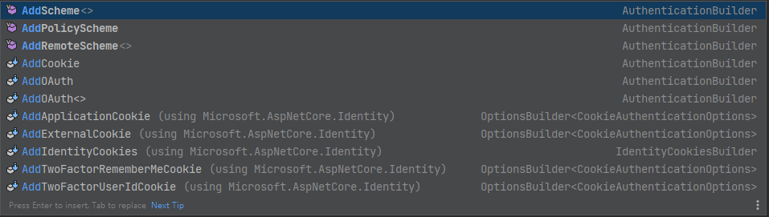
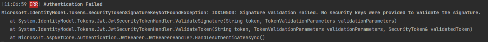

> 🔖 長話短說 🔖
>
> - 使用 `AddJwtBearar` 加入 JWT 的認證機制時，使用 `JwtBearerOptions.TokenValidationParameters` 來指定驗證條件的設定。
> - 使用 `TokenValidationParameters` 時，務必指定 `IssureSignKey` ，否則，呼叫 API 時，都會收到 `401 Unauthorized` 的回應。

我們知道 .NET Core 支援多種的 Authentication 的認證方式，今天就來聊聊 JWT 的設定與處理方式。



操作環境

- Windwos 11
- .NET 7
- Nuget package
  - Serilog

## 使用 JWT Authentication

### Middleware 設定

在 .NET 中，授權與認證的機制，依賴 `AuthenticationMiddleware` 與 `AuthorizationMiddleware` 兩個 Middleware。

所以，務必記得在插入兩個 Middleware。

```csharp
app.UseAuthentication();
app.UseAuthorication();
```

接著，要讓 `AuthenticationMiddleware` 知道有那些 AuthenticationSchema 可以使用。

在這裡，使用 `AddJwtBearer` 的方法，告知 Authenticate 可使用 `JWT` 認證。

```csharp
builder.Service.AddAuthentication()
               .AddJwtBearer(
                   JwtBearerDefaults.AuthenticationScheme,
                   options =>
                   {
	                  // ...
                   });
```

使用 `.AddJwtBearer(...)` 時，需要參考`Microsoft.AspNetCore.Authentication.JwtBearer` [Nuget 套件](https://www.nuget.org/packages/Microsoft.AspNetCore.Authentication.JwtBearer) 。

```shell
dotnet add package Microsoft.AspNetCore.Authentication.JwtBearer
```

### JWT Token 的驗證

回到 `.AddJwtBearer` 的 `JwtBearerOptions` 。我們可以在 `JwtBearerOptions` 進行額外的設定，但這邊重點放在 Token 的驗證條件。而驗證條件可使用 `JwtBearerOptions.TokenValidationParameters` 進行設定。

```csharp
.AddJwtBearer("Bearer", options =>
 {
	options.TokenValidationParameters = new TokenValidationParameters
     {
         ValidateIssuer = false,
         RequireExpirationTime = true,
         ValidateAudience = false,
         ValidateIssuerSigningKey = false,
         IssuerSigningKey = new SymmetricSecurityKey(Encoding.UTF8.GetBytes("1456789012"))
     };
 }
```

順帶一提，若沒有定 `IssureSigningKey` 時，使用 curl 或 postman 呼叫 API 時，會收到 `401 Unauthorized` 的回應。

簡單的查看 `JwtBearerHandler` 的程式，在驗證過程中，若找不到任何的 `SigningKey` 時，會丟出 `SecurityTokenSignatureKeyNotFoundException`。

而 `ValidateIssuerSigningKey` 的驗證時間點，在取回 `SigningKey` 之後，才進行 `IssuerSigningKey` 的驗證。

不要誤解字面上的意思，並不是 `ValidateIssuerSigningKey = false`，就不需要設定 `IssuerSigningKey`。

### 產生 JWT Token

```csharp
private string GenerateToken(string userId)
{
    var claims = new List<Claim>
    {
        new Claim("UID", userId),
    };

    // 取得 JWT 的 Secret Key
    var secret = "1456789012";

    // 將 Secret Key 轉換為 byte 陣列
    var key = Encoding.ASCII.GetBytes(secret);

var credentials=
 new SigningCredentials(new SymmetricSecurityKey(key), SecurityAlgorithms.HmacSha256Signature);

    // 建立 JWT Security Token Handler
    var tokenHandler = new JwtSecurityTokenHandler();
    var securityToken = tokenHandler.CreateJwtSecurityToken(
        issuer: "test", // 設定發行者
        audience: "test", // 設定接收者
        subject: new ClaimsIdentity(claims), // 設定 Claim
        expires: DateTime.UtcNow.AddMinutes(30), // 設定過期時間
        signingCredentials:credentials
    );

    return tokenHandler.WriteToken(securityToken);
}
```

### 輸出 Authenticate 失敗的訊息

如果想要知道或追蹤驗証失敗的原因，也可以利用 `JwtBearerOptions` 的 `Events` ，插入額外的動作。

在這邊，配合 _Serilog.Sinks.Console_ 套件，直接把 Log 輸出到 console 畫面。可以直接觀察到驗證失敗的原因。

```csharp
.AddJwtBearer("Bearer", options =>
 {
    options.Events = new JwtBearerEvents
     {
         OnAuthenticationFailed = context =>
         {
             Log.Error(context.Exception, "Authentication Failed");
             return Task.CompletedTask;
         },
     };
 });
```



## OpenAPI (Swagger) 對應 JWT 的調整

```csharp
services.AddSwaggerGen(c =>
{
    c.SwaggerDoc("v1", new OpenApiInfo { Title = "demoAPI", Version = "v1" });
    c.AddSecurityDefinition("Bearer", new OpenApiSecurityScheme
    {
        In          = ParameterLocation.Header,
        Description = "Please enter JWT with Bearer into field",
        Name        = "Authorization",
        Type        = SecuritySchemeType.ApiKey
    });
    c.AddSecurityRequirement(new OpenApiSecurityRequirement
    {
        {
            new OpenApiSecurityScheme
            {
                Reference = new OpenApiReference
                {
                    Type = ReferenceType.SecurityScheme,
                    Id   = "Bearer"
                }
            },
            Array.Empty<string>()
        }
    });
});
```

## 延伸閱讀

▶ 站內文章

▶ JWT Authentication

- [c# - How do I log authorization attempts in .net core - Stack Overflow](https://stackoverflow.com/questions/48889771/how-do-i-log-authorization-attempts-in-net-core)
- [JWT and Refresh Tokens in ASP.NET Core | by Levan Revazashvili | Medium](https://medium.com/@levanrevazashvili/jwt-and-refresh-tokens-in-asp-net-core-11a877575147)
