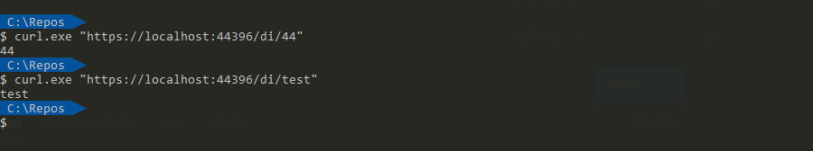
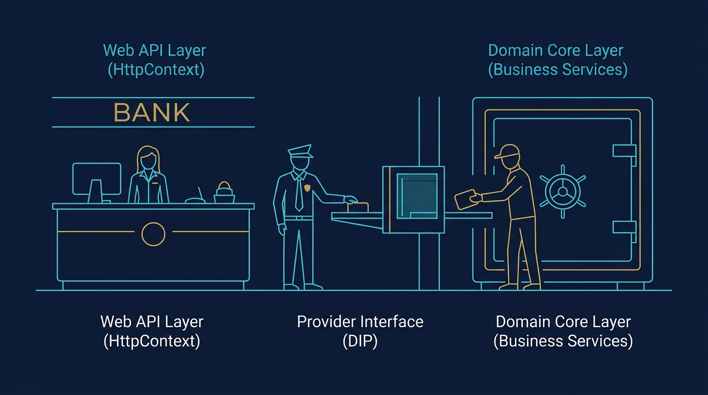
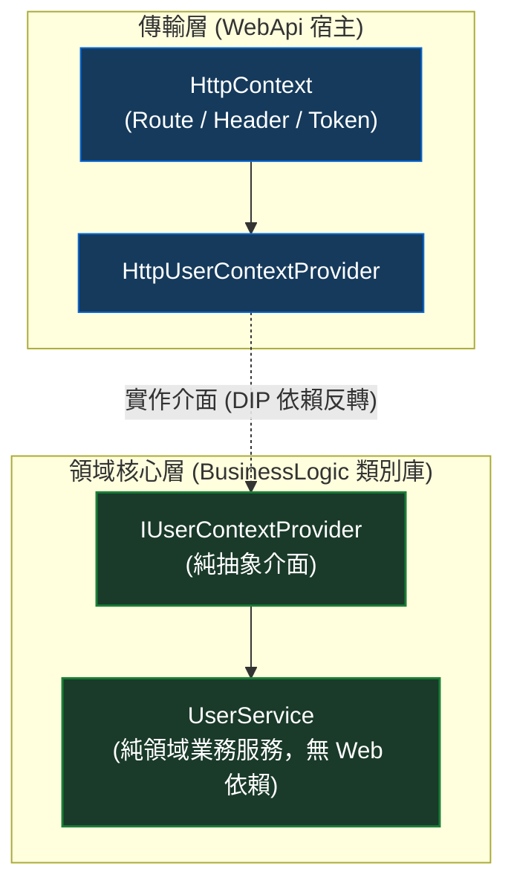

> 🔖 長話短說 🔖
>
> - **核心問題**：當服務類別中幾乎所有方法都需要相同的上下文參數（如 `tenantId`、`userId`），在每個方法手動傳入極易出錯且污染簽章，最理想的作法是直接由 DI 容器在建構式（Constructor）完成注入。
> - **基礎作法**：在單一 WebAPI 專案中，可透過 `AddHttpContextAccessor()` 搭配 `services.AddScoped(sp => ...)` 的工廠委託（Factory Lambda），直接自 Route 或 Header 讀取參數並建立實例。
> - **分層挑戰**：當專案拆分為 Clean Architecture 或獨立類別庫（Class Library）時，若在擴充方法中直接引用 `IHttpContextAccessor`，會導致業務核心反向依賴 Web 框架，造成嚴重的「架構洩漏（Leaky Abstraction）」。
> - **架構解法**：在核心層定義 `IUserContextProvider` 抽象介面，Web 層實作 HTTP 讀取細節，類別庫僅透過 Provider 取得參數，徹底兼顧依賴反轉、模組共用與單元測試便利性。

在開發 ASP.NET Core Web API 時，尤其是面對多租戶（Multi-tenant）或權限隔離的業務系統，我們常會遇到一個棘手的情境：某個服務（Service）底下的所有商業邏輯，全部都需要帶入同一個關鍵識別碼（例如 `tenantId` 或 `userId`）。

如果不在物件生成時解決，後續程式碼往往會長成這樣：

```csharp
public interface IUserService
{
    UserEntity GetUser(string userId);
    void UpdateProfile(string userId, UserProfileDto dto);
    void ChangePassword(string userId, string newPassword);
    // ... 幾十個方法全部被迫傳遞 userId
}
```

這樣寫不僅讓 Controller 每次呼叫都要手動傳參、容易傳錯，而且嚴重污染了領域邏輯的介面定義。

直覺的解法是：**能不能把 `userId` 直接放進 Service 的建構式（Constructor）中，讓 DI 容器在處理請求時，自動從 HTTP Request 讀出參數並生成物件？**

答案當然是可以。但在實作過程中，隨著專案架構從單一 Web 專案逐步重構為分層架構（Clean Architecture）時，如果處理不當，很容易在 DI 的擴充方法中埋下嚴重的架構耦合陷阱。

本文將完整梳理從「基礎工廠委託」到「分層架構高內聚封裝」的演進過程與避雷指引。

<!--more-->

## 基礎解法：利用 IHttpContextAccessor 與工廠委託

在最標準的單一 Web API 專案架構中，如果希望在物件建立時取得當前 HTTP 請求的資訊，最直接的工具就是 `IHttpContextAccessor`。

假設我們的 API 路由規格固定含有租戶 Id（`[Route("[controller]/{id}")]`），受測服務希望在建構式直接接收該參數：

```csharp
[ApiController]
[Route("[controller]/{id}")]
public class TenantController : ControllerBase
{
    private readonly ITenantService _service;

    public TenantController(ITenantService service)
    {
        _service = service;
    }

    [HttpGet]
    public ActionResult Get()
    {
        // Controller 呼叫方法時，完全不需要手動傳入 id
        return Ok(_service.GetId());
    }
}

public interface ITenantService
{
    string GetId();
}

public class TenantService : ITenantService
{
    private readonly string _id;

    public TenantService(string id)
    {
        _id = id;
    }

    public string GetId() => _id;
}
```

### 註冊動態工廠委託

預設的 `services.AddScoped<ITenantService, TenantService>()` 無法處理需要動態純字串參數的建構式。此時，我們可以使用 DI 容器提供的 **工廠委託多載（Factory Lambda）**：

1. 在 `Program.cs` 註冊 `AddHttpContextAccessor()`。
2. 透過傳入的 `IServiceProvider` 解析 `IHttpContextAccessor`。
3. 自當前請求的 `RouteData` 或 Header 擷取參數，並呼叫 `new TenantService(id)`。

```csharp
var builder = WebApplication.CreateBuilder(args);

// 1. 註冊 HttpContext 存取器
builder.Services.AddHttpContextAccessor();

// 2. 透過 Factory Lambda 動態生成服務
builder.Services.AddScoped<ITenantService>(sp =>
{
    var accessor = sp.GetRequiredService<IHttpContextAccessor>();
    var httpContext = accessor.HttpContext 
        ?? throw new InvalidOperationException("無法於非 HTTP 請求脈絡下解析 TenantService");

    // 從 RouteData 中讀取 {id} 參數
    var id = (string?)httpContext.GetRouteData().Values["id"] ?? string.Empty;

    return new TenantService(id);
});

var app = builder.Build();
app.MapControllers();
app.Run();
```

透過這套設定，每當一個新的 HTTP 請求進入時，DI 容器在 Scoped 生命週期內就會自動擷取該次請求的 Route 參數並完成注入：



#### ⚠️ 關鍵避雷點：依賴 Request 參數的服務嚴禁註冊為 Singleton

這是新手在實作工廠委託時最容易踩中的架構地雷。

如果將 `TenantService` 註冊為 `AddSingleton`，或是它被另一個 Singleton 服務（如快取管理器或背景常駐服務）所引用，將會引發嚴重的 **Captive Dependency（被俘虜的依賴）**。

- 只有**第一個**打進系統的 HTTP 請求能觸發工廠委託生成單例；
- 該單例產生後會常駐記憶體，內部儲存的 `id` 永遠被鎖定為第一位租戶的數值；
- 後續所有不同租戶的使用者請求進來，解析出的全部都是第一位租戶的實體，造成災難性的全站資料洩漏！

因此，凡是建構式依賴 Request 動態參數的服務，生命週期**務必嚴格設定為 Scoped（或 Transient）**。

> 🛡️ **架構防衛機制：開啟容器自動範圍驗證（ValidateScopes）**  
> 光靠工程師自律往往會因人為疏忽漏網。在 ASP.NET Core 中，強烈建議在 `Program.cs` 的主機建置時顯式開啟範圍驗證：

```csharp
builder.Host.UseDefaultServiceProvider((context, options) =>
{
    options.ValidateScopes = true;
    options.ValidateOnBuild = true;
});
```

 開啟後，一旦有任何 Singleton 服務在建構式中誤注入了 Scoped 動態服務，應用程式在啟動或建立 Scope 時便會主動拋出 `InvalidOperationException` 阻斷啟動，直接將隱形資安地雷消滅在 CI/CD 測試階段！

> 💡 **延伸思維：那自訂 `IServiceProviderFactory` 呢？**
>
> 在部分進階架構或第三方容器整合（如 Autofac）中，.NET 也允許我們透過實作 `IServiceProviderFactory<IServiceCollection>` 並呼叫 `builder.Host.UseServiceProviderFactory(...)` 來接管容器建置流程。  
> 不過在絕大多數業務開發情境下，若僅是為了解析請求層級的動態參數，使用工廠委託（Factory Lambda）更加輕巧直覺，無需額外引入客製容器工廠的維護負擔。

在單一專案結構下，這種作法直接且有效。但當專案規模擴大、我們開始把商業邏輯拆分為獨立的類別庫時，問題就來了。

這就像銀行金庫內的保險箱鎖匠（業務邏輯）：  
鎖匠在打造金庫鎖頭時，只需要知道「開鎖時需要輸入一組身分識別碼」。  
鎖匠絕不該自己從金庫深處拉一條電線跑到銀行大門口，親自去翻警衛桌上的訪客登記簿（`IHttpContextAccessor`）。  
大門口的登記簿是警衛室（WebApi 外層）的管轄範圍。警衛核驗完訪客身分後，透過托盤（抽象介面）把識別碼遞進金庫，鎖匠拿了就用，彼此互不干涉、各司其職。



## 分層架構下的暗礁：當業務邏輯獨立為類別庫

在標準的多層架構、洋蔥架構（Onion Architecture）或 Clean Architecture 中，我們通常會將商業邏輯獨立在獨立的類別庫（Class Library）中，讓 WebAPI 僅作為應用的外層入口：

```text
Solution
├── WebApi (ASP.NET Core Web 應用)
└── BusinessLogic (獨立的 .NET 類別庫)
```

為了維持高內聚，通常會在 `BusinessLogic` 專案內撰寫一個 `IServiceCollection` 的擴充方法（Extension Method），把內部服務的註冊邏輯封裝起來：

```csharp
namespace BusinessLogic;

public static class ServiceCollectionExtensions
{
    public static IServiceCollection AddBusinessServices(this IServiceCollection services)
    {
        // 封裝內部所有服務的註冊
        services.AddScoped<IUserService, UserService>();
        return services;
    }
}
```

如此一來，Web API 的 `Program.cs` 只需要乾淨地呼叫一行 `builder.Services.AddBusinessServices()` 即可。

### 隱形陷阱：在類別庫中直接使用 IHttpContextAccessor

現在情境重現：假設 `UserService` 內的所有方法都需要當前登入者的 `userId`，我們希望在 `AddBusinessServices` 裡面動態注入它。

許多人的直覺作法，是把剛剛在 `Program.cs` 寫的 Lambda 直接搬進 `BusinessLogic` 專案裡：

```csharp
// 位於 BusinessLogic 類別庫中的擴充方法
public static class ServiceCollectionExtensions
{
    public static IServiceCollection AddBusinessServices(this IServiceCollection services)
    {
        services.AddScoped<IUserService>(sp =>
        {
            // 為了這兩行，BusinessLogic 必須安裝 Microsoft.AspNetCore.Http
            var accessor = sp.GetRequiredService<IHttpContextAccessor>();
            var userId = (string?)accessor.HttpContext?.GetRouteData().Values["userId"];

            return new UserService(userId);
        });

        return services;
    }
}
```

這樣寫編譯會過，功能也能跑，但從軟體架構的角度來看，卻埋下了三個致命代價：

1. **破壞架構相依方向（Leaky Abstraction）**：
   商業邏輯層（BusinessLogic）本應是最純粹的領域核心，現在卻被強迫安裝了 `Microsoft.AspNetCore.Http` 或 ASP.NET Core 框架套件，導致核心邏輯依賴了傳輸層（Web）。
2. **喪失跨宿主運行的靈活性**：
   如果這套 `BusinessLogic` 未來需要被 Console 工具、排程作業（Quartz/Hangfire）或是訊息佇列消費者（RabbitMQ/Kafka Consumer）共用，這些非 Web 環境根本沒有 `HttpContext`，直接觸發 `NullReferenceException` 癱瘓。
3. **單元測試變得極度痛苦**：
   如果要在測試專案中測試 `UserService` 的工廠生成邏輯，你必須手動偽造一整組複雜的 `DefaultHttpContext` 與 `RouteData`，增加了無謂的測試負擔。

## 正統解法：透過 Provider 介面實現真正的依賴反轉

要解決這個問題，核心思維就是物件導向與架構設計的基石：**依賴反轉原則（Dependency Inversion Principle, DIP）**。

業務邏輯層只需要知道「我需要 `userId`」，至於這個 `userId` 是從 HTTP Route、JWT Token、還是 Background Job 來的，**業務層完全不應該過問**。

我們可以透過引入一個簡單的參數抽象介面來達成徹底解耦：



### 核心類別庫：定義純粹參數介面

在 `BusinessLogic` 專案中，定義一個純粹的參數提供者介面：

```csharp
namespace BusinessLogic;

public interface IUserContextProvider
{
    string GetCurrentUserId();
}
```

而在同一層的 `AddBusinessServices` 擴充方法中，服務只跟 `IUserContextProvider` 要資料，完全不碰任何 Web 相關類別：

```csharp
namespace BusinessLogic;

public static class ServiceCollectionExtensions
{
    public static IServiceCollection AddBusinessServices(this IServiceCollection services)
    {
        services.AddScoped<IUserService>(sp =>
        {
            // 透過抽象介面取得參數，完全不需要引用 Microsoft.AspNetCore.Http
            var provider = sp.GetRequiredService<IUserContextProvider>();
            var userId = provider.GetCurrentUserId();

            return new UserService(userId);
        });

        return services;
    }
}
```

#### 💡 實戰延伸：如果服務還有其他多個依賴（Repository、Logger），該怎麼寫？

很多工程師看到這裡會立刻提出一個務實問題：「在真實專案中，`UserService` 通常還需要注入 `IUserRepository`、`ILogger<UserService>` 與 `IEmailSender`。如果每次都寫 Factory Lambda，難道我得手動寫成 `new UserService(userId, sp.GetRequiredService<IUserRepository>(), sp.GetRequiredService<ILogger<UserService>>()...)` 嗎？只要建構式多一個依賴，工廠委託就得手動改一次，這未免太脆弱了！」

實務上有兩種非常優雅的解決途徑：

1. **途徑 A（最推薦・直接注入 Provider 介面）**：  
   讓服務類別直接依賴 `IUserContextProvider`，讓 DI 容器發揮預設的自動建構式匹配：

   ```csharp
   public class UserService : IUserService
   {
       private readonly IUserContextProvider _userProvider;
       private readonly IUserRepository _repo;
       private readonly ILogger<UserService> _logger;

       // 依賴 Provider 介面與其他所有服務，DI 容器自動滿足所有參數
       public UserService(
           IUserContextProvider userProvider, 
           IUserRepository repo, 
           ILogger<UserService> logger)
       {
           _userProvider = userProvider;
           _repo = repo;
           _logger = logger;
       }

       public UserEntity GetCurrentUserProfile()
       {
           var userId = _userProvider.GetCurrentUserId();
           return _repo.FindById(userId);
       }
   }
   ```

   此時註冊只需要乾淨的一行：`services.AddScoped<IUserService, UserService>()`，完全不需要手寫任何工廠委託！

2. **途徑 B（若必須維持純字串建構式：運用 ActivatorUtilities）**：  
   如果因領域純粹性要求，`UserService` 建構式必須維持 `(string userId, IUserRepository repo, ILogger<UserService> logger)`，可以使用 .NET 內建的 **`ActivatorUtilities`**：

   ```csharp
   services.AddScoped<IUserService>(sp =>
   {
       var provider = sp.GetRequiredService<IUserContextProvider>();
       var userId = provider.GetCurrentUserId();

       // 關鍵利器：框架會自動從容器解析其餘相依服務，只需傳入手動的 userId 參數！
       return ActivatorUtilities.CreateInstance<UserService>(sp, userId);
   });
   ```

   如此一來，未來無論 `UserService` 新增了多少個由 DI 管理的 Repository 或 Logger，這段工廠委託程式碼都完全不需要變動！

   > ⚠️ **特別提醒：避免傳入多個同型別的未註冊參數**  
   > `ActivatorUtilities` 的非服務參數是**基於型別順序（Type-based Position）**進行配對的。如果你的服務建構式同時接收兩個字串 `(string tenantId, string userId)`，依序傳入可能因建構式參數順序變更而發生錯位災難。  
   > 若非服務參數超過 1 個，最佳實踐是將它們封裝為一個獨立的強型別物件（如 `TenantUserContext`），或是直接採用**途徑 A（注入 Provider 介面）**，維護性更高且重構更安全。

### WebApi 宿主層：實作具體環境取值

具體要從 HTTP 請求的哪裡拿 `userId`，是 WebAPI 層的專屬職責。我們在 WebAPI 專案內實作該介面：

```csharp
namespace WebApi.Providers;

public class HttpUserContextProvider : IUserContextProvider
{
    private readonly IHttpContextAccessor _accessor;

    public HttpUserContextProvider(IHttpContextAccessor accessor)
    {
        _accessor = accessor;
    }

    public string GetCurrentUserId()
    {
        var httpContext = _accessor.HttpContext;
        if (httpContext == null)
        {
            throw new InvalidOperationException("當前脈絡並非有效的 HTTP 請求");
        }

        // 可以自由決定從 RouteData、Header、或是 ClaimsPrincipal 中取得
        var userId = (string?)httpContext.GetRouteData().Values["userId"]
                     ?? httpContext.User.FindFirst(ClaimTypes.NameIdentifier)?.Value;

        return userId ?? throw new UnauthorizedAccessException("請求中缺少有效的 User ID");
    }
}
```

### 應用程式進入點：完成跨層服務組裝

最後，在應用程式的進入點完成註冊：

```csharp
// WebApi / Program.cs
var builder = WebApplication.CreateBuilder(args);

builder.Services.AddControllers();
builder.Services.AddHttpContextAccessor();

// 1. 註冊 Web 專屬的 Provider 實作
builder.Services.AddScoped<IUserContextProvider, HttpUserContextProvider>();

// 2. 註冊純粹的商業邏輯服務
builder.Services.AddBusinessServices();

var app = builder.Build();
app.MapControllers();
app.Run();
```

這套架構帶來的好處非常顯著：

- **職責分離**：`BusinessLogic` 專注於商業規則，乾淨得不需要安裝任何 Web NuGet 套件。
- **隨處可用**：如果明天要寫一個背景任務 Worker，只需在 Worker 專案寫一個 `JobUserContextProvider` 註冊進 DI，底層所有的 `UserService` 完全不必修改任何一行程式碼。
- **易於測試**：單元測試時，只需 Mock 一個只有單一方法的 `IUserContextProvider`，測試程式碼清晰又好維護。

## DI 動態物件生成策略決策分析判斷表

在 ASP.NET Core 實務中，面對需要外部參數的服務，並非所有情境都需要一律拆解出 Provider 介面。架構設計的核心在於「適度」——如果今天只是一個 3 個月驗證期的小型專案，硬拆成 4 個類別庫反而會增加無謂的跳轉負擔。

我們可以依據專案規模與參數特性，透過以下決策表選擇最適當的實作模式：

| 判斷步驟                     | 判定條件                                                 | 建議實作策略                                                    | 典型應用場景                                 | 考量重點                                                         |
| :--------------------------- | :------------------------------------------------------- | :-------------------------------------------------------------- | :------------------------------------------- | :--------------------------------------------------------------- |
| **Step 1：單純少數方法**     | 該參數僅有 1～2 個特定方法需要，其餘方法皆無關           | **直接作為方法參數傳遞 (Method Argument)**                      | 特定報表匯出時臨時傳入日期區間               | 避免過度設計，不要為了少數方法的參數大動干戈改寫 DI。            |
| **Step 2：單體架構單一專案** | 專案規模小，所有邏輯皆在同一個 Web 專案內                | **工廠委託直接解析 (Factory Lambda with IHttpContextAccessor)** | 小型內部管理後台、驗證原型 (MVP)             | 在 `Program.cs` 快速註冊即可，維護與除錯成本最低。               |
| **Step 3：分層架構與多宿主** | 商業邏輯抽為 Class Library，或未來需支援非 Web 宿主      | **上下文提供者介面抽象 (Context Provider Interface)**           | 企業級多租戶 SaaS、跨 Web 與 Worker 共用核心 | 依賴反轉標準實踐，徹底隔絕 Web 框架向核心洩漏。                  |
| **Step 4：動態生命週期狀態** | 參數在請求過程中可能動態變更（如中途切換租戶或語系）     | **作用域請求狀態容器 (Scoped Request Context Object)**          | 多語系本地化設定、動態切換操作帳號           | 建立一個 Scoped 物件負責存放狀態，各服務透過注入該狀態容器讀取。 |
| **Step 5：多變體運行時生成** | 需依據參數在同一請求內切換多種不同實作（如不同金流管道） | **工廠模式 (Factory Pattern / Func<TKey, TService>)**           | 依據交易類型動態挑選綠界或 LINE Pay 服務     | 透過工廠方法動態傳入 Enum 或識別碼取得對應實作。                 |

## 💡 深入實戰的常見疑問 (FAQ)

### Q1：在 `Task.Run()` 背景執行緒中存取 `IHttpContextAccessor` 為什麼會拋出例外？該如何傳遞參數？

**A**：這是許多工程師常踩的隱藏地雷。

ASP.NET Core 的 `HttpContext` 生命週期與 HTTP 請求嚴格綁定。一旦 Controller 或 Minimal API 的 Endpoint 完成回傳，伺服器就會結束該請求，框架會立即將 `HttpContext` 物件回收並重置歸還給物件池（Object Pool）。

如果你在請求處理中使用了 `Task.Run(async () => { ... })` 執行背景非同步任務，當背景任務還在執行時，主 HTTP 請求很可能早已結束。這時背景執行緒再去呼叫 `IHttpContextAccessor.HttpContext`，就會拿到 `null`，甚至引發 `ObjectDisposedException` 或 `NullReferenceException`。

**正確解法**：

1. **主動捕捉參數值（Parameter Capturing）**：在啟動背景非同步任務前，先在主執行緒中取得具體的值，再將純資料傳給背景任務：

   ```csharp
   // 在 Controller / Service 主執行緒先取值
   var currentUserId = _userProvider.GetCurrentUserId();

   _ = Task.Run(async () =>
   {
       // 背景任務直接使用純字串變數，不再依賴 HttpContext
       await ProcessUserReportAsync(currentUserId);
   });
   ```

2. **需要使用 DI 服務時建立獨立 Scope**：如果背景工作需要使用資料庫 Context，記得注入 `IServiceScopeFactory` 建立獨立作用域：

   ```csharp
   _ = Task.Run(async () =>
   {
       using var scope = _scopeFactory.CreateScope();
       var scopedService = scope.ServiceProvider.GetRequiredService<IReportGenerator>();
       await scopedService.GenerateAsync(currentUserId);
   });
   ```

### Q2：微服務中若租戶資訊來自 JWT Token 或自訂 Header，解析細節該寫在哪裡？

**A**：這正是 **Provider 模式** 最大的威力所在——**將繁雜的傳輸協議細節徹底隔離在 Web 宿主層**。

在真實生產環境中，使用者識別或租戶 ID 可能來自 JWT Claims（例如 `sub` 或自訂 Claim），也可能來自 API Gateway 轉發的 Header（如 `X-Tenant-Id`）。所有的容錯與解析邏輯，都應該被封裝在 `HttpUserContextProvider` 內部：

```csharp
public class HttpUserContextProvider : IUserContextProvider
{
    private readonly IHttpContextAccessor _accessor;

    public HttpUserContextProvider(IHttpContextAccessor accessor)
    {
        _accessor = accessor;
    }

    public string GetCurrentUserId()
    {
        var context = _accessor.HttpContext 
            ?? throw new InvalidOperationException("無法在非 HTTP 請求脈絡下解析使用者身分");

        // 1. 優先從已驗證的 JWT Claims 中讀取
        var userIdFromClaim = context.User?.FindFirst(ClaimTypes.NameIdentifier)?.Value
                           ?? context.User?.FindFirst("sub")?.Value;

        if (!string.IsNullOrEmpty(userIdFromClaim))
        {
            return userIdFromClaim;
        }

        // 2. 備援：若為內部微服務調用，從特定 Header 讀取
        if (context.Request.Headers.TryGetValue("X-Internal-User-Id", out var headerValue))
        {
            return headerValue.ToString();
        }

        throw new UnauthorizedAccessException("請求中未包含有效的使用者身分識別");
    }
}
```

商業邏輯層的 `UserService` 完全不必知道 Token 格式，更不需要知道 Header 名稱。未來若資安架構升級調整 Claim 欄位，整個系統只需要修改這一個 Provider 類別。

### Q3：單元測試時，依賴 Provider 介面比起直接 Mock 原生 HttpContext 有多方便？

**A**：差別非常懸殊。

如果你的商業服務或工廠方法直接依賴 `IHttpContextAccessor`，要寫出一個綠燈的單元測試，你得手動建立繁雜的階層物件樹：

```csharp
// 痛苦的舊寫法：為了測一個 UserService，必須 Mock 整套 ASP.NET Core Web 框架
var mockAccessor = new Mock<IHttpContextAccessor>();
var mockContext = new Mock<HttpContext>();
var routeData = new RouteData();
routeData.Values["userId"] = "user-999";

mockContext.Setup(c => c.Features.Get<IRoutingFeature>())
           .Returns(new RoutingFeature { RouteData = routeData });
mockAccessor.Setup(a => a.HttpContext).Returns(mockContext.Object);
```

只要稍有不慎少 Mock 一個屬性，測試就會莫名其妙噴出 `NullReferenceException`。

而導入了 `IUserContextProvider` 抽象後，單元測試回歸純粹的業務意圖：

```csharp
// 優雅的新寫法：只要 2 行，意圖清晰明瞭
var mockProvider = new Mock<IUserContextProvider>();
mockProvider.Setup(p => p.GetCurrentUserId()).Returns("user-999");

var userService = new UserService(mockProvider.Object, mockRepo.Object, mockLogger.Object);
// 開始測試業務邏輯...
```

單元測試的執行速度更快，測試碼也具備高度的抗脆弱性（Robustness）。

### Q4：`IHttpContextAccessor` 被微軟官方註冊為 Singleton，會不會發生多執行緒競爭、拿到別人請求資料的狀況？

**A**：不會。雖然 `IHttpContextAccessor` 物件實例在容器中是 Singleton，但它內部存取 `HttpContext` 的核心機制是 **`AsyncLocal<T>`**。

在 .NET 運行時中，`AsyncLocal` 會將變數儲存在目前執行緒的「執行內容（ExecutionContext）」內。當程式碼遇到 `await` 切換執行緒時，.NET 執行環境會自動流轉（Flow）這個上下文。

每個進入伺服器的 HTTP 請求都是獨立的非同步鏈結，各自擁有隔離的 ExecutionContext，因此並行處理的上千個請求之間是完全獨立的，絕對不會發生 A 請求覆蓋 B 請求上下文的情況。

### Q5：在非 Web 宿主（如 Hangfire 排程或訊息佇列 Worker）中，Provider 該如何取得當前任務脈絡？

**A**：在背景服務（如 RabbitMQ Consumer 或 Hangfire Job）中，每個任務都沒有 HTTP 請求，但核心原則完全相同：**為每個任務建立獨立的 `IServiceScope`，並提供專屬的 ContextProvider**。

實務上有兩種乾淨的實作手法：

1. **基於 AsyncLocal 的 Scope 模式**：  
   封裝一個基於 `AsyncLocal<string>` 的 ambient context：

   ```csharp
   public class WorkerUserContextProvider : IUserContextProvider
   {
       private static readonly AsyncLocal<string?> _currentUserId = new();
       public static IDisposable BeginScope(string userId)
       {
           _currentUserId.Value = userId;
           return new ScopeDisposable(() => _currentUserId.Value = null);
       }
       public string GetCurrentUserId() => _currentUserId.Value ?? "System:Worker";
   }
   ```

   在 Worker 消費迴圈收到訊息時呼叫 `using (WorkerUserContextProvider.BeginScope(message.UserId))`，容器內部的 `UserService` 就能在該非同步鏈結中無縫取得任務專屬的使用者 Id。

2. **在建立 Scope 後直接指派 Scoped 物件狀態**：  
   建立一個 Scoped 生命週期的 `UserContextHolder`，在 Worker 處理訊息開頭建立 Scope 並填入值，供同一 Scope 內的 Service 讀取。

## 簡單總結

相依性注入（DI）是現代 .NET 開發的基石，但往往也是架構邊界最容易模糊的源頭。

從最初直接在每個方法反覆傳遞參數，到利用 `IHttpContextAccessor` 在容器中動態生成物件，再到透過 `IUserContextProvider` 進行分層解耦，這正是軟體架構從「能跑就好」走向「高內聚、低耦合」的演進過程。

不要為了追求架構形式而過度設計；但在核心邏輯與傳輸層產生牽扯時，適時運用一層薄薄的介面進行依賴反轉，往往能為日後的系統維護與跨平台遷移省下巨大的成本。

> 💡 **互動時間**
>
> 在你的專案架構中，面對多租戶或是取得當前操作者（Current User）時，你是習慣使用本文介紹的 Provider 介面、依賴 ASP.NET Core 的 Middleware 搭配 AsyncLocal 儲存，還是透過 MediatR Pipeline Behavior 統一注入？歡迎在下方留言分享你的架構選擇與實務踩雷經驗！

## 延伸閱讀

▶ 站內相關文章

- [聊聊架構 - 從單點故障 (SPOF) 到系統冗餘 (Redundancy)：高可用架構的實踐與權衡](聊聊架構%20-%20從單點故障%20(SPOF)%20到系統冗餘%20(Redundancy)%20的實踐與權衡.md)
- [問題排除的下一階段：從單一 Log 到建立 Telemetry (遙測) 的可觀測性思維](../from-logging-to-telemetry-observability/index.md)

▶ 外部參考

- [Dependency injection in ASP.NET Core - Microsoft Learn](https://learn.microsoft.com/en-us/aspnet/core/fundamentals/dependency-injection)
- [IHttpContextAccessor in ASP.NET Core - Microsoft Learn](https://learn.microsoft.com/en-us/aspnet/core/fundamentals/http-context)
- [Clean Architecture: A Craftsman's Guide to Software Structure and Design](https://www.oreilly.com/library/view/clean-architecture-a/9780134494272/)
