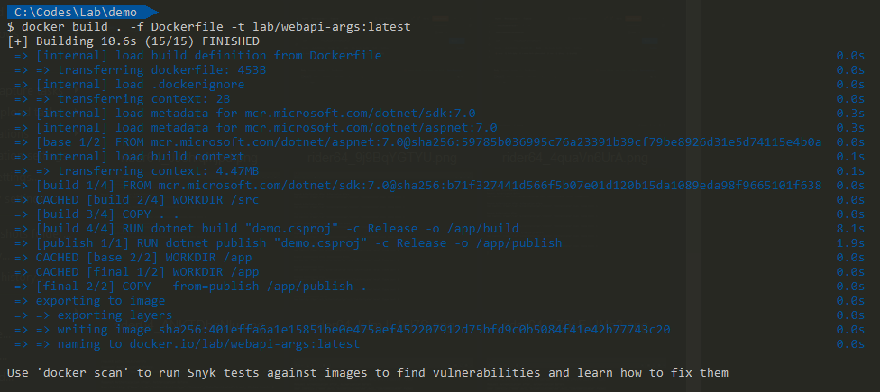
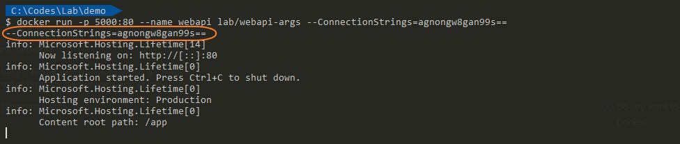
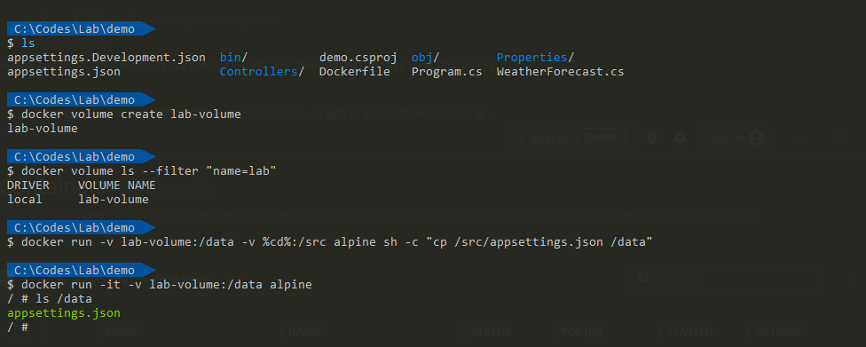
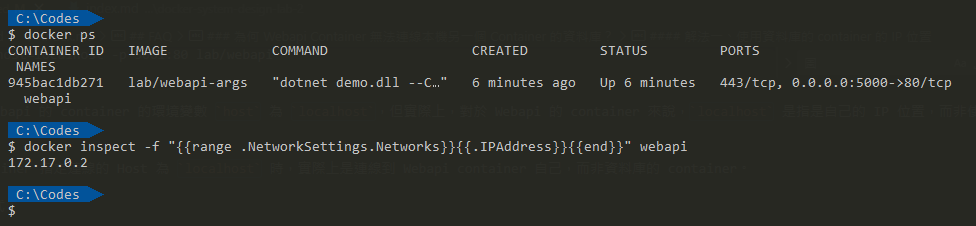

想要使用 Docker 技術將 ASP.NET Web API 應用程式打包成 image 時，需要針對機敏性資料進行特別的處理，以確保這些機密性資料不會外流。

在本文中，將簡單介紹 Dockerfile 的建置方式，以及如何提供連線字串給 Container 內的應用程式使用。雖然內文只介紹連線字串的部份，但是憑證的處理方式，也是類似的作法。

> 🔖 長話短說 🔖
>
> - 在使用 Docker 封裝應用程式時，有時需要使用一些機敏性資料，需要額外處理，例如連線字串及憑證資料等。
> - Container 的所有設定，都可以透過 `docker inspect` 指令查看到，所以傳遞機敏性資料，必須要加密或透過其他方式。
> - 機敏資料的傳遞，可以透過 `環境變數`、`命令列參數`與 `mount/volume` 的方式。
> - Docker Image 建立後，可以使用 `docker scan` 指令，進行掃描，確認是否有安全性問題。

<!--more-->

實作環境

- Windows 10
- .NET 7.0
- Docker Engine 20.10.8

## Dockerfile 簡介

雖然在 [Docker 操作簡介](../series/build-automated-deploy/docker-operate/index.md)有提過，不過還是簡單回顧一下。

### Single-Stage Build

關於 Docker 建置 Image 時，最簡單的方式就是在 Dockerfile 內一個步驟完成所有的設定，這種方式稱為 `Single-Stage Build`。

```dockerfile
FROM mcr.microsoft.com/dotnet/sdk:7.0
WORKDIR /src
COPY ["demo/demo.csproj", "demo/"]
RUN dotnet restore "demo/demo.csproj"
WORKDIR /src/demo
RUN dotnet build "demo.csproj" -c Release -o /app/build
RUN dotnet publish "demo.csproj" -c Release -o /app

WORKDIR /app
EXPOSE 80
EXPOSE 443

ENTRYPOINT ["dotnet", "demo.dll"]
```

簡單說明一下指令的意義

- `FROM` 使用的 base Image
- `WORKDIR` 目前 Image 內所在的位置
- `COPY` 把外部資料複制到 Image 內的指定位置
- `RUN` 執行指定的指令
- `EXPOSE` 指定 Image 內的服務埠
- `ENTRYPOINT` 指定 Image 內的執行指令

但要特別注意，若是在 `Single-Stage Build` 中，直接將程式碼進行建置、打裝的方式，會將所有的步驟所使用的工具、中繼檔、程式碼等等，都包含在 Image 內。

導致 Image 內部存在不必要的檔案、多餘資料，除了檔案過大外，還可能造成資料的外洩。

當然，我們也可以建置過程中，加入指令刪除建置過程中，所使用的程式碼與中繼檔，也僅能確保刪除的項目不會被他人看到，至於過程中使用的工具等，可能還是遺留在 Image 內。

Docker 的 [官方文件](https://docs.docker.com/build/building/multi-stage/)，也建議使用 `Multi-Stage Build` 的方式，來建置 Image。除了可以減少 Image 的大小外，也可以確保 Image 內的資料，不會被外洩。

### Multi-Stage Build

在 Visual studio 建立 .NET 專案時，若有勾選 support Docker 的選項。在建立專案的同時，一併建立 `Dockerfile` 的檔案，其內容的編排，就是使用 `Multi-stage` 的方式。

在這個 Dockerfile 內的描述，會分成四個階段來進行建置。

- 首先，建立運行發佈程式所需要的 Base Image。
- 再來，建立建置環境用的影像檔，裡面包含.NET SDK 與 程式碼，並確認程式碼可以正常建置。
- 第三步，將第二步建置過的程式碼，打包成發佈版本。
- 最後，將發佈版本的程式，放入運行環境的 Base Image 內。

```dockerfile
# 建立一個執行程式的基礎模板
FROM mcr.microsoft.com/dotnet/aspnet:7.0 AS base
WORKDIR /app
EXPOSE 80
EXPOSE 443

# 使用 .NET SDK 的 Image, 並程式碼複製到容器內，並執行建置
FROM mcr.microsoft.com/dotnet/sdk:7.0 AS build
WORKDIR /src
COPY ["demo/demo.csproj", "demo/"]
RUN dotnet restore "demo/demo.csproj"
COPY . .
WORKDIR "/src/demo"
RUN dotnet build "demo.csproj" -c Release -o /app/build

# 使用上一步建立的 Image, 進行發佈版本的建置
FROM build AS publish
RUN dotnet publish "demo.csproj" -c Release -o /app/publish

# 將最後建置的程式，放置到基礎的 Image 內，並設定執行的指令
FROM base AS final
WORKDIR /app
COPY --from=publish /app/publish .
ENTRYPOINT ["dotnet", "demo.dll"]
```

若要確認每一個階段的 Image 內容，可以使用 `docker image history` 指令，來查看。

也可以使用 `docker scan` 指令，來進行掃描，確認是否有安全性的問題。

## 機敏資料的處理

在專案中，可能會有一些機敏資料，例如資料庫的連線字串、憑證資料等等。大伙都知道，這些資料不應該直接放置在程式碼內。相同的，也不應該放置在 Image 內。

此外，在實際的應用中，可能需要使用憑證來進行身份驗證或資料加密。雖然後續文章只介紹連線字串的部份，但是憑證的處理方式，也是類似的作法。

在 Docker 中，可以運用 `mount/volume` 與 `環境變數` 方式，提供憑證、相關檔案、密碼，給 Container 使用。

藉由掛載方式，將憑證檔案掛載到 container 內，讓應用程式可以存取這些檔案，並且進行相關的操作。此外，也可以將憑證密碼以環境變數的形式傳入 Container 中，讓應用程式可以透過這些環境變數來存取憑證資料。

值得注意的是，掛載憑證資料的方式需要額外注意資料的安全性。我們可以使用加密的方式來保護憑證資料的安全性，以防止資料被未經授權的人員存取。

### 資料庫的連線字串

若 ASP.NET Webapi 已經建置為 Docker Image，可以使用`環境變數`、`命令列`、`掛載文件檔` 的方式，來傳遞資料庫的連線資訊。

提醒一下，`Container` 建立後，是可以用 `docker inspect` 查看 Container 的相關設定，無論是用那種方式，機敏資料最好還是要進行加密。

先把已知的各種做法的差異，整理列表如下

| 作法類型   | 啟動 Container 的動作             | Dockfile 設定 | 程式碼調整             |
| ---------- | --------------------------------- | ------------- | ---------------------- |
| 環境變數   | 使用 `-e` 指定資料庫相關資訊      | `ENV`         | 組成連線字串、加解密   |
| 環境變數   | 使用 `-e` 指定連線字串            | `ENV`         | 加解密                 |
| 命令列     | 使用 `--` 傳入命令列參數          |               | 取得 Args 資料、加解密 |
| 掛載文件檔 | 使用 `-v` 掛載資料夾路徑或 volume | `VOLUME`      | 讀取特定位置的檔案     |

#### 作法一、環境變數

##### 自組連線字串

在 Dockerfile 內，建立多組的環境變數，如 `Host`、`Port`、`Database`、`User`、`Password` 等。並在程式碼中，使用環境變數的方式，自行組合為連線字串。

簡單說明一下，實作的方式。在程式碼的部份，連線字串的取得方式，改為由環境變數自行組合而成。

實務上，在 User 與 Password 的部份，建議環境變數的資料，使用加密後的密文，避免明文的方式傳遞。在組合連線字串前再解密，以避免資料外洩。

```csharp
// 機敏資料的解密。
// 使用自行實作的 Decrypt 方法來解密
var user = Decrypt(Environment.GetEnvironmentVariable("DB_USER"));
var password = Decrypt(Environment.GetEnvironmentVariable("DB_PASSWORD"));

// 以 postgresql 的連線字串 為例
var connectionString = string.Format(
    "Host={0};Port={1};Database={2};Username={3};Password={4};Pooling=true;",
    Environment.GetEnvironmentVariable("DB_HOST"),
    Environment.GetEnvironmentVariable("DB_PORT"),
    Environment.GetEnvironmentVariable("DB_NAME"),
    user,
    password);

builder.Services.AddDbContext<LabContext>(options => options.UseNpgsql(connectionString));
```

接著，調整 Dockerfile ，增加環境變數。

```dockerfile
FROM mcr.microsoft.com/dotnet/aspnet:7.0 AS base
WORKDIR /app

# 設定 DB 相關的環境變數，這邊先給予預設值
ENV DB_HOST=127.0.0.1
ENV DB_PORT=5432
ENV DB_NAME=postgres
ENV DB_USER=postgres
ENV DB_PASSWORD=123

EXPOSE 80
EXPOSE 443

// 略 ...
```

在完成上述的調整後，就可以使用 `docker run` 的方式，啟動容器。

```bash
docker run -e DB_HOST=127.0.0.1 \
           -e DB_PORT=5432 \
           -e DB_NAME=postgres \
           -e DB_USER={加密後的使用者名稱} \
           -e DB_PASSWORD={加密後的密碼} \
           -d \
           -p 5000:80 \
           --name webapi lab/webapi
```

##### 加密後的連線字串

若是覺得傳入多個環境變數過於麻煩，也可以採用直接傳入連線字串的方式。

這邊，我們將連線字串加密，使用環境變數的方式，傳遞加密後的字串，這樣就可以避免直接將連線字串放置在程式碼內。

要注意的是，加密後的連線字串，無法直接使用，需要在程式碼中，進行解密。至於連線字串的加解密方式，網路上已經有很多範例，這邊就不再贅述。例如：[為 EF 連線字串加密的簡單範例-黑暗執行緒](https://blog.darkthread.net/blog/encrypt-ef-connstring/)。

基本上，Dockerfile 的調整方式，與作法一相同，只是在環境變數的設定上，改為加密後的連線字串。

```dockerfile
FROM mcr.microsoft.com/dotnet/aspnet:7.0 AS base
WORKDIR /app

# 加入環境變數
ENV ConnectionStrings

EXPOSE 80
EXPOSE 443

// 略 ...
```

```csharp
// 連線字串的解密。
// 使用自行實作的 Decrypt 方法來解密
var connectionString = Decrypt(Environment.GetEnvironmentVariable("ConnectionStrings"));

builder.Services.AddDbContext<LabContext>(options => options.UseNpgsql(connectionString));
```

在完成上述的調整後，就可以使用 `docker run` 的方式，啟動 Container。

```bash
docker run -d -p 5000:80 --name webapi -e ConnectionStrings={加密後的連線字串} lab/webapi
```

#### 作法二、Command Argument

除了使用環境變數的方式， 也可以在不調整 dockerfile 的前提下，Command Argument 傳遞加密後連線字串。

在這作個簡單 Demo 範例，先新增一個 ASP.NET Core Webapi 專案，並在 Program.cs 中，加入以下的程式碼。

```csharp
var list = args.ToList();
Log.Information(list.Count > 0 ? string.Join(" ", list) : "No arguments");
```

直接使用 Dockerfile 建置 Image，並運行 Container。

```bash
# 建置 Image
docker build . -f Dockerfile -t lab/webapi-args:latest

# 運行 Container
docker run -p 5000:80 --name webapi lab/webapi-args --ConnectionStrings=agnongw8gan99s==
```





#### 作法三、掛載文件檔

一般而言，當我們使用 EF Core 來建立資料庫的連線時，通常會將連線資訊存放在 appsettings.json 檔案中。

同樣地，我們可以沿用這種方式，將連線資訊先存放在另一個 JSON 檔案中，並將這個檔案放在指定的主機位置或 Docker Volume 內。

雖然在範例中，直接取得連線字串的明文。但是，正式環境，最好是加密後的連線字串。

```dockerfile
FROM mcr.microsoft.com/dotnet/aspnet:7.0 AS base
WORKDIR /app

# 加入 Volume
VOLUME /app/data

EXPOSE 80
EXPOSE 443

// 略 ...
```

```csharp
// 宣告存放連線字串的 connect.json 檔案
var configuration = new ConfigurationBuilder()
                   .SetBasePath(Directory.GetCurrentDirectory())
                   .AddJsonFile("appsettings.json")
                   .AddJsonFile("connect.json", true)
                   .Build();

// 讀取連線字串
var connectionString = builder.Configuration.GetConnectionString("Lab");
builder.Services.AddDbContext<LabContext>(options => options.UseNpgsql(connectionString));
```

若是直接把 connect.json 放在實體主機的指定位置，可以使用以下的方式，將檔案掛載到容器內的指定位置。

```bash
# 假設 connect.json 放在 /home/user/connect.json
docker run -d -p 5000:80 --name webapi -v /home/user/:/app/data lab/webapi
```

若是使用 Docker Volume 的方式，將檔案掛載到容器內，可以使用以下的方式。

```bash
# 建立 Volume
docker volume create {connect-volume}

# 將 connect.json 放入 Volume
docker run -d -v {connect-volume}:/data -v {connect.json 所在位置}:/src/ alpine sh -c "cp /src/connect.json /data"

# 運行 Container
docker run -d -p 5000:80 --name webapi -v {connect-volume}:/app/data lab/webapi
```

完成後，的應用程式就可以直接使用 connect.json 檔案內的連線字串，來連線資料庫。

光說不練假把式，我們使用下方的幾行指令來快速驗證，檔案確實有被放入 `VOLUME` 中。

```bash
# 進入檔案所的資料夾
cd c:/Codes/Lab/Demo

# 建立 Volume
$ docker volume create lab-volume

# 確認 Volume 是否建立成功
$ docker volume ls --filter "name=lab"

# 將 appsettings.json 放入 Volume
# %cd% 代表目前所在的資料夾, 若是使用 PowerShell 則是 $pwd
$ docker run -v lab-volume:/data -v %cd%:/src alpine sh -c "cp /src/appsettings.json /data"

# 啟動 Container 並進入
$ docker run -it -v lab-volume:/data alpine
```



## FAQ

### 為何 Webapi Container 無法連線本機另一個 Container 的資料庫？

原因如同 [GitLab CI 實作記錄(1) - 使用 Docker 在同台主機運行 GitLab 與 GitLab-Runner](../gitlab-and-runner-on-same-host-using-docker/index.md) 中提到的 Docker Network 的觀念問題。

在同一台主機上，啟動 Container 卻不指定 Network 的情況下，會使用名為 `bridge` 的預設 Network。

而加預設 Network 內的 Container ，會被自動分配一個網段為 `172.17.0.0/16` 的 IP 位置，此時要連線到其他 Container，必須要知道對方的 IP 位置。

這是因為預設 Network 不支援 Docker 內的 DNS 功能，因此無法透過 Container 的名稱來連線。

```bash
docker run -d -e host=localhost -p 5001:80 lab/webapi
```

上述指令中，指定 Webapi 的 container 的環境變數 `host` 為 `localhost`，但實際上，對於 Webapi 的 container 來說，`localhost` 是指是自己的 IP 位置，而非使用者的主機。更不用說資料庫的 container 了。

當 Webapi 的 container 指定連線的 Host 為 `localhost` 時，實際上是連線到 Webapi container 自己，而非資料庫的 container。

對此，有兩種解決方式：

#### 解法一、使用資料庫的 container 的 IP 位置

- 使用資料庫的 container 的 IP 位置，而非 `localhost`。

```bash
# 查詢 Webapi 的 container 的 IP 位置
docker inspect -f "{{range .NetworkSettings.Networks}}{{.IPAddress}}{{end}}" {db_container_name}
```



#### 解法二、新增 Network 並使用 Docker 內的 DNS 功能

將 Webapi 的 container 與資料庫的 container 都加入到同一個 Network 內，並指定相同的網段，這樣兩個 Container 就可以互相連線了。

只要手動增加一個類型為 `Bridge` 的 Network，它就會自動支援 Docker 內的 DNS 功能。

然後先把資料庫的 Container 切換到新的 Network 內，再啟動 Webapi 的 Container，就可以使用資料庫的 Container 的名稱來連線了。

```bash
# 建立 Network
docker network create --driver bridge {network_name}

# 將資料庫的 Container 切換到新的 Network 內
docker network connect {network_name} {db_container_name}

# 啟動 Webapi 的 Container
docker run -d --name -e host={db_container_name} -e database=demo -e user_id=test -e password=test -p 5001:80 lab/webapi --network {network_name}
```

## 延伸閱讀

▶ 站內文章

- [Do\[Docker 操作簡介\](../series/build-automated-deploy/docker-operate/index.md) dotnet-ef 建立 PostgreSQL 的 DBContext](../dotnet-ef-postgresql-dbcontext/index.md)
- [使用 dotnet-ef 建立 SQL Server on Docker 的 DBContext](../dotnet-ef-sqlserver/index.md)
- [建立 PostgreSQL 的 container 時，同時完成資料庫的初始化](../docker-postgresql-initialization-scripts/index.md)

▶ 站外文章

- [ConnectionStrings.com](https://www.connectionstrings.com/)
- [為 EF 連線字串加密的簡單範例-黑暗執行緒](https://blog.darkthread.net/blog/encrypt-ef-connstring/)
