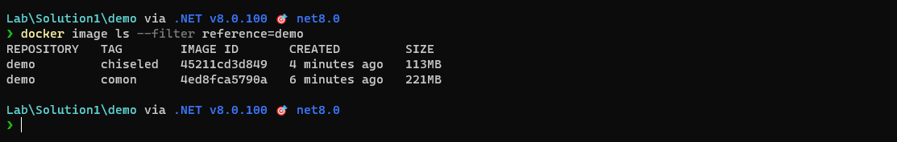

## Distroless Contaier Image

自從 .NET 8 在 2023.11.14 發佈後，因為 Native AOT 的原因，注意到 Distroless Container Image 這個名詞，就花了一些時間，好好的去了解了一下。

若是使用 `Distroless Container Image` 到 google search，一定會找到 google 在 Github 的公開的專案 [GoogleContainerTools/distroless](https://github.com/GoogleContainerTools/distroless) 。

而且在 Readme 一開頭就說明。

> "Distroless" images contain only your application and its runtime dependencies. They do not contain package managers, shells or any other programs you would expect to find in a standard Linux distribution.

個人解讀如下:

Distroless Image 內，除了要運行的應用程式主體與相依的套件外，去除非必要的 Shell、套件管理或其他的程式，維持可運行的極簡環境。

同時，因為去除 Shell、套件管理或其他非必要的程式，變相的減少攻擊的切入點，進而提高了安全性。

與一般 Container Image 的差異:

- 輕量化：因為 Distroless Image 內只包含應用程序執行所必需的程式，所以 Image 大小遠小於使用一般 Image。使得 Push/Pull Image 更快。
- 無互動：因為沒有 shell，所以也無法在 Container 有互動性的操作。限制了 Container 只能運行預定的應用程式。
- 單一性：移除非必要的應用程式，例如套件管理、系統或日誌工具。減少外部攻擊的切入點，同時讓 Container 聚焦在本身的服務。

所以 Distroless Container 非常適合用於對安全性要求極高的環境中。不過，相對的，使用 Distroless Container Image 的 Container 在發生問題時，就無法直接進到 Contaier 內除錯，就需要其他的除錯方式。

查看 [GoogleContainerTools/distroless](https://github.com/GoogleContainerTools/distroless) 過去的記錄，發現它實驗性的支援過 .NET Core 3.1，不過在 2021.11 的某次 Commit，直接移除支援。

### Distroless Container Image: Chiselled Ubuntu

Canonical 從現行發佈的 Ubuntu 中，建構出 Distroless Container: [Chiselled Ubuntu](https://ubuntu.com/engage/chiselled-ubuntu-images-for-containers) 。同時，微軟在 .NET 6 後，與 Canonical 合作，推出基於 `jammy-chiseled` Image base 的 runtime 與 aspnet 的 Image。

關於 Ubuntu Chiseled .NET images 詳細內容可以看 Microsoft 在 Github 的 [Ubuntu Chiseled + .NET](https://github.com/dotnet/dotnet-docker/blob/main/documentation/ubuntu-chiseled.md) 文件。

在這邊，我分別使用基於 `jammy` 與 `jammy-chiseld` 的 .NET Image 建置 Docker Image。以便進行後的觀察。

直接在使用 .NET 8 建立預設的 Web API，並使用以下的 dockerfile 樣版進行建置。

```dockerfile
FROM mcr.microsoft.com/dotnet/aspnet:8.0 AS base
WORKDIR /app
EXPOSE 80
EXPOSE 443

FROM mcr.microsoft.com/dotnet/sdk:8.0 AS build
WORKDIR /src
COPY . .
RUN dotnet build "demo.csproj" -c Release -o /app/build

FROM build AS publish
RUN dotnet publish "demo.csproj" -c Release -o /app/publish /p:UseAppHost=false

FROM base AS final
WORKDIR /app
COPY --from=publish /app/publish .
ENTRYPOINT ["dotnet", "demo.dll"]
```

接著，base image 分別使用 `mcr.microsoft.com/dotnet/aspnet:8.0` 與 `mcr.microsoft.com/dotnet/aspnet:8.0-jammy-chiseled`。

| Container Image Type | Base Image                                         | Artifact      |
| -------------------- | -------------------------------------------------- | ------------- |
| 一般                 | mcr.microsoft.com/dotnet/aspnet:8.0                | demo:common   |
| distroless           | mcr.microsoft.com/dotnet/aspnet:8.0-jammy-chiseled | demo:chiseled |


接著將剛剛產出的 `demo:common` 與 `demo:chiseled` 兩個 Docker Image 列出來。

```shell
docker image ls --filter reference=demo
```



可以看到 Image base 為 `aspnet:8.0-jammy-chiseled` 比 `asp.net:8.0` 的檔案尺寸，明顯小了一半。

接著，我們可以藉由 SBOM 來查看，剛剛建立的兩個 Docker Image 當中，含有那些套件。

## 軟體物料清單 (Software Bill of Materials, SBOM)

在製造業，物料清單(Bill of Materials, BOM) 記錄了一個產品在生產或維修中，所有需要使用到的原物件。

同理，在軟體開發的過程式，我們也是會需要 OS、程式框架、引用套件，各種不同的元件，將其組合為最終的軟體。

尤其，近年來 OPEN SOURCE 的流行，加速了軟體系統開發的速度。同時，也意味著軟體內可能引用了許多第三方開發的軟體套件。

但是我們無法確保所有的套件都是安全無疑慮的，在資訊安全的前提下，我們開始關注軟體系統內引用的套件清單。而這份記錄著組成軟體的框架、元件庫、函式庫、第三方套件等等的清單，就被稱為[軟體物料清單(SBOM)](https://www.cisa.gov/sbom) 。

在過去幾年，不時會聽到熱門套件被植入不安全的程式代碼，導致發生資安疑慮或資料外洩的問題，所以希望確保軟體使用套件的軟體供應鏈安全無疑慮。

自然 SBOM 就成為資安界的一項熱門話題。透過檢視 SBOM 內的供應商名稱、元件名稱、版本、相依、時間戳記等資訊，就可以很容易地發現當下引用套件版本，有那些問題已被 `漏洞揭露計畫(CVE, Common Vulnerabilities and Exposures)` 揭露，以便對證下藥。

回到 Container，目前有一些工具，也可以針對 Container Image 進行掃描，產生 SBOM 或 Vulnerability 分析。

除了後面介紹的 Trivey、Syft、Grype 外，[Clair](https://quay.github.io/clair/) 與 [Snyk](https://snyk.io/) 有機會也可以試試。

### Trivy: 可用於 SBOM 與 Vulnerability

#### Vulnerability Analyize

由 [Aquasec](https://www.aquasec.com/) 公開於 Github 的 [aquasecurity/trivy](https://github.com/aquasecurity/trivy) 專案，可以用來掃描 SBOM、CVE、機敏性資訊與軟體授權。

筆記撰寫的當下，最新的版本是 0.48 版，詳細說明與安裝設定，可以查看 [官方文件](https://aquasecurity.github.io/trivy/v0.48/)。

在這邊，我選擇使用 Trivy 提供的 [Docker Image](https://hub.docker.com/r/aquasec/trivy)，但指令的使用上，小細節(坑)出乎意料的多。

若依 Docker Hub 上給的範例，去掃描 Docker Hub 或其他的 Registry 內的 Image 時，一切正常。

```shell
docker run aquasec/trivy image python:3.4-alpine
```


在上圖，可以看到透過 Trivy 掃描 `python:3.4-alpine` 時，發現了 37 個問題。眼尖的可能會發現圖中的指令，多了一段 `-v trivy-db-volume:/root/.cache/trivy`，原因在後面會提到。

但調整為掃描本地的 `demo:common` Image 時，發生 "image scan error: scan error: unable to initialize a scanner: unable to initialize an image scanner" 的問題。


這是因為位置 Container 的 Trivy 作業時，找不到位於外部的 Host 的 Image。

所以，必需加入 `-v /var/run/docker.sock:/var/run/docker.sock` 設定，讓 Container 內的 Trivy 可以找到位於 Host 的 Local Image。

```shell
docker run -v /var/run/docker.sock:/var/run/docker.sock \
		   aquasec/trivy image <target-image>
```


從上圖可以發現，執行 trivy 的 Container 時，每次都會到 `ghcr.io/aquasecurity/trivy-db` 下載資料，預設會放在 `/root/.cache/trivy` 內。如果想要調整 cache 儲存位置，可以使用 `--cache-dir` 參數設定 cache 位置。

這邊，選擇使用 Docker Volume 的方式，將 trivy-db 的資料，儲存到 Volume 之中。

```shell
docker volume create trivy-db-volume
docker run -v /var/run/docker.sock:/var/run/docker.sock \
		   -v trivy-db-volume:/root/.cache/trivy \
		   aquasec/trivy image <target-image>
```

當完成 cache 資料，儲存到 volume 後。之後再啟動 Trivy container 時，就可以減少重新下載 trivy-db 的動作了。


Trivy 分別掃描 `demo:common` 與 `demo:chiseld` 後，明顯發現檢查出來的問題總量，減少了 8 成以上 (74 -> 6)。

| Image        | Total | Unknown | Low | Medium | High | Critical |
| ------------ | ----- | ------- | --- | ------ | ---- | -------- |
| demo:common  | 74    | 3       | 60  | 8      | 2    | 1        |
| demo:chiseld | 6     | 0       | 5   | 1      | 0    | 0        |

#### SBOM

若想要取得 Image 的 SBOM，在進行 Image 掃描時，就需要指定 `--format` 的格式與 `--output` 的檔案名稱。

```shell
docker run aquasec/trivy image \
		   --format --format spdx-json --output spdx.json \
		   alpine:3.16.0
```

上面的指令執行後，會把 spdx.json 放在 container 之中，在後續使用 `trivy sbom` 時，需要指定 spdx 的檔案位置，就會有些麻煩。

在這，可以把 `--output` 的檔案位置，指定到先前 cache 的位置，以便後續顯示 SBOM。

```shell
docker run -v /var/run/docker.sock:/var/run/docker.sock \
		   -v trivy-db-volume:/root/.cache/trivy \
		   --format spdx-json --output /root/.cache/trivy/spdx.json \
		   aquasec/trivy image <target-image>

# 產生 SBOM
docker run -v trivy-db-volume:/root/.cache/trivy \
		   aquasec/trivy sbom /root/.cache/trivy/chiseled-result.json
```


從結果看起來，如果在掃描 Image 時，沒有指定 `--format` 時，就會直接以 SBOM 方式顯示。配合 `--format` 與 `--output` 就可以產出 SBOM 文件，提供其他軟體使用。

### Syft: 用於產生 SBOM

[syft](https://github.com/anchore/syft) 是由 anchore 維護的專案，用於產生 Container Image 與檔案系統的 SBOM。

Syft 有提供多種安裝方式。而我選擇用 [Docker](https://hub.docker.com/r/anchore/syft/tags) 的版本。

```shell
docker pull anchore/syft:latest
```

不過在 Docker Hub 的 Overview 上，並沒有說明如何使用。不過，我們可以這樣使用。

```shell
docker run -v /var/run/docker.sock:/var/run/docker.sock anchore/syft <local-image>
```

加上 `-v /var/run/docker.sock:/var/run/docker.sock` 的原因與 Trivy Container 相同。

位於 Container 內的 Syft 作業時，找不到位於外部的 Host 的 Image。必需加入 `-v /var/run/docker.sock:/var/run/docker.sock` 設定，讓 Container 內的 Syft 可以找到位於 Host 的 Local Image。

若沒有設定 ，會出現 "unable to load image: unable to use OciRegistry source: failed to get image descriptor from registry: " 錯誤訊息。


順利運行 syft 的話，會看到 image 內的 SBOM。


如果想要輸出特定格式，可以使用 `-o` 或 `--output` 的參數，來指定不同的格式。支援的格式，可參考 [output-format](https://github.com/anchore/syft?tab=readme-ov-file#output-formats) 說明。

```shell
docker run -v /var/run/docker.sock:/var/run/docker.sock \
		   anchore/syft <image>
		   -o <output-format>
```

在 `-o` 或 `--output` 只設定格式時，會單純把結果輸出在畫面上。若要輸出為檔案，需加上輸出路徑位置。

```shell
docker run -v /var/run/docker.sock:/var/run/docker.sock \
		   anchore/syft <image>
		   -o <output-format>=<SBOM-File>
```

若 SBOM-File 沒有指示路徑，預計會放在 Container 內的 `/tmp` 。老樣子，可以藉由 mount 到 `/tmp` 的方式，取得檔案。

### Grype

[grype](https://github.com/anchore/grype) 一樣是由 anchore 維護的專案，用於掃描 Container Image 與檔案系統的漏洞。

一樣從 [Docker Hub](https://hub.docker.com/r/anchore/grype) 取得 grype 的 Image。

```shell
docker pull anchore/grype
```

使用方式與重點，同 syft 的說明。執行畫面如下。


## 補充資料

▶ SBOM

- [拿回你的主控權！ 守護軟體供應鏈安全 從建立 SBOM 開始](https://www.gss.com.tw/eis/266-eis108/3430-eis108-9)

▶ Distroless

- [Distroless containers are not that small and secure](https://bell-sw.com/blog/distroless-containers-for-security-and-size/)
- [使用 Distroless 技巧來縮小容器映像並提升雲端資安](https://www.trendmicro.com/zh_tw/research/22/j/enhancing-cloud-security-by-reducing-container-images-through-di.html)
- [What's Inside Of a Distroless Container Image: Taking a Deeper Look](https://iximiuz.com/en/posts/containers-distroless-images/)
- [Why distroless containers aren't the security solution you think they are](https://www.redhat.com/en/blog/why-distroless-containers-arent-security-solution-you-think-they-are)
- [How to use and build your own distroless images – INNOQ](https://www.innoq.com/en/blog/2023/02/how-to-use-and-build-your-own-distroless-images/)
- [Testing Chiseled Ubuntu container images with .NET](https://www.mytechramblings.com/posts/testing-chiseled-ubuntu-containers-with-dotnet/)
