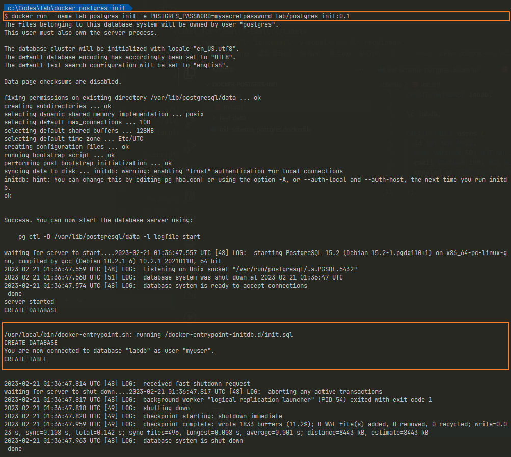
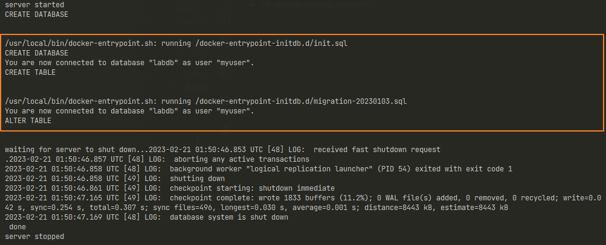
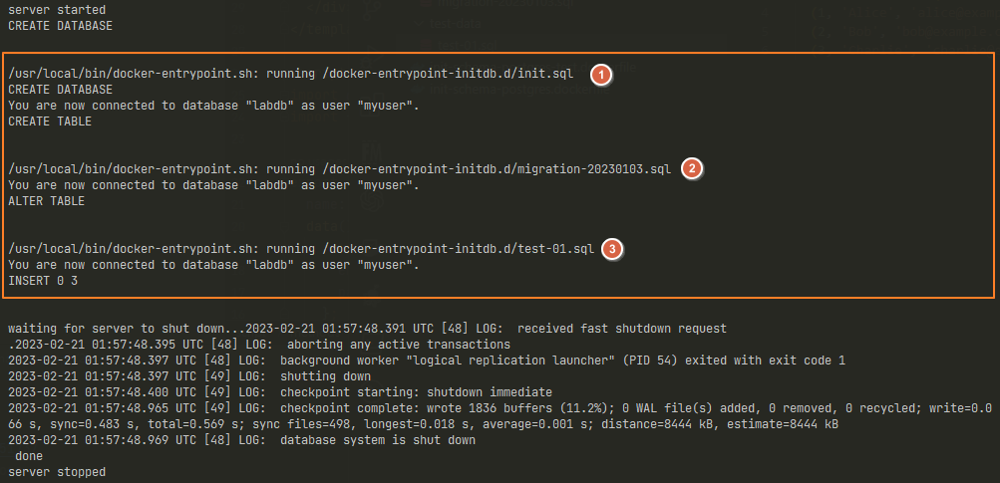

現在都可以使用 Container 的方式來運行資料庫，那麼。是否有辦法在 Image 建立 Container 的當下，就一併完成資料庫 schema 的設定？

若是可以，在啟動 PostgreSQL Image 時，就已經完成初始化資料庫的 container ，可以享受一些好處。

- 簡化部署流程：在建立 Container 時，自動完成初始化資料庫的過程，可以大幅簡化部署流程。只需要運行一個命令，就可以創建已經包含初始化資料庫的 Container，而不需要再手動初始化資料庫。

- 自動化測試：例如在每次測試運行時，都使用相同的的資料庫，確保測試結果一致性和可靠性。

- 方便協作：不同的開發人員可以使用相同的初始化資料庫 Continaer，確保在開發和測試過程中，使用相同的資料庫，減少開發和測試之間的差異。

> 🔖 長話短說 🔖
>
> - 若要讓 PostgreSQL container 建立的同時，完成資料庫 schema 初始化。要在在建立 Docker Image 的同時，把 `init.sql` 複制到 `/docker-entrypoint-initdb.d/`
> - `docker-entrypoint-initdb.d` 可放入多個 .sql 檔，其執行順序依地區設定的檔名順序。預設為 `en_US.utf8`

<!--more-->

在 [使用 dotnet-ef 建立 PostgreSQL 的 DBContext](../dotnet-ef-postgresql-dbcontext/index.md) 已經有使用 Docker-compose 建立 PostgreSQL，而本篇文章記錄的重點，在於建立 PostgreSQL  Container 時，自動把 database schema 建立起來。

操作環境:

- Docker version 20.10.22
- Docker Image: PostgreSQL:15.1

## 實作

在 PostgreSQL 的 [Docker Hub](https://hub.docker.com/_/postgres/) 內容中，`Initialization scripts` 有特別說明，若有需在 Container 建立之初，額外執行 script 時，可以把一到多個的  `*.sql`、`*.sql.gz`、 `*.sh`  的 scripts 放到 `/docker-entrypoint-initdb.d` 內。PostgreSQL 在 `initdb` 時，會去執行這些 script。

### 單個 init.sql 檔案

首先，將建立資料庫與表格的 script 存為 `init.sql`，並放在 `schema` 的資料夾中。

```sql
CREATE DATABASE labdb;

-- 連入資料庫
\c labdb;

CREATE TABLE users (
  id INT NOT NULL,
  name VARCHAR(50) NOT NULL,
  email VARCHAR(100) NOT NULL,
  created_at TIMESTAMP DEFAULT CURRENT_TIMESTAMP,
  PRIMARY KEY (id)
);
```

同時，將 產生一個會進行 Initial script 的 postgreSQL 的 Image 的 dockerfile 另存為 `init-schema-postgres.dockerfile`。

```dockerfile
FROM postgres

COPY schema/init.sql /docker-entrypoint-initdb.d/

ENV POSTGRES_USER myuser
ENV POSTGRES_PASSWORD mypassword
ENV POSTGRES_DB mydb

EXPOSE 5432
```

目前資料夾的結構如下。

```
C:.
│  init-schema-postgres.dockerfile
│
└─schema
    init.sql
```

使用 `docker build` 的指令，建置名為 `lab/postgres-init` 的 Docker Image。

```shell
docker build . -f init-schema-postgres.dockerfile -t lab/postgres-init:0.1
```

完成後, 執行 Docker 來看一下成果，並不加 `-d` 以便觀察 PostgreSQL 的訊息。

```shell
docker run --name lab-postgres-init -e POSTGRES_PASSWORD=mysecretpassword lab/postgres-init:0.1
```

從輸出訊息中，可以看到 PostgreSQL Docker 會使用 `/usr/local/bin/docker-entrypoint.sh`  執行 `init.sql` 。



### 使用多個 sql 檔案

隨著開發的進行，可能因為需求異動或增刪欄位，而頻繁更新 schema。導致每次異動，都需要更新建置 Image 的 init.sql。

或者，開發人員可能需要含有測試資料的開發專用的資料庫 Image。

而 PostgreSQL 的 `Initialization script` 也支援多個 .sql 的檔案，但會**依據檔案名稱的順序，逐一執行**，若沒有改變 docker 內的地區設定，預設使用 `en_US.utf8` 。

#### 使用疊代的方式初始化資料庫

模擬在現有的資料庫 Schema 之中，新增欄位。

我們將增加欄位的 sql 語法，另存為 *migration-20230103.sql* 並存在 schema 的資料夾之中。

```sql
-- migration-20230103
\c labdb;

-- 資料庫的異動
ALTER TABLE users ADD COLUMN address VARCHAR(200);
```

此時，資料夾的結構如下。

```
C:.
│  init-schema-postgres.dockerfile
│
└─schema
     init.sql
     migration-20230103.sql
```

接著，再調整一下先前的 init-schema-postgres.dockerfile，更新 `COPY` 的方式，由單一檔案，改為資料夾內所有的 .sql 檔。

```dockerfile
FROM postgres

COPY schema/*.sql /docker-entrypoint-initdb.d/

ENV POSTGRES_USER myuser
ENV POSTGRES_PASSWORD mypassword
ENV POSTGRES_DB mydb

EXPOSE 5432
```

可以將新建立的 Image `tag` 0.2 版，以便與之前的版本區分。

在後續的使用上，也可以在每次的資料庫 schmea 異動時，所建立的 Image 加上不同的 `tag`，以區別資料庫的版本。

```shell
docker build . -f init-schema-postgres.dockerfile -t lab/postgres-init:0.2

docker run --name lab-postgres-init -e POSTGRES_PASSWORD=mysecretpassword lab/postgres-init:0.2
```



#### 加入測試資料

有時，為了進行開發測試或自動化測試，會需要一個已經含有測試資料的資料庫。若是需要手動從無有到的自建，可能費時又費力。

也可以運用 `Initialization script` 的機制，在建立完成 schema 後，再填入測試資料。

新增一個塞入測試資料的 scripts，並存放在 test-data 資料夾之中，取名為 *test-01.sql*。

```sql
-- test-01.sql
\c labdb;

-- 增加測試資料
INSERT INTO users (id, name, email) VALUES
  (1, 'Alice', 'alice@example.com'),
  (2, 'Bob', 'bob@example.com'),
  (3, 'Charlie', 'charlie@example.com');

```

此時的資料夾結構如下。

```
C:.
│  init-schema-postgres-test.dockerfile
│  init-schema-postgres.dockerfile
│
├─schema
│    init.sql
│    migration-20230103.sql
│
└─test-data
     test-01.sql
```

為了與前面的 init-schema-postgres.dockerfile 區份，另存為 `init-schema-postgres-test.dockerfile`。

在 dockerfile 的內容，增加 `COPY` 測試資料的 scripts 到 `/docker-entrypoint-initdb.d` 。

```dockerfile
FROM postgres

COPY schema/*.sql /docker-entrypoint-initdb.d/
COPY test-data/*sql /docker-entrypoint-initdb.d/

ENV POSTGRES_USER myuser
ENV POSTGRES_PASSWORD mypassword
ENV POSTGRES_DB mydb

EXPOSE 5432
```

再進行 docker image 的建置與執行。

```shell
docker build . -f init-schema-postgres-test.dockerfile -t lab/postgres-init-test:0.1

docker run --name lab-postgres-init -e POSTGRES_PASSWORD=mysecretpassword lab/postgres-init-test:0.1
```

從訊息可以看到，在建立 container 時，依序的執行 `init.sql`、`migration-20230103.sql`、`test-01.sql` 三支 script。



#### 注意事項

前面有提到，PostgreSQL docker 在 initialization scripts 時，是依據地區設定來決定 .sql 的執行順序。

當沒有注意檔名，很有可能會造成初始化失敗或資料非預期的情況。而 PostgreSQL docker 只要內部資料庫有存在任何資料，就不會再執行 `Initialization Scripts`。

為了實驗，故意放入 `02.sql` 後，執行 Image，就會看到以下的錯誤訊息。


在還沒有進行資料庫 schema 之前，就進行塞入測試資料的動作。會成立 Container 啟用資料，就算開啟 Container，內部的資料庫 schema 與資料也不完整。這是要注意的地方。

## 補充資料

▶ 站內文章

- [使用 dotnet-ef 建立 PostgreSQL 的 DBContext](../dotnet-ef-postgresql-dbcontext/index.md)
- [Docker 操作簡介](../series/build-automated-deploy/docker-operate/index.md) 外部文章

- [Creating and filling a Postgres DB with Docker compose | by José David Arévalo | Level Up Coding](https://levelup.gitconnected.com/creating-and-filling-a-postgres-db-with-docker-compose-e1607f6f882f)
