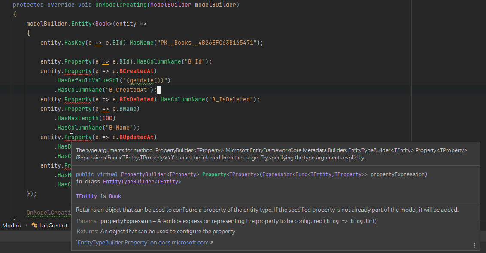
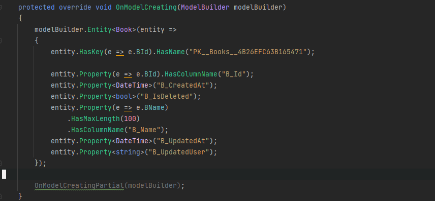
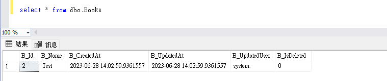
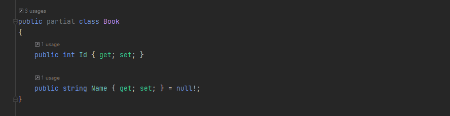
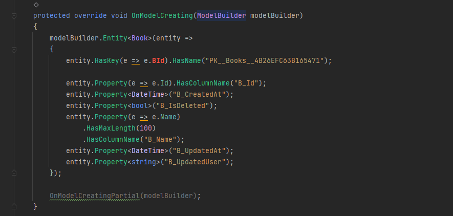

接續 DBContext 操作的議題，目前已知現有的資料庫內，所有的表格都有 `CreatedAt`、`UpdatedAt`、`UpdatedUser`、 `IsDeleted` 四個特定字詞結尾的欄位，額外記錄資料異動記錄。

在「[使用 HasQueryFilter 限定 DBContext 查詢內容](../dfcore-dbcontext-hasqueryfilter/index.md)」中，提到如何透過 `HasQueryFilter` 來簡化資料庫查詢的動作。

接下來，想要再進一步的封裝 EFCore 所使用的 Entity，讓這四個欄位的資訊，不要曝露於 DBContext 的操作中。

針對客制化 EFCore 的 DBContext 與 Entity Type，將相關的實作內容記錄下來。

> 🔖 長話短說 🔖
>
> - 若是覺得用 `dotnet ef dbcontext scaffold` 的指令來建立 DBContext 不方便，在 Visual Studo 可以安裝 [`EF Core Power Tool`](https://marketplace.visualstudio.com/items?itemName=ErikEJ.EFCorePowerTools) Extension 套件，以 GUI 進階設定 DBContext 的建立內容。
> - 針對 DBContext 的查詢要進行過濾，可在 DBContext 內的 `OnModelCreatingPartial(ModelBuilder modelBuilder)` 進行過濾。
> - 若要使用 EFCore 的 Shadow Property 來隱藏並操作資料，需要**規範資料庫欄位的格式**，避免 CodeTemplate 解析錯誤，以及 EF Core 更新資料發生錯誤。

<!--more-->

操作環境：

- Windows 11
- .NET Core 6
- EF Core 7

## DBContext 與 EntityType 的建立

`EFCore Power Tools` 是 Visual Studio 的 Extension，所以在使用前，需要先進行安裝。

在安裝完成後，我們可以在專案項目，按下滑鼠右鍵的選單中，選擇 `EFCore Power Tools > Reverse Enginerring`，以 GUI 的方式進行 EFCore Scaffold 產出想要的 DBContext。

可以在不調整 CodeTemplate 的前提下，配合勾選 GUI 內的選項,就可以達到進階 DbContext 生成設定。若需要調整 CodeTemplate，也可以利用 `EFCore Power Tools > Add CodeTemplate`，它會自動在專案的目錄下，建立一個名稱 `CodeTemplate/EFCore` 的資料夾。

順帶一提，`Reverse Enginerring` 內，勾選的設定，都會存在 `efpt.config.json` 之中。

## 使用 CodeTemplate 自訂產出的 DBContext 與 Entity

也可以使用 CLI 的方式來產生 CodeTemplate 資料夾。首先需要安裝  `dotnet new` EF Core 範本套件：

```shell
dotnet new install Microsoft.EntityFrameworkCore.Templates

# 若上述指令無法執行，可將 install 改為 -i
dotnet new -i Microsoft.EntityFrameworkCore.Templates
```

接著到要新增 CodeTemplate 的專案目錄下，執行下述指令。

```shell
dotnet new ef-templates
```

會在專案目錄下，建立 `CodeTemplate\EFCore` 資料夾，資料夾內有 `DbContext.t4` 與 `EntityType.t4` 兩個檔案，分別對應產出的 DBContext 與 Entity Type。

不管是使用 `EFCore Power Tools > Reverse Enginerring`，或是使用 CLI `dotnet ef dbcontext scaffold`，都會套用 CodeTemplate 內的設定。

可以使用 CodeTemplate 的 T4([Text Template Transformation Toolkit](https://en.wikipedia.org/wiki/Text_Template_Transformation_Toolkit)) 來客制化產出 DBContext 與 Entity Type ，來達成以下的需求。

- 要想限制建立出來的類型不公開，為 `private` 或 `internal` 的存取層級。。
- 變更 Entity Type 內的欄位名稱。
- 排除特定的 Entity Type 欄位。

個人建議，若需要調整 `DbContext.t4` 或 `EntityType.t4` 進行客制化，建議使用 CLI 的方式來執行，因為這樣可以更直接查看 `.t4` 調整後執行階段的錯誤訊息。

## 實作 Lab

在實作 Lab 之前，來描述一下需求。

目前有一個遵循三層式架構(Applicaiton/Business/Data Layer)的軟體，並使用 DI/IoC 的方式，避免模組之間的直接的耦合依賴關係。

這意味著 DbContext 的使用應儘量被限制在 Data Layer 中，避免 DbContext 曝露在外的。確保資料操作在適當的範疇內進行。

在資料庫的表格內，均有以 `CreatedAt`、`UpdatedAt`、`UpdatedUser`、 `IsDeleted`  這四個字詞結尾的欄位，額外記錄資料異動記錄。但希望減輕開發者的工作負擔，讓這四個欄位的更新或自動化。避免使用 ORM 時，還要花費心思在更新或維護這四個欄位的資料，或是發生更新失誤的情況。

同時，資料庫欄位名稱過長或不夠直覺，想要讓 ORM 生成 Entity Field 時，變更為適當的名稱。讓程式碼更加直觀易懂，提高開發效率。

將上述的需求用工程話語解釋如下

- DBContext 與 Entity 的 Class 存取等級為 Private/internal
- 開發人員在使用 Entity 時，無法變更四個欄位的資料。
- 自定義 Entity 內的 Field 名稱。

假設直接使用預設 Template 產生的 DBContext/Entity 內容。

```csharp
public partial class LabDbContext : DbContext
{
	public virtual DbSet<Book> Books { get; set; }

	protected override void OnModelCreating(ModelBuilder modelBuilder)
	{
		...

		OnModelCreatingPartial(modelBuilder);
	}

	partial void OnModelCreatingPartial(ModelBuilder modelBuilder);
}

public class Book
{
	public int BId { get; set; }
	public string BName { get; set; }
	public DateTime BCreatedAt { get; set; }
	public DateTime BChgTime { get; set; }
	public string BChgUsr { get; set; }
	public short BChgState { get; set; }
}
```

期望的 DBContext/Entity 內容

```csharp
internal partial class LabDbContext : DbContext
{
	public virtual DbSet<Book> Books { get; set; }

	protected override void OnModelCreating(ModelBuilder modelBuilder)
	{
		...

		OnModelCreatingPartial(modelBuilder);
	}

	partial void OnModelCreatingPartial(ModelBuilder modelBuilder);
}

internal class Book
{
	public int Id { get; set; }
	public string Name { get; set; }
}
```

### 更新 DbContext/Entity 的存取等級

我們從最簡單的開始，把 DbContext/Entity 的存取等級，由 public 更改為 internal。

分別在 `DbContext.t4` 與 `EnitiyType.t4` 找到 `public partial class` 這一行，改為 `internal partical class` 。

```t4
// DbContext.t4
internal partial class <#= Options.ContextName #> : DbContext

// EntityType.t4
internal partial class <#= EntityType.Name #>
```

再執行 `dbcontext scaffold` 結果如下。

### 隱藏特定欄位，並在增/修/刪時，自動更新資料

這要同時調整 `EntityType.t4` 、`DbContext.t4` ，運用 [Shadow Properties](https://learn.microsoft.com/zh-tw/ef/core/modeling/shadow-properties#configuring-shadow-properties) 的特性，讓一般開發者不會直接操作 `CreatedAt`、`UpdatedAt`、`UpdatedUser`、 `IsDeleted` 四個欄位。

並 override DbContext 的 `SaveChanges/SaveChangesAsync`，讓資料的增/修/刪時，可以在背後更新 `CreatedAt`、`UpdatedAt`、`UpdatedUser`、 `IsDeleted` 對應的資料庫欄位。

#### EntityType.t4 調整

在 `EntityType.t4` 的調整，主要目的是讓開發者不會透過 Entity 去異動到不該動的資料欄位。

找到 `foreach (var property in EntityType.GetProperties().OrderBy(p => p.GetColumnOrder() ?? -1))` 這一行，針對特定的欄位名稱進行排除。

```t4
var excludeColumns = new List<string> { "CreatedAt", "UpdatedAt", "UpdatedUser", "IsDeleted"};

foreach (var property in EntityType.GetProperties().OrderBy(p => p.GetColumnOrder() ?? -1))
{
	// 加入欄位排除，實務上依實際的欄位名稱進行對應調整。
	if (excludeColumns.Any(exclude => property.Name.EndsWith(exclude))
	{
		continue;
	}

	... skip ...
}
```

#### DbContext.t4 調整

當調整完 EntityType 後，再執行 `dotnet ef dbcontext scaffold` 後，會發現 LabContext 內的發生以下的錯誤。


所以，接下來我們要進行 DbContext.t4 的調整。可以使用 `entity.Property` 為 keyword，快速定位要調整的位置。

接著，針對要原本的 `CreatedAt`、`UpdatedAt`、`UpdatedUser`、 `IsDeleted` 這四個欄位，改寫 DbContext.t4，使其成為 [Shadow Properties](https://learn.microsoft.com/zh-tw/ef/core/modeling/shadow-properties#configuring-shadow-properties)，並預期產出的 DBContext 內容如下。

```csharp
protected override void OnModelCreating(ModelBuilder modelBuilder)
{
	modelBuilder.Entity<Book>(entity =>
	{
		... 略 ...

		// 原本 DbContext 產生的內容
		// entity.Property(e => e.BUpdatedAt)
		// 	     .HasDefaultValueSql("(getdate())")
		//  	 .HasColumnName("B_UpdatedAt");

		// Shadow Property
		entity.Property<DateTime>("B_UpdatedAt");

	});

	OnModelCreatingPartial(modelBuilder);
}
```

在這邊會用到 `code.Reference(property.ClrType)` 與 `property.GetColumnName()`，各別取得資料類型與資料庫欄位名稱。

```t4
foreach (var property in entityType.GetProperties())
{
	...

	var excludeColumns = new List<string> { "IsDeleted", "CreatedAt", "UpdatedAt", "UpdatedUser" };

	if (excludeColumns.Any(exclude => property.Name.EndsWith(exclude))
	{
#>
		entity.Property<<#= code.Reference(property.ClrType) #>>("<#= property.GetColumnName() #>");
<#
    }
	else
	{
#>
	entity.Property(e => e.<#= property.Name #>)<#= code.Fragment(propertyFluentApiCalls, indent: 4) #>;
	}

	anyEntityTypeConfiguration = true;
	firstProperty = false;
}
```

調整後，產生出來的 DbContext 如下。對應到資料庫 `B_CreatedAt`、`B_UpdatedAt`、`B_UpdatedUser`、`B_IsDeleted` 四個欄位的 Property 都已經變更為 Shadow Property。



#### 改寫 SaveChanges/SaveChangeAsync 行為

在前面，已經將 `CreatedAt`、`UpdatedAt`、`UpdatedUser`、`IsDeleted` 四個特定字詞結尾的欄位，變更為 Shadow Property。所以在進行 `SaveChanges/SaveChangesAsync` 調整時，需要直接對 Entity.Property 進行設定。

```csharp

internal partial class LabContext
{
	public override int SaveChanges()
	{
		this.UpdateDataAttribute();
		return base.SaveChanges();
	}

	public override Task<int> SaveChangesAsync(
		CancellationToken cancellationToken = new CancellationToken())
	{
		this.UpdateDataAttribute();
		return base.SaveChangesAsync(cancellationToken);
	}

	private void UpdateDataAttribute()
	{
		var currentTime = DateTime.UtcNow;

		foreach (var entry in this.ChangeTracker.Entries())
		{
		// 若是刪除的操作，將操作改為軟刪除(編輯)
		if (entry.State == EntityState.Deleted)
		{
			var isValid = entry.Properties.FirstOrDefault(prop =>
							prop.Metadata.Name.EndsWith("IsDeleted",
								StringComparison.OrdinalIgnoreCase));

			// 因為資料庫欄位為 bit, 所以直接指定 1, 實務上請避免使用 Magic Number。
			if (isValid != null)
				isValid.CurrentValue = 1;

			entry.State = EntityState.Modified;
		}

		if (entry.State == EntityState.Added)
		{
		// 若是新增資料，額外指定 CreatedAt 的資料
		var createAtProperty = entry.Properties.FirstOrDefault(prop =>
								prop.Metadata.Name.EndsWith("CreatedAt",
									StringComparison.OrdinalIgnoreCase));

		if (createAtProperty != null)
			createAtProperty.CurrentValue = currentTime;
		}

		// 更新 UpdatedAt
		var updateAtProperty = entry.Properties.FirstOrDefault(prop =>
								prop.Metadata.Name.EndsWith("UpdatedAt",
								StringComparison.OrdinalIgnoreCase));

		if (updateAtProperty != null)
			updateAtProperty.CurrentValue = currentTime;

		// 更新 UpdatedUser
		var updateUserProperty = entry.Properties.FirstOrDefault(prop =>
									prop.Metadata.Name.EndsWith("UpdatedUser",
										StringComparison.OrdinalIgnoreCase));

		// Lab 先固定 operateUser 為 system, 實務上需要從其他取得資料
		if (updateUserProperty != null)
			updateUserProperty.CurrentValue = "system";
	}
}
```

#### 成果

建立一個 .NET 6 的 console app，並依上述的說明進行調整。

從下述的 DEMO Code 可以看到，開發者在不指定或不知道 shadow property 的情況下，EF Core 在背後協助特定資料的更新。

```csharp
// Program.cs
using Lab.Models;

Console.WriteLine("Hello, World!");

var context = new LabContext();
context.Books.Add(new Book { BName = "Test" });
context.SaveChanges();
```



### 更新 Enity 的 Field 名稱

針對這個需求,需要同時異動 `EntityType.t4` 與 `DbContext.t4`，不然 DbContext 無法將 Entity 與 Database 的欄位 Mapping 起來。

在這些只是作個 DEMO，所以下述說明，僅調整 Property 的部份。但在實務上，還需要調整 `.HasKey` 、`HasIndex` 等地方，要特別注意。

#### EntityType.t4

使用 `{ get; set; }` 快速定位要調整的位置。調整 `<#= property.Name #>` 的內容即可。

```t4
// 原本的寫法
public <#= code.Reference(property.ClrType) #><#= needsNullable ? "?" : "" #> <#= property.Name #> { get; set; }<#= needsInitializer ? " = null!;" : "" #>

// 調整後的寫法
// 因為 POC 所以直接把欄位名稱第一個字元移除，實務上需依實際情況調整
public <#= code.Reference(property.ClrType) #><#= needsNullable ? "?" : "" #> <#= property.Name.Substring(1) #> { get; set; }<#= needsInitializer ? " = null!;" : "" #>
```



#### DbContext.t4

欄位名稱調整的位置，跟前面進行 Shadow Propery 調整的位置相同。一樣可以使用 `entity.Property` 快速定位調整位置。

但因為沒有調整 `.HasKey` 、`HasIndex` 等地方，所以產生出來的 DbContext 內容會有異常。

```t4
// 原本寫法
entity.Property(e => e.<#= property.Name #>)<#= code.Fragment(propertyFluentApiCalls, indent: 4) #>;

// 調整後
entity.Property(e => e.<#= property.Name.Substring(1) #>)<#= code.Fragment(propertyFluentApiCalls, indent: 4) #>;
```



## 小結

利用 EF Core 的特性來隱藏實際資料庫欄位資訊，並自動化進行特定資料的更新，除了在 EF Core 底層，需要做一些額外的設定。

同時需要規範資料庫欄位的格式，避免 EF Core 底層解析錯誤。

但換來的昰減少重復性的工作併且避免錯誤操作，造成的資料錯誤。

## 延伸閱讀

▶ 站內文章

- [使用 HasQueryFilter 限定 DBContext 查詢內容](../dfcore-dbcontext-hasqueryfilter/index.md)
- [在 HasQueryFilter 使用 Shadow Property 的注意事項](../../Ean%20的寫作庫/Software/Develop/EF%20Core%20-%20在%20HasQueryFilter%20使用%20Shadow%20Property%20的注意事項.md)

▶ 站外文章

- [Reverse Engineering · ErikEJ/EFCorePowerTools Wiki · GitHub](https://github.com/ErikEJ/EFCorePowerTools/wiki/Reverse-Engineering)
- [自訂反向工程範本 - EF Core | Microsoft Learn](https://learn.microsoft.com/zh-tw/ef/core/managing-schemas/scaffolding/templates?tabs=dotnet-core-cli)
- [陰影和索引子屬性 - EF Core | Microsoft Learn](https://learn.microsoft.com/zh-tw/ef/core/modeling/shadow-properties)
