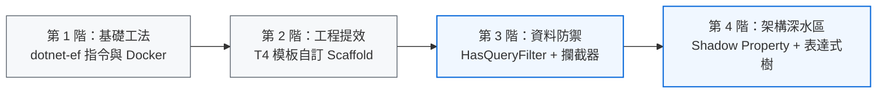

> ⚠️ **版本適用說明**：
>
> 本系列文章多半基於 **.NET 7 / EF Core 7** 開發經驗撰寫。儘管框架持續迭代，文中所提及的多數核心觀念、架構決策與 CLI 指令 (如 Scaffolding、Global Query Filter、Docker 架設等) 依然向上相兼容，適合做為進階開發之參考指引。
>
> 本系列文章彙整了在 .NET 環境中使用 Entity Framework Core 的各種實踐與筆記，從基礎工具的使用、由資料庫優先 (Database-First) 的 DbContext 生成，到進階的查詢過濾與模板客製化，提供一系列的實戰經驗分享。

這些文章最初都源自我個人在專案實作時，真實遇到的各種痛點與踩坑紀錄。隨著時間推移，站內與 `EF Core` 相關的累積文章越來越多。

為了解決自己「每次依應用情境找資料都很麻煩」的問題，並希望能幫助到遇到相同困難的主流開發者，我將它們系統化地歸納成這份總覽指南，讓大家能快速對症下藥。

## 🗺️ 建議閱讀路徑

為了幫助不同階段的開發者快速找到需要的資源，可以依照以下路徑閱讀本系列：

- 🐣 **初學者/剛接手專案**：建議從 [**EF Core CLI Tool 操作筆記**] 開始，接著根據專案使用的資料庫，閱讀對應的 **[從既有資料庫建立專案 (Database First)]** 章節。
- 🦅 **進階開發者/架構師**：如果需要解決共用欄位、權限隔離與自動化問題，請直接跳至 **[⚙️ 進階客製化與資料存取控制]** 章節，了解 `T4 Template`、`HasQueryFilter` 與 `SaveChangesInterceptor` 軟刪除審計的閉環運用。

## 🛠️ 基礎工具與環境設置

關於 `EF Code` 的操作，雖說部份 IDE 已有提供操作 UI，但大多時間的操作，都是透過 CLI 指令進行。

有時候久久未使用，臨時無法回想起所需要的指令。在這個時機點，可以直接在這查詢需要的指令。

### [EF Core CLI Tool 操作筆記](../ef-core-cli-note/index.md)

**實際情境：**

- 剛加入新專案，PM 說要用 EF Core，但不知道從哪開始
- 接手舊專案，發現資料庫結構改了但程式碼沒更新
- 開發到一半忘記 Scaffolding 指令的完整參數
- 團隊成員電腦的 EF Core 工具版本不一致導致問題

**解決問題：**

- 不熟悉 EF Core 命令列工具的安裝、更新與基本操作
- FAQ 基本操作問題的查找與排除

## 🗄️ 從既有資料庫建立專案 (Database First)

以個人而言，開發後端服務時，與資料庫相關的功能，大多是使用 DataBase First，再透過 `scaffold` 方式，讓工具自動產生對應的 Model。

但個人電腦資源有限，不想要在本地端直接安裝資料庫的主體。大多都會採用 Docker 建立 Container 的方式，在本地端建立起資料庫。一方面保持系統的乾淨性，另一方面，在無需使用時，釋放資料庫相關的使用資源。

若在使用 Container 容器，建立資料庫的操作遇到相關的問題，可以參考以下的文章。

### [使用 dotnet-ef 建立 SQL Server on Docker 的 DBContext](../dotnet-ef-sqlserver/index.md)

**實際情境：**

- 公司使用 Docker 環境開發，但每次重啟容器資料都不見了
- 用 `dotnet ef scaffold` 連 SQL Server 時出現憑證錯誤
- 開發環境的 SQL Server 登入帳密設定有問題
- 需要在容器化環境中建立穩定的開發資料庫

**解決問題：**

- 如何建立 SQL Server 的 container
- Docker 環境下 SQL Server 的資料持久性與連線問題
- EF Core  Nuget 相關套件安裝
- 處理憑證錯誤、登入問題

### [使用 dotnet-ef 建立 PostgreSQL 的 DBContext](../dotnet-ef-postgresql-dbcontext/index.md)

**實際情境：**

- 專案決定從 SQL Server 轉換到 PostgreSQL
- 新專案選用 PostgreSQL，但不知道如何設定 EF Core
- 需要快速從現有 PostgreSQL 資料庫產生 C# 程式碼
- 想要跨平台部署，選擇開源資料庫方案

**解決問題：**

- 建立 PostgreSQL 的 Container
- PostgreSQL 資料庫提供者的安裝與連接設定
- 資料庫機敏資料的管理

## ⚙️ 進階客製化與資料存取控制

隨著 `EF Core` 使用的次數與情境越來越多，開始發現有些固定的欄位，基於維運與稽核，是系統必須保留的資訊。

但是每次都手動更新的話，可能會忘記去更新，或更新錯誤。為避免這個問題，我們就開始考慮，能否以採用自動化的方式來自動更新。

還好知道，當透過 `EF Core` 的 `scaffold` 工具來建立 Model 時，其底層透過 `T4 Template` 的技術，產出程式中使用的 `DBContext` 與對應表格的 `Entry`。

而資料庫的存取控制操作，則是在 `DBContent` 預設的提供方法。

因此可以從這兩個方向下手，來達成自動化的目標。

如果是針對 `T4 Template` 或是改寫 `DBContent` 現行方法有需求的話，可以參考下面內容。

### [使用 T4 CodeTemplate 客制化 EFCore Scaffold 產出內容](../dotnet-ef-core-customized-dbcontext-entity/index.md)

**實際情境：**

- 公司要求所有 Entity 類別都要有 `CreatedAt`、`UpdatedAt` 審計欄位，但**希望** Scaffold 產出的程式碼沒有
- 希望自動產生的程式碼能遵循公司的 Coding Standard（如 private 欄位、特定命名規則）
- 有些資料庫欄位不想暴露給 API，希望設成 Shadow Property
- 每次重新 Scaffold 都要手動修改一堆程式碼，想要一次性解決

**解決問題：**

- 自動產生的 Entity 類別缺乏客製化邏輯，如審計欄位自動更新
- 需要統一的程式碼風格、Shadow Properties、或自動化業務邏輯

**核心價值：** 透過 T4 模板實現程式碼生成的完全控制，減少重複性工作

### [EF Core 資料存取防護全攻略：從 HasQueryFilter 全域過濾到 SaveChangesInterceptor 軟刪除與審計實戰](../efcore-hasqueryfilter-and-savechanges-interceptor-guide/index.md)

**實際情境：**

- SaaS 產品需要多租戶功能與軟刪除，但手寫 `.Where(x => !x.IsDeleted)` 容易因人為遺漏造成髒資料外洩
- 過去在 DbContext 中覆寫 `SaveChanges` 處理時間戳與軟刪除，導致資料庫上下文過度肥大且無法跨 Context 共用
- 呼叫 `Remove()` 時希望自動改寫為 `UPDATE` 並標記軟刪除與刪除時間，對業務層完全透明
- 需要將「讀取端」過濾與「寫入端」攔截整合成高內聚的企業級資料存取安全防護機制

**解決問題：**

- 透過 `HasQueryFilter` 建立全域查詢過濾，必要時以 `.IgnoreQueryFilters()` 顯式繞過
- 透過 `SaveChangesInterceptor` 在交易提交前攔截，就地改寫 `EntityState` 狀態並補齊審計欄位
- 提供 5 階段 If-Then 決策分析判斷表，指引團隊選用最適合的資料存取防護策略

### [EF Core 實戰：當 HasQueryFilter 遇上 Shadow Property](../use-shadow-property-and-hasqueryfilter-on-ef-core/index.md)

**實際情境：**

- 使用 T4 模板將 `IsDeleted`、`ShopId` 設為 Shadow Property，但在 `HasQueryFilter` 中使用 `Expression.Property` 會在執行時期拋出 `ArgumentException`
- 想要將中繼欄位完全從 Entity 類別中隱藏，同時又要在查詢中自動全域過濾
- 寫入存檔時，需要為沒有實體 C# 屬性的陰影欄位自動賦值與更新軟刪除狀態
- 在傳統「覆寫 `SaveChanges`」與現代「`SaveChangesInterceptor`」之間尋求最佳整合架構

**解決問題：**

- 剖析 `Expression.Property` 反射盲點，改用 `Expression.Call` 搭配 `EF.Property<T>` 動態轉譯 SQL
- 提供寫入端雙軌實踐：單體快速專案的 `DbContext.SaveChanges` 覆寫 vs 企業級分層架構的 `SaveChangesInterceptor` 獨立實作
- 附帶 5 步驟故障排查指南與架構健檢清單，專治深水區邊界地雷

---

## 結語與未來更新

`Entity Framework Core` 是一個非常龐大且演進迅速的 ORM 框架，理解其核心工具與進階架構，能為 .NET 專案帶來極大的開發效益。

本系列文章是基於個人在實務開發中遇到的痛點與解法所整理的結晶。技術日新月異，未來如果在專案中遇到更多有趣的情境或 EF Core 的新特性實戰，我也會持續將內容補充進這個系列之中。建議您可以將此頁面加入書籤，並隨時回來查找需要解決方案！
