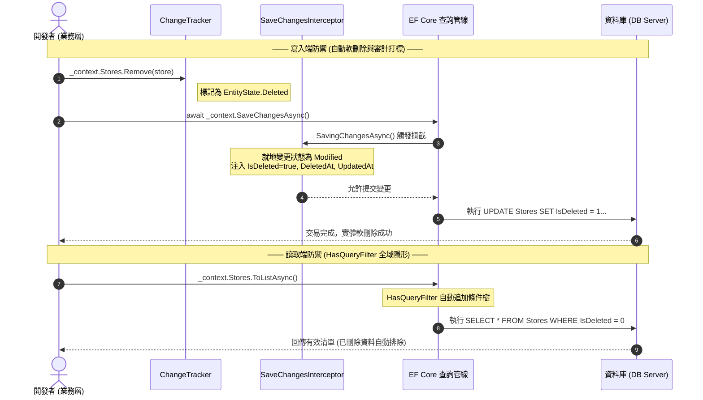

> 🔖 長話短說 🔖
>
> - **常見困境**：手動在每個 LINQ 查詢寫 `.Where(x => !x.IsDeleted)` 容易因人為遺漏造成髒資料洩漏；而傳統在 `DbContext` 覆寫 `SaveChanges` 處理時間戳與軟刪除，又會導致資料庫上下文過度肥大。
> - **讀取端防禦**：使用 `HasQueryFilter` 建立全域查詢過濾器，任何查詢預設自動排除軟刪除資料與跨租戶資料；後台管理需要查閱歷史紀錄時，再透過 `.IgnoreQueryFilters()` 顯式繞過。
> - **寫入端防禦**：使用現代 EF Core 的 `SaveChangesInterceptor` 攔截資料庫提交交易，將 `EntityState.Deleted` 狀態就地改寫為 `EntityState.Modified` 並打上刪除時間，同時自動補齊 `CreatedAt` 與 `UpdatedAt` 審計欄位。
> - **讀寫自動協同**：寫入時攔截改寫為軟刪除，讀取時全域自動隱藏，兩者自動協同運作，上層業務邏輯完全無感，達成高內聚的企業級資料生命週期管理。

在開發資料密集型系統（如企業內部系統、SaaS 多租戶平台）時，有兩項非功能性需求幾乎是每個專案都躲不掉的標配：**資料軟刪除（Soft Delete）** 與 **維運審計追蹤（Audit Trail）**。

很多剛接觸企業系統的新手常會問：「既然使用者按下刪除，為什麼不直接從資料庫 `DELETE` 掉，省下硬碟空間？」在真實商業場景中，資料一旦物理刪除，後續的財務對帳、操作稽核、誤刪復原與歷史關聯都會瞬間斷鏈。因此，「軟刪除」本質上不是刪除，而是為資料打上「封存／已停用」的狀態標記，讓它在一般查詢中隱形，但在需要追溯時仍能完整還原。

平時為了求快或求方便，最直覺的作法就是在每次下 LINQ 查詢時手動補上一行 `.Where(x => !x.IsDeleted)`，並在 `DbContext` 覆寫 `SaveChanges` 塞滿各種狀態檢查與時間戳賦值。

這種做法在專案初期雖然簡單好上手，但背後的防護機制往往高度依賴人為自發介入——查詢一旦漏寫一行就可能造成機敏資料洩漏，而把所有審計邏輯往資料庫上下文塞，時間一久也容易讓 `DbContext` 變得臃腫雜亂且難以維護。

其實，這就像大樓的物業門禁與分揀機制：住戶進電梯感應磁扣，電梯自動只能前往授權樓層，未授權的樓層按鈕直接在面板上「隱形」，根本不需要警衛每次盯著監視器手動按電梯；而廢棄物丟進管道，也是由分揀閘門在掉入底層前自動分類標記，不需要清潔人員逐一開袋檢查。

在 EF Core 中，最理想的架構也是如此：

- **讀取端**：交給 **`HasQueryFilter`（全域查詢過濾器）**，在全域直接讓無效與跨租戶資料「自動隱形」。
- **寫入端**：交給 **`SaveChangesInterceptor`（異動攔截器）**，在提交交易前就地將刪除指令轉為軟刪除並補齊時間戳。

兩道防線各司其職，上層業務邏輯就能完全無感，回歸純粹的商業價值。本文將帶你從這套協同機制的底層原理出發，建構一個既好維護又具備韌性的資料存取防線。

<!--more-->

## 讀取端防禦：全域查詢過濾器 (HasQueryFilter)

在沒有全域機制前，多數開發者會透過兩種方式過濾軟刪除資料：

1. **手動下達 `.Where(x => !x.IsDeleted)`**：最直覺，但也最脆弱。專案有幾十個 API 就得寫幾十次，只要漏掉一次就是線上事故。
2. **自訂 `IQueryable` 擴充方法**：例如包裝 `.WhereActive()`，雖然提高了語意與重用性，但本質上仍然依賴開發者記得手動呼叫。

為了解決人為遺漏的問題，EF Core 提供了 **全域查詢篩選（Global Query Filter）**。只要在模型建立時宣告過濾條件，後續所有針對該 Entity 的查詢（包含關聯導覽屬性的 Include），都會自動被套上該條件。

這套過濾機制**完全是在資料庫端（Database Server）完成的**——EF Core 會在將 LINQ 編譯為 SQL 語句時，自動於 `WHERE` 子句追加條件，而不是把資料庫裡的數萬筆廢棄資料全都搬進應用程式記憶體才篩選。因此，它完全不會造成額外的網路頻寬消耗與記憶體浪費。

### 單一條件全域過濾

假設系統的 `Store` 實體具備軟刪除欄位 `IsDeleted`：

```csharp
public class Store
{
    public int Id { get; set; }
    public int TenantId { get; set; }
    public string Name { get; set; } = string.Empty;
    public bool IsDeleted { get; set; }
}
```

在 `DbContext.OnModelCreating` 中，我們只需一行宣告：

```csharp
protected override void OnModelCreating(ModelBuilder modelBuilder)
{
    base.OnModelCreating(modelBuilder);

    // 任何針對 Store 的查詢，底層 SQL 自動附加 WHERE [IsDeleted] = 0
    modelBuilder.Entity<Store>().HasQueryFilter(s => !s.IsDeleted);
}
```

當業務層呼叫 `await _context.Stores.ToListAsync()` 時，EF Core 在資料庫底層實際產生的 SQL 就會自動附加條件：

```sql
-- EF Core 自動轉譯的 SQL：過濾直接在資料庫執行，已刪除資料根本不會傳回記憶體
SELECT [s].[Id], [s].[Name], [s].[TenantId], [s].[IsDeleted]
FROM [Stores] AS [s]
WHERE [s].[IsDeleted] = CAST(0 AS bit);
```

這徹底杜絕了業務邏輯誤讀已刪除資料的可能。

### 動態多條件過濾（Expression Tree 實戰）

實務上，多租戶系統往往需要**同時過濾「未刪除」與「屬於當前租戶」**。如果模型是透過 Scaffold 從現有資料庫大量生成，一個個實體手寫設定非常繁瑣，我們可以直接運用 Expression Tree 對所有具備對應欄位的實體批次套用。

#### 為什麼非得手動組裝 Expression Tree？

可能會有朋友好奇：「既然已經有了 LINQ，為什麼我們不能直接寫一段泛型方法，非得親手組裝生澀的 Expression Tree 不可？」

關鍵在於**動態實體遍歷**與**SQL 語法樹編譯**：

- 當專案有數十張表是動態掃描出來的，我們無法在編譯期為未知型別預先寫死強型別的 Lambda。
- 更重要的是，EF Core 的 `HasQueryFilter` 接收的不是一個在記憶體中執行的委派（Func），而是一棵**語法樹（Expression Tree）**。EF Core 必須剖析樹狀節點，才能將其翻譯為資料庫端的 SQL 條件。因此在動態批次掃描設定時，親手組裝 Expression Tree 是最穩健且能確保被編譯為資料庫 SQL 的做法。

以下是考量實務穩定度後的安全實作：

```csharp
public class AppDbContext : DbContext
{
    private readonly ITenantProvider _tenantProvider;

    // 公開動態租戶屬性，供 EF Core 每次查詢時即時讀取
    public int CurrentTenantId => _tenantProvider.GetCurrentTenantId();

    public AppDbContext(DbContextOptions<AppDbContext> options, ITenantProvider tenantProvider)
        : base(options)
    {
        _tenantProvider = tenantProvider;
    }

    protected override void OnModelCreating(ModelBuilder modelBuilder)
    {
        base.OnModelCreating(modelBuilder);

        foreach (var entityType in modelBuilder.Model.GetEntityTypes())
        {
            var isDeletedProp = entityType.FindProperty("IsDeleted");
            var tenantIdProp = entityType.FindProperty("TenantId");

            // 必須共用同一個 ParameterExpression，否則執行時會拋出 NoNameParameter 例外
            var parameter = Expression.Parameter(entityType.ClrType, "e");
            Expression? combinedFilter = null;

            // 1. 軟刪除條件：e.IsDeleted == false
            // 防呆確認為 CLR 實體屬性（避免 Shadow Property 為 null 拋出例外）
            if (isDeletedProp?.PropertyInfo != null && isDeletedProp.ClrType == typeof(bool))
            {
                var isDeletedExpr = Expression.Equal(
                    Expression.Property(parameter, isDeletedProp.PropertyInfo),
                    Expression.Constant(false));
                combinedFilter = isDeletedExpr;
            }

            // 2. 多租戶條件：e.TenantId == this.CurrentTenantId
            // ⚠️ 關鍵：必須使用動態屬性存取 (MemberExpression)，切勿使用 Expression.Constant！
            if (tenantIdProp?.PropertyInfo != null && tenantIdProp.ClrType == typeof(int))
            {
                var currentTenantExpr = Expression.Property(
                    Expression.Constant(this),
                    nameof(CurrentTenantId));

                var tenantExpr = Expression.Equal(
                    Expression.Property(parameter, tenantIdProp.PropertyInfo),
                    currentTenantExpr);

                combinedFilter = combinedFilter == null 
                    ? tenantExpr 
                    : Expression.AndAlso(combinedFilter, tenantExpr);
            }

            if (combinedFilter != null)
            {
                var lambda = Expression.Lambda(combinedFilter, parameter);
                modelBuilder.Entity(entityType.ClrType).HasQueryFilter(lambda);
            }
        }
    }
}
```

> 💡 **進階思維：如果是使用影子屬性（Shadow Property）該如何處理？**  
> 在部分架構中，為了維持領域實體（Domain Entities）的純粹性，團隊可能會選擇使用 EF Core 的「影子屬性」來維護 `IsDeleted` 或 `TenantId`，此時實體類別上並沒有直接宣告 C# 屬性（`PropertyInfo` 為 `null`）。  
> 若專案採用影子屬性，就不能使用 `Expression.Property`，而是要透過反射組裝 `EF.Property<bool>(parameter, "IsDeleted")` 靜態方法節點。關於影子屬性在全域過濾器中的完整搭配細節，也可以參考我們先前的專題分享《[EF Core 實戰：當 HasQueryFilter 遇上 Shadow Property](../use-shadow-property-and-hasqueryfilter-on-ef-core/index.md)》。

#### ⚠️ 致命避雷點 1：切勿使用 Expression.Constant 綁定動態租戶

在組裝多租戶條件時，這是最致命也是最隱蔽的架構陷阱。

EF Core 的 `OnModelCreating` 在整個應用程式生命週期中**預設只會執行一次**（產生的模型會被長期快取在記憶體中）。如果在 Expression Tree 中寫入：

```csharp
// ❌ 嚴重危險：千萬不能這樣寫！
int currentTenantId = _tenantProvider.GetCurrentTenantId();
var tenantExpr = Expression.Equal(
    Expression.Property(parameter, tenantIdProp.PropertyInfo!),
    Expression.Constant(currentTenantId)); // 租戶 Id 被永遠鎖死在 Model 快取中！
```

這段程式碼在應用程式啟動、第一個租戶請求進來時能正常運作。但當第二位不同租戶的使用者請求進來時，因為 EF Core 根本不會重新執行 `OnModelCreating`，**所有使用者將被永久鎖死在第一位租戶的資料檢視中**，造成災難性的全站資料洩漏！

**正確解法**：如上方完整範例所示，透過 `Expression.Property(Expression.Constant(this), nameof(CurrentTenantId))` 存取 DbContext 上的屬性。EF Core 辨識到動態成員存取後，會將其編譯為參數化 SQL（如 `WHERE [s].[TenantId] = @__CurrentTenantId_0`），並在**每次執行查詢時動態帶入當前請求的值**。

#### ⚠️ 語法避雷點 2：共用 ParameterExpression 避免 NoNameParameter 例外

在動態組合多個 Expression 時，第二個常見錯誤是為每個條件各自呼叫 `Expression.Parameter(...)` 建立不同的參數變數。這段寫法在編譯期不會有任何警告，但執行時期 EF Core 會直接崩潰：

```text
System.InvalidOperationException: The LINQ expression 'NoNameParameter' could not be translated.
```

**解法**：務必在迴圈開頭建立單一 `var parameter = Expression.Parameter(entityType.ClrType, "e")`，並讓後續所有 `Expression.Property` 與最終 `Expression.Lambda` 嚴格共用同一個變數實例。

### 個別繞過全域過濾：IgnoreQueryFilters

如果後台管理員需要調閱歷史封存紀錄，或排程作業需要統計全域資料時，只要在 LINQ 鏈結中加上 `.IgnoreQueryFilters()`，就能顯式關閉全域過濾：

```csharp
// 顯式宣告繞過過濾器，連同已刪除的資料一併查詢
var allStores = await _context.Stores
                              .IgnoreQueryFilters()
                              .ToListAsync();
```

## 寫入端防禦：異動攔截器 (SaveChangesInterceptor)

讀取端搞定後，接下來是更關鍵的**寫入端**：當開發者呼叫 `_context.Remove(store)` 時，如何確保它不會真的執行 SQL `DELETE`，而是自動轉為軟刪除並寫入審計資訊？

### 告別在 DbContext 中覆寫 SaveChanges()

過去大家習慣在 `DbContext` 中寫：

```csharp
public override async Task<int> SaveChangesAsync(CancellationToken cancellationToken = default)
{
    foreach (var entry in ChangeTracker.Entries<IAuditableEntity>())
    {
        // 遍歷狀態並賦值...
    }
    return await base.SaveChangesAsync(cancellationToken);
}
```

這種作法隨著系統演進會帶來三大架構壞味道：

1. **破壞單一職責原則**：`DbContext` 應專注於資料庫連線與模型對映，不應成為審計與業務邏輯的垃圾桶。
2. **難以跨 Context 重用**：若系統包含多個 DbContext，這套邏輯只能靠基底類別繼承（BaseDbContext）或到處複製貼上。
3. **DI 依賴污染**：若審計欄位需要取得當前使用者 Id，往往需要將 `IHttpContextAccessor` 注入進 `DbContext` 的建構式，造成架構洩漏。

EF Core 7+ 提供的 **`SaveChangesInterceptor`**，讓我們可以將這段邏輯抽成完全獨立的服務元件。

> 💡 **職責邊界小思辨：為什麼不直接寫在 Controller Filter 或 Middleware 裡？**
>
> 有些朋友會問：「既然審計需要目前使用者資訊，為什麼不乾脆在 ASP.NET Core 的 Action Filter 或 Middleware 統一處理？」
>
> 核心在於**關注點分離與進入點的一致性**：Filter 與 Middleware 屬於 HTTP Web 傳輸層，只對 API 請求生效；但在真實企業應用中，資料的寫入與異動可能來自**背景排程作業（BackgroundService / Hangfire）、訊息佇列消費者（RabbitMQ / Kafka Consumer），或是單元/整合測試**。把防護邏輯深鎖在資料持久層的 `SaveChangesInterceptor`，才能確保無論資料從哪一個管道流入，都能受到 100% 相同標準的自動防護。

### 攔截器的生命週期時序

```text
應用層呼叫 context.SaveChangesAsync()
  │
  ├── 1. SavingChangesAsync()  <── 【核心介入點】在此改寫 EntityState 與補齊審計欄位
  │
  ├── 執行資料庫交易 (SQL INSERT / UPDATE)
  │
  ├── 2. SavedChangesAsync()   <── 資料庫交易成功，適合觸發領域事件或清除快取
  │
  └── 3. SaveChangesFailedAsync() <── 發生例外時觸發，用於統一記錄日誌
```

我們只要覆寫 `SavingChanges` 與 `SavingChangesAsync`，在資料庫交易觸發前介入，就能完美掌控實體的狀態轉換。

### 實作步驟：打造審計與軟刪除攔截器

#### 契約標記介面：定義軟刪除與審計領域規範

在核心領域層或共用類別庫定義契約介面：

```csharp
namespace Domain.Common;

public interface ISoftDeletable
{
    bool IsDeleted { get; set; }
    DateTimeOffset? DeletedAt { get; set; }
}

public interface IAuditableEntity
{
    DateTimeOffset CreatedAt { get; set; }
    string? CreatedBy { get; set; }
    DateTimeOffset? UpdatedAt { get; set; }
    string? UpdatedBy { get; set; }
}
```

#### 攔截器核心實作：狀態機轉換與自動時間戳

建立自訂攔截器，同步與非同步方法皆需覆寫：

```csharp
using System;
using System.Threading;
using System.Threading.Tasks;
using Domain.Common;
using Microsoft.EntityFrameworkCore;
using Microsoft.EntityFrameworkCore.Diagnostics;

namespace Infrastructure.Persistence.Interceptors;

public class AuditAndSoftDeleteInterceptor : SaveChangesInterceptor
{
    private readonly ICurrentUserProvider _currentUserProvider;

    public AuditAndSoftDeleteInterceptor(ICurrentUserProvider currentUserProvider)
    {
        _currentUserProvider = currentUserProvider;
    }

    public override InterceptionResult<int> SavingChanges(
        DbContextEventData eventData, 
        InterceptionResult<int> result)
    {
        UpdateEntities(eventData.Context);
        return base.SavingChanges(eventData, result);
    }

    public override ValueTask<InterceptionResult<int>> SavingChangesAsync(
        DbContextEventData eventData, 
        InterceptionResult<int> result, 
        CancellationToken cancellationToken = default)
    {
        UpdateEntities(eventData.Context);
        return base.SavingChangesAsync(eventData, result, cancellationToken);
    }

    private void UpdateEntities(DbContext? context)
    {
        if (context == null) return;

        var now = DateTimeOffset.UtcNow;
        var currentUserId = _currentUserProvider.GetCurrentUserId();

        // 1. 處理審計欄位 (IAuditableEntity)
        foreach (var entry in context.ChangeTracker.Entries<IAuditableEntity>())
        {
            if (entry.State == EntityState.Added)
            {
                entry.Entity.CreatedAt = now;
                entry.Entity.CreatedBy = currentUserId;
            }

            if (entry.State == EntityState.Modified)
            {
                entry.Entity.UpdatedAt = now;
                entry.Entity.UpdatedBy = currentUserId;
            }
        }

        // 2. 處理軟刪除狀態轉換 (ISoftDeletable)
        foreach (var entry in context.ChangeTracker.Entries<ISoftDeletable>())
        {
            if (entry.State == EntityState.Deleted)
            {
                // 關鍵核心：將狀態轉為 Modified，並精準設定屬性變更
                entry.State = EntityState.Modified;
                entry.Entity.IsDeleted = true;
                entry.Entity.DeletedAt = now;

                // ⚠️ 關鍵防禦：顯式指定參與 UPDATE 的屬性，避免未載入欄位被覆蓋
                entry.Property(nameof(ISoftDeletable.IsDeleted)).IsModified = true;
                entry.Property(nameof(ISoftDeletable.DeletedAt)).IsModified = true;

                if (entry.Entity is IAuditableEntity auditable)
                {
                    auditable.UpdatedAt = now;
                    auditable.UpdatedBy = currentUserId;
                    entry.Property(nameof(IAuditableEntity.UpdatedAt)).IsModified = true;
                    entry.Property(nameof(IAuditableEntity.UpdatedBy)).IsModified = true;
                }
            }
        }
    }
}
```

#### 💡 狀態轉換核心解析：嚴防「Stub 實體全欄位覆蓋災難」

當上層呼叫 `_context.Stores.Remove(store)` 時，ChangeTracker 預設將其標記為 `EntityState.Deleted`。攔截器在資料庫執行前將其攔截並轉為軟刪除。

但很多朋友在實作時容易忽略一個隱藏的生產環境地雷：**Stub 實體覆蓋問題**。

在實務開發中，為了避免不必要的資料庫查詢，工程師很常建立僅具備主鍵的 Stub 物件進行刪除：

```csharp
// 建立僅帶有 Id 的虛擬實體進行刪除，省去一次資料庫查詢開銷
var stub = new Store { Id = 10 };
_context.Stores.Remove(stub);
await _context.SaveChangesAsync();
```

如果攔截器僅僅執行 `entry.State = EntityState.Modified;`，EF Core 的 ChangeTracker 會認定該實體的所有屬性都被修改了！
這會導致 EF Core 在資料庫底層生成包含所有欄位的 UPDATE 指令：

```sql
-- ❌ 致命事故：未載入的 Name 與 TenantId 全被預設值覆寫！
UPDATE [Stores] 
SET [IsDeleted] = 1, [DeletedAt] = @now, [Name] = NULL, [TenantId] = 0
WHERE [Id] = 10;
```

資料庫原本珍貴的業務欄位直接被洗成 null 或 0，釀成難以挽回的資料損毀事故！

因此，我們在範例程式碼中特別透過 `entry.Property(...).IsModified = true` 進行**精準屬性標記**，確保產生的 SQL 永遠只會更新 `IsDeleted`、`DeletedAt` 與審計欄位，徹底杜絕全欄位覆寫的隱患。

#### 容器整合與註冊：生命週期與 DbContext 掛載

在 `Program.cs` 註冊攔截器，並透過 `AddInterceptors` 傳入 DbContext：

```csharp
var builder = WebApplication.CreateBuilder(args);

// 1. 註冊使用者識別提供者
builder.Services.AddScoped<ICurrentUserProvider, HttpCurrentUserProvider>();

// 2. 註冊攔截器 (生命週期與 UserProvider 保持一致，設為 Scoped)
builder.Services.AddScoped<AuditAndSoftDeleteInterceptor>();

// 3. 註冊 DbContext 並綁定攔截器
builder.Services.AddDbContext<AppDbContext>((sp, options) =>
{
    var interceptor = sp.GetRequiredService<AuditAndSoftDeleteInterceptor>();

    options.UseNpgsql(builder.Configuration.GetConnectionString("DefaultConnection"))
           .AddInterceptors(interceptor);
});
```

此時的 `AppDbContext` 內不需要寫任何一行 `SaveChanges` 覆寫程式碼，維持極致乾淨。

## 讀寫端如何自動協同運作

現在，我們把「讀取端」與「寫入端」串聯在一起，看看實務上的運作路徑：



開發者完全不需要在業務層操心「軟刪除欄位有沒有改」、「查詢條件有沒有漏」，一切在基礎設施層全自動完成。

## 資料存取防護方案決策分析判斷表

在討論具體策略前，不少務實的工程師或 Tech Lead 常會提出一個好問題：「我們團隊只有 2~3 個人，寫程式時手動指派 `entity.IsDeleted = true` 只要 3 秒鐘，何必大費周章定義介面、攔截器與表達式樹？這算不算過度設計？」

答案取決於**系統的生命週期與犯錯成本**：

- 如果是 1~2 個月內驗證商業模式的短期 MVP、或邏輯極單純的內部拋棄式小工具，手動賦值確實最快最輕便，硬上完整攔截器與表達式樹反而徒增初期理解成本。
- 但如果這個系統預期會維護超過一年、未來會有新成員加入，或者系統具有「跨租戶機敏資料隔離」與「法規稽核要求」，那麼人為手動標記就如同不定時炸彈——因為只要有一次發布漏寫了一行過濾，就可能面臨資料洩漏的重大合規風險。此時攔截器與全域過濾器不是過度設計，而是在專案初期為團隊買下長期維護的「合規保險」。

在評估軟刪除與資料防護架構時，不同的業務規模與技術情境有不同的合適處方：

| 評估步驟 | 判定條件與情境 | 推薦實作策略 | 關注重點 | 適用場景 |
| :--- | :--- | :--- | :--- | :--- |
| **Step 1：查詢端過濾防護** | 系統全面導入軟刪除或多租戶隔離 | **EF Core HasQueryFilter (全域過濾器)** | 必須提供 `.IgnoreQueryFilters()` 供後台調閱歷史 | 任何有軟刪除與租戶隔離需求的專案 |
| **Step 2：單體微型專案存檔** | 僅 1~2 人微型專案、單一 DbContext，無類別庫拆分 | **手動賦值或覆寫 DbContext.SaveChanges()** | 最快上手，但有架構耦合與人為遺漏包袱 | 短期驗證 (PoC)、小型內部工具 |
| **Step 3：分層架構標準實踐** | 採用 Clean Architecture、多類別庫或需多 Context 共用 | **EF Core SaveChangesInterceptor (本文推薦)** | 職責徹底解耦，隨插即用，單元測試極為友善 | 企業級 Web API、SaaS 產品、現代後端架構 |
| **Step 4：極高併發大量批次更新** | 頻繁使用 `ExecuteUpdate()` 或 `ExecuteDelete()` 批次指令 | **資料庫層級 Trigger 或規範 ExecuteUpdateAsync** | 批次指令直接跳過 ChangeTracker，攔截器不會觸發 | 巨量日誌清理、秒殺庫存扣減批次處理 |
| **Step 5：異質跨語言共用資料庫** | 資料庫同時被 Python、Java、排程或舊系統直接連線寫入 | **資料庫底層 Trigger + View 檢視表** | 跨語言全域防禦，所有連線強制生效 | 遺留系統共用資料庫、多系統整合場景 |

## 💡 深入實戰的常見疑問 (FAQ)

這套「讀取全域過濾 ＋ 寫入攔截器」的協同機制在絕大多數場景中相當省心，但在面對複雜業務與資料庫邊界情境時，實務上我們常會遇到以下幾個深入的關鍵問題：

### Q1：軟刪除後，唯一索引（Unique Index，如帳號、Email）衝突如何解決？

**實際遇到的狀況**：  
當使用者以 `user@example.com` 註冊帳號，一段時間後將帳號註銷（軟刪除 `IsDeleted = true`）。之後該使用者或另一位新用戶想用同一個 `user@example.com` 重新註冊時，資料庫會因為該 Email 依然存在於資料表中，直接拋出 `Unique Constraint Violation` 錯誤。

**建議作法**：

1. **首選做法：資料庫部分索引（Filtered Index / Partial Index）**  
   關聯式資料庫（SQL Server / PostgreSQL）支援針對特定條件建立索引。我們只要宣告「唯一性限制只針對未刪除的資料生效」即可：

   ```csharp
   // SQL Server 範例
   modelBuilder.Entity<User>()
       .HasIndex(u => u.Email)
       .IsUnique()
       .HasFilter("[IsDeleted] = 0");

   // PostgreSQL 範例
   // modelBuilder.Entity<User>().HasIndex(u => u.Email).IsUnique().HasFilter("is_deleted = false");
   ```

   如此一來，歷史已刪除的資料可以有多筆相同的 Email，但線上活躍中的有效資料永遠只能有一筆。
2. **替代做法：複合唯一鍵（Email + 刪除時間戳）**  
   若使用的資料庫不支援部分索引（如 MySQL 8.0 之前），可將唯一索引設為 `(Email, DeletedAt)` 複合鍵，未刪除時 `DeletedAt` 為預設初始值（如固定時間戳或透過虛擬產生欄位處理）。

### Q2：EF Core 7+ 的 `ExecuteDeleteAsync()` 批次指令會觸發攔截器嗎？

**實際遇到的狀況**：  
有些團隊為了追求批次操作效能，將大量過期資料清理改寫為 EF Core 7 的批次指令：`await _context.Stores.Where(s => s.Expired).ExecuteDeleteAsync();`。上線後卻發現這些資料被資料庫直接實體刪除，完全沒有保留軟刪除標記。

**原因解析**：  
答案是**不會觸發**。  
`ExecuteDeleteAsync()` 與 `ExecuteUpdateAsync()` 的設計初衷是直接將 LINQ 轉譯為單一 SQL 指令（`DELETE FROM Stores WHERE ...`）送進資料庫執行，完全繞過了 EF Core 的 ChangeTracker。因為實體根本沒有進入追蹤清單，`SaveChangesInterceptor` 自然完全無從介入。

**建議作法**：

1. **團隊規範：以 ExecuteUpdateAsync 取代 ExecuteDeleteAsync**  
   在團隊開發規範中明訂，具備軟刪除特性的實體一律禁止呼叫 `ExecuteDeleteAsync`，必須改為批次更新指令：

   ```csharp
   await _context.Stores
       .Where(s => s.Expired)
       .ExecuteUpdateAsync(s => s
           .SetProperty(b => b.IsDeleted, true)
           .SetProperty(b => b.DeletedAt, DateTimeOffset.UtcNow));
   ```

2. **資料庫層級保險：INSTEAD OF DELETE Trigger**  
   如果團隊希望在資料庫端建立最後一道防線，可在關鍵資料表上建立 `INSTEAD OF DELETE` Trigger，將任何直接對資料庫下達的物理刪除指令強制改寫為軟刪除 UPDATE。

### Q3：關聯資料表的串聯刪除（Cascade Delete）會連帶軟刪除子實體嗎？

**實際遇到的狀況**：  
刪除「訂單（Order）」時，其底下的「訂單明細（OrderItems）」會不會自動跟著被打上軟刪除標記？

**原因解析**：  

- **如果子實體未載入記憶體**：因為攔截器將父實體的指令改成了 `UPDATE Orders SET IsDeleted = 1`，資料庫端根本沒有發生物理 `DELETE`，因此資料庫層級的外鍵串聯刪除（Foreign Key Cascade Delete）**完全不會被觸發**，子表仍然保持 `IsDeleted = false`。
- **如果子實體已載入記憶體**：EF Core 的 ChangeTracker 預設只對物理刪除做級聯處理，當父實體被改寫為 `Modified` 後，ChangeTracker 不會自動將已載入的子實體也標記為刪除。

**建議作法**：

1. **導覽屬性穿透**：如果查詢子資料時一律透過父實體以導覽屬性查詢（例如 `_context.Orders.Include(o => o.Items)`），因為父實體已被 `HasQueryFilter` 隱藏，子實體自然也查不出來。
2. **攔截器深度遍歷（推薦）**：若業務上允許直接單獨查詢子實體（例如統計報表直接下 `_context.OrderItems`），則需在攔截器中針對標記為軟刪除的實體，透過 ChangeTracker 遍歷其已載入的關聯集合，連帶將子實體一併打上 `IsDeleted = true`；或者發送領域事件（Domain Event）交由專門的 Handler 處理批次軟刪除。

### Q4：累積數百萬筆軟刪除歷史資料，會不會拖慢常規查詢？

**實際遇到的狀況**：  
系統運行數年後，資料表累積了 500 萬筆資料，其中 400 萬筆是已刪除的歷史資料。全域查詢每次都自動附帶 `WHERE IsDeleted = 0`，一般查詢會不會因此變慢？

**原因解析**：  
**確實可能發生索引選擇性（Selectivity）退化**。  
一般 B-Tree 索引預設會將所有資料（包含 400 萬筆廢棄資料）全部納入索引樹。當 `IsDeleted = 0` 佔比極少或極高時，資料庫查詢最佳化器可能判定走索引成本過高而退化為全表掃描。

**建議作法**：

1. **部分索引（Filtered Index）**：在常用查詢的複合索引上加上 `WHERE IsDeleted = 0` 過濾條件。這樣索引樹只會維護未刪除的 100 萬筆資料，索引體積直接縮減 80%，記憶體快取命中率大幅提升。
2. **冷熱資料封存（Archive Pattern）**：定期透過深夜背景排程，將 `IsDeleted = true` 且超過法定保存期限（例如 180 天以上）的冷資料，批次轉移至專門的「歷史封存庫（Archive Database）」或離線資料倉儲，維持線上活躍資料庫的精煉與高效。

### Q5：背景 Worker 或訊息佇列消費者沒有 HTTP 脈絡時，審計者（CurrentUserProvider）如何取得？

**實際遇到的狀況**：  
在 Web API 請求中，我們能輕易透過 `IHttpContextAccessor` 從 JWT Claims 取得目前登入使用者的 Id。但在非同步排程（Hangfire / Quartz）、背景服務（BackgroundService），或是訊息佇列消費者（RabbitMQ Consumer）處理資料異動時，當前執行緒根本沒有 `HttpContext`，呼叫 `_currentUserProvider.GetCurrentUserId()` 會直接拋出例外或回傳 null，導致審計欄位缺失。

**建議作法**：  
1. **設計具備安全回退的 CurrentUserProvider**：  
   在提供者實作中加入脈絡判定。若 `HttpContext` 不存在，自動回退至預設的系統識別（例如 `"System/BackgroundWorker"` 或特定排程名稱）：
   ```csharp
   public class HttpCurrentUserProvider : ICurrentUserProvider
   {
       private readonly IHttpContextAccessor _httpContextAccessor;
       public HttpCurrentUserProvider(IHttpContextAccessor httpContextAccessor) 
           => _httpContextAccessor = httpContextAccessor;

       public string GetCurrentUserId()
       {
           var userId = _httpContextAccessor.HttpContext?.User?.FindFirstValue(ClaimTypes.NameIdentifier);
           return !string.IsNullOrWhiteSpace(userId) ? userId : "System";
       }
   }
   ```
2. **非 Web 執行緒使用 AsyncLocal 傳遞審計脈絡**：  
   若希望排程能精確記錄是哪一個 Job 或批次指令發起的變更，可封裝基於 `AsyncLocal<string>` 的環境範圍（Scope），在 Worker 執行開頭手動指派 `AuditScope.Begin("Job:DataCleanup")`，讓攔截器無縫取得精確的維運識別碼。

### Q6：資料庫暫時性故障重試（ExecutionStrategy）或並行衝突時，攔截器狀態機是否具備冪等性？

**實際遇到的狀況**：  
當 EF Core 設定了重試策略（如 `EnableRetryOnFailure()`），如果資料庫交易在提交當下遭遇網路微斷線，EF Core 會自動重新執行整個程式碼區塊。在第一次執行時，攔截器已經將實體的狀態從 `Deleted` 改寫為了 `Modified`，並打上了 `DeletedAt`。當重試再次呼叫 `SaveChangesAsync` 時，實體已經不是 `Deleted` 狀態了，攔截器會不會產生狀態錯亂或重複刷新時間戳？

**原因解析與建議作法**：  
這正是為什麼在實作攔截器時，必須確保狀態轉換的**冪等性（Idempotency）**：
- **檢查實體當前值**：若某個實體在重試時已經處於 `Modified` 狀態，且其 `IsDeleted` 已經是 `true`，攔截器應**跳過重複指派 `DeletedAt`**，保留最初標記的時間戳。
- **DbContext 的重試邊界**：EF Core 官方建議，在使用 `ExecutionStrategy` 時，整個重試範圍應盡量包覆乾淨的單元操作；若交易徹底失敗拋出 `DbUpdateConcurrencyException`，建議丟棄當前骯髒的 DbContext 實例，重新開闢全新 Scope 載入最新狀態再行處理。

## 簡單總結

軟體架構中最好的設計，往往是**「讓對的事情自然而然發生，讓犯錯的機率降到最低」**。

依賴工程師自律去寫 `.Where` 或在業務層手動標記狀態，本質上高度依賴人為的細心與記憶力。透過 **`HasQueryFilter` 守住讀取端**，配合 **`SaveChangesInterceptor` 守住寫入端**，我們用兩道乾淨解耦的防線，在框架層把資料防護化為「預設行為（Default Behavior）」。

當繁瑣的防禦與合規交由底層機制自動完成，我們在撰寫業務邏輯時，就能省下不必要的認知負擔，把精力回歸到真正重要的業務價值上。

### 📋 資料存取防護健檢清單

- [ ] 讀取端是否已為所有多租戶或軟刪除實體配置 `HasQueryFilter`，並保留 `.IgnoreQueryFilters()` 調閱通道？
- [ ] 多租戶全域過濾器是否使用動態屬性存取而非 `Expression.Constant`，避免 Model 快取造成跨租戶資料混淆事故？
- [ ] 動態生成 Expression Tree 時，是否已共用同一個 `ParameterExpression` 實例，避免 `NoNameParameter` 執行時期例外？
- [ ] 軟刪除實體若包含唯一限制（如 Email、帳號），是否已設置部分索引（Filtered Index）避免刪除後無法重新註冊？
- [ ] 寫入端是否已抽離為獨立的 `SaveChangesInterceptor`，消除 `DbContext` 臃腫與 DI 依賴污染？
- [ ] 攔截器在軟刪除時是否採用屬性級 `IsModified = true` 精準更新，防範 Stub 實體未載入欄位被覆蓋？
- [ ] 針對 `ExecuteUpdate()` 與 `ExecuteDelete()` 等繞過 ChangeTracker 的巨量操作，是否已規劃底層 Trigger 或自訂防護？
- [ ] 非 Web 執行緒（背景 Worker 或佇列消費者）是否已為 `CurrentUserProvider` 配置安全回退機制？

---

> 💡 **互動時間**
>
> 在你們團隊目前的架構中，軟刪除與審計欄位是在各個 Repository / Service 裡手動維護、在 DbContext 裡覆寫 SaveChanges，還是已經改用 SaveChangesInterceptor 呢？面對 `ExecuteDelete()` 等批次指令繞過 ChangeTracker 的情況，你們又通常採取什麼解法？歡迎在下方留言交流你的實務經驗！

## 延伸閱讀

▶ 站內相關文章

- [EF Core 實戰：當 HasQueryFilter 遇上 Shadow Property](../use-shadow-property-and-hasqueryfilter-on-ef-core/index.md)
- [使用 T4 CodeTemplate 客制化 EFCore Scaffold 產出內容](../dotnet-ef-core-customized-dbcontext-entity/index.md)
- [Entity Framework Core (EF Core) 實戰系列：從指令工具到進階應用總整理](../ef-core-series-overview/index.md)

▶ 外部參考

- [Global Query Filters - EF Core | Microsoft Learn](https://learn.microsoft.com/en-us/ef/core/querying/filters)
- [Interceptors - EF Core | Microsoft Learn](https://learn.microsoft.com/en-us/ef/core/logging-events-diagnostics/interceptors)
- [Implementing Soft Delete With EF Core | Milan Jovanović](https://www.milanjovanovic.tech/blog/implementing-soft-delete-with-ef-core)
