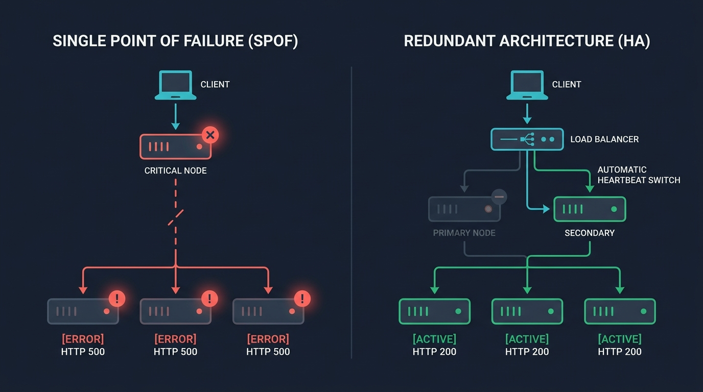
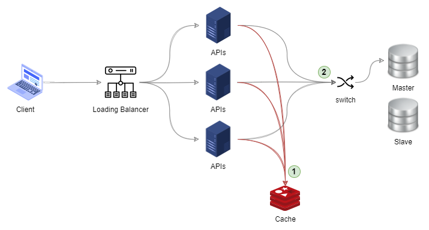
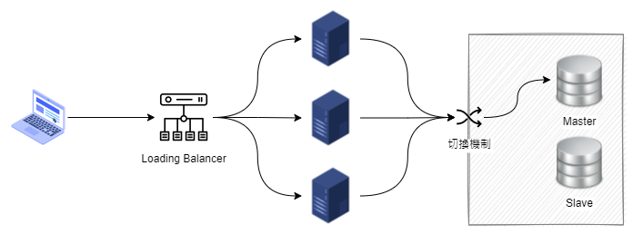
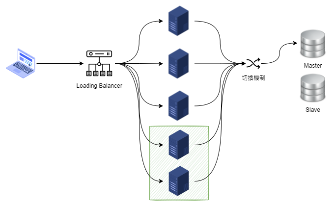
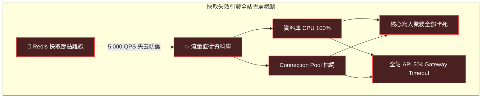
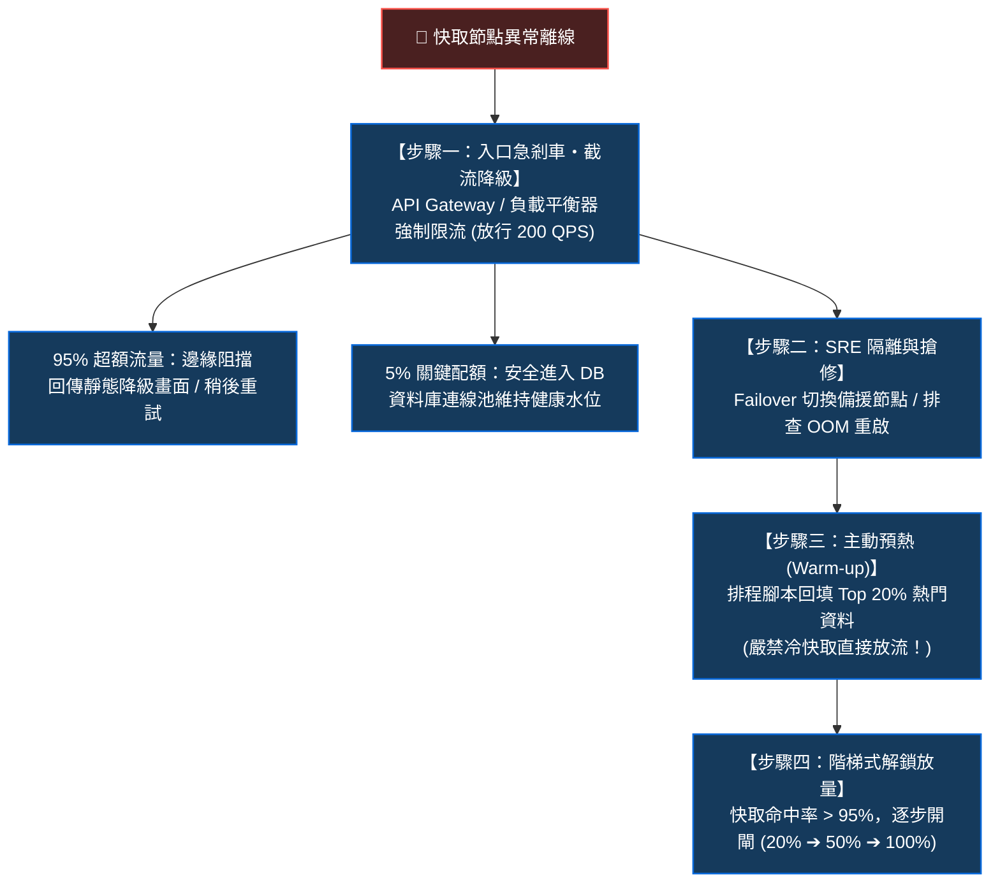
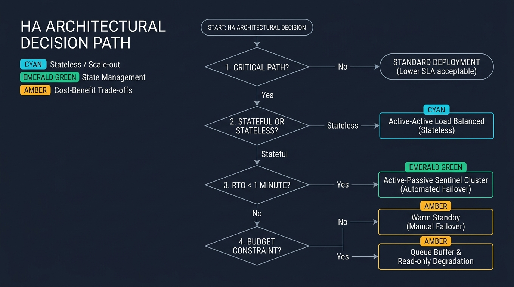

> 🔖 長話短說 🔖
>
> - **單點故障 (SPOF)**：系統中任何一個節點一旦倒下，就導致整個服務中斷的致命弱點。
> - **冗餘機制 (Redundancy)**：為了提升穩定度，刻意配置重複的節點、線路或資料副本，是消除單點最直接的手段。
> - **常見盲點**：單點往往隱藏在「看似有保護」的地方——例如為了保護資料庫而加的單節點快取，一旦當機反而引發快取雪崩，直接打垮底層資料庫。
> - **架構權衡**：冗餘並非越多越好。加機器代表成本增加、維護複雜度上升，還可能引入資料同步延遲與腦裂（Split-Brain）風險。依業務對 RTO/RPO 的容忍度做剛好足夠的配置，才是務實的架構思維。

單點故障（Single Point of Failure, SPOF）與冗餘機制（Redundancy），是高可用架構（High Availability, HA）設計中互為表裡的兩個核心觀念。

簡單來說，冗餘就是「多做一點反而更安全」的防禦性思維；而單點故障，就是整個系統裡最脆弱的環節——只要它出問題，不管其他服務再正常，整體功能就會直接停擺。

在系統建置初期，大家往往專注在業務功能開發，很容易忽略關鍵節點的單點相依。直到線上第一次遇到伺服器重啟或網路抖動，引發一連串的連線超時與服務中斷，才回頭檢視：原來整個架構的穩定性，全賭在單一元件上。

<!--more-->



從架構拓撲來看，兩者的邏輯非常清楚：
- **單點架構 (SPOF)**：所有流量只依賴單一路徑。一旦該節點異常，整條服務鏈路立刻中斷，使用者直接收到 HTTP 500 錯誤。
- **冗餘架構 (Redundancy)**：在前端加入負載平衡器（Load Balancer），後端配置平行或主備節點。當主節點發生故障時，健康檢查會自動剔除異常節點並切換流量，對外依然維持正常服務。

## 什麼是單點故障 (SPOF)？

**單點故障（Single Point of Failure, SPOF）** 指的是系統架構中的某個特定節點，一旦該物理或邏輯元件發生故障，就會導致整個系統無法運作，或造成核心業務中斷。

進行系統風險評估時，識別單點永遠是第一要務。如果只是系統效能不足，使用者大多只是感覺頁面載入變慢；但一旦觸發單點故障，往往就是整個服務斷線。

很多人直覺認為單點就是「伺服器當機」，但在實際生產環境中，SPOF 可能出現在多個維度：
- **網路與基礎設施**：單一電源迴路、單台 Switch、或是雲端環境只部署在單一可用區（Single-AZ）。值得注意的是，即使配置了跨可用區（Multi-AZ）達成了高可用性（HA），但若缺乏跨地域（Multi-Region）的異地備援，一旦遭遇大區域網路骨幹中斷或雲端供應商整個 Region 的控制平面癱瘓，單一區域依然會構成更大尺度的單點故障。
- **資料與快取層**：沒有備援的單點資料庫、單實例 Redis 快取、或是單一訊息佇列（Message Queue）。
- **架構相依性**：所有服務共用同一個未做限流的中心化認證 API，關鍵連線逾時導致上游應用程式連線池（Connection Pool）集體耗盡。
- **外部第三方依賴**：全站只串接單一家簡訊商或金流閘道，且完全沒有降級通道，對方當機業務就直接卡死。
- **人員單點（Single Engineer of Failure）**：全團隊只有特定工程師知道核心舊模組的運作細節或持有線上發布權限。

當清楚知道哪些節點故障會造成系統停擺後，才能在事前安排對應的防範措施。

## 案例分析：快取保護下的單點死穴

我們來看一個在實務上非常典型的架構案例。

假設有一個高頻率讀取的 API 服務，主要業務是提供「最新公告資訊」，佔了全站超過七成以上的讀取流量。為了減輕資料庫負擔，團隊規劃了常見的快取架構：



一般情況下的資料流很單純：
1. 請求進入 API 主機。
2. API 先至快取查詢公告資料。
3. 若快取命中（Cache Hit），直接回傳結果，資料庫完全不受影響。
4. 若快取未命中（Cache Miss），才查詢資料庫，並將結果回填至快取。

### 潛在的單點故障問題

這套架構平時運作良好，但仔細看就會發現脆弱點：**所有的 API 主機，全都同時依賴同一台快取伺服器。**

如果這台單點快取主機發生異常，或是遭遇到以下快取問題，將會直接波及後端資料庫：
- **快取雪崩 (Cache Avalanche)**：快取主機當機或重啟，原本由快取承載的海量請求，瞬間全部穿透至後端資料庫。
- **快取擊穿 (Cache Breakdown)**：熱門公告的快取剛好過期，大量併發請求在同一個毫秒內同時向資料庫發起查詢。
- **快取穿透 (Cache Penetration)**：出現大量不存在的查詢請求，快取查不到資料，每次查詢都直接穿透至資料庫。

當快取失效時，數以萬計的請求直接衝擊資料庫，極可能導致資料庫 CPU 滿載、連線池枯竭，進而引發整座系統全面癱瘓。

原本為了保護資料庫效能而引入的快取，**因為本身缺乏容錯與備援機制，反而成了整個架構中最致命的 SPOF**。

## 消除單點故障的核心手段：冗餘機制 (Redundancy)

要排除單點故障，最直接且有效的工程手段就是建立 **冗餘機制（Redundancy）**。

冗餘是指「為了提昇系統的穩定性與可靠性，刻意配置重複的零件、機能或備援通道」。核心目標是確保任何單一節點失效時，系統仍有備援機制可以接手，避免單一環節失效對整體服務造成衝擊。

### 負載平衡與叢集擴展

在現代系統架構中，最普遍的冗餘作法是 **Load Balancer 搭配多節點伺服器**：



在 API 前端配置負載平衡器，並在後端運行多台無狀態（Stateless）的伺服器：
- 負載平衡器會定期對後端節點進行健康檢查（Health Check）。
- 當任一主機發生異常，負載平衡器會自動將故障節點自清單中剔除，將流量分流至其他正常節點，使用者不會感受到服務中斷。

在業務尖峰時，冗餘也能提供水平擴展（Scale-Out）的能力。例如電商面對促銷活動突如其來的流量衝擊，可透過增加節點數量來分擔系統負載：



### 主動式冗餘 vs 被動式備援

實務上依據節點是否有狀態（Stateful vs Stateless），主要分為兩種冗餘模式：

1. **主動式冗餘（Active-Active）**：
   - 多個節點同時處於在線服務狀態，共同分攤系統流量。
   - **優點**：硬體資源利用率高，任何一個節點離線時，切換最為平滑。
   - **適用場景**：無狀態的 Web API 服務、微服務容器。
2. **被動式備援（Active-Passive / Standby）**：
   - 平時只有主節點（Primary）負責處理連線，備用節點（Standby）隨時同步資料並維持待命；一旦主節點故障，透過自動或手動機制將備用節點提升為主要節點。
   - **優點**：架構相對單純，能維持強一致性的資料寫入。
   - **適用場景**：關聯式資料庫（如 PostgreSQL、SQL Server 的主從複寫 Replication）、儲存磁碟陣列。

### 多層級冗餘實作方式

回到前面「快取單點失效引發資料庫雪崩」的案例，實務上常見的多層冗餘解法包含：
- **快取叢集化**：將單節點 Redis 升級為 **Redis Sentinel** 或 **Redis Cluster**，具備自動故障移轉（Failover）能力。
- **本機記憶體快取（Local Cache）雙層防禦**：在 API 伺服器內部配置輕量的 In-Memory Cache，即使外部 Redis 短暫異常，本地記憶體仍能提供防護。
- **資料庫讀寫分離與 Multi-AZ**：資料庫配置跨可用區（Multi-AZ）高可用，並將讀取流量分流至唯讀副本（Read Replica）。
- **開發與驗證機制的冗餘（BDD / SBE）**：除了硬體之外，軟體流程中也有冗餘思維。例如導入 **Behaviour-Driven Development (BDD)** 與 **Specification By Example (SBE)**，透過單元測試、整合測試與端到端驗證，針對同一業務目的配置多重驗證機制，也是機能冗餘的一種體現。

## 當快取失效時：從線上緊急應變到長期架構防禦

當快取服務（如 Redis）因為網路抖動、記憶體不足（OOM）或硬體故障突然倒下時，系統面臨的最核心危機，**不是快取讀不到，而是底層資料庫失去了原本的屏障，即將直接承受超越設計上限的海量流量**。

### 為什麼失去快取保護時，資料庫會瞬間被「沖垮」？

在現代架構中，快取與資料庫的負載能力往往存在著數十倍甚至百倍的數量級落差：
- **快取層（In-Memory）**：單台 Redis 輕鬆扛下 5,000～10,000 QPS 的高頻查詢。
- **資料庫層（Disk / Pool）**：後端關聯式資料庫（如 PostgreSQL 或 SQL Server），在複雜查詢下，連線池（Connection Pool）與 CPU 設計的健康承載量往往只有 200～500 QPS。

當快取節點突然崩潰，原本由快取承擔的 5,000 QPS，會在幾毫秒內如同潰堤洪水般全數灌入資料庫。
這會觸發災難性的連鎖反應：**資料庫 CPU 瞬間飆至 100%、連線池在 2 秒內被抽乾、連線等候佇列無限制堆積**。
原本只是「查看公告」這支邊緣 API 的快取失效，但因為資料庫連線池被佔滿，**導致全站的核心交易（會員登入、購物車結帳、訂單寫入）全部因連線逾時而陷入連鎖停擺**。



面對這種失去快取屏障的極端狀況，架構在現場的應變，必須嚴格區分為**「事故當下的短期應急處置（優先保住資料庫命脈）」**與**「架構層級的長效容錯防禦（防範骨牌效應）」**。

### 短期應急處置：保住資料庫命脈的救火三部曲

在線上事故當下、快取尚未重啟完成前，如果直接放任流量穿透到資料庫，往往只會讓災情進一步擴大。這時候最核心的考量，其實就是**先保住資料庫的運作，避免全站核心業務受到波及**。

實務上常見的緊急應變步驟主要分為三個階段：



#### 步驟一：入口截流與非核心業務降級
既然資料庫只能扛 200 QPS，就必須在系統的最外層（API Gateway、Cloudflare WAF 或負載平衡器）直接開啟**強制性速率限制（Rate Limiting）**：
- 僅放行 200 QPS 的安全額度進入後端。
- 其餘 4,800 QPS 的超額請求，直接在邊緣回傳降級回應（例如：回傳 HTTP 429 友善提示「目前系統繁忙，請稍候再試」、或是直接回傳空公告靜態資料）。
- **架構取捨**：寧可讓部分使用者暫時看不到公告，也絕對不能讓資料庫崩潰拖垮結帳金流。

#### 步驟二：搶修快取服務（SRE 介入）
維運團隊介入排查快取宕機原因：
- 若為實例崩潰，啟動 Sentinel 或叢集自動容錯移轉（Failover）至 Standby 節點。
- 若為記憶體不足（OOM），清理無效大物件（BigKey）或暫時擴容實例規格並重新啟動。

#### 步驟三：主動預熱再逐步放流（嚴防二次擊穿）
**很多團隊在此時會踩進第二個陷阱**：看到 Redis 重新上線，便欣喜地立刻解開入口的所有限流！
然而，剛重啟的 Redis 是**空無一物的「冷快取（Cold Cache）」**。若瞬間放行 5,000 QPS，海量請求依然會再次全部穿透到資料庫，引發二次崩潰。

正確作法是：
1. 維持入口限流狀態。
2. 透過內部排程腳本主動查詢資料庫，將前 20% 的核心熱點公告「預熱（Warm-up）」載入 Redis。
3. 監控確認 Redis 快取命中率達到 90% 以上時，才以 20% ➔ 50% ➔ 100% 階梯式解鎖入口流量。

### 長期架構防禦：雙層快取與無洩漏分區鎖實作

單靠事故當下的人工救火是不夠的，更穩健的系統應該在架構設計時，就將「快取異常時的自保機制」納入考量。

在實務上，一種常見且兼顧效能與穩定度的做法，是採用**雙層快取（In-Memory Cache + Redis）**搭配**基於 Key 的分區互斥鎖**。

但在實作分區互斥鎖時，如果不留意一些底層細節，容易在生產環境遇到以下幾個隱形瓶頸：
1. **靜態字典引發記憶體洩漏（Managed Memory Leak）**：若直接用 `ConcurrentDictionary<string, SemaphoreSlim>` 當作全域鎖池，當查詢了 100 萬個不同 ID，字典就會持續累積 100 萬個鎖物件而無法釋放。因此需要配合引用計數或快取回收機制。
2. **在互斥鎖內對故障快取盲目重試**：若前面讀取 Redis 已發現逾時，進入鎖內就**應避免再次發起 `SetAsync` 寫入**。否則鎖持有時間（Hold Time）會從原本的數毫秒被拉長至數秒的網路逾時，導致後面所有等候的請求跟著排隊卡死。
3. **快取穿透防禦要寫入空標記**：查詢不存在的資料時，不宜直接返回 null，而是回填短效期的空值標記（Tombstone），避免惡意或無效隨機 ID 每次都穿透到底層資料庫。

以下是考量生產環境穩定度後的具體實作範例：

```csharp
using System;
using System.Collections.Concurrent;
using System.Text.Json;
using System.Threading;
using System.Threading.Tasks;
using Microsoft.Extensions.Caching.Distributed;
using Microsoft.Extensions.Caching.Memory;
using Microsoft.Extensions.Logging;

// 備註：本服務建議註冊為 Scoped，與 Controller 及 DbContext 生命週期一致。
// 若要在 Singleton 或背景任務中使用，建議改為注入 IDbContextFactory<AppDbContext>。
public class HighAvailabilityAnnouncementService
{
    private readonly IMemoryCache _localCache;
    private readonly IDistributedCache _remoteCache;
    private readonly AppDbContext _dbContext;
    private readonly ILogger<HighAvailabilityAnnouncementService> _logger;

    // 解決記憶體洩漏：使用具備引用計數的鎖管理容器
    private static readonly ConcurrentDictionary<string, RefCountedLock> _lockPool = new();

    // 模擬不存在資料的穿透防禦空物件
    private static readonly AnnouncementDto NotFoundSentinel = new() { Id = -1, Title = "__NOT_FOUND__" };

    public HighAvailabilityAnnouncementService(
        IMemoryCache localCache,
        IDistributedCache remoteCache,
        AppDbContext dbContext,
        ILogger<HighAvailabilityAnnouncementService> logger)
    {
        _localCache = localCache;
        _remoteCache = remoteCache;
        _dbContext = dbContext;
        _logger = logger;
    }

    public async Task<AnnouncementDto?> GetAnnouncementAsync(int id)
    {
        var cacheKey = $"announcement:{id}";

        // 1. 第一道防線：檢查本機高速記憶體快取 (Local Cache) - 0ms 開銷
        if (_localCache.TryGetValue(cacheKey, out AnnouncementDto? localData))
        {
            return localData == NotFoundSentinel ? null : localData;
        }

        // 2. 第二道防線：讀取集中式 Redis 快取
        var isRemoteAvailable = true;
        try
        {
            var remoteBytes = await _remoteCache.GetAsync(cacheKey);
            if (remoteBytes != null)
            {
                var cachedDto = JsonSerializer.Deserialize<AnnouncementDto>(remoteBytes);
                // 同步寫入本地快取 30 秒，大幅消弭對 Redis 的高頻重複連線開銷
                _localCache.Set(cacheKey, cachedDto ?? NotFoundSentinel, TimeSpan.FromSeconds(30));
                return cachedDto?.Id == -1 ? null : cachedDto;
            }
        }
        catch (Exception ex)
        {
            // 標記外部快取異常，防止後續在鎖內再次發起必定逾時的無謂寫入
            isRemoteAvailable = false;
            _logger.LogError(ex, "Redis 快取連線異常，啟動本機分區鎖降級保護");
        }

        // 3. 取得安全分區鎖（具備引用計數，避免記憶體洩漏）
        var lockObj = AcquireLock(cacheKey);
        await lockObj.Semaphore.WaitAsync();

        try
        {
            // 雙重檢查（Double-Checked Locking）：排在後面的請求若前面已填好本地快取，直接返回
            if (_localCache.TryGetValue(cacheKey, out AnnouncementDto? doubleCheckedData))
            {
                return doubleCheckedData == NotFoundSentinel ? null : doubleCheckedData;
            }

            // 4. 真正穿透至資料庫（全站同一 Key 僅有 1 筆查詢直達 DB，徹底防擊穿）
            var dbData = await _dbContext.Announcements.FindAsync(id);
            var result = dbData != null 
                ? new AnnouncementDto { Id = dbData.Id, Title = dbData.Title, Content = dbData.Content }
                : NotFoundSentinel; // 快取穿透防禦：資料不存在時使用標記物件

            // 回填本地快取（空標記給 30 秒；正常資料給 2 分鐘，並加上隨機抖動 Jitter，防止同時間快取集體失效）
            var jitterSeconds = Random.Shared.Next(0, 30);
            var localTtl = result == NotFoundSentinel 
                ? TimeSpan.FromSeconds(30) 
                : TimeSpan.FromMinutes(2).Add(TimeSpan.FromSeconds(jitterSeconds));
            _localCache.Set(cacheKey, result, localTtl);

            // 若剛才遠端快取已經逾時或連線異常，在鎖內略過 SetAsync，避免鎖持有時間被放大至數秒
            if (isRemoteAvailable)
            {
                try
                {
                    var serialized = JsonSerializer.SerializeToUtf8Bytes(result);
                    var options = new DistributedCacheEntryOptions
                    {
                        AbsoluteExpirationRelativeToNow = result == NotFoundSentinel 
                            ? TimeSpan.FromSeconds(60) 
                            : TimeSpan.FromMinutes(10).Add(TimeSpan.FromSeconds(Random.Shared.Next(0, 120)))
                    };
                    await _remoteCache.SetAsync(cacheKey, serialized, options);
                }
                catch (Exception ex)
                {
                    _logger.LogWarning(ex, "回填 Redis 失敗，本機快取仍維持正常服務");
                }
            }

            return result == NotFoundSentinel ? null : result;
        }
        finally
        {
            ReleaseLock(cacheKey, lockObj);
        }
    }

    #region 引用計數鎖池輔助方法（解決 Managed Memory Leak）
    private static RefCountedLock AcquireLock(string key)
    {
        return _lockPool.AddOrUpdate(key, 
            _ => new RefCountedLock(), 
            (_, existing) => { Interlocked.Increment(ref existing.RefCount); return existing; });
    }

    private static void ReleaseLock(string key, RefCountedLock lockObj)
    {
        lockObj.Semaphore.Release();
        if (Interlocked.Decrement(ref lockObj.RefCount) <= 0)
        {
            // 當沒有任何執行緒在等候該 Key 時，從字典中移除，釋放記憶體
            // 實務上若需完全消除微秒級競態，亦可使用具備滑動過期的小型 MemoryCache 來管理 SemaphoreSlim
            _lockPool.TryRemove(key, out _);
        }
    }

    private class RefCountedLock
    {
        public readonly SemaphoreSlim Semaphore = new(1, 1);
        public int RefCount = 1;
    }
    #endregion
}
```

> 💡 **現代 .NET 9+ 的架構利器：`HybridCache`**  
> 如果你的專案環境已升級至 .NET 9 或更高版本，微軟官方直接內建了 **`HybridCache`**。  
> 它在底層自動封裝了 L1（In-Memory）與 L2（Redis）雙層架構，並以更高效的原子狀態機解決了鎖池生命週期與擊穿排隊問題（Stampede Protection）。開發者只需呼叫 `await _hybridCache.GetOrCreateAsync(cacheKey, async cancel => ...)` 即可自動獲得上述所有防護，完全無需手動撰寫鎖管理容器。

這套實作在生產環境中有效解決了三個關鍵隱患：
- **避免記憶體持續膨脹**：透過引用計數（Reference Count），當某個公告不再被頻繁查詢時，其對應的鎖物件會自動從記憶體中清除，即便面對動態 ID 也能維持記憶體健康。
- **鎖持有時間最小化**：若外部 Redis 故障，進入臨界區後直接略過遠端寫入，鎖持有時間維持在毫秒級，避免造成執行緒池卡死。
- **有效防禦快取穿透**：查詢不存在的資料時，確實回填短效期的 `NotFoundSentinel` 標記，有效防禦惡意隨機 ID 掃表衝垮資料庫的攻擊行為。

## 冗餘機制的代價與權衡 (Trade-offs)

冗餘機制雖然能提升系統的可用性，但天下沒有白吃的午餐，架構設計時必須評估其伴隨的代價：

1. **硬體與雲端成本直接增加**：重複配置主機、跨可用區傳輸費與軟體授權，都是實打實的支出。說白了，就是用預算換取系統可用性。
2. **架構與維運複雜度大幅提升**：節點數量一多，監控指標、分散式日誌、網路路由與設定同步的維護難度隨之倍增。
3. **資料一致性與腦裂（Split-Brain）風險**：在分散式架構中，若主要節點與備援節點之間發生網路分割（Network Partition），兩邊可能各自判定對方掛點而同時接收寫入，造成嚴重的資料衝突與不一致（Data Inconsistency）。
4. **備援機制的有效性需要驗證**：平時沒有跑流量的備援節點，容易因為設定過期、帳密未同步或規格不足，在真正發生故障切換時才發現根本跑不動。

## 高可用架構決策分析判斷表

面對系統中不同的服務與資料節點，並不需要每一個元件都配置最高規格的冗餘。我們可以依據業務關鍵度與技術限制，透過以下決策流程與對照表逐步推導出最適架構：



| 判斷步驟 | 判定條件 | 建議架構處方 | 典型場景 | 考量重點 |
| :--- | :--- | :--- | :--- | :--- |
| **Step 1：業務衝擊度** | 節點異常僅影響內部作業或離線批次任務 | **單點配置 + 定期快照備份** | 內部報表後台、排程批次 Job | 避免過度設計，定期驗證備份檔可正常還原即可 |
| **Step 2：計算無狀態** | 節點為無狀態運算（Stateless） | **主動式冗餘 (Active-Active) + 負載平衡器** | Web API 服務、前端伺服器 | 確保 Session 不存於單機記憶體，可隨時平滑擴展與摘除節點 |
| **Step 3：高頻讀取** | 讀取頻率極高，資料允許最終一致性 | **讀寫分離 + 雙層快取 (Local Cache + 互斥鎖)** | 商品目錄、公告資訊、靜態設定 | 必須配置併發防禦機制，避免快取失效時衝垮底層資料庫 |
| **Step 4：關鍵交易寫入** | 有狀態交易資料，且復原時間要求極高（RTO < 1 分鐘） | **被動熱備援 + 哨兵/仲裁機制 (Active-Passive)** | 訂單資料庫、帳戶資產庫 | 仲裁節點需配置奇數（≥ 3），防範網路分割引發腦裂 |
| **Step 5：預算與資源受限** | 核心寫入節點無法負擔完整高可用叢集成本 | **訊息佇列 (Message Queue) 緩衝 + 降級處理** | 活動促銷報名、非即時日誌處理 | 前端先回應受理，透過佇列非同步削峰填谷，保護底層資料庫。 |

## 💡 深入實戰的常見疑問 (FAQ)

### Q1：程式碼中的互斥鎖（Mutex）為什麼不能用全域單一鎖？單機鎖與 Redis 分散式鎖（RedLock）該如何抉擇？

**A**：這是許多團隊在實作快取防禦時，最容易直覺踩入的隱形效能瓶頸：

1. **為什麼全域單一鎖是隱形瓶頸？**  
   若宣告 `static readonly SemaphoreSlim _lock = new(1, 1)`，全站所有的快取查詢全都爭搶同一支鎖。如果「商品 A」因為底層資料庫缺少索引卡了 2 秒，全站所有查詢「商品 B」、「商品 C」的不相關請求，全都會無辜地被卡在後面排隊。這等於是用程式碼親手製造了一個全站 CPU 執行緒飢餓的單點瓶頸。因此必須使用本文示範的 **Key-Based 分區鎖**，讓不同資料彼此平行無阻。
2. **單機鎖 vs 分散式鎖（RedLock）的抉擇權衡**：  
   當後端水平擴展為 10 台主機時，單機鎖意味著同一時間最多可能會有 10 筆查詢同時穿透至資料庫。
   - **95% 的業務情境，單機鎖已經足夠優秀**：它將 10,000 個併發請求收斂至 10 個，對資料庫而言已消弭了 99.9% 的海嘯衝擊。更重要的是，單機鎖完全沒有跨網路呼叫的延遲（0ms Overhead），也沒有 Redis 鎖死鎖（Deadlock）或租期過期的風險。
   - **何時必須上 Redis 分散式鎖？**：只有在「該次查詢/計算成本極其昂貴（例如需要呼叫外部高額計費 API，或耗時 10 秒以上龐大運算）」或是「金融帳戶、庫存扣減等絕對零容忍重複執行」的關鍵路徑，才需要導入 Redis 分散式鎖。

### Q2：導入 In-Memory Local Cache 後，後台更新資料時，如何避免各台主機吃到「長達數分鐘的髒快取」？

**A**：引入雙層快取最大的挑戰就是「多機資料一致性（Data Consistency）」。

如果各台伺服器本機記憶體快取了 2 分鐘，當營運團隊在後台緊急修改公告內容時，使用者重新整理頁面，在負載平衡器的輪詢調度下，會一下看到新版、一下看到舊版，造成體驗嚴重的混亂。

**實務上常見且兼顧效能的作法：主動失效廣播機制（Cache Invalidation Event via Pub/Sub）**：

```text
       [ 營運後台更新公告 ]
               │
               ▼ 寫入 DB 並刪除 Redis 快取
        ┌─────────────┐
        │ Redis 主快取 │
        └──────┬──────┘
               │ PUBLISH "cache:invalidate" "announcement:101" (廣播事件)
       ┌───────┴───────────────────────┐
       ▼                               ▼
┌──────────────┐                ┌──────────────┐
│ API 主機 A   │ (SUBSCRIBE)    │ API 主機 B   │ (SUBSCRIBE)
│ 收到廣播事件 │                │ 收到廣播事件 │
│ 本機快取刪除 │                │ 本機快取刪除 │
└──────────────┘                └──────────────┘
```

1. **後台更新資料庫**，並同步刪除集中式 Redis 上的 `announcement:101`。
2. 後台透過 Redis 的 **Pub/Sub** 功能發佈廣播事件：`PUBLISH cache:invalidate announcement:101`。
3. 所有對外服務的 API 伺服器在背景常駐訂閱該頻道。一旦收到廣播訊息，立即在本地呼叫 `_localCache.Remove("announcement:101")`。
4. 下一次使用者的請求進來時，本機快取強制 Miss，自動向 Redis 抓取最新資料。

這套機制讓系統平時享有本機記憶體極致的讀取速度，又能在資料變更的短時間內達成各節點一致性。

> ⚠️ **進階深水區：若 Pub/Sub 廣播遺失（Fire-and-Forget）該如何防禦？**  
> 許多資深架構師會質疑：Redis 原生的 `PUBLISH` 屬於標準的 **Fire-and-Forget（發後即忘，無 ACK 確認與持久化保證）**。如果某台 API 主機在廣播發出的那幾十毫秒剛好發生 GC 停頓（GC Pause）或正在網路斷線重連，這條失效事件就會漏接。該主機豈不是要抱著舊資料直到過期？  
> **實務上的「雙保險」容錯設計**：  
> 1. **極短本地 TTL 自動失效**：即便有了 Pub/Sub 即時廣播，本機記憶體快取（Local Cache）的過期時間（TTL）也**不建議設得太長，通常抓在 15～30 秒左右即可**。如此一來，就算因為網路抖動不幸漏接了廣播，該主機最多也在 30 秒內必定自然過期並重新拉取最新資料，建立可靠的時間安全防線。  
> 2. **全域版本號快取戳記（Version Stamping）**：對於需要更高一致性的場景，可在 Redis 維護一個極輕量的版本號（如 `announcement:version: 15`）。本機快取在回傳前僅需進行輕量版本比對，一旦版本落後立即強制失效。

### Q3：高可用架構常聽到的「腦裂（Split-Brain）」到底是怎麼發生的？實體層面如何防範？

**A**：腦裂是分散式主備（Master-Slave / Primary-Standby）架構中最嚴重的災難：

- **成因**：當主節點與備援節點之間的內部心跳網路發生斷線或暫時抖動（Network Partition），但兩者對外的連線依然正常時。備援節點收不到主節點心跳，判定主節點已死，自動將自己晉升為「新 Master」；然而原本的主節點自認運作良好，依然以「舊 Master」自居。此時外部流量被分散路由到兩個節點，兩邊各自接收寫入，導致底層資料庫產生不可逆的資料衝突與分裂。
- **實體防範的兩大黃金準則**：
  1. **Quorum 仲裁原則（奇數節點與多數決）**：  
     叢集仲裁節點（如 Redis Sentinel、ZooKeeper、Etcd）數量必須維持奇數（$N \ge 3$），且新主節點的選舉必須取得超過半數節點的支持：
     $$\text{Quorum} = \lfloor N / 2 \rfloor + 1$$
     當網路切片發生時，被隔離在少數派（Minority）的一方因為拿不到過半選票，會自動降級為唯讀（Read-Only）或主動下線；只有身處多數派（Majority）的一側才能合法晉升，徹底杜絕兩個 Master 同時存在的可能。
  2. **Fencing Token（柵欄令牌）**：  
     每次發生主節點切換時，仲裁者會配發一個單調遞增的 Epoch 序號（例如 Token = 42）。底層儲存系統只接受擁有最新 Token 的指令。即便被孤立的舊 Master 試圖寫入資料，儲存層一旦發現其 Token 為過期的 41，就會直接拒絕寫入。

### Q4：負載平衡器的健康檢查（Health Check）該如何設定，才能避免「稍微網路抖動就誤殺整批主機」的連鎖雪崩？

**A**：健康檢查若配置過於激進，原本用來保護服務的機制，反而容易在突發高負載時引發雪崩：

在實務上，部分團隊習慣在健康檢查路由（如 `/health`）中直接執行 `SELECT 1` 探測資料庫。當資料庫負載突發性微幅上升、查詢耗時拉長到 3 秒時，第一台主機的健康檢查因為逾時被負載平衡器判定異常並摘除；剩餘主機隨即被迫承載額外流量，導致負載更高、逾時更嚴重，負載平衡器進而將正常運作的主機全數誤判離線，造成人為的系統中斷。

**防禦性健康檢查的最佳實踐**：
1. **深淺檢查徹底分離（Shallow vs Deep Health Check）**：  
   - **Liveness / Traffic Readiness（淺層檢查）**：供負載平衡器決定是否派發流量。僅驗證本機應用程式處理程序是否存活、記憶體是否健康，**應避免在此處呼叫資料庫或外部相依服務**。
   - **Deep Diagnostics（深層診斷）**：供維運團隊內部 Prometheus 或 SRE 監控告警使用，才進行資料庫連線、Redis 讀寫等全鏈路健康探測。
   - 在 ASP.NET Core 中，可透過內建的 `AddHealthChecks()` 搭配不同 Tag（例如將 Liveness 標記為 `live`、資料庫探測標記為 `ready`），分別對應 `/health/live` 與 `/health/ready` 端點，以低成本達成健康檢查分流。
2. **防抖動門檻（Flapping Protection）**：  
   將失敗判定門檻（Unhealthy Threshold）設定為至少連續 3~5 次失敗，不要因為單一封包遺失就直接摘除；同時拉長檢查間隔（Interval 至少 5~10 秒）。
3. **優雅冷卻回歸（Graceful Re-entry）**：  
   主機修復後，必須設定 Healthy Threshold 至少連續成功 5 次才平緩分發流量，避免主機在臨界狀態反覆震盪（Flapping）。

## 結語

架構設計從來不是追求「絕對零故障」，而是在有限的預算與資源限制下，做出最適當的權衡。

冗餘機制是消除單點故障最直接的手段，但盲目堆疊機器只會換來失控的成本與維運負擔。唯有清楚識別系統在各個環節的真實相依關係，將防禦資源投放在最致命的單點上，並建立可驗證的容錯與復原機制，才能讓系統在面對突發流量或硬體故障時，具備足夠的穩定度與彈性。

---

> 💡 **互動時間**
>
> 在你的系統架構中，如果外部 Redis 快取突然離線，你的應用程式是會直接拋出錯誤、自動降級直查資料庫，還是有配置類似本文的本機快取與防擊穿機制？面對後台資料更新，你們又是如何解決多機快取同步問題的？歡迎在下方留言分享你的架構經驗與實務踩雷心得！

## 延伸閱讀

▶ 站內相關文章
* [高併發架構導論：系統負載、分流策略與限制理論 (Theory of Constraints) 的實踐](../system-loading-limit-reroute/index.md)
* [問題排除的下一階段：從單一 Log 到建立 Telemetry (遙測) 的可觀測性思維](../from-logging-to-telemetry-observability/index.md)

▶ 外部參考
* [工程師的單點故障 (Single Engineer of Failure) 與備援](https://data.leafwind.tw/single-engineer-of-failure-947e2ede1039)
* [AWS Well-Architected Framework: Reliability Pillar](https://docs.aws.amazon.com/wellarchitected/latest/reliability-pillar/welcome.html)
* [Single Point of Failure (SPOF) - TechTarget Definition](https://www.techtarget.com/searchdatacenter/definition/Single-point-of-failure-SPOF)
