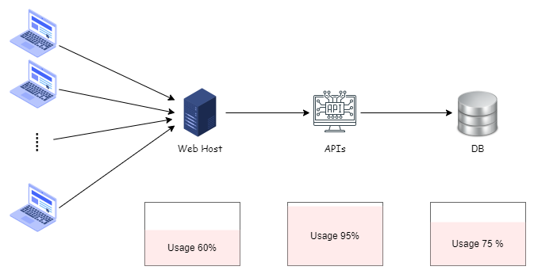

> 🔖 長話短說 🔖
>
> - **釐清 Log 目的**：Log 不只是為了抓 Bug。它更是效能分析、使用者行為追蹤、安全稽核的基礎，是打造系統可觀測性的第一步。
> - **善用 Log 分級**：別把所有資訊都當成 `Error`！學會使用 `Info`、`Warning` 等級別，能讓你在關鍵時刻快速過濾雜訊，找到問題根源。
> - **擁抱結構化日誌**：告別純文字 Log。採用 JSON 等結構化格式，能讓 Loki、ELK 等工具發揮最大戰力，實現高效的搜尋與告警。
> - **結合錯誤處理**：`catch` 到例外時，別只記錄錯誤訊息。完整的上下文 (Context) 與堆疊追蹤 (Stack Trace) 才是快速解案的關鍵線索。

幾個月前，跟團隊成員討論開發維運時，對於 Log 與 Error Handling 的一些觀念。整理後，也同步分享給大家。

<!--more-->

有參與維運的朋友都可以理解，當系統出現如下圖所示的效能瓶頸或非預期錯誤時，一個良好規劃的日誌系統，是快速定位問題、解決問題的最重要工具。


> 好的 Log 讓你快速找到問題，不好的 Log 只能通靈。

在系統發生問題時，我們都希望透過 Error Handing 攔截到非預期異常的 Log，其內容**明確記錄著異常相關資訊**，以便盤查問題。

換個角度來看，Log 與 Error Handling 是確保系統穩定性與可維護性的核心環節。

但在開發實務中，對於 Log 或 Error Handling 的設定與規劃，常常會令人頭大。

- 寫得多，擔心儲存空間使用過多、內容過多無意思資訊
- 寫得少，又怕該記錄的資訊，沒有記錄到。
- 那些情況要視為異常，那些情況又要視特殊處理流程？

## Log 的目的是什麼？

在討論如何記錄 Log 之前，我們需要先對齊一個共識：「為什麼我們需要 Log？」

雖然我們常用 Log 來追蹤與分析系統運作過程或異常訊息。

但它的目的涵蓋了更廣的範圍：

1. **問題追蹤與除錯 (Troubleshooting & Debugging)**：這是最主要的目的。當錯誤發生時，開發者需要依賴 Log 來重現問題、理解當時的系統狀態與執行流程。
2. **效能監控與分析 (Performance Monitoring)**：透過記錄關鍵操作的執行時間，我們可以分析系統的效能瓶頸在哪個環節。例如，上圖中 API 負載高達 95%，我們可以透過 Log 分析是哪個 API 端點、或是哪個資料庫查詢佔用了大量時間。
3. **使用者行為分析 (User Behavior Analysis)**：記錄使用者的關鍵操作，可以幫助產品團隊理解使用者如何與系統互動，作為未來優化的依據。
4. **安全稽核 (Security Auditing)**：記錄所有敏感操作（如登入、權限變更、資料刪除），以便在發生資安事件時進行追溯。

但我們就只先針對 **問題追蹤與除錯** 的部份進行討論，畢竟這是我們日常開發與維為運最常遇到的。

## Log 的分級 (Log Level)

為了在大量的 Log 中快速找到有用的資訊，我們對 Log 進行分級，不同的 Log Level 代表了不同的重要性與緊急程度。

常見的 Log Level 如下：

| 等級               | 說明                                           |
| ---------------- | -------------------------------------------- |
| Trace / Verbose  | 最詳細的資訊，通常只在開發階段為了追蹤特定流程而開啟。                  |
| Debug            | 用於開發與除錯階段的資訊，比 Trace 更精簡。                    |
| Information      | 記錄系統正常運行的關鍵事件，如服務啟動、使用者登入、完成一筆交易等。生產環境最常用級別。 |
| Warning          | 非預期情況但系統還可運行，例如呼叫非必要第三方服務失敗或快取未命中。           |
| Error            | 明確的錯誤，導致某功能無法正常完成，通常需要開發人員處理。                |
| Fatal / Critical | 嚴重錯誤，可能導致整個應用程式無法繼續運行。                       |

> 📝 **資訊補充** 📝
>
> 在生產環境中，通常會將 Log Level 設定為 `Information` 或 `Warning`，以避免產生過多的 Log 檔案，增加儲存成本與分析難度。

但我個人最常使用的是 `Information`、`Warning`、`Error` 這三種類別。

以下為上述 log 級別（Information、Warning、Error）的整理與重點說明：

|等級|定義|重要性與處理方式|
|---|---|---|
|**Information**|一般系統事件或流程資訊，主要用於觀察、追蹤程式運作階段。|重要性不一定，可用於事後追查，或了解系統當下處於什麼流程。|
|**Warning**|系統出現非預期但可被接受的異常情境，違反預設情境但未造成重大影響。|屬於異常狀況，不必馬上處理，屬於可以事後追蹤與修正的情境。|
|**Error**|發生錯誤導致功能無法正常運作，必須立刻注意與處理。|為緊急且重要的狀態，需馬上介入排查與修復，以免持續影響系統運作。|

而且，隨著系統的發展，原本的 Log Level 可能會發生調整或拔除，並非一成不變。

例如，一開始新功能上線，為了確保功能的正確性或穩定性，可能會加上一堆的 Log。半年後，功能正常穩定，就可能會拔除非必要的 Log。

## 該記錄什麼內容？

一筆有效的 Log，應該像一個完整的「案發現場紀錄」，提供足夠的線索讓我們破案。

而且，現在系統每日產生的 Log 數量龐大，我們也不可能用記事本，一筆筆的翻找，基本上都是使用日誌系統來進行解析及查詢。例如 [Seq](https://datalust.co/)、[Grafan](https://grafana.com/)

因此，**結構化日誌 (Structured Logging)** 是非常個人目前推薦的作法。相較於純文字，JSON 格式的 Log 更容易被日誌系統解析與查詢。

一筆好的 Log 應至少包含以下資訊：

- **時間戳記 (Timestamp)**：事件發生的精確時間。
- **日誌級別 (Log Level)**：`INFO`, `WARN`, `ERROR` 等。
- **訊息 (Message)**：簡潔明瞭的事件描述。
- **上下文資訊 (Context)**：
  - `TraceId` / `CorrelationId`: 用於追蹤一個請求在多個服務之間的完整路徑。
  - `UserId` / `TenantId`: 哪個使用者或租戶觸發的事件。
  - `ClassName` / `MethodName`: 事件發生的程式位置。
- **例外資訊 (Exception Details)**：(僅在 Error Level)
  - 錯誤類型 (Exception Type)
  - 錯誤訊息 (Error Message)
  - 完整的堆疊追蹤 (Stack Trace)

**範例：**

```json
{
  "Timestamp": "2023-07-30T10:15:30.123Z",
  "Level": "Error",
  "Message": "Failed to process payment for order.",
  "TraceId": "4bf92f35-7f2a-4a7e-8a3a-5e9d6b7c8a1d",
  "UserId": "user-123",
  "Order_Id": "order-456",
  "Exception": {
    "Type": "System.Data.SqlClient.SqlException",
    "Message": "Timeout expired. The timeout period elapsed prior to completion of the operation or the server is not responding.",
    "StackTrace": "at System.Data.SqlClient.SqlConnection.OnError(SqlException exception, Boolean breakConnection, Action`1 wrapCloseInAction)
   at System.Data.SqlClient.TdsParser.ThrowExceptionAndWarning(TdsParserStateObject stateObj, Boolean callerHasConnectionLock, Boolean asyncClose)
   ..."
  }
}
```

以個人為例，我目前經手的專案，大多都是採用 .NET 開發，其中的 Log 套件，都是使用 Serilog 來進行結構化日誌的記錄。

## Error Handling 的策略

記錄 Log 是在錯誤發生之後的補救措施，而一個穩健的錯誤處理 (Error Handling) 策略，則能在錯誤發生的當下就做好控制，防止錯誤擴散。

錯誤處理是軟體開發中不可或缺的一環，尤其在分散式系統中，錯誤處理與 Log 記錄密切相關。

目前業界上，也有不少文章在討論錯誤處理的最佳實踐。

以下是個人認為，在設計與規劃錯誤處理時，應該考慮的幾個關鍵要點：

### 不要吞掉例外 (Don't Swallow Exceptions)

以前在 Code Review 其他人的程式碼時，偶爾會看到這樣的寫法：

```csharp
try
{
    // 嘗試執行某些操作
}
catch (Exception ex)
{
    // 捕捉到例外，但什麼都不做
}
```

這樣的寫法是非常不好的習慣，這會讓問題石沉大海，難以追蹤。

若是要捕捉 Exception 而不進行任何處理，是有其特殊情境考量的，至少應該記錄下來，避免真的有那一天，系統發生問題時，卻沒有任何線索可循。

反之，若沒有特殊情況，應該避免這樣的寫法。

### 不要過度捕捉例外 (Avoid Over-Catching Exceptions)

在開發中，**應該只捕捉那些我們確實能夠處理的例外**。

在實務上，個人建議只處理預期需處理的異常，其他未考量到的例外，交由上層統一處理。

若後續針對未考量的例外討論，決定增加此異常的處理，這時候再回頭來進行處理就可以了。

### 在對的地方處理例外

通常在應用程式的邊界（如 API Controller、訊息佇列的消費者）進行集中的例外處理與記錄。

除非在業務邏輯中有明確的錯誤處理與恢復機制（例如重試），否則不要在業務邏輯深處過度捕捉例外。

例外處理的責任應分層清楚：

|層級|處理方式|
|---|---|
|應用邊界（API Controller、訊息消費者）|集中記錄、回應使用者友善錯誤|
|業務邏輯層|只有當有明確的錯誤處理策略（如重試、補償）時才捕捉|
|基礎建設層（資料庫、外部 API）|可以封裝底層例外為自訂例外，向上拋出讓上層判斷處理|

### 記錄完整的例外資訊

如上述範例所示，務必記錄完整的 `Exception` 物件，特別是 `StackTrace`，它是定位問題根源的最關鍵資訊。

當我們確實需要捕捉例外時，**記錄以下資訊是基本要求**：

- `ex.Message`（例外訊息）
- `ex.StackTrace`（堆疊追蹤，最重要）
- `ex.InnerException`（內部例外，若有）

目前大多的套件，基本上都會自行記錄以上的資訊。以 C# 而言的套件中，直接使用下方的寫法，達成目標。

```csharp
_logger.LogError(ex, "Failed to process order. OrderId: {OrderId}", orderId);
```

### 全域例外處理

若是在 Webapi 的情境，與其在業務邏輯的各個角落散布 `try-catch`，避免錯誤資訊直接暴露給前端，還不如採用**全域例外處理 (Global Exception Handler)** 的模式。(例如在 ASP.NET Core 中可以透過 Middleware 來實現)

這樣做的好處如下：

| 好處         | 說明 |
|----------------|------|
| **集中處理**   | 將錯誤處理邏輯集中管理，避免在各處撰寫重複的 `try-catch` 程式碼，提高可維護性。 |
| **統一格式**   | 確保所有未被捕獲的例外，都能用統一的格式回傳給前端，並以統一的格式寫入 Log。 |
| **提升安全性** | 攔截所有內部錯誤，只回傳通用的錯誤訊息（例如：`發生未預期的錯誤，請稍後再試`），同時將詳細的 Exception 資訊記錄到 Log 中，避免將堆疊追蹤等敏感資訊暴露給前端。 |

這樣的做法不僅能提升系統的可維護性，還能確保錯誤處理的一致性與安全性。

## 小結

Log 與 Error Handling 是軟體開發中的「基礎建設」。雖然在功能開發初期容易被忽略，但一個穩定、可維護的系統，絕對建立在扎實的日誌與錯誤處理機制之上。

透過定義明確的 Log 目的、實施 Log 分級、採用結構化日誌，並結合有效的錯誤處理策略，我們才能在問題發生時，從容不迫地找出原因，快速恢復服務，進而打造出高品質的軟體系統。

## 補充資料

▶ 站內文章

- [開發雜談 - 淺談 Log 的設計與問題排查的重要性](../the-importance-of-log-design-and-troubleshooting/index.md)

▶ 外部文章

- [Serilog - simple .NET logging with a clean API](https://serilog.net/)
- [Grafana Loki](https://grafana.com/oss/loki/)
