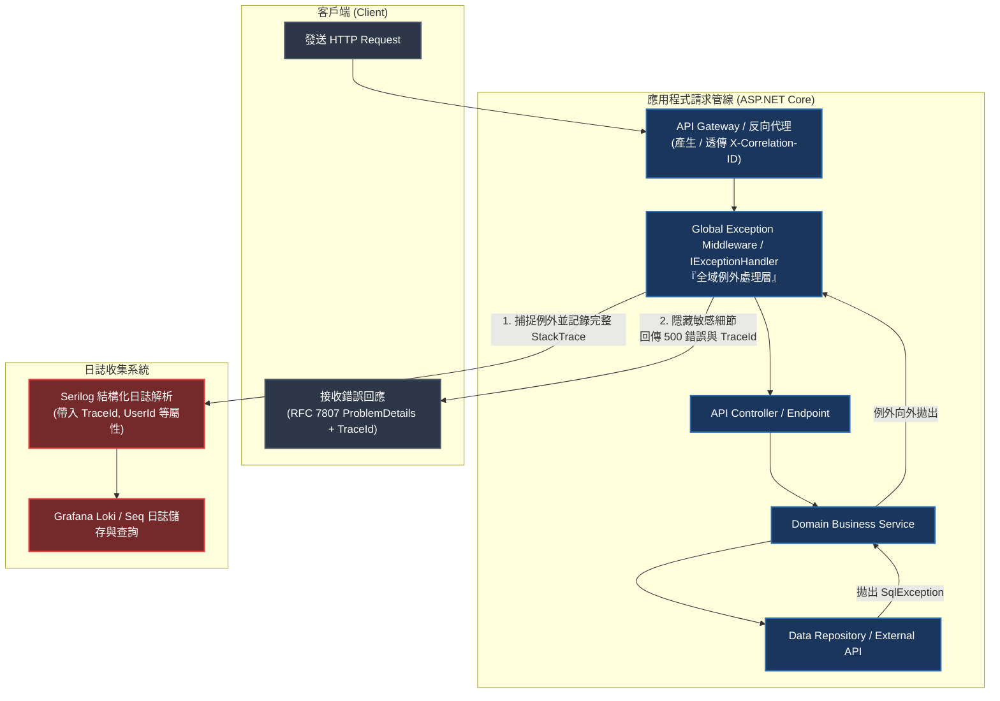

> 🔖 長話短說 🔖
>
> - **釐清 Log 目的**：Log 不只是為了抓 Bug，它更是系統排查、效能瓶頸分析與安全稽核的基本工具。
> - **落實 Log 分級**：別把所有異常都打成 `Error`。釐清各等級語義，出事時才能快速過濾雜訊、找到重點。
> - **採用結構化日誌**：避免用字串拼接日誌。改用 JSON 等結構化格式並帶上 Context，讓 Loki、Seq 等工具能精確檢索。
> - **分層處理例外**：嚴禁寫空白 catch 吞掉錯誤；使用全域例外處理集中管理，內部記錄完整 StackTrace，對外則隱藏敏感細節。

在指導新進同仁排查系統問題時，常常會遇到一個狀況：**程式碼出錯了，但打開日誌卻什麼都沒有──因為當初根本沒有寫 Log。**

在出問題的當下，由於沒有任何日誌線索，完全找不到問題的根本原因。最後只能在本機重新下斷點、一步步猜測與重跑。

<!--more-->

「好的 Log 讓你快速找到問題，不好的 Log 只能通靈。」這句話是很多工程師在維運時的真實體會。

在功能開發階段，大家往往覺得寫 Log 很麻煩；但只有在系統出狀況時，日誌才是排查問題唯一的依據。寫得太少，出事沒得查；寫得太多，又會造成硬碟負擔，而且充斥無效雜訊。

Log 與 Error Handling 是系統維護很核心的基本功。實務上常常面臨幾個具體問題：
- **寫得太多**：磁碟空間被塞滿，真有問題時反而找不到關鍵報警。
- **寫得太少**：缺乏足夠的上下文（Context），無法還原當下的輸入參數與執行狀態。
- **邊界不清**：哪些情境該在業務邏輯內處理，哪些該交給上層統一接管？

下圖梳理了常見 Web API 在請求處理、例外捕捉與日誌收集的端到端流程：


```mermaid
flowchart TD
    subgraph Client["客戶端 (Client)"]
        Req["發送 HTTP Request"]
        Resp["接收錯誤回應<br/>(RFC 7807 ProblemDetails + TraceId)"]
    end

    subgraph Pipeline["應用程式請求管線 (ASP.NET Core)"]
        GW["API Gateway / 反向代理<br/>(產生 / 透傳 X-Correlation-ID)"]
        GEM["Global Exception Middleware / IExceptionHandler<br/>『全域例外處理層』"]
        Ctrl["API Controller / Endpoint"]
        Svc["Domain Business Service"]
        Repo["Data Repository / External API"]
    end

    subgraph Observability["日誌收集系統"]
        Serilog["Serilog 結構化日誌解析<br/>(帶入 TraceId, UserId 等屬性)"]
        Sink["Grafana Loki / Seq 日誌儲存與查詢"]
    end

    Req --> GW
    GW --> GEM
    GEM --> Ctrl
    Ctrl --> Svc
    Svc --> Repo

    Repo --"拋出 SqlException"--> Svc
    Svc --"例外向外拋出"--> GEM

    GEM --"1. 捕捉例外並記錄完整 StackTrace"--> Serilog
    Serilog --> Sink
    GEM --"2. 隱藏敏感細節<br/>回傳 500 錯誤與 TraceId"--> Resp

    classDef client fill:#2d3748,stroke:#4a5568,stroke-width:2px,color:#fff;
    classDef pipeline fill:#1a365d,stroke:#2b6cb0,stroke-width:2px,color:#fff;
    classDef obs fill:#742a2a,stroke:#e53e3e,stroke-width:2px,color:#fff;

    class Req,Resp client;
    class GW,GEM,Ctrl,Svc,Repo pipeline;
    class Serilog,Sink obs;
```

---

## 為什麼需要記錄 Log？

在討論怎麼記 Log 之前，先釐清記錄 Log 的幾個主要目的：

1. **問題追蹤與除錯 (Troubleshooting & Debugging)**：  
   這是最主要的目的。系統出錯時，工程師需要靠 Log 來了解當時傳入的參數、執行流程與錯誤堆疊。
2. **效能分析 (Performance Monitoring)**：  
   記錄各關鍵步驟的執行時間。當 API 變慢時，可以很快知道是卡在資料庫查詢、外部 API 逾時，還是自己的程式邏輯太慢。
3. **使用者行為分析 (User Behavior Analysis)**：  
   記錄使用者的重要操作流程，協助了解功能的使用頻率與路徑，作為後續架構調整的參考。
4. **安全稽核 (Security Auditing)**：  
   記錄登入、修改權限、刪除資料等敏感動作，當資安事件發生時可以調閱確認。

平時開發中最常遇到的就是**除錯與問題排查**。因此接下來的重點，會放在如何把除錯用的 Log 寫好。

---

## Log 的分級思考 (Log Level)

對 Log 進行語義分級，是避免日誌充斥雜訊的第一步。如果什麼都打成 `Error`，出事時根本分不清輕重緩急；如果全打成 `Info`，又無法設定有效的過濾條件。

實務上各級別的定位與處理原則如下：

| 日誌等級 (Level) | 觸發情境與定義 | 生產環境建議與處理方式 | 直覺理解 |
| :--- | :--- | :--- | :--- |
| **Trace / Debug** | 開發除錯用。記錄變數數值、流程進出等細部細節。 | 平常關閉。只在本地開發或特定環境除錯時開啟，避免拖慢效能與佔用硬碟。 | 細部的過程筆記，沒事不需要看。 |
| **Information** | 系統常態運行事件（如服務啟動、訂單成立、完成扣款）。 | 生產環境預設等級。用來確認系統有正常在運作。 | 正常的營運打卡與交易記錄。 |
| **Warning** | 非預期狀況，但系統自己有容錯機制處理掉（如快取沒中改查 DB、重試成功）。 | 提醒性質。**不需要半夜緊急處理**，但應排入工作清單追蹤，避免未來惡化。 | 儀表板亮黃燈，車還能開，但提醒該安排檢查。 |
| **Error** | 功能執行失敗，導致單筆交易或請求中斷（如 DB 逾時、扣款失敗）。 | 重要且緊急。這代表已經影響到使用者操作，需要有工程師排查修復。 | 結帳刷卡機壞了，該筆訂單無法完成，需專人排查。 |
| **Fatal / Critical** | 嚴重錯誤，導致整個應用程式無法繼續運行（如核心服務起不來、連線全斷）。 | 最高嚴重度。整組服務已無法提供服務，需立即發送告警搶修。 | 整棟大樓跳電，全部停擺。 |

### 生產環境的動態調校原則

Log Level 不需要寫死不動：
- **新功能上線時**：可以針對特定模組暫時調高日誌詳細度（例如調成 `Debug`），方便觀察上線初期的狀況。
- **穩定運行後**：調回 `Information` 或 `Warning`，把沒必要的碎碎念拔掉，維持日誌乾淨。

---

## 該記錄什麼？結構化日誌 (Structured Logging)

一筆有用的 Log，必須提供足夠的線索讓我們能還原現場。

現在系統的 Log 數量很大，不可能靠文字編輯器一行行翻找，通常都是丟進日誌收集系統（如 [Grafana Loki](https://grafana.com/oss/loki/)、[Seq](https://datalust.co/)、Elasticsearch）用條件搜尋。

因此，**結構化日誌 (Structured Logging)** 非常重要。相較於純文字，以 JSON 或 Key-Value 格式儲存的 Log 才能被有效率地查詢與過濾。

一筆標準的結構化 Log 通常包含這些欄位：

- **Timestamp**：事件發生的精確時間 (建議使用 UTC)。
- **Log Level**：`Information`, `Warning`, `Error` 等。
- **Message Template**：帶有屬性欄位的訊息範本。
- **Context（上下文資訊）**：
  - `TraceId` / `CorrelationId`: 追蹤同一筆 HTTP 請求在不同微服務間流轉的識別碼。
  - `UserId` / `TenantId`: 觸發該操作的使用者或租戶。
  - `SourceContext`: 輸出 Log 的 Class 或 Namespace。
- **Exception Details**（出錯時必備）：
  - 錯誤類型 (`Type`)
  - 錯誤訊息 (`Message`)
  - 完整呼叫堆疊 (`StackTrace`)

### 結構化日誌範例 (JSON)

```json
{
  "Timestamp": "2025-07-30T10:15:30.123Z",
  "Level": "Error",
  "MessageTemplate": "處理訂單失敗！OrderId: {OrderId}, Amount: {Amount}",
  "Properties": {
    "OrderId": "ord-20250730-001",
    "Amount": 1280.00,
    "TraceId": "4bf92f35-7f2a-4a7e-8a3a-5e9d6b7c8a1d",
    "UserId": "usr-9952",
    "SourceContext": "OrderService"
  },
  "Exception": {
    "Type": "System.Data.SqlClient.SqlException",
    "Message": "Timeout expired while waiting for connection lock.",
    "StackTrace": "at System.Data.SqlClient.SqlConnection.OnError(SqlException ex)..."
  }
}
```

> [!IMPORTANT]
> **寫 Log 時不要用字串插值 (String Interpolation)！**  
> ❌ 錯誤寫法：`_logger.LogError($"處理訂單失敗: {orderId}");` ➔ 會變成一整串純文字，日誌系統無法單獨把 OrderId 抽成欄位。  
> ✅ 正確寫法：`_logger.LogError(ex, "處理訂單失敗！OrderId: {OrderId}", orderId);` ➔ Serilog 會把 `{OrderId}` 存成獨立屬性，在 Loki 或 Seq 裡就能直接用 `OrderId == "ord-20250730-001"` 來精準搜尋。

在 .NET 專案中，推薦使用 **Serilog** 搭配內建的 Microsoft.Extensions.Logging，就能很順手地輸出結構化日誌。

---

## Error Handling 的實務策略

記錄 Log 是事後的線索，而錯誤處理 (Error Handling) 則是在當下控制影響範圍。

以下是設計錯誤處理時的幾個關鍵原則：

### 1. 不要寫空白 Catch 吞掉例外

在 Code Review 時偶爾會看到這種寫法：

```csharp
try
{
    ExecuteCriticalBusinessOperation();
}
catch (Exception ex)
{
    // 空白 Catch：什麼都不做
}
```

空白 catch 的問題在於它把例外直接吞掉了。系統底層可能已經出錯、資料可能只寫了一半，但因為例外被吃掉，外部看起來完全正常，也沒有留下任何 Log。等到後續問題擴大時，根本找不到當初是哪裡先壞掉的。

### 2. 不要過度捕捉例外

只捕捉當前方法「確實有能力處理或恢復」的例外。

如果底層遇到資料庫斷線，當前業務邏輯根本無法修復，就不要在該層寫 try-catch 硬攔，應該讓它直接向上拋出，交給全域例外處理器統一處理。

### 3. 例外分類與 HTTP 狀態碼對照

在 Web API 開發中，可以建立一套清晰的例外分類，對應適當的 HTTP 狀態碼與處理策略：

| 例外類別 | 情境範例 | 捕捉層級 | HTTP 狀態碼 | Log Level | 處置方式 |
| :--- | :--- | :--- | :---: | :---: | :--- |
| **業務驗證例外** | 餘額不足、格式錯誤、庫存不夠 | 業務邏輯層或 Controller | `400 / 422` | `Information` 或不記 | 不需告警、不需重試，明確回傳業務錯誤訊息給前端。 |
| **找不到資源** | 查詢不存在的會員、訂單 ID 不合法 | Service 層 | `404 Not Found` | `Warning` | 不需告警。若短時間大量發生，可能有人在掃描 API。 |
| **暫時性相依異常** | 資料庫短暫連線逾時、外部 API 503 | 基礎設施層 (Polly Retry) | 內部重試 ➔ 耗盡則 `502/504` | `Warning` ➔ 耗盡轉 `Error` | 透過指數退避重試，重試失敗後再發出告警。 |
| **未預期系統崩潰** | NullReferenceException、未處理例外 | 全域例外處理層 | `500 Internal Error` | `Error` | **發送告警通知**，對外回傳通用錯誤訊息，隱藏內部細節。 |

### 4. 職責分層

| 層級 | 處理原則 |
| :--- | :--- |
| **應用邊界 (API Controller)** | 集中管理回應格式，回傳脫敏後的友善錯誤訊息。 |
| **業務邏輯層 (Service)** | 只有當存在明確的重試、降級或替代方案時，才進行 catch。 |
| **基礎設施層 (Repository / DB)** | 可以將底層特定例外包裝成自訂例外，但務必保留原始的 InnerException 向上拋出。 |

### 5. 務必傳入完整的 Exception 物件

記錄 Log 時，記得把 `Exception` 物件當作參數傳入，而不是只印 `ex.Message`：

```csharp
// 正確：Serilog 會自動把完整的呼叫堆疊 (StackTrace) 記錄下來
_logger.LogError(ex, "處理訂單失敗！OrderId: {OrderId}", orderId);
```

---

## 全域例外處理：.NET 8+ 的實作方式

與其在每個 Controller 或方法裡重複寫 `try-catch`，不如在最外層架設一個全域例外處理器 (Global Exception Handler)。

這樣做有三個好處：
1. **代碼乾淨**：業務邏輯不用到處塞重複的 try-catch。
2. **格式一致**：確保所有未預期的錯誤都符合標準格式（例如 RFC 7807 `ProblemDetails`）。
3. **安全脫敏**：避免把資料庫欄位或程式碼堆疊直接暴露給前端，防範資安外洩。

在 .NET 8 中，官方提供了標準的 `IExceptionHandler` 介面，實作起來非常乾淨：

```csharp
// 1. 實作全域例外處理器
public sealed class GlobalExceptionHandler : IExceptionHandler
{
    private readonly ILogger<GlobalExceptionHandler> _logger;

    public GlobalExceptionHandler(ILogger<GlobalExceptionHandler> logger)
    {
        _logger = logger;
    }

    public async ValueTask<bool> TryHandleAsync(
        HttpContext httpContext,
        Exception exception,
        CancellationToken cancellationToken)
    {
        // 取得當前請求的唯一追蹤碼 (TraceId)
        var traceId = Activity.Current?.Id ?? httpContext.TraceIdentifier;

        // 內部 Log：完整記錄例外堆疊、路徑與追蹤碼，方便後端排查
        _logger.LogError(
            exception,
            "發生未預期的系統異常！TraceId: {TraceId}, Path: {Path}, User: {UserId}",
            traceId,
            httpContext.Request.Path,
            httpContext.User?.Identity?.Name ?? "Anonymous"
        );

        // 對外回應：遵循 RFC 7807 格式，隱藏內部細節，只附帶 traceId 方便用戶回報對照
        var problemDetails = new ProblemDetails
        {
            Status = StatusCodes.Status500InternalServerError,
            Title = "系統服務暫時發生錯誤",
            Detail = "我們已收到錯誤紀錄並正在處理中。若問題持續發生，請提供追蹤代碼聯繫客服。",
            Instance = httpContext.Request.Path
        };
        problemDetails.Extensions["traceId"] = traceId;

        httpContext.Response.StatusCode = problemDetails.Status.Value;
        httpContext.Response.ContentType = "application/problem+json";

        await httpContext.Response.WriteAsJsonAsync(problemDetails, cancellationToken);

        return true; // 表示此例外已被處理，不再向外冒泡
    }
}

// 2. 在 Program.cs 中註冊啟用
builder.Services.AddExceptionHandler<GlobalExceptionHandler>();
builder.Services.AddProblemDetails();

var app = builder.Build();
app.UseExceptionHandler(); // 啟用全域例外處理管線
```

---

## 結語與自查清單

Log 與 Error Handling 是系統維護很基本、但非常重要的基本功。平常功能正常時可能感覺不到它的存在，但當線上出問題時，完善的日誌與例外處理能幫你在最短時間內定位問題，而不是對著螢幕盲猜。

一句話總結：**好的 Log 能幫你還原案發現場，優雅的 Error Handling 則是避免單一錯誤演變成全系統崩潰。**

---

### 📋 團隊 Log & Error Handling 自查清單

在將程式碼發布至生產環境前，建議團隊確認以下幾個項目：

- [ ] **1. 零空白 Catch**：沒有任何把例外吃掉卻沒記 Log 的空白 catch。
- [ ] **2. 拒絕純文字拼接**：Log 均採用範本參數（如 `{OrderId}`），沒有使用字串插值 (`$""`)。
- [ ] **3. 帶上 TraceId**：進入系統的每筆請求都有 TraceId，並能串連後續的內部呼叫。
- [ ] **4. Log Level 正確**：生產環境常態關閉 `Debug`；正常業務操作不濫用 `Error`。
- [ ] **5. 敏感資料脫敏**：密碼、信用卡號、Token 等機敏資料在寫入 Log 前都有遮蔽。
- [ ] **6. 保留完整 StackTrace**：記錄錯誤時傳入完整的 `Exception` 物件，而不是只印 `Message`。
- [ ] **7. 前端錯誤脫敏**：API 回傳的錯誤不包含後端程式碼堆疊或資料庫細節。
- [ ] **8. 錯誤回應帶 TraceId**：500 錯誤回應中帶有 `traceId`，讓使用者回報時後端能直接查對應 Log。
- [ ] **9. 外部呼叫有重試上限**：串接外部不穩定服務時有設定重試次數與超時限制。
- [ ] **10. 告警設定合理**：Error 告警有設定聚合與門檻，避免被無效通知洗版。

---

## 補充資料

▶ 站內相關文章
- [開發雜談 - 淺談 Log 的設計與問題排查的重要性](../from-logging-to-telemetry-observability/index.md)

▶ 官方與工具參考
- [Serilog - Simple .NET logging with structured data](https://serilog.net/)
- [Grafana Loki - Like Prometheus, but for logs](https://grafana.com/oss/loki/)
- [RFC 7807 - Problem Details for HTTP APIs](https://datatracker.ietf.org/doc/html/rfc7807)
