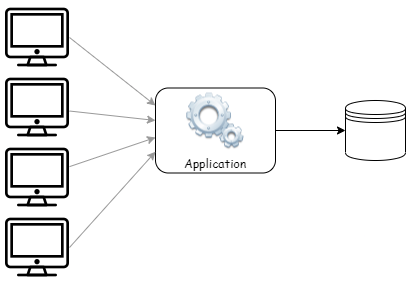
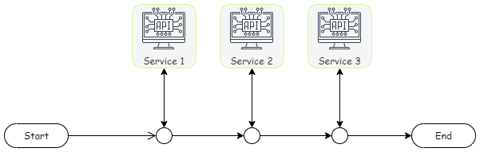
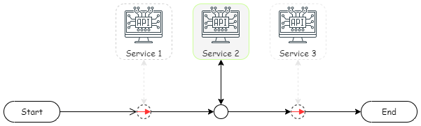
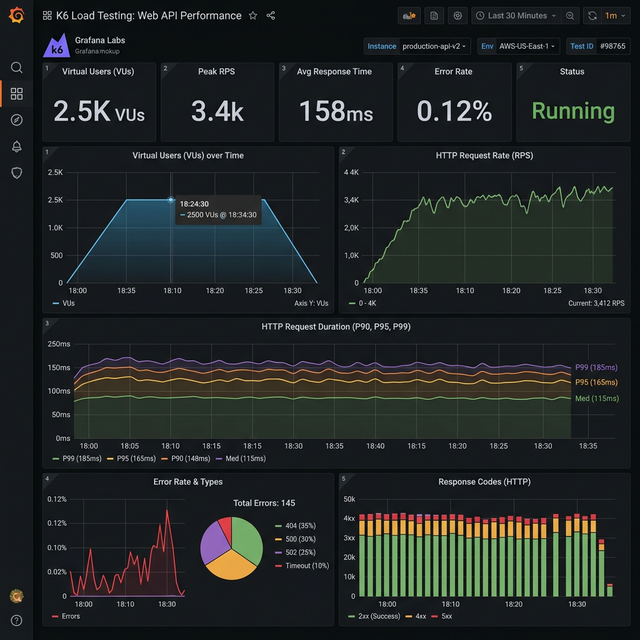

> 🔖 長話短說 🔖
>
> - **測試本質**：壓測不是為了交差或跑出漂亮數字，而是把系統的承載能力加以量化，作為加開機器、調整索引或設定警報水位的決策依據。
> - **核心三維度**：效能測試（平時找慢查詢與瓶頸）、負載測試（驗證規格與高併發下資料正確性）、壓力測試（不斷加壓摸出崩潰極限與 Auto Scale 觸發點）。
> - **相依隔離**：壓測前必須釐清範圍。除非目標是驗證外部 API，否則應使用 Mock 隔離第三方依賴，避免外部網路抖動或速率限制干擾自身系統的量測結果。
> - **報告核心**：單純列出平均回應時間沒有意義，必須觀察 P95/P99 延遲分位數、錯誤率跳變點，並對齊主機 CPU/Memory/IO 資源，才能精確定位擴充瓶頸。

在軟體開發與系統維運的過程中，我們經常會把「效能測試」、「負載測試」與「壓力測試」混在一起談。很多人一聽到系統要上線或準備面對促銷活動，直覺反應往往是：「那我們來做個壓測吧！」

這就像把車輛的各種檢驗混為一談：

- **效能測試**：就像平時進廠定期保養，接上電腦診斷底盤異音、調校噴油嘴，讓車子在一般市區也能開得順暢省油。
- **負載測試**：就像春節連假驗證國道疏運，車潮再怎麼龐大、收費感應門與匝道儀控也必須穩定運作，過路費絕不能扣錯帳。
- **壓力測試**：就像車廠把原型車開上封閉跑道，油門直接踩到底直到水箱滾燙爆缸，只為了摸清楚機械結構的極限到底在哪裡。

然而當團隊真正坐下來準備執行時，大家對測試的想像往往完全不同：

- 有人想知道「這台伺服器到底可以撐多少人同時在線？」（壓力測試）
- 有人想確認「線上 1,000 人同時結帳時，資料到底會不會寫錯？」（負載測試）
- 也有人想查出「為什麼某支 API 只要資料量一大，回應時間就直接飆破兩秒？」（效能測試）

測試如果沒有先釐清目的，最後往往就是寫了一堆壓測腳本、耗費大量伺服器資源，換來一份沒人看得懂、也無法用來做決策的圖表堆疊。

壓測的本質，是**將系統的承載能力加以數值量化**。只有量化，我們才能在有限的預算與架構限制下，做出最合理的工程決策：是要擴充硬體、調整資料庫索引、引入快取，還是設定自動水平擴展（Auto Scale）的警戒水位。

<!--more-->

在往下讀之前，先備好幾個後面會反覆出現的縮寫，看到時就不用中斷閱讀回頭查：

| 縮寫／名詞 | 白話意思 |
| :--- | :--- |
| **VUs（Virtual Users）** | 虛擬使用者數，可以想成同時間持續發送請求的模擬使用者數量 |
| **SLA（Service Level Agreement）** | 服務等級協議，這裡指壓測要達成的效能門檻，例如「95% 的請求要在 200ms 內完成」 |
| **AZ（Availability Zone）** | 可用區，雲端機房裡實體隔離的資料中心區域，跨 AZ 代表請求要多繞一段實體距離 |
| **2C4G / 8C16G** | 雲端主機規格簡寫，分別代表「2 核 CPU、4GB 記憶體」與「8 核 CPU、16GB 記憶體」 |
| **Hop** | 網路封包在到達目的地前，中途經過的每一個路由節點，Hop 數越多通常延遲越高 |
| **Zipf Distribution（Zipf 分佈）** | 長尾分佈的一種數學模型，白話講就是「少數熱門項目吃掉大部分流量，其餘項目乏人問津」 |

## 測試前先問：你的目的到底是什麼？

為了避免在一無所知的情境下，採用無效的測試方法或設計出過多無用的測試案例，在測試開始前，必須非常明確了解：這次測試期望回答什麼問題？

這三種常見測試在工程定位上的核心差異如下：

```mermaid
flowchart TD
    subgraph 壓力測試_摸索極限 ["壓力測試 (Stress Testing)"]
        S1["開始加壓"] --> S2["階梯持續拉高負載 ↗"]
        S2 --> S3["突破崩潰臨界點 💥"]
        S3 --> S4["量化極限 QPS 與 Auto Scale 水位"]
    end

    subgraph 負載測試_驗證規格 ["負載測試 (Load Testing)"]
        L1["升至預期尖峰"] --> L2["維持高負載高原期 ───"]
        L2 --> L3["驗證數千人同時併發"]
        L3 --> L4["確保資料一致性與零重複扣款"]
    end

    subgraph 效能測試_排查瓶頸 ["效能測試 (Performance Testing)"]
        P1["日常基準負載"] --> P2["穩定低水位運行 ───"]
        P2 --> P3["觀測慢查詢 SQL 與延遲"]
        P3 --> P4["定位前 20% 效能瓶頸熱點"]
    end

    classDef stress fill:#4a2020,stroke:#f85149,stroke-width:1px,color:#fff
    classDef load fill:#153a5c,stroke:#0969da,stroke-width:1px,color:#fff
    classDef perf fill:#2d333b,stroke:#57606a,stroke-width:1px,color:#fff

    class S1,S2,S3,S4 stress
    class L1,L2,L3,L4 load
    class P1,P2,P3,P4 perf
```



| 測試種類 | 主要目的 | 負載強度 | 關注指標重點 | 典型應用場景 |
| :--- | :--- | :--- | :--- | :--- |
| **效能測試 (Performance)** | 找出系統效能瓶頸並加以調校 | 日常穩定的預期負載 | 回應時間 (Response Time)、慢查詢 | 例行性檢視特定 API 是否有拖慢系統的 SQL 或外部呼叫 |
| **負載測試 (Load)** | 驗證系統是否符合預期規格與穩定度 | 等於或略高於預期的尖峰負載 | 資料處理正確性、系統資源使用率 | 上線前驗證，確認 1,000 人同時結帳時交易資料不會錯亂 |
| **壓力測試 (Stress)** | 摸索單機或整座系統的崩潰極限 | 持續極端增加負載直到系統癱瘓 | 崩潰臨界點、Auto Scale 觸發水位 | 搶購活動前評估需要加開多少台機器，或是驗證降級機制 |

隨著測試目的不同，規劃的測試架構、測試案例、假資料量以及觀測重點都會完全不同，無法一概而論。

## 三大典型測試場景與架構策略

### 摸索單機極限：量化硬體承載上限（壓力測試）

當需要評估採購新伺服器、或是要在雲端規劃規格時，常會有人問：「這台主機可以支援多少人同時使用？能扛多大的流量？」

在沒有實際數據支撐的前提下，很難憑空推估目前的硬體配置到底能支撐到什麼程度。

此時的測試重點是 **壓力測試（Stress Testing）**。透過不斷拉高負載強度，直到系統回應時間急劇惡化、開始大量拋出錯誤、甚至伺服器癱瘓，藉此量化當前硬體規格的極限容載量。



如果焦點在於單一機器的極限，測試拓撲就要盡可能單純：

- 壓測流量直接集中在受測伺服器，避免前端負載平衡器分流。
- 觀察無快取保護下的真實吞吐極限，並評估瓶頸是卡在應用程式 CPU、記憶體配置、還是資料庫連線池（Connection Pool）枯竭。
- 同時記錄平均回應時間、成功率、以及受測機器的 CPU、記憶體與磁碟 I/O。

收集到這組極限數據後，後續的容量規劃才有依據：是要加開機器節點、設定告警水位，還是進行程式碼重構。

### 驗證業務規格：確保尖峰資料正確性（負載測試）

業務端往往會有明確的規格需求，例如：「促銷期間必須保證 2,000 人同時在線結帳，全站功能依然正常。」

這時候的重點是 **負載測試（Load Testing）**。我們要驗證在大量併發請求持續湧入時，系統是否能穩定運作，更重要的是：**在龐大的交易量下，資料本身是否維持一致與正確？**

在這種場景下：

- 測試環境架構必須盡可能貼近正式環境的真實拓撲（包含負載平衡器、資料庫讀寫分離副本、快取等）。
- 除了監控請求成功率，還必須在測試結束後執行資料對帳腳本，驗證是否有庫存超賣、重複扣款、或是鎖定衝突導致的髒資料。

### 定位效能熱點：隔離外部依賴排查瓶頸（效能測試）

當線上系統運行一段時間後，使用者開始反應特定操作變得緩慢，團隊希望進行效能調校。

在動手改程式碼之前，必須先透過 **效能測試（Performance Testing）** 找出真正的瓶頸點。這往往是整個測試中最花時間的環節。我們需要收集並分析各服務之間的轉換時間、API 回應時間、以及資料庫查詢耗時。

在實務上，我們可以透過日誌聚合系統（如 ELK、Seq）、APM 監控工具（如 Azure Application Insights、Datadog）、OpenTelemetry 分散式追蹤，或在極端卡頓當下抓取處理程序的記憶體與執行緒 Dump，逐步拼湊出系統瓶頸的全貌。

在這個過程中，最容易遇到的干擾就是 **第三方外部依賴**。

如果測試案例的處理流程中，涉及外部的金流、簡訊或物流 API：



這時要先釐清：第三方服務的效能是這次測試的重點嗎？

- 如果只是想確認內部系統的處理極限，外部服務一旦延遲或阻擋請求，就會徹底污染測試數據。
- 除非測試目標就是量測串接第三方時的真實表現（此時需事先通知第三方供應商避免被視為攻擊），否則實務上會針對非核心外部依賴進行改寫，**改走 Mock Service 回傳假資料**：



隔離非必要因素後，量測到的數據才能真實反映內部程式與資料庫的瓶頸。

有了乾淨的基準值（Baseline），我們就能運用 80/20 法則，優先處理造成八成延遲的前兩成慢查詢與效能熱點。

## 測試案例與範圍的抉擇：商業情境優先

壓測不可能、也沒必要覆蓋全站所有功能。那到底該測哪些案例？

個人經驗是：**從核心業務情境下手。**

以電商平台為例，消費者進入站台，可能 80% 的時間都在瀏覽商品首頁與目錄，但真正產生商業價值的，只有最後不到 5% 的結帳交易。然而，結帳流程涉及庫存鎖定、扣款與訂單寫入，往往也是資料庫負擔最重、最容易崩潰的環節。

在規劃測試案例時：

1. **依商業價值鎖定關鍵路徑**：優先覆蓋會員登入、加入購物車、結帳下單等核心流程。
2. **依流量比例混合情境**：在模擬大量瀏覽讀取請求的同時，穿插真實比例的寫入交易，才能測出最貼近現實產線的系統承載力。
3. **隔離並清理測試資料**：壓測會在資料庫留下大量假訂單與扣款紀錄，測試環境應與正式環境的資料庫物理隔離；若條件不允許，至少要明確標記測試資料並在測試結束後執行清理腳本，避免污染正式報表或觸發異常告警。

## 現代壓測實戰：以 k6 建立階梯加壓與 SLA 門檻

理解了測試理論後，在實務中我們要如何將這些想法轉換為具體可執行的程式碼？

在現代雲原生環境中，**k6** 因為具備輕量、以 JavaScript 撰寫測試腳本、以及極佳的 CI/CD 整合能力，成為許多團隊的首選。以下是一份具備**階梯式加壓模型（Stages）**與**自動化 SLA 門檻防護（Thresholds）**的標準範例：

```javascript
import http from 'k6/http';
import { check, sleep } from 'k6';

// 1. 定義測試模型與自動化門檻 (Thresholds)
export const options = {
  stages: [
    { duration: '1m', target: 50 },   // 暖機期：1 分鐘內線性提升至 50 VUs
    { duration: '3m', target: 50 },   // 高原期：維持 50 VUs 驗證穩定性 (負載測試)
    { duration: '2m', target: 200 },  // 加壓期：拉升至 200 VUs 摸索極限 (壓力測試)
    { duration: '1m', target: 0 },    // 冷卻期：平緩降載，觀察連線與記憶體回收
  ],
  thresholds: {
    // 嚴格 SLA 規範：95% 請求需在 200ms 內完成，99% 需在 500ms 內
    http_req_duration: ['p(95)<200', 'p(99)<500'],
    // 測試全過程錯誤率必須低於 1%
    http_req_failed: ['rate<0.01'],
  },
};

// 2. 透過環境變數注入目標主機，避免正式/測試環境的網址寫死在腳本裡
const BASE_URL = __ENV.TARGET_HOST || 'https://staging.example.com';

// 3. 準備動態參數池，模擬真實分散的請求分佈
const productIds = [101, 102, 103, 201, 305, 408, 512, 630, 789, 999];

export default function () {
  // 隨機選取商品 ID，避免所有請求全部命中同一份 Redis 快取
  const targetId = productIds[Math.floor(Math.random() * productIds.length)];

  const res = http.get(`${BASE_URL}/api/v1/products/${targetId}`);

  // 4. 業務正確性斷言
  check(res, {
    'status is 200': (r) => r.status === 200,
    'has valid payload': (r) => r.body && r.body.includes('productName'),
  });

  // 5. 模擬真實使用者操作間隔 (Think Time)
  sleep(1);
}
```

這份腳本展現了壓測工程的幾個核心細節：

- **階段化負載（Stages）**：先暖機讓 JIT 編譯與連線池就緒，接著進入負載驗證高原期，最後才衝刺極限，完整描摹系統在不同時期的體質。
- **門檻防護（Thresholds）**：將抽象的 SLA 化為具體的程式碼斷言。當 P95 超過 200ms 或錯誤率大於 1% 時，k6 會直接回傳非零退出碼，非常適合整合在自動化部屬流程中。
- **思考時間（Think Time）**：真實人類不會在上一動完成後 0.001 秒就發送下一動，適度的 `sleep(1)` 才能模擬真實使用者的並發壓力，而非不自然的連環重擊。

要注意的是，上面的 `stages` 屬於固定虛擬用戶數的封閉式模型（Closed Model），適合用來驗證負載測試的規格內穩定度。如果目的是摸極限或量測真實排隊延遲，必須換成下一節會提到的開放式模型（如 k6 的 `constant-arrival-rate` 執行器），否則會直接踩進協調遺漏的地雷。

## 踩雷指南：壓測常見的三大深水區地雷

在開始收集數據之前，我們必須提防壓測界三個極易讓人誤判的經典陷阱：

### 地雷一：封閉式加壓的隱藏陷阱（協調遺漏 Coordinated Omission）

這是許多效能工程師常踩的隱形巨坑。
如果壓測工具採用**封閉式模型（Closed Model）**（例如傳統以固定執行緒數量加壓的架構）：當受測伺服器開始排隊、回應時間從 50ms 暴增到 5,000ms 時，壓測工具內部的執行緒也跟著被迫等候！

這意味著：**當伺服器變慢時，壓測機發送請求的頻率竟然自動放慢了！**  
原本在高峰期應該持續灌入的數千個請求根本沒被送出。最終產出的報告中，延遲數據看起來只是微幅上揚，團隊誤以為系統很能扛，結果正式上線時，外部用戶根本不會「體貼地等你處理完才發請求」，龐大流量直接引發雪崩。

**防範對策**：對於高併發公共 API，應考慮採用**開放式模型（Open Model）**，例如 k6 的 `constant-arrival-rate` 執行器，確保不管後端多慢，壓測端都維持恆定速率持續發送請求，才能測出最殘酷的真實排隊延遲。

### 地雷二：快取集中度假象 (Zipf Distribution 失真)

如果你的壓測腳本只拿 10 個固定的熱門商品 ID 狂打，在幾分鐘內，這 10 筆資料就會被全數載入本機記憶體快取或 Redis 中。
表面上系統跑出每秒 30,000 QPS 的漂亮成績，但這只是在「測試快取的讀取速度」，底層的資料庫幾乎處於閒置狀態。

**防範對策**：真實使用者的存取行為通常符合長尾效應（Zipf 分佈 / 帕累托 80/20 法則）。壓測資料集應建立足夠規模的動態參數池（包含 20% 熱門資料與 80% 冷門資料），模擬快取未命中（Cache Miss）時真實穿透到資料庫的查詢負載。

### 地雷三：縮水測試環境的「線性乘法迷思」

理想情況下，測試環境應該跟正式環境用一模一樣的規格與拓撲，這樣量出來的數據才能直接套用。但現實是機器成本擺在那裡，多數團隊不可能為了壓測另外養一套跟正式環境等規格的叢集，於是常見的做法是拿規格較差、數量較少的機器來湊合著測，這就是所謂的「縮水測試環境」。

在資源受限下，測試環境往往只有單台 2C4G 小主機，而正式環境是 10 台 8C16G 搭配叢集。許多人會天真地推論：「小機器測出 500 QPS，正式環境有 10 台，那承載力就是 5,000 QPS 吧？」

這是極度危險的假設。在分散式架構中，**效能擴展是非線性的**：

- 節點增加會帶來分散式快取網路開銷、分散式鎖競爭、以及資料庫連線池排隊。
- 測試環境單機無負載平衡器延遲，而正式環境跨 AZ 與 Gateway 會增加多個網路 Hop。

縮水環境的數據價值，在於**觀察單一處理程序內的瓶頸熱點、記憶體洩漏與 GC 停頓**，而非直接等比例推估全站總容量。

## 測試報告的三大核心架構

完成了壓測，下一步就是把雜亂的數據整理成具備說服力的測試報告。一份能為架構決策提供價值的報告，通常由三個部分組成：

### 測試環境與系統架構比對

回顧與覆盤時，如果不知道當時的測試環境設定，數據就毫無參考價值。這部分必須清楚記錄：

- **正式架構 vs 測試架構比對**：註明兩者之間的差異（例如測試環境使用單台資料庫而非正式環境的 Multi-AZ 叢集）。
- **硬體規格**：應用程式伺服器與資料庫的 CPU 核心數、記憶體容量、磁碟類型（SSD/NVMe）。
- **初始資料量**：資料庫內是否有預先填入與正式環境相當的資料量？（空資料庫測出的 SQL 查詢時間完全不具代表性）。
- **測試工具配置**：壓測機（JMeter / k6）的部署位置、壓測機本身的資源是否達到瓶頸、有無使用 Mock API。

### 測試策略與執行結果數據

說明測試採用的負載模型（固定負載、階梯加壓、或是突波衝擊），並客觀呈現量測數據：

- 併發使用者數（Virtual Users, VUs）與每秒處理請求數（QPS / TPS）。
- 回應時間分佈（不能只看 Average，必須包含 P95、P99 分位數）。
- 錯誤率與錯誤類型分佈（HTTP 500、504 Gateway Timeout、連線逾時等）。

### 結論與具體架構決策建議

這是整份報告最有價值的部分。數據本身不是目的，**數據背後推導出的行動才是關鍵**：

- **警報與擴展水位**：若測試顯示系統在 2,000 VUs 時 CPU 達到 80% 且延遲開始微幅上升，建議將 Auto Scale 的擴展門檻設定在 1,500 VUs（或 CPU 70%）。
- **瓶頸改善處方**：指出主要瓶頸是單一資料庫慢查詢，建議加上快取或調整複合索引；或是瓶頸卡在第三方 API，建議引入訊息佇列進行非同步解耦。
- **效益比對**：若為調校後的複測報告，明確列出優化前後的數據差異（例如：相同硬體下 TPS 提升 40%，P95 延遲由 800ms 降至 150ms）。

## 讀懂圖表背後的訊號：Grafana & k6 實戰解讀

在現代壓測實務中，我們常用 Grafana 搭配 k6 來視覺化呈現負載與系統各維度的互動。



面對這類綜合儀表板，解讀數據時應掌握三個關鍵維度：

### 負載與回應時間的關聯 (VUs vs Response Time)

在測試圖表中，當併發虛擬用戶數（VUs）從 0 穩定爬升至 2,500 的高原期時：

- 觀察中段的回應時間走勢。若 P95 延遲依然能平穩維持在合理區間（如 165ms 左右），代表在此負載強度下，系統的佇列與處理執行緒依然運轉良好。
- 反之，若 VUs 爬升到某個臨界點時，P95/P99 延遲突然出現垂直向上的「拐點」，代表系統內部某個資源（如資料庫連線池或執行緒池）已經被耗盡，請求開始排隊積壓。

### 錯誤率 (Error Rate) 的異常跳變

錯誤率是判斷系統是否健康的硬指標：

- 在正常負載下，錯誤率通常極低且多為預期的業務校驗未通過。
- 一旦圖表中的 Error Rate 出現突發性尖峰，必須立刻比對當下的 VUs 水位。這能幫我們精確抓出系統的「雪崩臨界點」：例如在 1,800 VUs 時系統正常，但一跨過 2,000 VUs 錯誤率瞬間飆高，往往代表後端連線發生超時或記憶體溢出。

### 效能數據與硬體資源相互對齊

光看前端 API 的回應時間是不夠的，必須把壓測時間軸與伺服器監控指標疊對在一起分析：

- **CPU 滿載但延遲尚可**：代表運算即將見頂，雖然使用者端尚未感受到變慢，但系統已無緩衝空間，應提早觸發水平擴展。
- **CPU 很低但延遲極高**：典型代表系統卡在 I/O 等候，例如資料庫鎖定（Deadlock / Lock Wait）、磁碟寫入延遲、或是外部相依連線逾時。

## 效能測試與架構決策分析判斷表

面對即將執行的測試與收集到的數據，如何推導出最適當的測試策略與後續架構處方？我們可以透過以下決策流程進行評估：

| 判斷步驟 | 核心問題與條件 | 建議測試策略與架構處方 | 關注關鍵指標 | 決策行動 |
| :--- | :--- | :--- | :--- | :--- |
| **Step 1：確定核心目標** | 想摸索單機極限 vs 驗證上線容量 vs 找出效能瓶頸 | **極限測量採壓力測試；上線前採負載測試；慢速排查採效能測試** | 崩潰點、P95 延遲、慢查詢 Log | 決定測試環境拓撲與工具配置 |
| **Step 2：外部相依釐清** | 流程是否包含第三方金流/簡訊 API？ | **非測試重點一律使用 Mock API 隔離；必要測試需事先向供應商報備** | 內部純處理時間、第三方回應時間 | 避免外部網路抖動干擾內部效能基準 |
| **Step 3：分析回應時間** | 負載增加時，P95/P99 延遲是否出現階梯式暴增？ | **出現延遲拐點：排查資料庫連線池上限與未命中索引的慢查詢** | P95、P99、DB Wait Time | 調整資料庫連線配置、增加快取、建立索引 |
| **Step 4：對齊硬體資源** | 延遲拉長時，應用程式主機與 DB 的 CPU 使用率為何？ | **CPU > 80%：進行水平擴展 (Scale-Out)；CPU < 30% 但延遲高：排查 I/O 阻塞與鎖定** | Host CPU、Memory、Disk I/O | 評估加開運算節點 vs 解除底層儲存鎖定 |
| **Step 5：驗證資料正確性** | 大流量交易結束後，是否有重複交易或庫存負數？ | **加強分散式鎖 (Distributed Lock) 或資料庫樂觀鎖/悲觀鎖防護** | 資料對帳錯誤數、交易成功率 | 修正併發寫入邏輯，確保交易一致性。 |

## 深入實戰的常見疑問 (FAQ)

### Q1：QPS、TPS、RPS 這三個名詞常常被混用，它們到底有什麼嚴格區別？向主管報告時該用哪一個？

**A**：在工程討論或向非技術主管報告時，混淆這三個名詞往往會造成極大的溝通落差：

- **Request Per Second (RPS)**：每秒請求數。這是純粹從**網路傳輸協定**層面計算的吞吐量。壓測工具對外送出了多少個 HTTP Request，受測伺服器就收到了多少個 RPS。
- **Query Per Second (QPS)**：每秒查詢數。通常指的是**資料讀取或底層組件（如資料庫 SQL、Elasticsearch、DNS）的查詢頻率**。如果一隻前端 API 內部需要依序執行 3 次 SQL 查詢，那麼在 1,000 RPS 的流量下，資料庫承受的實際負擔就是 3,000 QPS。
- **Transaction Per Second (TPS)**：每秒事務/交易數。這是指**完成一個具備商業意義的完整交易單元**。例如電商的「結帳流程」，可能由「驗證購物車、扣減庫存、建立訂單、取得扣款授權」4 個 API 請求共同組成。在業務層面，這 4 個請求全部成功才算完成 1 個 Transaction。

**向主管報告的心法**：

- 對**業務主管或老闆**：請一律使用 **TPS**。他們關心的是「系統一秒鐘能讓多少位客人完成付款買單」，業務層面只看交易結果。
- 對**架構師與 SRE 維運團隊**：請務必拆開標明 **RPS**（應用程式網路入口承載力）與底層儲存的 **QPS**（資料庫讀寫壓力），避免不同層級的數字混為一談導致擴展決策失準。

### Q2：伺服器 CPU 使用率很低（< 20%），但 API 回應時間卻飆到數秒，現場排查的「四大隱形栓塞」SOP 是什麼？

**A**：在排查現場，最棘手的就是「伺服器明明很閒，用戶端卻全部卡死」。這代表 CPU 根本沒在運算，而是在無奈等候某種外部資源。身為第一線排查者，請依序檢查以下四大嫌疑犯：

1. **連線池枯竭（Connection Pool Starvation）**：
   - 資料庫連線池（如 HikariCP、Npgsql）、Redis 連線池或 HTTP Client 連線池被佔滿。當大量請求同時湧入，後面的執行緒全被卡在連線池外排隊等待釋放連線，造成嚴重的等候延遲。
   - *檢查方式*：檢視連線池的 Active Connections 是否達到 Max 限制，以及 Pool Wait Time 是否飆高。
2. **非同步死鎖引發執行緒池飢餓（ThreadPool Starvation）**：
   - 在非同步（C# async/await、Java CompletableFuture）程式碼中，若有人圖方便寫了同步阻塞語法（例如 `.Result`、`.Wait()` 或 `.GetAwaiter().GetResult()`），極易引發執行緒相互卡死。此時 ThreadPool 會被迫進入緩慢的每秒微量補血機制，引發全站大排隊。
   - *檢查方式*：檢視應用程式的 ThreadPool Queue Length 與 Active Threads 數量。
3. **資料庫列級鎖（Row-level Lock）或死鎖（Deadlock）**：
   - 程式邏輯在開啟事務後執行了冗長的外部呼叫，導致資料庫特定 Row 或 Table 長時間未釋放排他鎖（Exclusive Lock），後續所有對該筆資料的更新或讀取全數卡在等鎖隊伍中。
   - *檢查方式*：查詢資料庫系統視圖（如 MySQL 的 `information_schema.innodb_locks` 或 SQL Server 的 `sys.dm_tran_locks`）。
4. **雲原生容器限流（Kubernetes CFS Quota Throttling）**：
   - 這是 K8s 環境最常見的無聲刺客。Pod 雖然設定了 CPU Limit，但 Linux 核心的完全公平調度器（CFS）是以「毫秒週期」進行配額切片。若程式在 10ms 內瞬間併發爆衝用完配額，容器就會被強制「凍結（Throttled）」數十毫秒直到下一個週期。
   - *檢查方式*：檢視 Prometheus 指標 `container_cpu_cfs_throttled_periods_total` 是否出現異常激增。

### Q3：為什麼「平均回應時間（Average）」是壓測中最大的謊言？為什麼架構師只看 P95 與 P99？

**A**：平均數會殘酷地掩蓋極端值，在軟體工程中更會嚴重誤導決策：

- **生活化的大賣場結帳比喻**：
  想像你在超市排隊結帳。前面 9 個人每人只買一瓶水，刷條碼 3 秒搞定；第 10 個人推了滿滿三台購物車，條碼刷不出來還跟店員吵架，卡了整整 30 分鐘！
  如果計算這 10 位顧客的「平均結帳時間」：`(3秒 × 9 + 1800秒) / 10 ≈ 182.7 秒`（約 3 分鐘）。
  主管看報表可能會覺得：「平均才 3 分鐘，效能非常優秀！」但現實中，排在第 10 位客人後面的所有消費者已經全數抓狂退場了。
- **高價值用戶往往承擔最差延遲**：
  在真實商業系統中，購買最多商品、購物車清單最長、最願意掏錢的大客戶，執行的計算最複雜，往往就是撞上那 5% 長尾延遲的人。只看平均值，代表你可能正在不知不覺中傷害對公司貢獻度最高的核心用戶。
- **微服務扇出放大效應（Fan-out Amplification）**：
  現代分散式系統中，使用者開啟一個頁面，前端往往會並行呼叫 10 個後端微服務。如果每個微服務的 P99（前 1% 最慢請求）是 500ms，那麼使用者端「完全不踩到任何一個微服務 P99」的機率只有：
  $$(0.99)^{10} \approx 90.4\%$$
  這代表**高達將近 10% 的前端真實使用者，會直接撞上某一個微服務的長尾卡頓！**  
  這也是為什麼資深工程師普遍會把 P95、P99 與 P99.9 當作觀察系統健康度的核心指標，而不是只看平均值。

### Q4：測試環境機器規格比正式環境小很多，縮水壓測最大的價值到底是什麼？

**A**：既然無法透過單純的乘法直接推估正式環境的總容量，那做縮水壓測還有意義嗎？答案是：**非常有價值，但關注點必須徹底轉移**：

1. **揪出單一處理程序內的程式碼效能黑洞**：未命中索引的慢 SQL、演算法時間複雜度過高（如在迴圈內反覆調用外部 API）、或是過度序列化肥大 JSON，這些程式碼層級的瑕疵，在單機環境下同樣會被放大檢驗。
2. **提早驗證記憶體洩漏（Memory Leak）與垃圾回收（GC）體質**：讓單台主機在 70% 負載下持續運轉 2 小時，觀察記憶體使用量是否呈現「單調遞增且無法回收」的樓梯趨勢。這能精準抓出抓著物件不放的靜態快取（Static Cache）或未釋放的連線句柄。
3. **驗證邊界崩潰與優雅降級（Graceful Degradation）**：故意將單機負載拉升至極限，檢驗系統在快要倒下前，熔斷器（Circuit Breaker）是否能及時介入？限流器（Rate Limiter）是否能噴出友善的 HTTP 429？還是直接拋出未捕捉例外導致整台 Process 默默重啟崩潰？

## 簡單總結

效能測試從來不是為了追求跑出幾萬 TPS 的虛榮數字，而是為了在真實災難發生前，冷靜摸清系統的邊界與耐受極限。

把測試目的想清楚、在合適的環境下用正確的策略加壓、並從數據與圖表中讀出系統發出的求救訊號，我們才能把雜亂的日誌轉化為堅實的架構決策，讓每一分硬體預算與調校時間，都精準投資在刀口上。

---

> 💡 **互動時間**
>
> 搞清楚了測試目的與報告核心，回到你的工作現場：你在團隊中習慣使用 k6、JMeter 還是其他壓測工具？面對非預期的效能瓶頸，你通常第一個排查的指標是什麼？歡迎在下方留言分享你的實戰經驗與踩雷心得！

## 延伸閱讀

▶ 站內相關文章

- [聊聊架構 - 從單點故障 (SPOF) 到系統冗餘 (Redundancy)：高可用架構的實踐與權衡](聊聊架構%20-%20從單點故障%20(SPOF)%20到系統冗餘%20(Redundancy)%20的實踐與權衡.md)
- [高併發架構導論：系統負載、分流策略與限制理論 (Theory of Constraints) 的實踐](../system-loading-limit-reroute/index.md)

▶ 外部參考

- [Load Test Types - Grafana k6 Documentation](https://grafana.com/docs/k6/latest/testing-guides/test-types/)
- [Apache JMeter User's Manual: Best Practices](https://jmeter.apache.org/usermanual/best-practices.html)
- [Performance Testing vs. Load Testing vs. Stress Testing - BlazeMeter](https://www.blazemeter.com/blog/performance-testing-vs-load-testing-vs-stress-testing)
