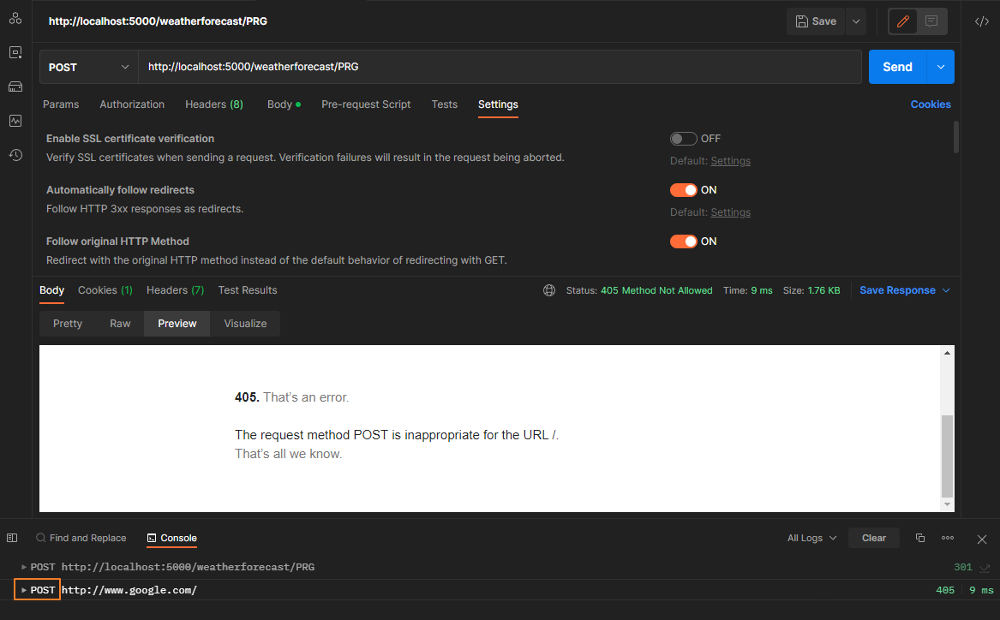

最近因為工作需求，需要提供一支使用  `POST`  方法的 Web API，並在處理完成任務後，轉導到其他的網頁。

但在使用 Postman 測試的過程，因為 POC 轉導到 google 時，回應  `405 Method Not Allow` 的狀態，所以研究的過程特別記錄下來。

> 🔖 長話短說 🔖
>
> - 使用 Postman 測試 Redirect 時，要注意 `Follow original HTTP Method` 的選項是否開啟。
> - 要確認被轉導的 Url 允許的 HTTP 方法有那些。否則會被回 `405 Method Not Allow`

<!--more-->

首先，先到 RFC 查找關於 Post redirect Get 的資訊，在 [RFC 7231: Hypertext Transfer Protocol (HTTP/1.1)](https://www.rfc-editor.org/rfc/rfc7231#section-6.4.2) 6.4.2 中提到

> Note: For historical reasons, a user agent MAY change the request method from POST to GET for the subsequent request.  If this behavior is undesired, the 307 (Temporary Redirect) status code can be used instead.

接下來就是確認測試過程的那些因素，造成 google 回應 `405` 。

## 實作方法

測試環境:

- OS: Windows 11
- SDK: .NET Core 3.1

首先，先建立一個測試用 的 WebAPI 的專案。

``` bash
dotnet new webapi -n test -f  netcoreapp3.1
```

並在 `WeatherForecastController` 建立一個路徑為 `PRG`  的 Post Method。

### 作法一：使用 RedirectPermanent

```csharp
[HttpPost("PRG")]
public IActionResult PostRedirectGet([FromBody] TestEntity entity)
{
 // 使用 HttpStatusCode 301
 return this.RedirectPermanent("http://www.google.com");
}
```

### 作法二：調整 Response 的 Header 與 StatusCode

```csharp
[HttpPost("PRG")]
public void PostRedirectGet([FromBody] TestEntity entity)
{
 this.Response.StatusCode = (int)HttpStatusCode.Moved;
 this.Response.Headers.Add("Location", "http://www.google.com");
}
```

## Postman 測試注意事項

我們直接使用 Postman 測試 API，會發現回應 `Statue: 405 Method Not Allowed` 。



但觀察 Console 的記錄，發現 API 回應 `301 Move Permanently`，並持續原本的  `POST`  Method 去呼叫 <http://www.google.com> ，然後就收到 `405 Method Not Allow` 的錯誤。

回頭查看 <http://www.google.com> 回應的標題，它就很明確的告知，只允許 `GET`、`HEAD` 兩種方式。


回頭檢查 Postman 的請求設定中，發現 `Follow original HTTP Method` 、`Automatically follow redirects` 兩個選項。

當開啟  `Follow original HTTP Method`  時，只要 API 回應 `3xx` 的 StatusCode 時，會使用原先的 HTTP Method 去進行 Redirect 。


所以將 `Follow original Http Method` 選項 Disabled 後，再重新發送請求。

可以發現 Redirect 時，使用 `GET`  Method 呼叫 <http://www.google.com.tw> ，順利得到 `200 OK` 的回應。


此外，若將 `Automatically follow redirects` 關閉時，當 API 回應 `3xx` 的 StatusCode 時，Postman 不會進行 Redirect 的行為。


## 延伸閱讀

1. [Various ways of redirecting a request in ASP.NET Core | BinaryIntellect Knowledge Base](http://binaryintellect.net/articles/2cde4c7c-b43d-4c67-acc2-614ae9b0fcf5.aspx)
2. [Post/Redirect/Get (PRG) Design Pattern - GeeksforGeeks](https://www.geeksforgeeks.org/post-redirect-get-prg-design-pattern/)
3. [Redirections in HTTP - HTTP | MDN (mozilla.org)](https://developer.mozilla.org/en-US/docs/Web/HTTP/Redirections)
