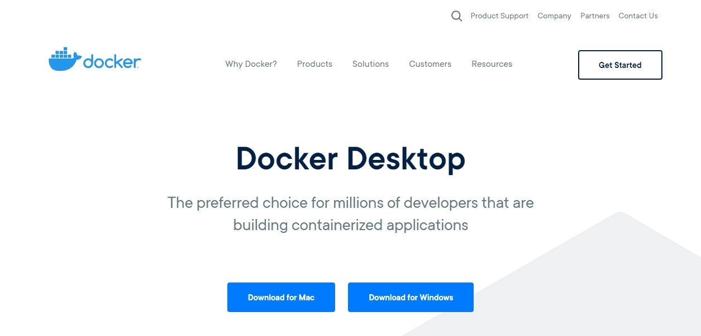

> 本篇為 [靈活運用 Docker 打造高效的容器化應用環境](../flexibly-use-docker-foreword/index.md) 系列的文章之一。內容由現有的文章中，將相關的內容整理於此。後續不定期編修與更新內容。

## 各 OS 安裝 Docker

### Windows

由於 Docker 政策的因素，是無法直接在 Docker 官網下載 Docker CE。必需經過 Docker store，才能下載 Docker CE 。

Docker Store 必需登入帳戶，才能進行下載動作。如果沒有帳戶，記得申請帳戶。



安裝時，不用額外設定，只要順著指示步驟進行安裝，就能完成設定。

要注意的是，如果準備安裝 Docker for Windows 的作業系統，不是 **Windows 10 Pro** 、 **Enterprise** 、**Windows Server 2016**，會出現以下的畫面，然後就停止安裝動作。


但是，要補充一點，在 Docker 完裝完成後，假若機器是第一次安裝 Docker，會出現 `close and log out` 的按鈕：反之，只會出現 `close` 的按鈕。

當啟用 Docker for Windows 時，Docker 會自行確認所需的技術或功能是否有開啟支援。若未開啟相關功能，Docker 會詢問是否要開啟。同意的話，會自動重新開機。反之，則直接告知無法啟動 Docker。


~~在啟動後，Docker 會要求使用者登入。~~

> [2022.08 補充] 
> 目前 Docker for Windows version 20.10 之後，不會直接出現使用登入的畫面，改為 Docker Desktop Dashboard 的畫面。

實際上，登入與否的差異，只差在能否存取 Docker Hub 的 Repositories。本機 Docker 還是可以正常操作。


### Ubuntu

可以使用 `docker --version` 來確認目前 Ubuntu 上安裝的 docker 版本。若還沒有安裝，可以參考官方文件
([Install Docker Engine on Ubuntu | Docker Docs](https://docs.docker.com/engine/install/ubuntu/)) 的說明，進行安裝。

在這邊，採用增加 `apt` Repository 的方式，來進行 Docker 的安裝。下面簡單說明幾個步驟。

#### 1. 增加 Docker 的 apt Repository

```bash
# Add Docker's official GPG key:
sudo apt-get update
sudo apt-get install ca-certificates curl gnupg
sudo install -m 0755 -d /etc/apt/keyrings
curl -fsSL https://download.docker.com/linux/ubuntu/gpg | sudo gpg --dearmor -o /etc/apt/keyrings/docker.gpg
sudo chmod a+r /etc/apt/keyrings/docker.gpg

# Add the repository to Apt sources:
echo \
  "deb [arch="$(dpkg --print-architecture)" signed-by=/etc/apt/keyrings/docker.gpg] https://download.docker.com/linux/ubuntu \
  "$(. /etc/os-release && echo "$VERSION_CODENAME")" stable" | \
  sudo tee /etc/apt/sources.list.d/docker.list > /dev/null
sudo apt-get update
```

在確保使用最新版本的套件前提下，下載 Docker 的 GPG public key，以確保下載的 Docker 是官方的版本。

#### 2. 安裝 Docker 相關套件

安装最新版本的 Docker 套件。

```bash
sudo apt-get install docker-ce docker-ce-cli containerd.io docker-buildx-plugin docker-compose-plugin
```

測試是否安裝成功。如果能看到 `Hello from Docker!` 訊息，表示 Docker 已成功安装。

```bash
sudo docker run hello-world
```

#### 加入 docker 用戶組(選項)

若是後續在執行 `docker` 指令時，不想要每次都都要輸入 `sudo` 的話，別忘了在用戶組內，加入 docker 操作權限。

```bash
sudo usermod -aG docker ${USER}

# 重啟 Docker
sudo systemctl restart docker
```

## 補充資料

▶ 延伸閱讀

- [靈活運用 Docker - 打造高效的容器化應用環境](../flexibly-use-docker-foreword/index.md)
- [縮網址服務實作記錄(1) - 基於 Docker 容器技術的網站服務架構實踐](../../side-project/shorten-1-build-service-base-on-container/index.md)
