> 縮網址服務為 <https://url-ins.com/shorten/> ，有任何想法或回饋，可以在 [SurveyCake](https://www.surveycake.com/s/wgveX) 留下寶貴的意見。(為了維持主機的維運，在頁面內放入 Google Adsense 廣告。)

這一系列的文章，是個人在實作縮網址服務時，思考模式、技術選擇、架構規劃與實作過程的記錄。國外也有類似的系統設計概念分享[URL Shortening System Design](https://systemdesign.one/url-shortening-system-design/) 也很推薦去看看。

這篇文章的內容，主要的內容包含以下項目。

1. 建立系統服務的評估架構規劃。
2. Ubuntu 的防火牆設定、使用者密碼/ SSH Key 的認證設定。
3. 在 Docker 中，利用 Docker network 進行網段劃份，以控制服務之間的訪問。
4. 使用 Docker Hub 以外的 Container Registry，進行 Docker Image 管理。
5. Grafana 與 Loki 的設定方式。

> 🔖 長話短說 🔖
>
> 設定 Ubuntu 允許 SSH 使用密碼登入時，除了 `/etc/ssh/sshd_config` 需要調整，也要檢查 Include 其他的 `.conf` 是否有覆寫的情況。
>
> 若是在要 Docker Compose 使用的 `yaml` 檔中，宣告使用外部的 docker network，記得加上 `external: true`

## 一、服務環境評估、選擇與服務架構規劃

### 評估與規劃的先決條件

- 在初期，維運成本的支出，要盡可能的低。
- 使用 Docker 進行服務的佈署與管理。
- 服務只對外開放 80/443 PORT，以及 SSH 22 PORT。
- 集中收集與分析服務維運時的 LOG。

在維運成本的考量下，初期使用一台主機來建置整個服務系統，並基於 Container 進行佈署與維運。

最後選擇 Godaddy + [Digital Ocean](https://m.do.co/c/254e8cbe525a)(使用此推薦連結，可獲得 $200 的使用額度) 單一主機建立服務。

在 Docker Image 的 Artiact 的管理部份，最初的選擇，是直接使用 Digital Ocean 的 `Container Registry` 。但考量 Free Plan 只能使用一個 Repo，而這個專案有使用至少 2 個 Image。

在 GitLab 提供的 Container Registry 則是沒有數量的限制。它的提供 unlimit Private Container registry。

這個原因，導制後續改為使用 GitLab 的 Container registry。

### 使用技術、框架與環境設定如下

- 網路服務商
  - Domain: [Godaddy](https://tw.godaddy.com/)
  - 主機平台: [Digital Ocean](https://m.do.co/c/254e8cbe525a)
  - 版控與 Container Registry: [GitLab](https://gitlab.com)
- 使用服務:
  - Nginx 1.25.3
  - Postgresql 16
  - Grafana 10.2
  - Loki 2.9.2
- 使用技術
  - Vue3 / [Astro](https://astro.build) 3.3
  - .NET 7

使用相關線上工具

- [NGINXConfig](https://www.digitalocean.com/community/tools/nginx?global.app.lang=zhTW): Digital Ocean 提供的 Nginx conf 的產生器，可直接使用介面點選後，自動產生對應的 Nginx config。

### 服務架構圖


#### 服務

最初是希望有需要的使用服務的應用程式，可以直接調用 API，所以設計是以 API First 的方式，來進行開發規劃。同時，也讓提供一般使用者，可以進行基本的操作。

因此，這次主要的開發的項目，主要集中在面對使用者的前端頁面呈現，以及 Web API 功能的部份。

前端頁面選擇使用 Astro + Vue3 這對組合。主要是 Astro 建置出來的靜態網頁，對 SEO 與網頁速度有著不錯效能。Vue3 則是用於使用者互動的部份。(因為目前只對 Vue3 有些許的經驗)

Web API 的部份，則是使用最熟悉的 .NET Core，順便嘗試 .NET 7 之後的效能與支援的語法。

資料庫則是選擇使用後起新秀的 Postgresql，最主要的考量，最熟悉的 MS SQL SERVER 的 Lincese 費用，不是一般 Side Project 可以承受。而且後繼轉換為雲端服務商 Serverless RDS 的成本也在可接受範圍。(簡單來說，就是成本考量)

在監控與維運報警的部份，則是直接選擇使用 Grafana 全套，有一個考量，就是運用 Grafana 支援的 OpenTelemetry 來進一步研究 OpenTelemetry。

#### 網路規劃

在 Digital Ocean 的 VPS 防火牆只開放 80/443/22 這幾個需要的 PORT。

在主機內，直接使用 Docker netowrk 來進行網段的切分。在這在專案，只有簡單進行以下切分。

| Network-name | 說明                                    |
| ------------ | --------------------------------------- |
| gateway      | NGINX/WEB 與 Web API 所在的網段。       |
| backend      | Web API 與 Database 所在的網段。        |
| ops          | Grafana 相關服務與 Web API 所在的網段。 |

目前只有這樣簡單切分網段，後續有機會，會依據 [Docker security](https://docs.docker.com/engine/security/) 的說明，進一步進行 security 相關的設定。

## 主機設定

在服務主機的 OS 部份，使用 Ubuntu Ubuntu 22.04.3 LTS。

有以下的要求設定

- 對外只開放 80/443 與 SSH 使用的 22 PORT
- 操作只能使用特定帳號，來操作 Docker 的操作。

### 設定防火牆

```shell
# 確認目前防火牆狀態
ufw status

# 設定規則
ufw allow 80/tcp
ufw allow 443/tcp

# 開啟防火牆
ufw enable
```

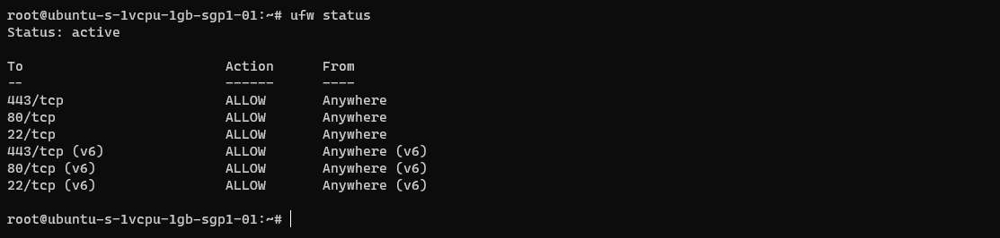

### 使用者權限設定

我們可以使用以下的指令來新增使用者，在這邊以 `opser` 這個使用者名稱為例。

```shell
sudo adduser 新使用者名稱
sudo usermod -aG sudo 新使用者名稱
su - 新使用者名稱
```


#### 使用密碼驗證 (Password Authenticaiton)

若是後續想要使用密碼來進行 SSH 連線，若 `sshd_config` 內的 `PasswordAuthentication` 為 `no`，使用 SSH 登入時，會直接出現 `Permission denied (publickey).` 錯誤。

Ditigal Ocean 開立的 Ubuntu 主機，預設是關閉 `PasswordAuthentication` 的，若要使用密碼認證，需要進行一些設定

```shell
cat /etc/ssh/sshd_config | grep
```

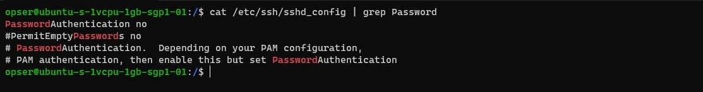

開啟密碼認證的設定，將 `PasswordAuthentication` 設為 `yes`。

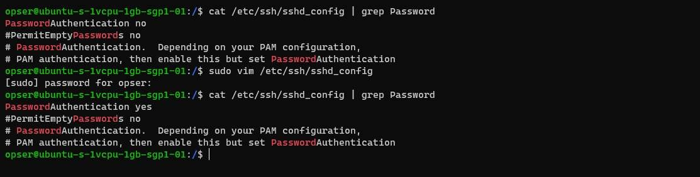

重啟 `sshd` 服務，讓 `PasswordAuthentication` 變動生效。

```shell
sudo systemctl restart sshd
```

📢 題外話：改完了設定，但還是無法使用密碼登入！！

在 `/etc/ssh/sshd_config` 有一行指令要特別注意，它會在載入 `sshd_config` 的設定後，再去載入其他的 `*.conf` 設定值。若出現相同的設定，後者的設定值會覆寫前面。

在 Digital Ocean 建立的主機，`/etc/ssh/` 內有一個資料夾 `sshd_config.d`，其中有一個 `50-cloud-init.conf` 檔案，會將 `PasswordAuthentication` 覆寫為 `no`。

當我們已經完成調整，嘗試使用 SSH 密碼登入時，還是出現 `Permission denied (publickey).` 的訊息。記得去檢查是不是這個問題。

#### 使用 SSH Key 認證

若我們不開放密碼認證，只允許新的使用者，只能使用 SSH Key 去進行登入認證。

在 [How To Set Up SSH Keys on Ubuntu 16.04 | DigitalOcean](https://www.digitalocean.com/community/tutorials/how-to-set-up-ssh-keys-on-ubuntu-1604) 這一篇文章，其實寫的還滿清楚的。

目前的情境: Ubuntu 主機只開放 `root` 使用 SSH Key 認證，不開放密碼認證，新使用者無法登入的前提下，進行設定。

可使用以下的步驟來進行設定。

- 使用 `ssh-keygen` 建立新的公私鑰。
- 將 SSH 使用的 Public Key 複制到 Ubuntu 主機。
- 建立使用者的 `authorized_keys` 與對應的 `.ssh` 訪問權限。

首先，先產生新使用者 `opser` 使用的 SSH Key。

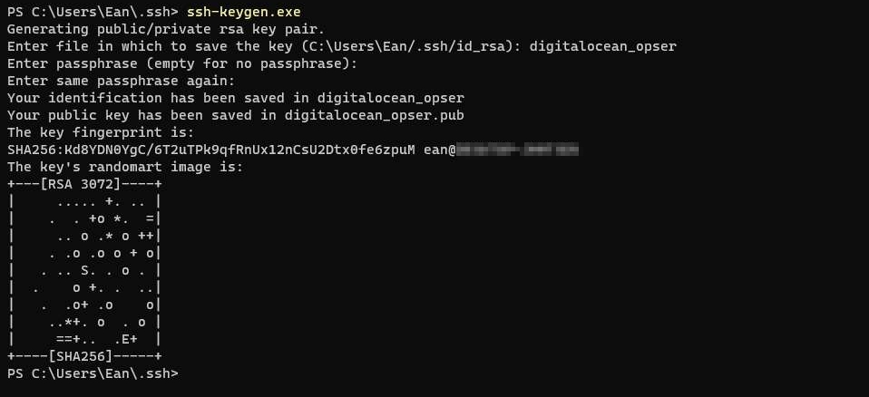

接著，讓我們把 Public Key 放到 Ubuntu 主機，並進行 `authorized_keys` 與對應的 `.ssh` 訪問權限設定。

在這，我先把建立出來的 Public Key (digitalocean_opser.pub) 使用 `SCP` 上傳到 Ubuntu 主機的 `/` 路徑下。

```shell
# 因為我們先登入 root, 所以要切到要調整的使用者帳號 opser 下
su - opser

# 若沒有 .ssh 資料夾，就建立。
mkdir -p ~/.ssh
# 建立 authorized_keys
touch ~/.ssh/authorized_keys
# 設定 .ssh 的讀取權限
chmod -R go= ~/.ssh

# 把 /digitalocean_opser.pub 的內容放到 /home/opser/.ssh/authorized_keys 內。
# 實際操作，請作實際名稱調整
cat /digitalocean_opser.pub >> ~/.ssh/authorized_keys
```

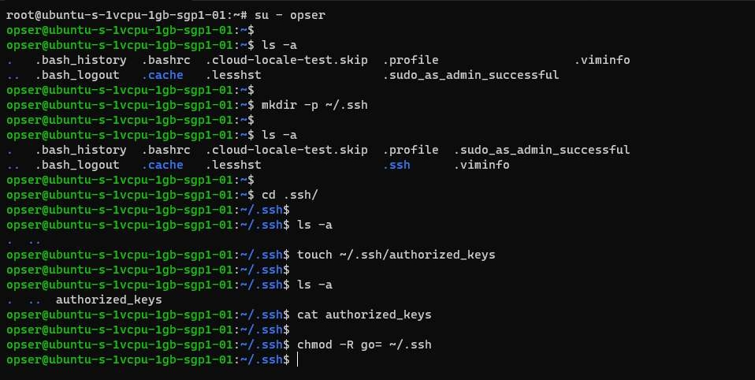

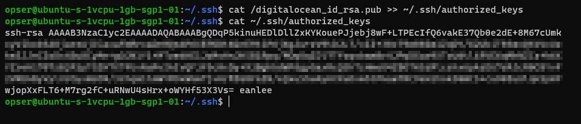

完成上述指令之後就可以順利的使用 opser 以 SSH Key 登入。

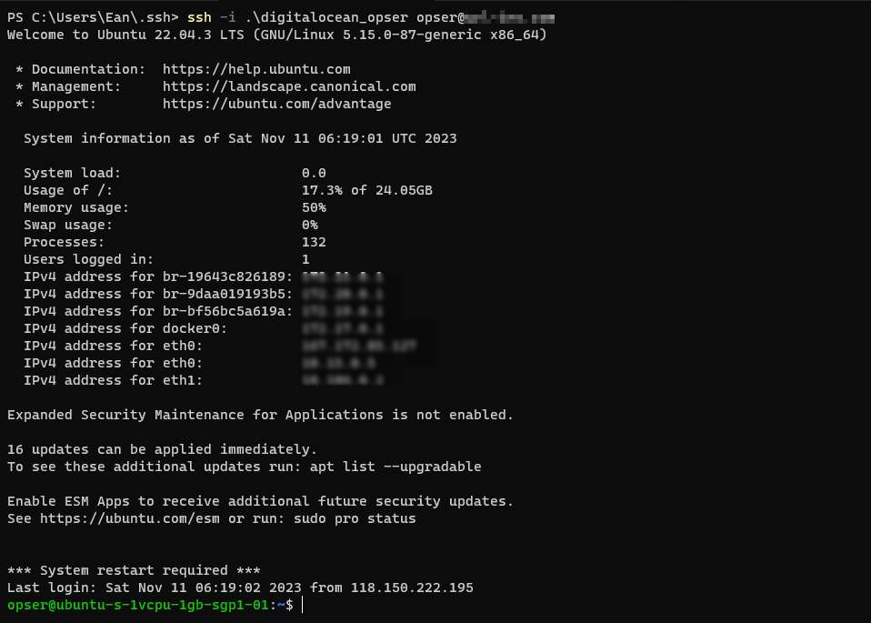

### Docker 確認

可以使用 `docker --version` 來確認目前 Ubuntu 上安裝的 docker 版本。若還沒有安裝，可以參考官方文件

([Install Docker Engine on Ubuntu | Docker Docs](https://docs.docker.com/engine/install/ubuntu/)) 的說明，進行安裝。

在這邊，採用增加 `apt` Repository 的方式，來進行 Docker 的安裝。下面簡單說明幾個步驟。

#### 1. 增加 Docker 的 apt Repository

```bash
# Add Docker's official GPG key:
sudo apt-get update
sudo apt-get install ca-certificates curl gnupg
sudo install -m 0755 -d /etc/apt/keyrings
curl -fsSL https://download.docker.com/linux/ubuntu/gpg | sudo gpg --dearmor -o /etc/apt/keyrings/docker.gpg
sudo chmod a+r /etc/apt/keyrings/docker.gpg

# Add the repository to Apt sources:
echo \
  "deb [arch="$(dpkg --print-architecture)" signed-by=/etc/apt/keyrings/docker.gpg] https://download.docker.com/linux/ubuntu \
  "$(. /etc/os-release && echo "$VERSION_CODENAME")" stable" | \
  sudo tee /etc/apt/sources.list.d/docker.list > /dev/null
sudo apt-get update
```

在確保使用最新版本的套件前提下，下載 Docker 的 GPG public key，以確保下載的 Docker 是官方的版本。

#### 2. 安裝 Docker 相關套件

安装最新版本的 Docker 套件。

```bash
sudo apt-get install docker-ce docker-ce-cli containerd.io docker-buildx-plugin docker-compose-plugin
```

測試是否安裝成功。如果能看到 `Hello from Docker!` 訊息，表示 Docker 已成功安装。

```bash
sudo docker run hello-world
```

#### 加入 docker 用戶組(選項)

若是後續在執行 `docker` 指令時，不想要每次都都要輸入 `sudo` 的話，別忘了在用戶組內，加入 docker 操作權限。

```bash
sudo usermod -aG docker ${USER}

# 重啟 Docker
sudo systemctl restart docker
```

## 二、服務佈署與設定

### Docker Image 的 Artifact 管理

#### docker login

在把建置出來的 Image Push 到 Container Registry 之前，我們需要先登入要存放 Image 的 Container Registry。

```shell
docker login <container-registry-host>
```

這邊以 Digital Ocean 的 Container Registry(registry.digitalocean.com) 為例。

只要在 `Username` 與 `Password` 輸入正確的認證資料，就可以順利登入。至於認證資料輸入的內容，請查看各 Container Registry 的要求。

例如 Digital Ocean 的認證資料，就需要先去申請 API Token 後，再把 Token 輸入 Username/Password。

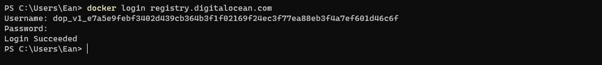

在成功登入，就可以在允許的權限下，進行 Container Registry 操作。

#### docker push image

在 Push 到 Container Registry 之前，來看一下 Docker 官網的[說明](https://docs.docker.com/engine/reference/commandline/push/)。

可以藉由 Push 的指令，將 Image 分享到 Docker Hub 或自建的 Container Registry。

```shell
docker push [OPTIONS] NAME:[Tag]
```

這個有個小細節。

當我們連到 [docker tag | Docker Docs](https://docs.docker.com/engine/reference/commandline/tag/) 進一步查看資訊時，會發現 docker push 的 `NAME` 的內容格式為 `[HOST[:PORT]/]PATH`，由 `HOST`、`PORT` 與 `PATH` 三者組成。

若是沒有指定 `HOST`，預設指向 Docker Hub 所在的 `docker.io`。

這意味著，若是想要把自行產生的 Image 上傳到 Digital Ocean Container Registry。在上傳之前，就必須使用 `docker tag` 進行名稱的調整，將 Image 名稱加上 `HOST` 資訊。

以 Digital Ocean Container Registry 為例，若是要上傳 `url-insight/web` 到 Digital Ocean Container Registry 的 Repo(url-insight) 之中，就需要執行下述指令。

```shell
# docker tag <image-name>:<tag> registry.digitalocean.com/<registry-name>/<image-name>:<tag>

docker tag url-insight/web:latest registry.digitalocean.com/my-registry/url-insight/web:latest
```

完成更名後，就可以把 Image 上傳到 Digital Ocean Container Registry。

```bash
docker push registry.digitalocean.com/<registry-name>/<image-name>:<tag>
```

例如，將 `url-insight/web` 映像推送到 Container Registry：

```shell
docker push registry.digitalocean.com/my-registry/url-insight/web:latest
```

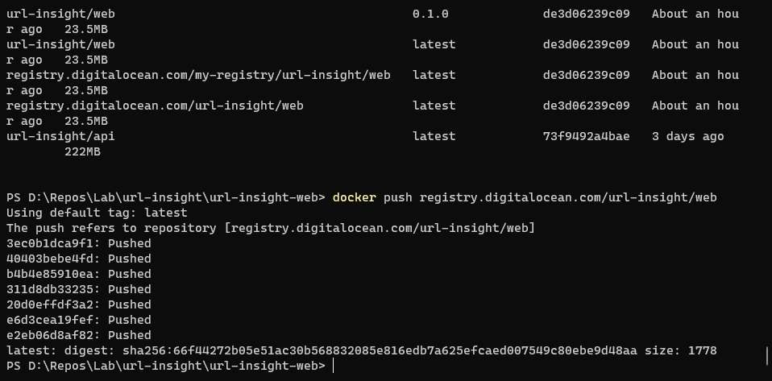

完成 Push 後，就可以在 Digital Ocean Container Registry 查到上傳的 Image 記錄。

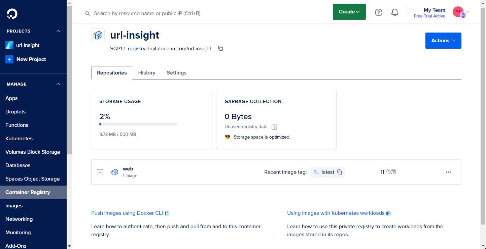

#### 變更使用的 Container Registry

在完成 `uri-insight/web` 的 Image 上傳後，繼續上傳 `uri-insight/api` 的 Docker Image 時，出現 `denied: registry contains 1 repositories, limit is 1` 錯誤。

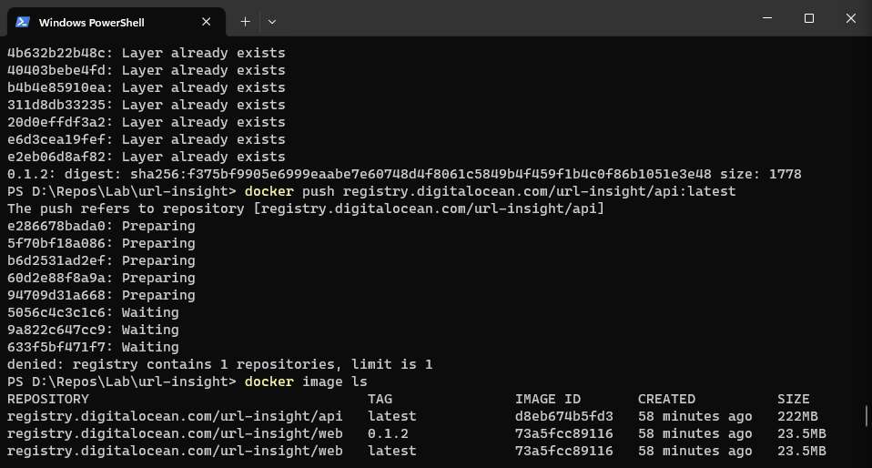

這時，我才發現犯了一個認知的錯誤。

原本查看 Digital Ocean 的 Registry 的免費方案時，以為 Digitial Coean 的 Starter plan 的 1 Repo，指的是 Project level 的 Repository。

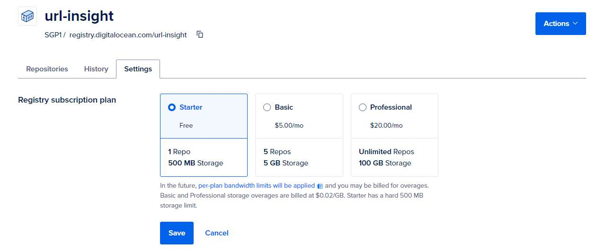

想說可以將實作的服務，`uri-insight/web` 與 `uri-insight/api` 兩個 Image，都上傳到同一個 Repo。

在實作使用時，才發現它指的是 Docker Image Repository，只要不同的 NAME，就會視為不同的 REPO。

所以 push 第二個 Docker Image 時，才會出現了 `denied: registry contains 1 repositories, limit is 1` 錯誤。


剛好，使用的版控的 Gitlab 平台，也有提供 Container registry，而且，在官方的 [GitLab Container Registry 說明文件](https://docs.gitlab.com/ee/user/packages/container_registry/)中提到，它們提供的 Private Container Registry 沒有數量限制。

所以決定移到 GitLab 這個 Unlimit Private Container Registry。

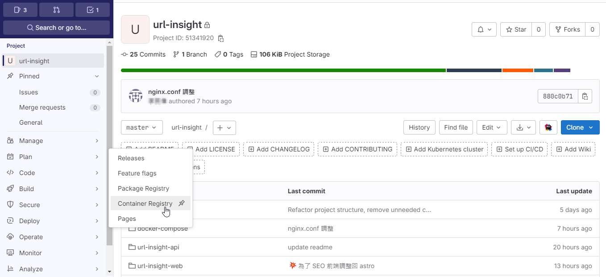

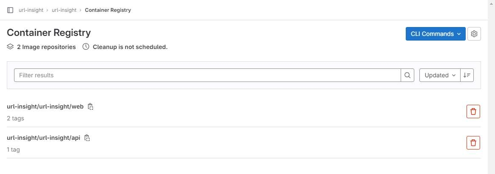

題外話，在 Container Registry 的呈現畫面，個人比較喜歡 Digital Ocean 的呈現方式

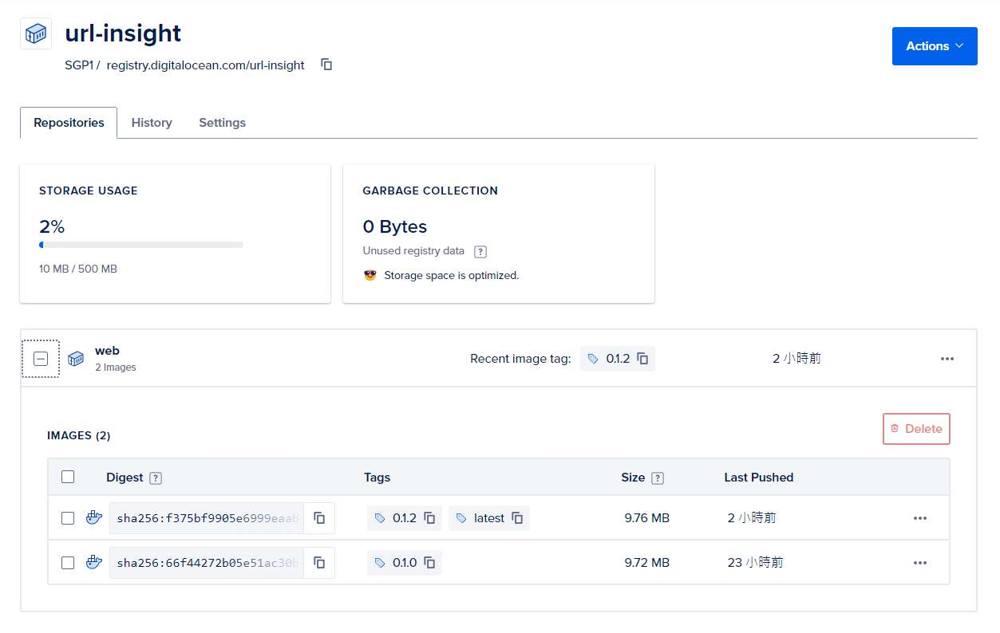

### 服務佈屬

在服務佈署的部份，在還沒有建立 CI/CD 流程之前。使用 `scp` 的指令，透過 SSH，將服務相關的 `*.yml` 與 `nginx.conf` 等檔案傳輸到服務主機。

```shell
# 單一檔案
scp [source-host:]<來源檔案> [帳號@target-host]:<目地檔案>

# 資料夾
scp -r [source-host:]<來源資料夾> [帳號@target-host]:<目地資料夾>
```

後續使用 `docker compose` 來建立 Container 時，需要從 Container Registry 下載所需要的 Docker Image。所以不要忘記先進行 `docker login` 的動作。

在 url-insight 的服務，`docker compose` 相關的 `.yml` 的設定與說明如下。

#### 網段設定

若想要使用 `docker compose` 來統一管理 Container 時，`docker compose` 會自動建立對應該 `.yml` 設定檔內 network。

```shell
sudo docker compose up -p proj -d
```

在上述的例子，因為指定 `docker compose` 啟動一個名為 proj 的專案，所以它在背後，會自行建立一個名為 `proj-network` 的 Docker network。

但在規劃中，希望啟用的 Container 分別歸屬於 `gateway`、`backend`、`ops` 這三個網段。所以需要進行以下的動作。

首先，手動建立使用的 network

```shell
docker network create ops
docker network create backend
docker network create gateway
```

接著，在 `docker compose` 使用的 `*.yml` 內，指定使用的網路下方，加入 `external: true` 指示，docker compose 就不會自建網址，而是使用外部已存在網路。

```yml
network:
	my-network:
		external: true
```

#### A. Web-Gateway: 作為站台與入口的 gateway 設定

使用 Nginx 作為反向代理，並設定 `nginx.conf`，讓所有的請求依 Domain 與路徑，指向 Astro/Vue 建立的靜態網站，或是 WebAPI 服務。

若是對 Nginx 組態不熟悉，也可以使用 Digital Ocean 提供的 NGINX Conig 設定工具 ([NGINXConfig](https://www.digitalocean.com/community/tools/nginx?global.app.lang=zhTW)) 或 [ChatGPT](https://chat.openai.com/)/[Claude.ai](https://claude.ai/) 來協助設定。

```yaml
version: '3'

services:

  web:
    image: registry.gitlab.com/url-insight/url-insight/web:latest
    restart: always
    ports:
      - 80:80
    volumes:
      - ./nginx.conf:/etc/nginx/nginx.conf:ro
    networks:
      -  gateway-web

networks:
  gateway:
    external: true
```

yaml 檔內使用的 `url-insight/web` 是以 Nginx 為基底，將 Astro/Vue 的靜態站台一併封裝。

重點在於 Mount `nginx.conf` 設定與指定使用外部已建立的網路 `gateway`。

#### B. Backend: 提供 Webapi 服務

Backend 網段，主要是 .NET 7 開發的 Web API(`url-insight/api`) 與 PostgreSQL 資訊所在的網段。

而 yaml 檔內的關注點如下。

- 使用 `expose` 來宣告 container 可使用的 port, 提供同 docker-network 的其他 container 連入。但無法從外面連入 Container。
- webapi 服務，同時身處 3 個 docker-network，其目的與 Container 間的資訊傳輸與 DNS 解析相關。

順帶一提，若 Container 內的應用程式，若是想要連到其他的 Container, 建議建立 docker-network，再配合 docker DNS 解析，簡單快速的達成目的。

在下述的 yaml 檔啟動的服務，在 webapi container 內的程式，可以透過 `postgres:5432` 的設定，順利訪問資料庫。

```yaml
version: '3'

services:
  webapi:
    image: registry.gitlab.com/url-insight/url-insight/api:latest
    restart: always
    expose:
      - 80
      - 443
    environment:
      - ASPNETCORE_ENVIRONMENT=Production
      - ConnectionStrings:${DB_ConnctionString}
    networks:
      - backend
      - gateway
      - ops

  postgres:
    image: postgres:16
    restart: always
    environment:
      - POSTGRES_USER=${PSG_USER}$
      - POSTGRES_PASSWORD=${PSG_PWD}
    expose:
      - 5432
    volumes:
      - postgres-data:/var/lib/postgresql/data
    networks:
      - backend

volumes:
  postgres-data:

networks:
  gateway:
    external: true
  backend:
    external: true
  ops:
    external: true
```

> 📢 題外話
>
> 在 Linux 在指定連線字串時，務必大小寫相同。因為個人習慣在 windows 上開發，沒注意到這個細節。
> 在佈置在 Ubuntu 與執行 Container，花了一些時間在排除這個問題。

#### C. Ops: 用於收集與監控系統資訊

Ops 網段，主要是負責管理所有與維運相關服務的網路。

```yaml
version: "3"

networks:
  grafana-ops:
    external: true

services:
  loki:
    image: grafana/loki:2.9.2
    ports:
      - "3100:3100"
    command: -config.file=/etc/loki/local-config.yaml
    networks:
      - grafana

  grafana:
    environment:
      - GF_PATHS_PROVISIONING=/etc/grafana/provisioning
      - GF_AUTH_ANONYMOUS_ENABLED=true
      - GF_AUTH_ANONYMOUS_ORG_ROLE=Admin
    entrypoint:
      - sh
      - -euc
      - |
        mkdir -p /etc/grafana/provisioning/datasources
        cat <<EOF > /etc/grafana/provisioning/datasources/ds.yaml
        apiVersion: 1
        datasources:
        - name: Loki
          type: loki
          access: proxy
          orgId: 1
          url: http://loki:3100
          basicAuth: false
          isDefault: true
          version: 1
          editable: false
        EOF
        /run.sh
    image: grafana/grafana:latest
    ports:
      - "3000:3000"
    networks:
      - grafana
```

但因為在規劃時，不希望對外開放於 Internet，但又需要讓維運人員可以藉由 Grafana 來查看目前系統狀態。

所以使用 SSH Tunnel 的方式，讓維運人員可以直接查看 Grafana。

簡單附上使用的語法，若要詳細用法，可參考補充資料。

```shell
ssh -L <-port>:<remote-host>:<remote-port> <user>@<remote-host>
```

## 補充資料

▶ 站內文章

- [縮網址服務實作記錄(2) - 基於 Container 的 Let's Encrypt 申請與設定](../shorten-2-lets-encrypt-setting/index.md)

▶ 外部文章

- [Ubuntu - 《Docker —— 從入門到實踐 ­》正體中文版](https://philipzheng.gitbook.io/docker_practice/install/ubuntu)
- [Ubuntu Server 20.04.1 預設 UFW 防火牆 Firewall 設定規則詳解和教學](https://footmark.com.tw/news/linux/ubuntu/ubuntu-server-ufw/)
- [關於 SSH Tunnel 連線 (SSH Proxy, SSH Port Forwarding) - 技術雜記 Technology Notes - Jack Yu | 傑克](https://yu-jack.github.io/2019/01/08/ssh-tunnel/)
- [SSH Tunneling (Port Forwarding) 詳解 · John Engineering Stuff](https://johnliu55.tw/ssh-tunnel.html)
- [How to Fix SSH Permission Denied (Public key) Error](https://www.tecmint.com/ssh-permission-denied-publickey/)

▶ 參考連結

- [2023 VPS 主機價格評比：Linode, Vultr, DigitalOcean, OVH - TerryL](https://terryl.in/zh/best-pricing-vps/)
- [學習 VPS 的重要性與各大 Linux VPS 比較與推薦 (Linode, DigitalOcean, Vultr, AWS Lightsail)](https://progressbar.tw/posts/131)
