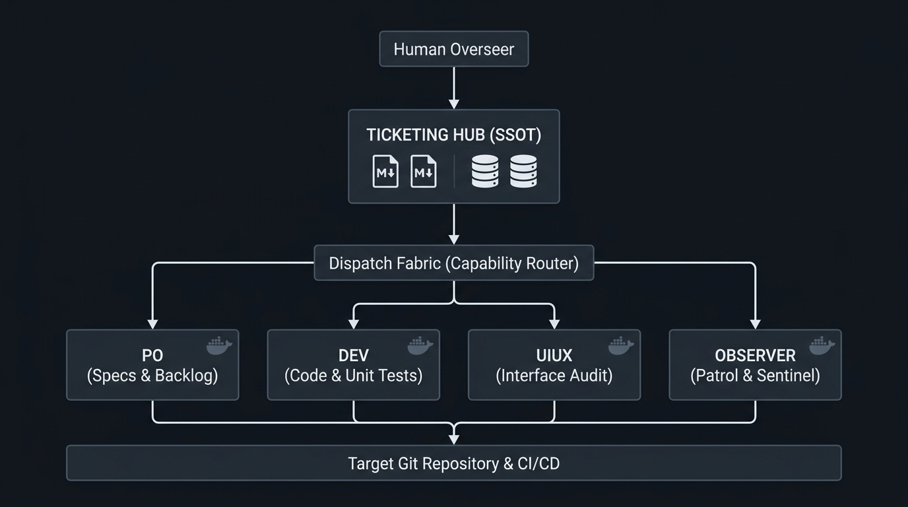

> 🔖 長話短說 🔖
>
> - **這是什麼**：一個人怎麼用自己寫的一套票務系統，加上自己寫的一套派工引擎，帶一組會自己接活、自己回報、偶爾還會出包的 AI persona——真的有種在帶團隊的錯覺。
> - **這系列在講什麼**：不是「AI 幫我寫程式」這種老掉牙的題材，是「AI 有自己的帳號、自己的權限、自己的工作紀錄，像員工一樣被管理」這件事，實際做起來長什麼樣子。
> - **誠實揭露**：系列裡有幾篇會直接講「這個設計我還沒做完」「這個決策後來被自己推翻」，不是每篇都是漂亮的成功案例。
> - **跟我 3 月那篇〈AI 發展脈絡與工程師角色的轉變〉的關係**：那篇講的是「工程師要從實作者變成管理者」這個判斷，這系列是把那個判斷真的做出來之後，發生的所有事。

3 月那篇文章寫完之後，我一直在想一件事：如果工程師的角色真的要往「管理 AI 團隊」的方向走，那具體要管什麼？怎麼管？這個問題沒辦法光靠空想，而是在現實的多專案工作中被徹底逼出來的。

當時我手頭上同時有兩到三個專案在並行。如果每一個專案我都開著終端機、坐在螢幕前用「互動式對話（Interactive Session）」一句一句陪 AI 寫程式碼、看著它一行行吐出來，我個人的時間與注意力立刻就被鎖死在單線程上，產能完全被卡死。

但我發現，其實很多功能的需求與規格已經非常明確，根本不需要人類隨時坐在旁邊當伴讀書僮。如果規格很清楚，為什麼不能像派工給工程師一樣，把任務非同步丟給 AI，讓它自己去沙盒裡開分支、寫程式碼、跑測試、送 PR 回報？

這是一人公司在物理時間限制下，唯一能讓多專案同時併行的解法。如果這套機制在最複雜的軟體開發與測試上能跑通，未來要複製到營運、資料分析等其他業務場景，也只是遲早的事。

於是我把手上原本用來管理工作的專案管理工具，整個重寫成一套自己設計的票務系統，再搭一套專門派工給 AI 的引擎，讓好幾個 AI persona 即時接票、幹活、回報，偶爾還會出包。看著它們忙進忙出，真的有種在帶團隊的錯覺。這系列文章，就是這幾個月做下來的完整記錄。

<!--more-->

## 一切是怎麼開始的：從 Plane 到自己刻票務系統

最一開始，為了解決這種單線程阻塞的困境，我嘗試搭建了一套以 Claude Code 為核心、串接專案管理工具 **Plane** 與開源設計工具 **Penpot** 的非同步協作模式（也就是 `Plane ⟵ Claude Code ⟶ Penpot` 的三角形協作）。

當時的運作模式很單純：我在 Plane 上開出規格明確的工作項目，讓 Claude Code 直接對接 Penpot 讀取設計稿與介面規格並動手實作。每派完一個任務，我就可以轉頭去處理另一個專案的事情，每隔十幾分鐘再回頭看一次進度與回報，讓 Claude Code 在執行的過程中把成果記錄回 Plane 的票據裡。

但隨著使用時間變長，幾個很實際的痛點浮了出來：

- **查詢篩選失效與龐大雜訊**：Plane 的查詢 API 悄悄吃掉了狀態與指派人篩選條件，表面上回傳 HTTP 200，私底下卻永遠回傳 120 筆以上的全量資料。當多個 Agent 排程巡檢時，每一次都把全量資料拉回本機比對，單次就白燒了 26 萬 Token。加上工具本身是為人類設計的，富文本 JSON 裡塞滿了各種人類看著舒服、但對 AI 來說完全是干擾的排版資料。
- **權限模型卡死自己**：舊工具的成員權限只有 WorkspaceMember 與 ProjectMember 兩層，新開的 Agent 帳號因為不是專案成員無法開票，而加成員又需要管理員權限；加上多個 Agent 共用同一把 Admin API Key，導致工單的稽核日誌（Actor）被嚴重污染，完全分不清這句話是誰說的。

那時候我也試過市面上其他工具，例如 Linear，初步試用確實覺得設計得很好、很流暢；但用著用著，總覺得有些底層操作的自由度還是受限。

我知道在軟體工程裡，重新造輪子、自己刻一套既有的專案管理工具，通常被認為是蠻浪費時間的事。然而在 AI 時代，開發與迭代的邊際成本已經徹底改變，這反而成了一個難得的契機——讓我們不用再去遷就那些原本為人類設計的舊框架，而是能從第一天起，就為 AI 團隊打造最契合的資料模型。

一個念頭就此冒了出來：**我是不是乾脆自己寫一套票據系統？**

這套系統在專案內部暫定代號為 **Waypoint**（一套專為 AI 打造的單一真實來源票務系統）。在架構設計上，它有幾個非常明確的核心目標：

1. **單一真實來源（Single Source of Truth, SSOT）**：統一使用標準 CommonMark Markdown，消滅 API 與 UI 的格式落差，資料模型乾淨，只留下 AI 與人類真正需要的任務資訊。
2. **預設安全的 API 與精準查詢**：支援多層條件 AND 組合篩選、輕量計數（Count-only）與增量查詢，將查詢的 Token 浪費直接砍掉 70% 以上。
3. **原生支援 Agent 身分與憑證**：資料模型原生區分 `Human` 與 `Agent`，每個 Agent 配發專屬的 `AgentCredential`，具備最小權限範圍（Scope）、生命週期與輪替機制，讓每一次工單留言與狀態流轉都有精確的稽核紀錄。

## 派工引擎的演化：從單純 Webhook 到 Capability Fabric

有了票據系統作為單一真實來源之後，下一步是「怎麼把票派給 AI 做」。

一開始的想法非常陽春：只寫了一個簡單的 Webhook 接收器，拿到票據發出來的通知後，直接在自己的電腦（Host）上啟動一個 Claude Code session 去幹活。

但隨著需求延伸，我希望能以 headless agent 無頭代理人的方式全自動處理任務，這時候直接跑在 Host 上的做法立刻撞到了兩堵大牆：

1. **改壞東西的恐懼（缺乏安全邊界）**：在本機直接執行，代表 Agent 可以碰得到個人電腦裡的全部資料與其他專案。因為是放手讓它自動修改程式碼，萬一它哪天邏輯跑偏、改到不該改的系統設定或目錄，真的會讓人後悔莫及。
2. **恐怖的 Token 浪費**：Claude Code 本身的機制，在啟動時會去掃描並載入機器內所有全域設定的 Skill 與 MCP 工具。但對於某個特定的開發任務來說，它根本不需要載入這十幾種八竿子打不著的工具。全量載入的結果，是每一次派工光是起手式的 Context 就肥大無比，Token 燒得觸目驚心。

為了解決這兩件事，我開始打造專門的派工與執行架構——**Capability Fabric（能力織網派工引擎）**。

我們把每個 Agent 塞進獨立的 Docker 容器做環境隔離，並且依據任務角色，**在容器啟動時才動態注入該角色專屬的 Skill 與 MCP 工具白名單**，不再讓全域工具污染 context。

等回過神來的時候，這個架構已經越做越大。但也是從這時候開始，專案進入了真正的 **Dogfooding（自己吃自己的狗糧）** 模式：當基礎架構建立起來之後，後續整個系統的開發、Bug 修復與功能擴充，全都是我透過系統開票、派工給這些容器裡的代理人，讓它們自己去改自己系統的程式碼、自己送 PR 回報。

不過在實際開發過程中，還是會撞上一個很根本的現實：**系統基礎架構本身的故障**。當底層設施出問題、連線或派工機制卡死時，你根本沒辦法把任務派出去或觸發這些 headless agent 無頭代理人——因為「用來派工的管道」本身就是壞的。在這種時候，就不能指望無人值守的自動化，依然必須靠著我自己開啟「互動式 session」去介入排查與救火。也正是因為需要有人在旁邊盯著整個系統基礎設施的健康狀態，才在後面的架構裡催生了那個專門巡邏、只看不動手的「觀察者（Observer）」角色。

### 系統協同架構：票據中樞與派工引擎

為了讓這群 AI 員工能安全、精確、低浪費地協同作戰，整套系統的核心運作拓撲如下：

#### 系統拓撲雙軌說明清單

1. **單一真實來源（Ticketing Hub / 代號 Waypoint）**：所有任務、規範與討論統一收斂於此。拋棄肥大的富文本格式，純粹以 CommonMark 作為人類與 Agent 的溝通介面；每個 Agent 持有獨立憑證與生命週期，消滅身分冒用與日誌污染。
2. **派工中樞（Dispatch Fabric）**：負責解耦任務事件與執行個體。依據任務指派的角色，動態拉起獨立的沙盒容器，並**只注入該角色所需的最小工具集（Skill / MCP 白名單）**，將起始 Context 膨脹降至最低。
3. **沙盒化角色矩陣（Docker Sandboxes）**：每個 Persona 擁有專屬的容器邊界，徹底隔絕個人主機目錄與敏感環境變數；各角色恪守職責邊界，各司其職。

### 技術選型決策矩陣：逼我做出轉變的個人決策臨界點

或許有人會好奇：「用既有的 Linear、Notion 加上 Claude Code 寫排程腳本不也能跑？為什麼我非要自己刻一套？」

這不是為了追求技術炫技，而是**我在多專案實戰中，被痛點逼出來的個人決策臨界點（Critical Threshold）**。以下是我在評估轉型時，自己所對照的取捨維度：

| 評估維度 | 階段一：我一開始的做法（SaaS 既有工具 + 本機直接執行） | 階段二：我最終選擇的架構（自建 Waypoint + 容器化 Fabric） | 逼我做出轉變的個人決策臨界點 (Why I Shifted) |
| :--- | :--- | :--- | :--- |
| **資料模型與 Token** | 充斥富文本排版雜訊，API 易全量回傳，每次巡檢浪費數十萬 Token | 純淨 CommonMark Markdown，支援輕量計數與精準增量查詢，Token 節省 70%+ | **當我開始掛載定時巡檢 Agent**，看到單次巡檢白白燒掉 26 萬 Token、費用顯著上升的那一刻 |
| **身分與稽核日誌** | 全員共用單一 Admin API Key，工單 Actor 嚴重混亂，責任難追溯 | 原生區分 Human / Agent，專屬憑證最小權限與輪替機制 | **當我同時指派 2 個以上不同職責的 Agent**，卻完全分不清是誰留下哪條留言、日誌被嚴重污染時 |
| **執行安全防護** | Agent 直接在 Host 本機執行，具備完整目錄存取權，隨時有改壞環境的風險 | 獨立 Docker 容器嚴格沙盒化，目錄與環境變數嚴密隔離 | **當我想要放手讓 Agent 進行無人值守（Headless）派工、自動改程式碼發 PR**，本機直接執行讓我無法放心時 |
| **Context 純淨度** | 全量掃描並載入本機所有全域 Skill 與 MCP 工具，初始 Context 肥大 | 依角色動態注入專屬白名單，徹底消滅無關工具干擾 | **當我發現 Agent 因為載入太多無關工具導致 Context 過載**，開始出現注意力渙散與幻覺時 |
| **維護與建置成本** | 🟢 **極低**（開箱即用，依賴現成產品） | 🔴 **高**（需自行維護 API、派工排程與容器基底） | 如果只是單純偶爾輔助寫程式，停在階段一最划算；**但既然我決定要建構一套長期營運的一人研發團隊**，階段二就是我必須付出的代價 |

## 不是隨選隨丟的短工，而是長期任用的員工

在帶著這組 Agent 持續開發的過程中，我慢慢發現：**多代理人的設計，本質上就是組織架構設計**。

過往使用 Agent 時，大多是開啟視窗，進行討論與指派任務，完成後就直接將視窗(Session) 關掉。就是是一個隨叫隨到的臨時工——開個視窗問兩句，用完把視窗關掉，下一次又是全新的白紙。但我希望從「公司招聘員工」的角度來看待這些角色：

- 他們不是臨時雇傭，而是**長期在系統中運作的正式員工**。
- 每個員工有專屬的職責範圍（例如 PO 負責釐清需求，Dev 負責工程實作，UIUX-IA 負責介面審查，Observer 負責巡邏）。
- 他們要在這個工作環境中累積可以複利的資產，而不是每一次派工都讓整個系統從零重來。

也因為這樣，我後續花了相當多時間在研究 Agent 的自我成長與行為約束，這也是為什麼這套系統最後長成了一個由票務、派工、容器、角色憲章組合而成的體系。

## 最大的隱形成本：資訊落差導致的重工與返工

在透過 AI 持續進行日常開發的過程中，最折磨人的往往不是「某個 bug 解不掉」，而是我之前在寫 AI 治理與知識管理時深刻體會到的一件事：**程式碼現況與文件記錄的嚴重脫節**。

這件事並不是紙上談兵的理論，而是在實戰中被反覆炸出來的血淚：

- 很多時候，Agent 跑得很快，程式碼改了一輪又一輪，但設計文件與票據上的說明卻留在原地沒人更新。
- 下一個接手的 Agent（甚至是隔天回來的我自己），看著過期的文件做判斷，結果就是產出完全偏離現況的程式碼。
- 這種資訊落差不僅僅是白白燒掉昂貴的 Token，更讓我花費了極其龐大的時間成本，在程式碼底層與文件記錄之間反覆比對、抓狂通靈：「為什麼現在跑的代碼，跟文件上寫的完全是兩回事？」

這種「因為資訊不同步而帶來的重工與返工」，成了整個系統在設計防護邊界、維持文件與程式碼同步時，最核心想根治的問題。

### 我不是在寫程式，而是在建立系統規範

被文件過期與反覆重工痛擊之後，我才徹底想通了一件事：**帶領 AI 團隊的本質，不是每天自己動手寫程式碼，而是建立一套嚴謹的系統規範與框架，讓所有 Agent 有所依據去做事。**

不管是開在票據系統上的工單與留言，還是 Git 儲存庫 `docs/` 底下隨時都在變動的規格文件，文件的精準度直接決定了 AI 的產出品質。

為了徹底解決「人類讀得吃力、AI 讀了通靈」的雙重困局，我深入研究並導入了兩套在國外技術寫作領域非常成熟的規範：

1. **Diátaxis 架構體系**：將文件嚴格區分為操作指南（How-to）、架構解釋（Explanation）與規格參考（Reference），徹底消除文件類型的混淆。
2. **ASD-STE100 簡明技術寫作（Simplified Technical English）思維**：借鑑航太工業嚴謹的手冊規範，消滅模稜兩可的語意與模糊詞彙，用極其精確、單一解讀的語言定義行為規則。

這套規範帶來了一個非常實在的改變：

- **對人類而言**：結構清楚、閱讀成本很低，一眼就能看懂文章在講什麼。
- **對 AI 而言**：拿到的 Context 乾淨、精準，不需要額外燒 Token 去猜測上下文。就像工程師要從幾千行未結構化的 raw log 裡撈出關鍵錯誤極度費時一樣，你丟給 AI 一堆雜亂模糊的文件，它也只會浪費 Token 去解讀雜訊，甚至吐出充滿幻覺的程式碼。

## 為什麼拆成這 11 篇系列？

說來有趣，催生這整個 11 篇系列的直接引信，其實來自一篇外部文章。

在動筆寫這系列之前，我偶然讀到了探討 AI 工程落地思維的討論文章《別急著打造你的 Devin》（其核心主張正是：*Buy the intelligence. Build the environment. Own the feedback loop.* —— 買智能、蓋環境、自己顧好回饋迴路）。讀完當下最大的感受不是別的，而是一種「原來也有人跟我在做一樣的事情」的強烈共鳴——有一種**吾道不孤**的踏實感。

原來我過去幾個月在戰壕裡為了解決多專案單線程瓶頸、跌跌撞撞摸索出來的票務中樞與沙盒容器，竟然在無意間呼應了這套 Harness 六層架構的思維，甚至不知不覺已經實作了前四層。雖然彼此在實作細節、切入方向與回饋機制上不盡相同，但底層的核心本質卻高度一致。既然這條探索之路並非自己憑空瞎想、方向也是對的，那麼**提前排程把這些實戰經驗梳理成系列文章**，不再讓它們沉睡在個人筆記與 Git commit 裡，就成了一個非常值得的決定。

因為這一路走來，技術細節實在太深、踩過的坑也實在太多了。從舊工具的查詢陷阱、容器方案的捨棄、憑證險些全滅的事故，到角色邊界的收斂，任何一個主題拉出來都值得單獨好好講清楚。

目前這套系統依然在內部持續運作與打磨。等整體架構與驗證機制演進到更成熟的階段時，我也會將這套方案開源，提供給社群作為參考。

而這系列文章，就是把這段從零摸索到日常落地的完整過程攤開來。**帶一個 AI 團隊，本質上不是在考驗提示詞技巧，而是在考驗軟體架構與組織邊界的設計功力。** 當我們給予 AI 足夠清晰的邊界、乾淨的資料來源與獨立的執行沙盒時，它才會從一個「需要人類隨時盯著的臨時工」，真正轉變為「能與你並肩作戰的可靠員工」。希望這些實戰踩坑記錄，能讓想嘗試組建自己 AI 團隊的開發者，少走幾次回頭路。

---

## 系列文章架構與各篇導覽

這 11 篇文章依據實務推進的脈絡，大致可分為四個部分：

### 一、基礎與架構設計（01～03 篇）

從「為什麼既有工具不合用」開始，說明資料模型與執行環境的底層抉擇：

- **01 為什麼自己寫一套 Ticketing 系統給 AI 用？**  
  從舊工具 API 偷偷忽略篩選條件、回傳 HTTP 200 害我白燒 26 萬 Token 的痛點，談為什麼需要一套「每一條 API 都強制權限檢查、資料模型讓 AI 自己看得懂」的票務系統。
- **02 Harness 到底是什麼？我怎麼讓一支現成的 AI 助理變成能派工的員工**  
  拆解派工引擎（Capability Fabric）內部的四層架構與通用任務契約（TaskEvent / TaskResult），以及一場對話配一個容器的生命週期取捨。
- **03 容器化怎麼選？我為什麼放棄了看起來最潮的方案**  
  盤點手上的假隔離機制，為什麼社群上最熱門的方案不符合我的威脅模型，最後如何回歸既有且穩定的做法。

### 二、憑證、工具與設定（04～05 篇）

AI 員工要開始動手，鑰匙怎麼給、工具怎麼配是第一道防線：

- **04 憑證怎麼給 AI 員工？憑證管理設計，以及一次差點讓整個系統啞掉的鑰匙事故**  
  憑證只存指標不存明碼。記錄憑證保險箱的設計，以及一次動態解析錯誤差點讓全體 Agent 集體失聲的事故復盤。
- **05 派工引擎怎麼設定與優化：從工具健檢到跨機連線**  
  工具不是掛越多越好。記錄工具白名單的收斂、跨機連線的網路微調，以及如何避免過多 MCP 污染 context。

### 三、組織分工與邊界治理（06～07 篇）

分工的價值不是產能加倍，而是保護每個角色的判斷力：

- **06 一人公司怎麼帶團隊？PO、Dev、UIUX-IA、Observer 的角色分工實戰**  
  目前實際運作的五個角色職責劃分。分享三條實際踩坑後定下來的硬規則，包括為什麼「PO 絕對不能讀原始碼」。
- **07 我發明了一個「只看不做」的角色：Observer 巡邏規則邊界的演化史**  
  為什麼需要一個完全不碰程式碼的旁觀者？巡邏規則如何從過度熱心收斂到精準的異常熔斷警報。

### 四、運維血淚、溝通與反思（08～11 篇）

系統上線後的災難復原、溝通成本與自我檢視：

- **08 一場基礎設施復原記：資料庫救回來了，Volume 不見了，連 Session 也斷了**  
  換機器那天最慘痛的教訓：只搬了資料庫、漏了 Docker volume，導致狀態全面脫鉤後的救火全紀錄。
- **09 「已完成」不是一則好留言：跟 AI 團隊溝通的兩個方向**  
  它回報得太少像黑箱，我交代得太多又限制了彈性。探討指派任務與驗收回報時，如何收斂出資訊對稱的溝通方式。
- **10 一直在動的文件，怎麼不要壞掉？frontmatter、拆檔案、文件過期**  
  給 AI 讀的規範文件會隨時間腐化。記錄如何導入 Diátaxis 框架與 ASD-STE100 簡明思維，用最低閱讀成本讓人類秒懂、讓 AI 拿到零雜訊 Context，防止過期文件變成錯誤決策的溫床。
- **11 讀完《別急著打造你的 Devin》才發現，我已經做到一半了**  
  拿業界文章提倡的六層架構回頭審視自己。做對了前四層，但也誠實指出自己「完全缺乏系統性驗收（Evals）」的具體缺口與代價。

---

## 系列各篇一覽表

| 篇 | 標題 | 一句話重點 |
| :--- | :--- | :--- |
| **01** | 為什麼自己寫一套 Ticketing 系統給 AI 用？ | 從舊工具的痛點，到「讓 AI 自己看得懂」的資料模型設計 |
| **02** | Harness 到底是什麼？ | 怎麼把一支現成的 AI 助理變成能派工的員工 |
| **03** | 容器化怎麼選？ | 我為什麼放棄了看起來最潮的方案 |
| **04** | 憑證怎麼給 AI 員工？ | 憑證管理設計，以及一次差點讓整個系統啞掉的鑰匙事故 |
| **05** | 派工引擎怎麼設定與優化 | 從工具健檢到跨機連線 |
| **06** | 一人公司怎麼帶團隊？ | PO、Dev、UIUX-IA、Observer 的角色分工 |
| **07** | 我發明了一個「只看不做」的角色 | Observer 巡邏規則邊界的演化史 |
| **08** | 一場基礎設施復原記 | 換機器那天，資料庫救回來了，連 Session 也斷了 |
| **09** | 「已完成」不是一則好留言：跟 AI 團隊溝通的兩個方向 | 它回報得太少，跟我指派時說得太多，是同一個問題 |
| **10** | 一直在動的文件，怎麼不要壞掉？ | frontmatter、拆檔案、Diátaxis 與文件過期治理 |
| **11** | 讀完《別急著打造你的 Devin》才發現，我已經做到一半了 | 回頭檢查自己的架構決策與未竟之處 |

大部分文章會互相引用，建議照順序讀；但如果只對特定主題有興趣（例如權限設計、角色分工或災難復原），每一篇也可以獨立當作一篇實戰紀錄來看。

---

## 延伸閱讀

▶ 站內文章

- [AI 發展脈絡與工程師角色的轉變：從扮演專家到 Sub Agent 團隊協作](../../../transformation-of-engineer-role-in-ai-evolution/index.md)：這系列的起點，先讀這篇會更清楚為什麼要做這件事。
- [AI 高速開發時代的治理挑戰：真正的瓶頸不是 AI 速度，而是人類的認知極限](../../../ai-development-governance-and-context-hygiene/index.md)：探討當 AI 產能無限放大時，架構審查與知識同步所面臨的心智承載瓶頸。

▶ 外部參考：Agentic Engineering 系列（fantasybz）

- [別急著打造你的 Devin：Agentic Engineering 的組織策略與 90 天行動藍圖](https://fantasybz.medium.com/別急著打造你的-devin-agentic-engineering-的組織策略與-90-天行動藍圖-7342ababc417)
- [Agentic Engineering 三部曲（一）誰來做：Platform + Federation 的組織設計實務](https://fantasybz.medium.com/agentic-engineering-三部曲-一-誰來做-platform-federation-的組織設計實務-9d9353ef7f3a)
- [Agentic Engineering 三部曲（二）Harness 藍圖：把系統變成 Agent 讀得懂的地方](https://fantasybz.medium.com/agentic-engineering-三部曲-二-harness-藍圖-把系統變成-agent-讀得懂的地方-f2a139f5b561)
- [Agentic Engineering 三部曲（三）Eval、單位經濟與規模化：把 Agent 當產品營運](https://fantasybz.medium.com/agentic-engineering-三部曲-三-eval-單位經濟與規模化-把-agent-當產品營運-d6d9623c2dc6)
