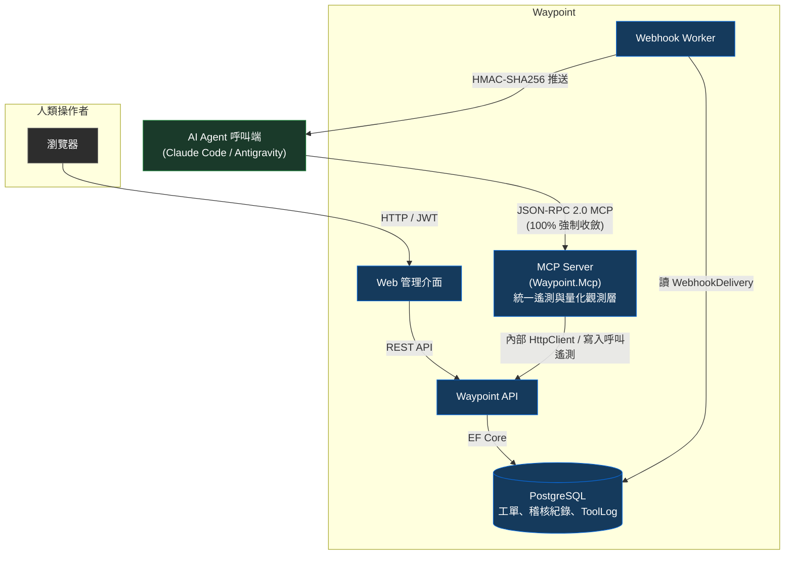
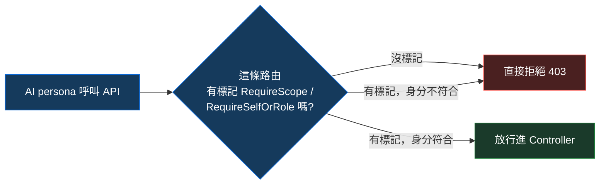
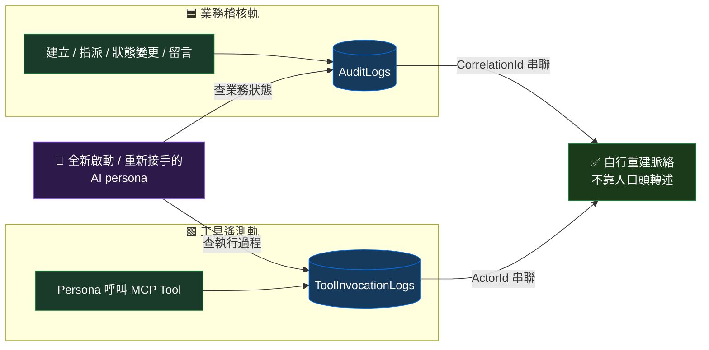
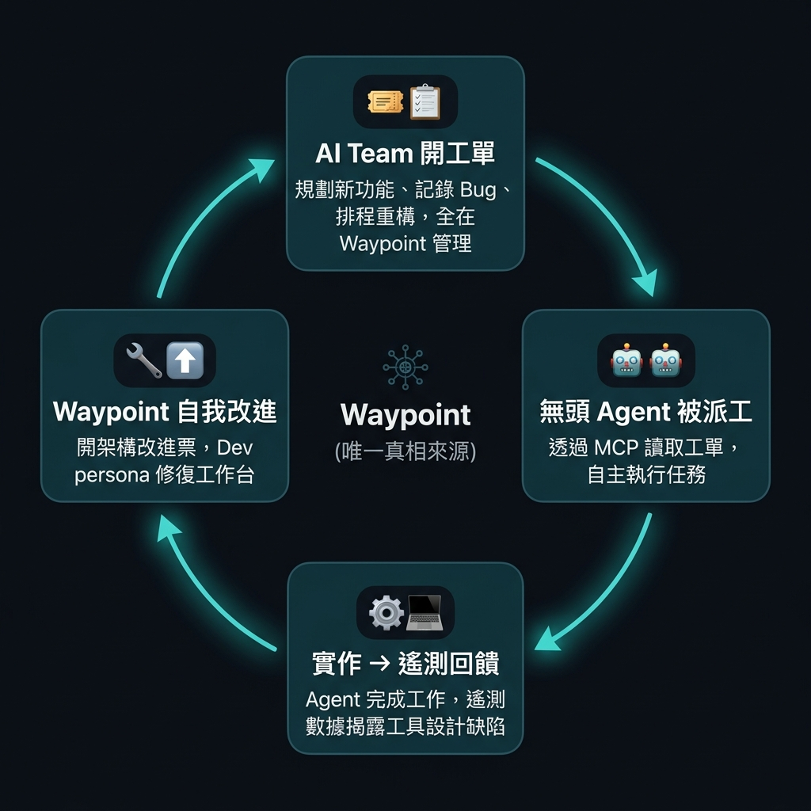

> ℹ️ 系列導讀：本文屬於[「一人公司，一組 AI 團隊」](../solo-company-ai-team-overview/index.md)系列第 01 篇，探討當專案管理工具的使用者從「真人」切換為「高頻呼叫 API 的 AI Agent」時，為何我不繼續在既有開源工具上修補，而是親手打造一套專為 AI 打造的票務系統 Waypoint 的架構決策與實戰痛點。

> 🔖 長話短說 🔖
>
> - **使用者與場景切換**：當專案管理工具的使用者從真人點擊換成高頻呼叫 API 的無狀態 AI Agent，篩選失效、權限死結與身分冒用等隱性地雷接連爆發。
> - **後端過濾省下 70% Token**：原本無效的查詢 API 導致 5 個 Agent 單輪查詢燒掉 26 萬 Token，透過後端精準過濾收斂至 7 萬 Token。
> - **Fail-Closed 授權與 NetArchTest 架構防線**：預設拒絕未授權存取，並透過架構單元測試在 CI 階段封鎖 AI 隨意放寬權限的可能。
> - **雙軌日誌與強型別關聯**：業務稽核日誌與工具呼叫日誌雙軌落地，讓重啟的無狀態 Agent 能像看重播一樣零依賴自行重建脈絡。
> - **架構守門人的工程底蘊**：不親自寫任何一行程式碼，反而更考驗架構邊界、分層與自動化測試能力，維持人機協作的動態平衡。

<!--more-->

## 當專案管理工具的使用者換成 AI

一開始選擇 [Plane](https://github.com/makeplane/plane) 的理由很單純：它是開源軟體（Community Edition），可以直接自託管，資料放在自己手裡比較踏實。而且在實際使用的過程中，它介面操作的手感也確實相當不錯——開幾張票、在看板上拖拉、整理手邊的工作進度，在一般正常的人類使用情境下，體驗相當順手。

當時我的真實需求其實很明確：我手邊同時有好幾個專案要處理，極度需要一套票據系統把這些複雜的事情與上下文清清楚楚記錄下來。那時候我心裡琢磨著一個很大膽的構想——「我能不能透過票據系統，在同一台電腦裡『同時並行開發 3 個以上的專案』？」

我的理想圖景是：讓 Agent 根據我的想法自行去作業、自動拆解並建立工單，然後 Claude Code 可以依據這些工單資訊去進行程式碼開發、執行測試並更新狀態。當然，萬丈高樓平地起，第一步先從「單一專案的深度結合」開始摸索。

既然現成的 Plane 操作手感好又是開源自託管，最直覺的想法自然就是直接拿它來串接這套自動化流程，根本沒想過要自己重造輪子。

但當真正的使用者從「我自己拿滑鼠在瀏覽器上點」，換成「好幾個 AI 角色天天發 API 高頻呼叫」之後，故事的走向就完全不一樣了。在讓多個 AI persona 協同作業的這段時間裡，各種意料之外的狀況接連發生。這篇先聊其中最根本、也最直接推動架構決策的三個核心問題。

再次強調，這三個問題並不是 Plane 本身有什麼缺陷，而是它的設計初衷本來就是為了「人類透過介面操作」。當你把它交給一群高頻呼叫 API 的無狀態 AI 時，使用場景上的根本差異就逐漸浮出水面了。

### 篩選參數失效與 Token 成本

事情是從一個很無聊的懷疑開始的。我讓幾個 AI persona 各自去查自己的待辦，結果每次查回來的量都差不多，感覺不太對——好像不管傳了什麼篩選條件，拿回來的都是全部的票。

派了一個角色去單獨驗證，結果證實了那個懷疑：那套工具（[Plane](https://github.com/makeplane/plane)，一套在人類團隊中相當優秀且活躍的開源專案管理工具）的查詢 API `assignees`、`state`、`assignees__in`、`state_id` 這些參數確實接得進去，伺服器也回傳了 HTTP 200。在網頁介面上，前端元件可能透過其他邏輯把資料渲染得很完美；但對純 API 呼叫端而言，這些條件在後端查詢中並沒有生效，回傳的永遠是專案的全部工單（當時剛好 120 筆）。

這件事在人類使用時完全不是問題——人眼在畫面上隨手點選切換分頁，甚至感受不到背後抓了多少筆資料。

但換成好幾個 AI 角色各自獨立、高頻率地呼叫同一支 API 時，這個差異立刻被放大成看得見的成本：五個角色各自獨立查一次自己的待辦，就算查到的結果是零筆，每一次呼叫都還是要付一次完整的固定 Payload 成本——加總下來大概二十五到二十六萬 Token。後來改成只發一次查詢把全部票抓回來，同一輪裡自己依身分再過濾，總成本降到 71,175 Token，省了大約七成。

如果今天背後的資源像大企業一樣火藥庫充足，這幾十萬 Token 的浪費我可能根本不會那麼在意，眼睛閉著也就過去了。但偏偏作為一人團隊，我沒有那個本錢去揮霍——每一筆 API 帳單都是自掏腰包的真金白銀。正因為預算有限，我三不五時就會神經敏感地去審視後台 Token 的消耗曲線，定期排查哪裡的呼叫又在默默燒錢、有沒有更好的最佳化與精簡空間。

平心而論，Plane 作為一套功能完整的現代專案管理系統，裡面還有非常多更深入、更進階的功能（像是週期衝刺、甘特圖排程、多維度自訂屬性等），坦白說我還沒有機會深入去全面了解。但在前面 Token 異常消耗這件事情上，實實在在地讓我狠狠提起了警覺——當最基礎的工單列表查詢都在默默抽乾你的 Token 預算時，後續那些龐大而複雜的功能，反而讓我不敢貿然交給自動化 Agent 去隨意碰觸。

這個數字對我來說是一個關鍵的認知轉折：這不是工具寫得不好，而是它最初設計的目標場景，根本不是為了給一群無狀態的 AI Agent 反覆高頻查詢。在人類為主的介面中，篩選在前端做或後端做差別不大；但在多 Agent 的自動化協作裡，每一個 API 的行為都會直接牽動 Token 成本。這也是後來設計新系統時，我堅持「查詢端點從第一天就要支援精準的後端條件過濾」的直接原因。

### 權限模型的「真人操作」假設

第二個踩到的雷，是權限模型。

那套工具的成員權限分兩層：一層是比較寬鬆的 `WorkspaceMember`，可以做一些基礎操作；另一層是 `ProjectMember`，建立票務這種核心操作需要這一層的身分。問題是，我幫六個 AI persona 開的帳號，一開始全部只停在 `WorkspaceMember` 這層——結果是六個角色連建一張票都做不到。

正常情況下這只是補一下權限而已，呼叫一支「加入專案成員」的管理 API 就能解決。但這支 API 本身又要求呼叫者自己必須已經是 `ProjectAdmin` 等級——而我自己名下所有能用的 Token，剛好在更早之前因為別的原因被我軟刪除掉了，一顆能用的 Admin Token 都沒有。結果就是一個死結：修好這六個帳號權限所需要的那把鑰匙，根本不存在。最後只能認賠，回到網頁介面手動用最原始的帳密登入，重新產生一把能用的 Token。

這件事讓我意識到一個更根本的問題：這套權限模型的每一個環節，骨子裡都假設「操作者是一個會自己打開瀏覽器、自己點頁面的人」。一旦你把使用者換成一批全部靠 API 呼叫運作、彼此獨立、數量還可能繼續增加的 AI 帳號，任何一個「卡住了就回網頁手動修」的隱性假設，都會變成一個真正的斷點——沒有人在後面隨時盯著畫面，斷點不會自己被看見，只會安靜地卡住，直到某個角色的任務失敗才會被發現。這也是後來設計新系統時，我要求「這個角色能不能碰這筆資料」這件事必須是程式碼層級的強制檢查，而不是靠介面操作習慣去維持的原因。

### 稽核紀錄的身分污染

第三個問題的影響最深遠，因為它動搖的是協作系統中最基礎的信任。

每個 AI persona 各自有一把獨立的存取金鑰。理論上這樣就能區分「這則留言、這次狀態變更，是哪個角色做的」。

但實際運作下來，用錯金鑰的狀況真的發生過——而且同一輪工作裡，重複發生了三次以上。後果是：某個角色的操作，被系統永久記錄成另一個角色做的，前前後後污染了 44 張以上工單的稽核紀錄。

有一次是負責後端實作的角色，拿著產品負責人的金鑰把一張票關掉；反過來，產品負責人角色的留言，也曾被記成是後端角色說的話。事後只能一張一張人工回去補留言更正，但原始的錯誤記錄沒辦法真的消除，它已經寫進歷史了。

這件事讓我意識到，在 AI 協作中，稽核紀錄是唯一的真相來源。在人類團隊裡，「誰講的話被記成誰講的」這種錯誤，通常有很多社會性的修正機制——語氣、記憶、旁人的印象都能幫忙糾正。但 AI 團隊的稽核紀錄，是系統唯一的、沒有旁證的真相來源。一旦身分被寫錯，而且是永久寫入、無法回頭修改的那種記錄，錯的東西就會一直錯下去，除非有人專程回去人工訂正。這也是為什麼新系統設計時，我把「誰、用什麼角色」這件事，看得跟「能不能碰這筆資料」一樣重，兩者都不是可以事後補救的細節。

### 繞路補救的極限

看到這裡，你可能會有跟我一開始一樣的反應：自己刻一套票務系統，聽起來就是一件不自量力、重複造輪子的事。市面上成熟的專案管理工具一大把，無論是開源的 Plane 還是商業的 Linear、Jira，在人類團隊的敏捷協作中都極其優秀。真的走到「自己動手寫」這一步之前，合理的自我拷問一定是——是不是自己沒有先把現成工具用對、用透？

其實我嘗試過好幾條折衷補救的路，但最後發現這並不是工具寫得不好，而是它們最初的架構設計與我的使用情境存在根本性的目標差異。

1. **針對查詢過濾**：我曾認真考慮過不動既有工具本身，而是在 AI persona 與系統之間加一層輕量 MCP / Proxy 轉接層，由它負責把 Payload 精簡裁切，只把真正需要的欄位交給 AI，把 Token 消耗壓下來。這個方向確實有效——後來「單次查詢、自己過濾」省下七成 Token 的做法就是類似邏輯。但轉接層能最佳化的只有資料量傳輸，無法改變後續的權限與身分機制。
2. **針對權限模型**：當角色權限卡在 `WorkspaceMember` 時，我循著標準 API 嘗試將其加入專案成員，但該 API 依據嚴謹的安全設計要求呼叫者具備 `ProjectAdmin` 身分。在當時管理員 Token 軟刪除的特殊情境下，若要從自動化腳本內部自救，就必須越權存取資料庫；而專案管理工具為了保護使用者安全，Token 本身經過雜湊加密，無法直接逆向還原。現有系統的安全邊界本來就是為了「有真人管理員登入後台」而設計，自動化腳本一旦卡在裡面，根本無法自我修正。
3. **針對身分歸屬**：我也嘗試過官方提供的 MCP Server，希望能藉此標準化管理 Persona 身分。然而多數現成 MCP Server 的設計預設是服務「當前坐在電腦前的這位單一開發者」，在同一個工作中要維持多個角色並發切換、且各自擁有獨立的稽核紀錄，這在以單一用戶為中心的客戶端架構中本就不是主要支援的情境。事後回頭翻 [`plane-mcp-server`](https://github.com/makeplane/plane-mcp-server) 的原始碼與官方 [self-host 文件](https://developer.plane.so/dev-tools/mcp-server-self-host) 驗證這個判斷：官方文件明講「OAuth application registration is available on Plane Cloud and Plane Commercial Edition; Plane Community Edition does not include it」——我自託管的正是 Community Edition，OAuth 傳輸模式用不了，能多身分並發呼叫的 HTTP + PAT header 模式又只開放在官方託管的 `mcp.plane.so`，自託管版唯一能用的只剩 stdio 模式，而 stdio 模式的身分是啟動時寫死的一組 `PLANE_API_KEY`，整個 process 生命週期只認這一個身分。

幾條補救路走了一圈，我徹底想通了一件事：這不是現成工具有缺陷，而是它們的設計初衷是為「以人為本、以介面為中心」的團隊協作服務；而我需要的，是一個「以 API 為本、以多無狀態 Agent 為中心」的極端自動化工作流。

## 重寫還是繼續修？

說決定重寫，聽起來很大膽。在過去純手刻程式碼的時代，一個人要自己造輪子寫出一套兼具 API、資料庫與後台的專案管理系統，不僅極度耗時耗力，從 ROI（投資報酬率）的角度來看更是近乎瘋狂。作為一個一人公司的工程師，自己的時間與專注力就是最貴的固定資本。

但時代真的不一樣了。就像前面聊到的人機協作一樣，現在 AI 發展的便利與成熟，讓「自己打造一個專屬系統」這件事，實作門檻與時間成本變得非常低。從起手式開 Clean Architecture 專案、設計 Minimal API、撰寫 EF Core 資料庫遷移，到生出完整的整合測試，只要架構思路清晰，在 AI 結對與輔助開發的加持下，你不需要耗費幾個月，幾天內就能讓一套專注於核心需求的極簡骨架跑起來。

自建的門檻被 AI 大幅拉低了，但這並不代表我們應該盲目重寫。在真正動手之前，我依然冷靜下來設計了一套可移植的判斷工具，來驗證「重寫」在長期維護上是否真的比「繼續修」更划算：

### 問題性質的邊界診斷

當你在自動化流程中遇到工具摩擦時，先問一個關鍵問題：「這個問題能不能在工具既有的架構邊界內被優雅解掉，而不需要動到它的核心程式碼？」

這個問題能把所有的問題精準分成三種性質：

| 問題性質 | 現象舉例 | 代價模式 | 處方建議 |
| :--- | :--- | :--- | :--- |
| **表面症狀**<br>（換參數、改設定就能解） | API 回傳 Payload 欄位過多，或是分頁參數格式不同 | 一次性除錯，修完就一勞永逸 | **修**，最划算 |
| **架構邊界限制**<br>（需動到工具本身的核心程式碼） | 查詢端點的篩選條件在後端 ORM 層被忽略 | 修了這個，下次上游更新可能又覆蓋或冒出新問題 | **評估**，看發生頻率與 Token 浪費成本 |
| **設計前提不符**<br>（工具從第一天起就不是為了該場景設計） | 權限模型假設「單一真人操作瀏覽器」，與「多 AI Agent 並行切換身分」根本衝突 | 每次都要靠人類人工繞路，且隨 Agent 數量呈乘數放大 | **換／自研**，越早下決心越好 |

> 📌 適用前提提示：這個診斷矩陣在「使用者是程式（AI Agent），而不是人類」時特別嚴苛。因為人類同事遇到功能卡住時會自己切換畫面或口頭確認，但 AI Agent 不會「通融」——你寫什麼邏輯，它就死板地執行到底。

當初盤點下來，前述的三個致命雷區，全部無一例外地落在「設計前提不符」。

### 四條替代路徑評估

確認了問題出在「設計前提」之後，我把所有可能的替代路徑攤在桌上進行四方對比：

| 評估維度 | 方案 A：維護開源 Fork (Plane) | 方案 B：外掛 MCP / Proxy 轉接層 | 方案 C：導入成熟商業 SaaS (Linear/Jira) | 方案 D：為 AI 自研專用系統 (Waypoint) |
| --- | --- | --- | --- | --- |
| **多 Agent 身分支援** | 🟡 原設計以單一使用者為中心，修改核心需大幅調整認證層 | 🟡 可以在 Proxy 層切換，但底層稽核仍難以精準映射到獨立 Persona | 🔴 商業計費通常按人頭席次計算，且 API 頻率限制針對人類節奏 | 🟢 原生支援多 Agent 專屬金鑰、獨立 Persona 權限與稽核隔離 |
| **資料模型與關聯** | 🟡 適合人類閱讀的豐富富文字，但缺乏給 AI 自動解析的強型別欄位 | 🟡 仍受限於底層系統的非結構化文字，無法在資料庫層自動維護關聯 | 🟢 系統結構非常完整，但多數欄位是為了前端豐富 UI 展現而設 | 🟢 強型別關聯（`IssueRelation`），AI 一查就能零歧義還原依賴圖 |
| **Token 消耗控制** | 🟡 需自行修改後端查詢邏輯以配合純 API 呼叫需求 | 🟢 可在 Proxy 層精準裁剪 Payload，有效降低傳輸量 | 🟡 需自行寫 Adapter 過濾肥大欄位，呼叫額度受限 | 🟢 查詢端點完全按 Agent 最小所需資料設計，省下 70% 無效消耗 |
| **長期維護負擔** | 🔴 需持續追蹤並同步上游龐大功能更新，維護私有分支成本高 | 🟡 系統多一層中介軟體，維護兩套程式碼，除錯鏈條變長 | 🟢 基礎設施零維護成本，但遇到特殊自動化限制需妥協繞路 | 🟢 初期投入一次性開發，架構極度精簡，無黑箱且完全符合當前需求 |

### 決定自研的臨界條件

這張表列出來之後，選擇就變得很清晰了。我給自己設定的評估標準很務實：「這個需求差異，是屬於局部的邊角修補，還是整個使用情境的模式根本不同？」

1. **改開源（方案 A）**：如果只是想給社群回饋幾個小功能，提 PR 當然最好。但 Plane 的核心價值在於為人類打造一個功能強大的現代敏捷介面，其龐大的 Django 後端與前端 SPA 是緊密協同的。我若為了讓它適配純 API 的多 Agent 情境而長期維護私有 Fork，就必須持續背負上游大量前端功能的同步成本，這對一人公司來說並不划算。
2. **包一層 Proxy / MCP（方案 B）**：外掛轉接層確實能有效幫忙過濾太肥的 Payload（把 25 萬 Token 降下來）。但這本質上只是通訊層的轉譯；底層工具的權限模型與關聯結構本來就是以人類在瀏覽器上操作為出發點，轉接層很難在不改動資料庫的前提下改變這個基本事實，反而讓除錯鏈條多了一層。
3. **買成熟商業 SaaS（方案 C）**：像 Linear 這樣優秀的工具在人類工程團隊中體驗極為出色。但對於一個「一人帶著多個 Agent」的實驗性團隊而言，按席次收費的商業模式、針對真人點擊設計的 API Rate Limit，以及專為真人 UI 設計的豐富欄位，在面對 Agent 高頻率、無狀態的自動化讀寫時，並非最契合的選擇。

重寫的成本是一次性的；但長期在目標不適配的工具上修修補補，每次除錯與適配都要消耗專注力。

坦白說，我也很清楚自己跳下來做一套系統，「工」其實也不算少。但自研最大的好處，就如前面提到的：第一是快速驗證概念，第二是只實作當前真正必要的功能，把系統複雜度壓到最低。雖然說隨著專案推進，未來這套系統確實有可能越長越龐大；或者哪天原本的開源軟體也注意到了這些痛點、推出了大幅度的優化，這些都有可能——但站在當下那個時間點，如果不先跨出這一步做出來，整個多 Agent 的自動化協作就只能繼續在原地打轉。

評估到此，得到一個結論：

- 如果你只是要一個 AI 助理「偶爾幫忙查個進度、回個狀態」：現成工具絕對綽綽有餘，千萬不要重寫。
- 但如果你的開發模式是「讓一群 AI Agent 成為日常執行主力，專案管理系統是唯一真相來源」：那麼一個專為 API First、多身分隔離、強型別關聯打造的微型系統，就不是重複造輪子，而是為特定使用場景打造一個最契合的專用工具。

## Waypoint 的架構設計

確定了自研的方向後，我將這套專為 AI 打造的票務系統命名為 Waypoint。它在架構上聚焦在三個最關鍵的層面：全域拓撲與通訊協定、Fail-Closed 授權防護、以及專為無狀態 Agent 設計的資料模型。

### 系統拓撲與邊界考量



在這套架構裡，有幾個看似多繞一圈、實則關鍵的邊界考量：

1. **堅持一律透過 MCP 存取，禁止 Agent 直連 REST API**  
   技術上，現在的大型語言模型當然有能力自己組裝 HTTP 請求打 REST API。甚至在系統規劃初期，直接發送 API 呼叫似乎更直覺。但 Waypoint 在設計之初就確立了一條剛性鐵律：**所有 AI Agent 必須 100% 透過 MCP 進行系統存取，嚴格禁止繞道直連 REST API**。

   除了前述「封裝通訊細節、大幅縮減 Prompt 負擔」（就像給 AI 一個專用的電視遙控器，按鍵功能明確，而不是每次要轉台都得塞給它整本電視機電路設計圖）之外，這項決策背後更深層的戰略價值，在於**建立全局統一的量化遙測層（Telemetry Layer）**。

   無法度量，就無法持續優化。如果放任 Agent 自由呼叫 REST API，呼叫紀錄只會散落在 Web 伺服器雜亂的 HTTP Access Log 中，很難精確量化哪個 Persona、呼叫了哪支 Tool、傳了什麼參數、花了多少 Token。當所有操作一律收斂至 MCP，每一次工具呼叫都會在 `Waypoint.Mcp` 被集中攔截並記錄至 `ToolInvocationLogs`，為系統沉澱第一手數據，讓我們能針對性地裁剪端點 Payload、打磨 Skill 規範，真正實現資料驅動的架構持續優化。

2. **MCP Server 不直查資料庫，堅持透過內部 HttpClient 打 API**  
   在實作時最容易貪圖方便的直覺，是讓 MCP Server 直接拿 EF Core 連進資料庫讀寫，少過一層網路封包。但我嚴格禁止這個捷徑。

   因為一旦 MCP Server 直接碰 DB，你就必須在 API 與 MCP 兩端維護兩套一模一樣的業務驗證、資料約束與權限檢查。時間一久，必然演變成「API 補了漏洞、MCP 忘了加」的雙軌後門。將 MCP 定位為「純協定轉接器」，能確保所有安全中介層、資源歸屬校驗與稽核日誌，永遠在 API 這一層單點收斂。

3. **實作 Webhook 與獨立背景 Worker，驅動無頭 Agent 工作流**  
   保留並實作 Webhook 機制，主要承擔兩個核心任務：一是保留工單變更的即時通知能力，讓人類隨時掌握進度；二是**自動觸發「無頭代理人（Headless Agent）」的自動化工作流**。後續我們可以透過 Webhook 事件，自動喚醒在後台以無頭模式運行的 Claude Code / Agent，自主取單、改 code、跑測試，並將修改摘要與執行日誌自動回填至工單中。

   為了確保這個派工機制絕對穩定，我們把發送 Webhook 的邏輯抽離成獨立的背景 Worker（HostedService），輪詢 PostgreSQL 內的佇列。因為工單異動是高頻操作，如果直接在 API 請求週期內同步發送，一旦外部接收端回應慢或斷線，整支 API 就會被拖垮。拆成背景 Worker 不僅徹底解耦，還能提供可靠的指數退避重試（Exponential Backoff）與死信保護，確保每一次派工訊號都不會丟失。

4. **人類與 AI 享有平等的「一等公民」地位**  
   人類用的 Web SPA 和 AI 用的 Agent Client，在架構上都只是 Waypoint API 的消費者。這意味著系統不會對 AI 進行「特殊繞道」，兩者面對的是同一套嚴謹的狀態機與資料約束。

這個結構決定了後面兩個核心設計各自守護的邊界：API 這一層負責「誰能碰什麼」，PostgreSQL 這一層負責「誰做了什麼、留得住查」。

### 授權防護：Fail-Closed 與架構測試

踩完這幾個雷，回頭看，其實新系統要解的核心只有兩件事：一件是「誰能碰什麼」，一件是「誰做了什麼、留不留得住」。

為什麼偏偏是這兩個？因為三個雷，其實是同一個病的兩個症狀。

權限卡死，是系統沒辦法在程式碼層面回答「這個操作他有沒有資格做」。身分冒用，是系統沒辦法在紀錄裡保證「留下來的這個名字是真的」。這兩個問題沒解，其他的最佳化——查詢怎麼省 Token、流程怎麼順——都是在不穩的地基上加東西。

具體到「誰能碰什麼」這件事，設計的出發點是：把每一個 AI persona 都當成「不可信的外部呼叫者」來設計，不當成自己人。人類同事忘了檢查權限，旁邊的人多半會提醒；但 AI persona 是照著指令一步步跑，沒有人在旁邊盯著它有沒有多做了不該做的事。權限這件事沒辦法靠「大家會小心」撐著，只能靠機制擋。

這個設計的重點，寫成白話就是一句話：除非明確標註例外，否則「這筆資料是不是屬於呼叫者」這層檢查，一定會自動掛上。任何一個新加的功能，只要照著既有的寫法接上去，就自動拿到這層檢查，不需要每個開發者（不管是我自己，還是被派工的 Dev persona）自己記得加。

具體做法是一層 Fail-Closed（預設拒絕）的授權中介軟體。這在資安架構上與許多網頁框架預設的 Fail-Open（預設放行）恰好相反：Fail-Open 的思維是「只要沒明確阻擋就預設通過」，而 Fail-Closed 的鐵律則是「只要沒有顯式授權，大門預設永遠緊閉」。

在 Waypoint 裡，所有端點預設一律拒絕存取，要嘛顯式標記 `.RequireScope(...)`，要嘛標記 `.RequireSelfOrRole(...)`。沒標記的路由，直接拒絕，絕不會因為漏寫檢查就悄悄放行。



沒標記等於直接判死刑，不是「先放行、之後再補檢查」。這個設計的價值，不是「權限檢查寫得漂亮」，是它讓「忘記加檢查」這件事在結構上變得很難發生。對一個會有 AI persona 直接呼叫 API 的系統來說，這件事特別重要——因為你沒辦法要求每一次派工的 Dev persona，都主動記得「這裡要不要加資源歸屬檢查」，系統本身就要幫忙擋下這種疏漏，不能像舊系統那樣，指望操作者永遠會走「正常」的那條路。

但敏銳的工程師一定會問另一個問題：「Fail-Closed 確實能擋下『漏標』的路由，但如果 Dev persona 寫新功能時『亂標』——為了省事隨便標一個超寬鬆的 Scope，甚至自己發明權限，這怎麼防？」

這也是真實發生過的隱憂。在 Waypoint 裡，我們用了兩道機制來封堵：

1. **靜態分析與架構測試（Linter & NetArchTest）**：  

我們在 CI 流程中設了兩道嚴格的卡關防線：

- **程式碼風格的靜態檢查（Linter / Roslyn Analyzers）**：強制程式碼規範、嚴禁未經授權的反射與敏感方法呼叫。只要 AI 寫出違規模式，編譯器層級直接報錯中斷建置。

- **架構邊界的自動化測試（NetArchTest）**：在 .NET 10 Minimal APIs 中，為了避免鏈式路由呼叫難以進行靜態型別分析，我們採用「端點物件化（`IEndpointDefinition`）」模式將每個模組的 API 宣告封裝為獨立類別。接著利用 NetArchTest 在 CI 中進行靜態反射斷言：所有端點類別必須顯式宣告合法 Scope，且必須來自強型別常數庫（如 `IssuesWrite`、`CommentsCreate`），嚴禁字串硬編碼或降級為匿名存取。

```csharp
// 1. 端點顯式宣告範例 (Minimal API 搭配 IEndpointDefinition)
public class CreateIssueEndpoint : IEndpointDefinition
{
    public void MapEndpoints(IEndpointRouteBuilder app)
    {
        app.MapPost("/api/v1/issues", HandleAsync)
           .RequireScope(Scopes.IssuesWrite); // 顯式掛載 Scope，漏標則預設拒絕 403
    }
}

// 2. NetArchTest 架構邊界單元測試 (CI 硬性紅燈卡關)
[Fact]
public void AllEndpoints_MustHaveExplicitScopeRequirement()
{
    var result = Types.InAssembly(typeof(Program).Assembly)
        .That().ImplementInterface(typeof(IEndpointDefinition))
        .Should()
        .MeetCustomRule(new RequireExplicitScopeAttributeRule())
        .GetResult();

    result.IsSuccessful.Should().BeTrue("所有 API 端點必須顯式宣告 Scope，禁止未授權裸奔放行");
}
```

   任何一次派工如果 AI 為了圖方便「亂標」或「跨層依賴」，CI 測試直接全盤亮紅燈，死活不讓通過。
2. **Persona 金鑰最小權限原則**：每個 AI persona 拿到的 API Key，在資料庫層級就已經嚴格限制了可使用的 Scope 集合。即使某個 Dev persona 在程式碼裡為端點標上了過度寬鬆的權限，只要它自己的金鑰沒有對應身分，在隨後的自動化端對端驗收測試中它自己就打不通這支 API，問題立刻在合併前暴露出來。

### 資料模型：雙軌日誌與強型別關聯

第二個核心設計決定，是讓票務、狀態這些資料模型，本身就是給 AI 讀的，不只是給人看的。

背後有個很實際的觀察。在用 Plane 的那段時間，每次派新工作給一個 AI 角色，都得先花一段話解釋「上次做到哪裡、這次要接什麼」——因為上一輪對話結束之後，那個角色對之前發生的事一無所知。它沒有記憶，只有你這次給它的資訊。

一個人用工具時感覺不出來，因為「上次做到哪裡」存在你自己的腦子裡。但換成好幾個 AI 角色、每隔幾小時就輪換一次，這份「脈絡轉述」的成本就全部壓到你頭上。你不轉述，角色就真的從頭來過，不會自己去找線索。

所以背後的核心概念是：把每一個 AI persona 都當成隨時可能被中斷、隨時要重啟的無狀態 worker，不是一個記得住上次聊到哪裡的人。

人類同事被打斷去開會，回來還記得自己做到哪；AI persona 一旦這一輪對話結束，那份「記得」就沒了，下一次啟動跟第一次接手沒兩樣。如果「現在進度到哪裡」只存在某次對話的上下文裡，沒有落到資料庫，就等於每次中斷都要靠人重新口頭交代——而且沒人有空天天做這件事。

具體來說，每一次票務的異動——建立、指派、狀態變更、留言——都會落一筆稽核紀錄，不是事後才補寫，是資料模型的一部分。同樣地，每一次 AI persona 呼叫工具，都會落一筆呼叫紀錄，記錄呼叫了什麼、用什麼參數、結果是什麼、花了多久。



而且這份紀錄要能查的不只是「現在狀態是什麼」，而是整段異動歷史與執行過程。現況只回答得了「現在是這樣」，回答不了「當初為什麼決定這樣做」。後面接手的 AI persona 常常要往回翻好幾步，才知道某個狀態變更、某個決策背後的理由是什麼，不然很容易對著一個看起來不合理的現狀，重複做出前人已經試過、後來被推翻的判斷。

為了達到這個目標，Waypoint 在資料層面設計了「雙軌記錄機制」，分別落地為兩張獨立的實體資料表：

- **業務稽核日誌（`AuditLogs` 資料表）**：記錄工單實體欄位的業務變化（狀態從 In Progress 改為 Done、指派給誰、優先級調整）。它關心的是「系統處於什麼業務狀態」。
- **工具呼叫日誌（`ToolInvocationLogs` 資料表）**：記錄 AI 執行的遙測細節（哪一個 Persona、呼叫了什麼 Tool、輸入了什麼具體參數、耗時多少毫秒、消耗多少 Token、回傳的原始 Payload 摘要）。它關心的是「當時是怎麼做出這個決定的、執行過程有沒有警訊」。為了避免高頻 Agent 呼叫把資料庫磁碟快速灌爆，我們對過大的 Payload 進行了前後 2KB 截斷摘要處理，並在 PostgreSQL 設定了 14 天的滾動清除策略（TTL / Retention），兼顧除錯可溯性與儲存成本。
- **雙軌關聯的兩條紐帶**：這兩張表透過 `ActorId`（Persona 專屬的身分識別碼）與全域的 `CorrelationId`（單次任務呼叫鏈）緊密串聯。當一個全新接手的 Agent 發現一張票被標為 Blocked 時，它先查 `AuditLogs` 找到變更節點，再拿關聯的 `CorrelationId` 去調閱 `ToolInvocationLogs`，就能瞬間看到上一個 Agent 在哪一行程式碼執行失敗、回報了什麼例外。這讓 AI 不再面對「一個只剩結果的黑盒子」，而是能像看錄影重播一樣還原上下文。

這也是為什麼票與票之間的依賴關係，必須是強型別的實體欄位，而不是文字描述。

公平地說，Plane 本身其實是有 Relation Link（關聯連結）功能的。但在當初實際使用與 API 對接時，我發現經常沒有辦法順利成功關聯上去。這讓我在設計新系統時，對工單關聯特別在意。

更麻煩的是，一開始我發現 AI Agent 有個很頑固的習慣：它極度喜歡在工單的 Description 裡用「純文字」隨手寫依賴（例如在內文打一行 `Blocked by #12-更新密碼`），卻不去真正呼叫工具建立關聯。

但工程師都知道：只要不能在畫面上自動點擊跳轉到對應票據、在資料庫層沒有建立真正的關聯索引，這行字基本上「有寫跟沒寫一樣」。人類看到無法一鍵跳轉查上下文，接棒的無頭 Agent 更是無法透過 API 遍歷依賴樹（Dependency Tree）。

在換系統前的一次跨模組重構中，我實際抽查了 48 處這類寫在內文的相依標記，發現居然有 37 處（將近 77%）是無效連結——有的工單被重新命名、有的在上一輪被軟刪除，留下來的文字就變成了無法對應的「幽靈參照」。人類工程師看到還能憑記憶猜出大概，但 AI 拿 Regex 去解析，直接原地迷航，甚至根據一個不存在的幽靈需求做出了完全相反的實作。

Waypoint 把這類相依性全部抽離成強型別的 `IssueRelation` 資料表，由資料庫外鍵直接維護參照完整性，徹底扼殺幽靈連結。

當然，光有資料庫約束還不夠，重點是怎麼讓 AI 老實去建關聯。在日常協作中，我們花了大量力氣在調整與打磨 Agent 的專屬 Skill，反覆告誡它：只要有相依，必須透過工具建立實體關聯。雖然到了後期，AI 已經比較受控、不太會再犯這種斷鏈失誤，但三不五時還是會冒出「該關聯卻漏了關聯」的狀況——這也是我們到現在依然在持續最佳化與微調 Prompt/Skill 的真實日常。

你可能會問：「那之前在舊系統累積的專案資料怎麼辦？保留在原系統還是搬移到新系統？」

我的做法是：既然決定徹底轉移，就不打算讓兩套系統長期並行，增加記憶與維護的雙軌負擔。

在 Waypoint 的核心框架與基礎端點初步成形後，我甚至沒有特別去寫傳統的資料庫遷移腳本。

我直接透過 Claude Code 同時掛載 Plane MCP 與 Waypoint MCP，讓 AI 自己從舊系統把所有累積的工單資料全部讀出來，進行結構化清洗轉換後，再完整呼叫 Waypoint MCP 逐一寫入新系統。

一次把所有歷史工單整批平移，最直接的好處就是我和 AI 再也不用跨兩套系統到處切換翻找資料，徹底告別舊工具，讓新地基在第一天就成為唯一的真相來源。

更重要的是，我們也順水推舟，直接利用這一次真實的搬移作業來收集第一批呼叫遙測資訊——每一張工單寫入花了多少毫秒、傳遞了多大的 Payload、以及過程中消耗的 Token 數量，全部即時沉澱到資料庫中。這讓新系統在剛落地的第一天，就用最真實的批次操作驗證了遙測與量化觀測機制的有效性。

這兩類紀錄與強型別關聯存在的意義，不是「方便人類除錯」這麼簡單。它們是讓一個全新啟動的 AI persona——不管是第一次接觸這張票，還是被打斷後重新接手——不用靠人類口頭轉述，自己查資料就能精準重建「這件事現在走到哪裡了、我該接著做什麼」。

## 當我不親手寫程式碼

走完從 Plane 到 Waypoint 的整個重構歷程，回頭看這套系統最真實的演進脈絡：它不是一開始就設想著要打造多龐大的 AI 平台，而是我和 AI 從最單純的痛點出發、一路「吃自己的狗糧（Dogfooding）」自然生長出來的成果。

既然前面在 Plane 碰壁、確認了「設計前提不符」，我決定帶著最初那個「單一專案深度結合」的目標重新出發：第一步依然是先從極簡的單點開始——我和 Claude Code 結對協作，把第一版極簡的票務系統與基礎 API 刻出來，驗證單一 Agent 在上面讀票、改 code、回填進度的穩定度。

而等到真正動手寫下去、看著系統在人機協作中漸漸成形之後，我心裡浮現了另一個更深層的軟體工程好奇與自我驗證：我想拿自己這些年累積的軟體開發與架構知識，來做一個極限的人機邊界實驗——如果我在整個過程中完全不親自介入任何一行程式碼的開發，只負責定期檢視架構、把關邊界，剩下的需求分析、方案評估、程式碼實作、除錯到自我調整，全數交給 AI 自主完成，那麼，我最終到底能得到一個什麼樣的東西？

很多人可能會誤以為，在 AI 時代只要寫寫 Prompt 就能輕鬆讓系統自己跑起來。但實戰下來我感受最深的恰恰相反：正因為不親自下場寫程式碼，這些年工作經驗中所累積的「測試概念」、「架構概念」、「模組解耦」等軟體工程基本功，反而成了打造這套系統最關鍵的基礎知識與底層支柱。沒有清楚的分層思維、沒有把架構邊界轉化為自動化測試的敏銳度，放手讓 AI 自由發揮只會極速堆疊出一座失控的程式碼黑洞。唯有深刻的工程概念作為骨架，這場「不寫程式碼」的實驗才可能真正落地。

等到單點運作基本穩定、地基不再天天卡住之後，我就開始「想東想西」了：既然單一 Agent 可以依賴這套系統高效執行，我為什麼不更進一步，真正組建一支各司其職的 AI 團隊（產品負責人、架構師、後端、前端、測試）來互相協同？

但當團隊裡同時存在多個 AI persona 時，他們要怎麼協作？讓他們像真人一樣在即時通訊軟體裡漫無目的地聊天嗎？那只會讓 Token 像開水龍頭一樣失控噴發，而且聊完沒幾輪上下文就被洗掉了。

這時候，Waypoint 的角色發生了關鍵轉變——它不再只是一個單純存工單的資料庫，而是演變成了這群無頭代理人（Headless Agents）之間進行狀態交接、任務派工與資訊交流的協作樞紐（唯一真相來源）。

這也順理成章地形成了一個非常扎實的「吃自己的狗糧（Dogfooding）」循環：

- 我們把 AI 團隊的所有新功能規劃、重構需求與 Bug 修復，全部在 Waypoint 裡開票管理；
- 當某個無頭 Agent 被派工時，它透過 MCP 來到 Waypoint 讀取需求；如果工具操作不順手、呼叫遙測顯示 Token 消耗異常、或是發現工單狀態語意模糊，我們就地在 Waypoint 上開一張架構改進票，派工給負責後端的 Dev persona，讓它自己動手修復與重構自己的工作台；
- 系統每迭代一個版本，這群無頭代理人在上面的交接效率與穩定度就再躍進一步。



正因為每天自己都在吃這份狗糧，任何一個架構上的假性假設、MCP 工具設計不良、或是欄位設計上的模糊，都會在第一時間被這群無頭 Agent 的真實呼叫與遙測紀錄撞擊出來。這種由人機協作實戰反覆打磨出來的系統，自然會淘汰掉所有華而不實的花俏功能，走向極致的確定性與邊界收斂。

但千萬別誤會——這並不代表有了自動化的正向循環，人類就可以徹底放手、期待系統「自己無痛長成完美架構」。

在實戰中，我們很快就撞上了另一個真實的工程現實：AI 衝刺與迭代的速度極快，但極速的背後也伴隨著代價。

Agent 在執行單一工單時往往極度專注於當前的上下文，容易追求「當下的局部最佳解」。當數個無頭 Agent 在幾天之內快速迭代了數十個功能與修復後，如果沒有外力介入，你很快就會發現底層的架構開始悄悄「髒掉、亂掉」——模組邊界被悄悄穿透、出現重複的封裝邏輯，甚至程式碼風格開始發散。

這也是為什麼人類工程師的角色從來沒有消失，而是升級成了「架構守門人」。

在這樣的模式下，我必須維持高維視角，定期對整套系統做全域的架構巡檢與健康確認：檢視模組依賴是否依然乾淨、資料流向是否符合初衷。一旦發現架構出現劣化徵兆，我就會將這些技術債整理成清晰的重構規格，在 Waypoint 上開出專門的架構修正工單，再次派工讓 AI 團隊進行精準的「自我修正（Self-Correction）」。

但光靠「開單與交代規範」依然不夠。在實戰中我們深刻體會到：就算給了再多細緻的文字規範，AI 有時候還是「太自由了」——只要上下文一長、指令稍有衝突，它隨時會把你的 Prompt 叮嚀拋在腦後。

要真正約束 AI 的過度自由，絕不能只靠道德勸說式的文字叮嚀，必須靠系統能自動執行的「硬性檢查機制」。靜態檢查工具如 Linter、以及能把架構分層規則寫成單元測試的 NetArchTest，都是與 AI 一同協作的絕佳把關工具——有了這些自動化卡關防線，AI 的自由發揮才會被穩穩收斂在健康的架構骨架內。

AI 負責戰術上的極速推進與日常修補，人類與自動化測試負責戰略上的架構審核與邊界定錨——唯有這個動態平衡，才能確保整套系統在 AI 團隊的高頻衝刺下，依然能長治久安。

## 小結

- **設計假設的場景邊界**：查詢篩選失效、權限死結、金鑰誤用——在人類以介面為中心的協作中微不足道；但一旦換成高頻呼叫 API 的無狀態 AI Agent，傳統工具的設計假設與新場景之間的落差就會被極限放大。
- **Token 的隱形黑洞**：API 端點行為在自動化中會被倍數放大——落實精準的後端過濾，能直接省下 70% 的 Token 浪費。
- **用自動化測試卡死架構邊界**：授權架構必須設計成 Fail-Closed，並搭配 Linter 與 NetArchTest 將分層與權限寫成單元測試——面對偶爾遺忘文字規範的 AI，CI 的自動化紅燈才是唯一可靠的煞車皮。
- **真實可溯的資料模型與量化遙測**：AI Agent 全面強制收斂於 MCP 存取，杜絕繞道直連 REST API。透過 Audit Log 與 Tool Invocation Log 的雙軌關聯，既能讓 Agent 重啟時零猜測重建任務脈絡，更能藉由結構化呼叫數據量化統計行為與 Token 消耗，成為後續持續調校 Skill 與系統架構的堅實依據。
- **自研的理性邊界**：若 AI 只是輔助助理，現成商業工具絕對最划算；但若 AI 是一人團隊的主要執行者，專案管理系統是唯一真相來源，打造一套專為 API First 與多身分隔離設計的專用系統，就是讓團隊穩定運轉的關鍵骨架。

## 延伸閱讀

▶ 系列文章

- [一人公司，一組 AI 團隊：從互動對話到非同步派工（實戰系列導讀）](../solo-company-ai-team-overview/index.md)

▶ 站內文章

- [AI 發展脈絡與工程師角色的轉變：從扮演專家到 Sub Agent 團隊協作](../../../transformation-of-engineer-role-in-ai-evolution/index.md)
