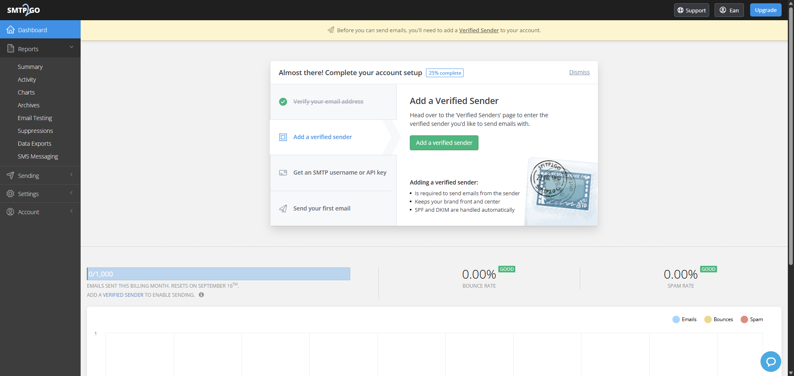
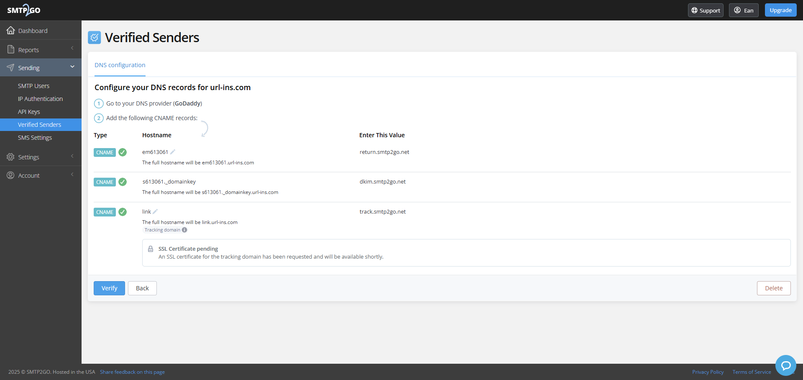
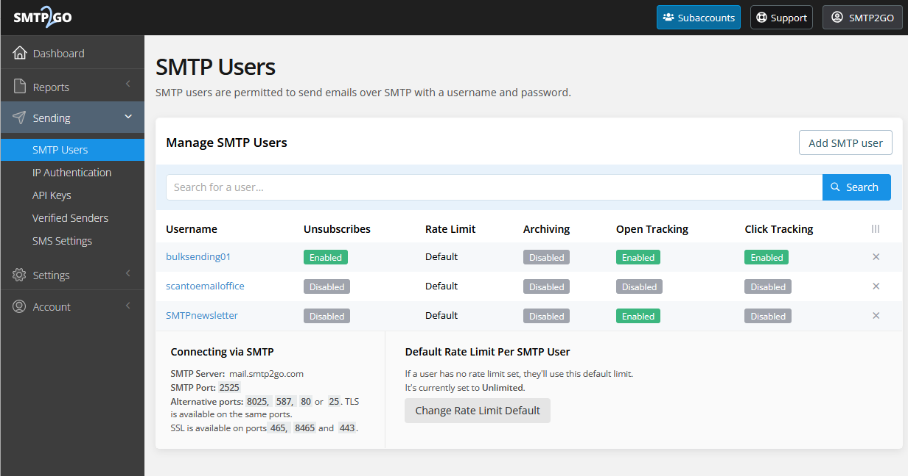
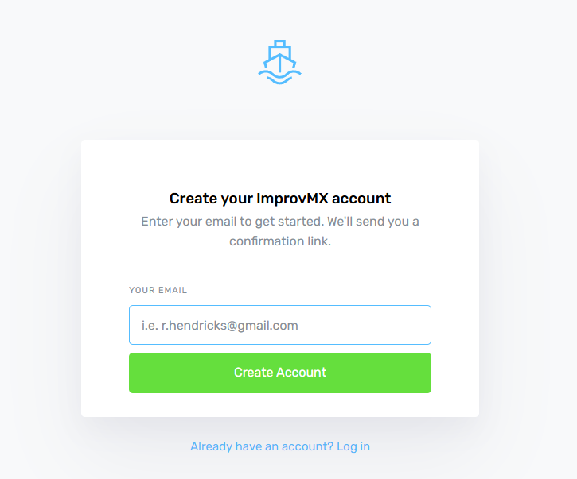
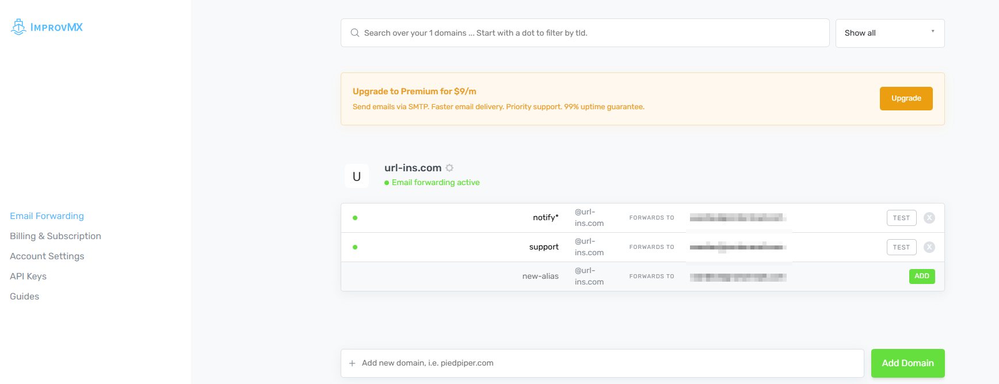
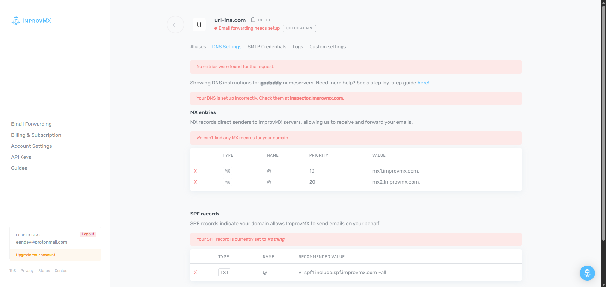
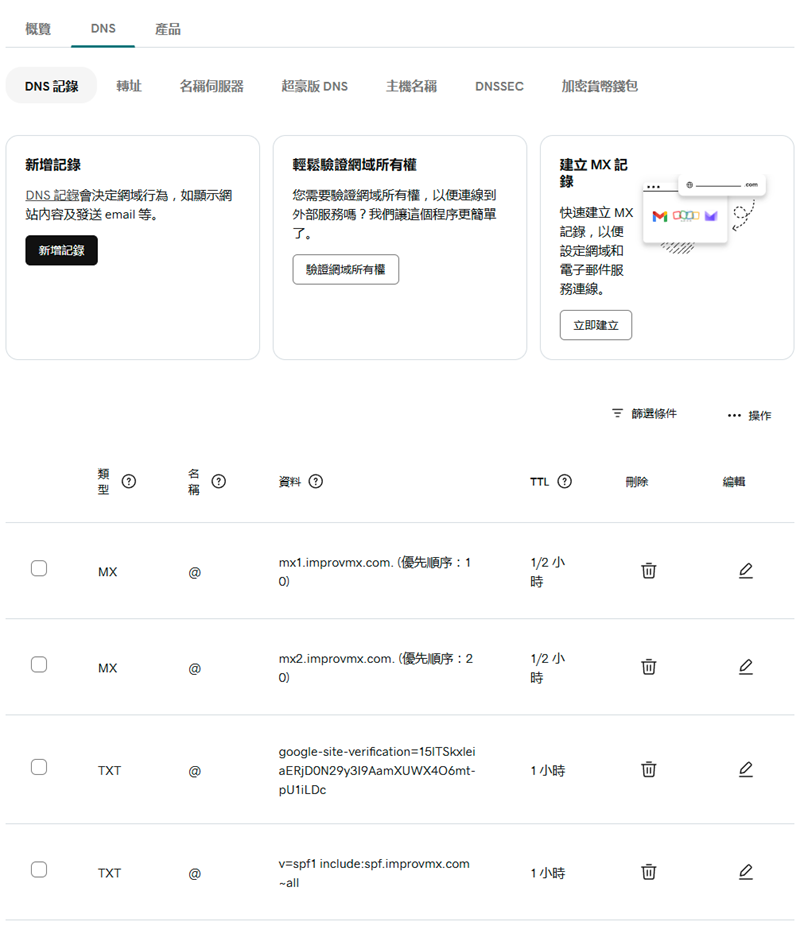
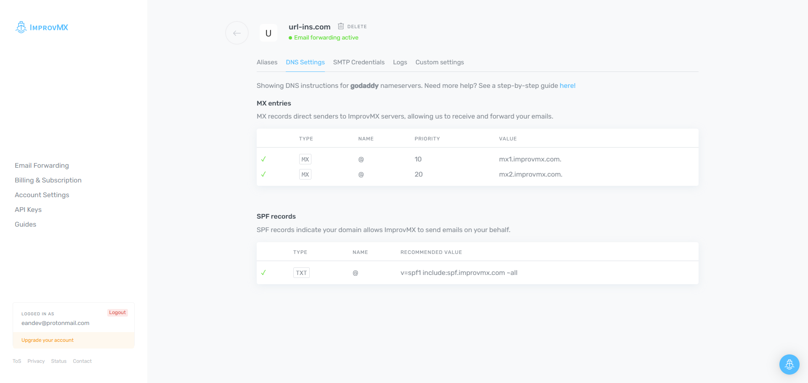

> 🔖 長話短說 🔖
> 
> 本文介紹如何結合使用 `SMTP2GO` 與 `ImprovMX` 兩個平台，為你的專案建立免費的 Email 寄送與接收功能。
> 
> - **解決問題**：在沒有專屬 Email Server 的情況下，實現自訂網域信箱的收發信功能。
> - **使用工具**：
>   - `ImprovMX`：設定 Email 反向轉發，將 `your-name@your-domain.com` 的信件轉寄到個人信箱 (如 Gmail)。
>   - `SMTP2GO`：作為 SMTP Server，用來發送應用程式的通知信、驗證信或使用者報告。
> - **核心流程**：先用 `ImprovMX` 建立轉發信箱，再用此信箱註冊 `SMTP2GO`，並完成兩邊的 DNS 設定 (SPF/DKIM/MX) 以確保郵件投遞成功率。

<!-- more -->

## 前言

在開發網站或應用程式時，Email 功能是不可或缺的一環。無論是使用者註冊時的帳號驗證、密碼重設，或是定期的電子報、系統通知，都需要一個穩定可靠的郵件發送服務 (SMTP Server)。

目前我正在開發的 [url-insight](https://url-insight.com) 服務，除了原有的 Google SSO 登入，也希望提供使用者透過 Email 註冊的選項，並能定期發送分析報告給使用者。

然而，對於個人專案或預算有限的團隊來說，自行架設或租用昂貴的 SMTP Server 並不划算。因此，我開始尋找免費且可靠的替代方案，最終選擇了 `SMTP2GO` 搭配 `ImprovMX` 的組合。

## SMTP2GO

SMTP2GO 是一個專業的 SMTP 服務平台，它負責將你的電子郵件可靠地送達收件人信箱。其免費方案提供每月 1,000 封的額度，對於小型專案或初期產品測試已相當足夠。詳細資訊可參考 [SMTP2GO 價目表](https://www.smtp2go.com/pricing/)。

註冊 SMTP2GO 的第一個挑戰是，它要求使用自訂網域的 Email 進行註冊，不接受 Gmail、Yahoo 等公開的免費信箱。

這意味著我必須要有一個能接收 `@url-ins.com` 結尾的信箱。這時，`ImprovMX` 就派上用場了。(細節可以跳到 [ImprovMX](#ImprovMX) 觀看)

假設我們已經透過 ImprovMX 設定好轉發信箱，並用它來註冊 SMTP2GO。完成信箱驗證後，登入儀表板，會看到系統引導我們完成幾個設定步驟。

其中，最重要的就是 `Verified Senders` 與 `SMTP Users` 這兩項。

### Verified Senders

根據 SMTP2GO 官方文件 [Verified Senders](https://support.smtp2go.com/hc/en-gb/articles/115004408567-Verified-Senders)，這項設定是為了提升郵件安全性與投遞成功率的關鍵機制。從 2025 年 4 月 11 日起，所有郵件都必須由已驗證的寄件者發送。

-   **驗證寄件人身份**：你可以新增「寄件網域」或「單一寄件地址」，證明你擁有該網域或 Email 的所有權，防止他人冒用你的身份發信。
-   **提升郵件投遞率**：完成網域驗證後，SMTP2GO 會自動處理 SPF 和 DKIM 設定，這能讓你的郵件更容易通過收件伺服器的安全檢查，大幅降低被歸類為垃圾郵件的風險。

驗證方式通常是透過設定 DNS Record。只需依照 Verified Senders 頁面上的指示，到你的 DNS 代管服務商（例如 Godaddy, Cloudflare）後台新增幾筆 CNAME 或 TXT 記錄即可。等待 DNS 設定生效後，驗證狀態便會更新。

### SMTP Users

此區塊用於設定透過 SMTP 發送信件時所需的認證資訊。你需要在此建立一組專用的帳號與密碼，應用程式將使用這組憑證來連接 SMTP2GO 服務。

📝 PS: 上圖直接採用官網說明文件的圖片，來源 [SMTP User Authentication](https://support.smtp2go.com/hc/en-gb/articles/13645646122777-SMTP-User-Authentication)。

## ImprovMX

[ImprovMX](https://improvmx.com/) 是一個免費的 Email 反向轉發服務。它可以讓你建立一個自訂網域的 Email 地址 (例如 `notify@your-domain.com`)，並將所有寄到這個地址的信件，自動轉發到你指定的真實信箱 (例如 `your-name@gmail.com`)。

它的註冊流程非常簡單，輸入你的網域和要轉發到的目標信箱，收取驗證信後即可建立帳號。

登入後，首先需要設定轉發規則。例如，我設定了兩組轉發信箱：`notify@url-ins.com` 與 `support@url-ins.com`，並將它們都轉發到我的個人 Gmail。

設定完轉發規則後，最重要的步驟就是設定 DNS。ImprovMX 需要你修改網域的 `MX` 和 `SPF` 記錄，才能夠接管你網域的郵件服務。

接著，我們到 DNS 代理商的站台進行設定。以 Godaddy 為例，ImprovMX 甚至提供了針對性的[圖文教學](https://improvmx.com/guides/godaddy)，非常貼心。

依照指示完成 `MX` 與 `SPF` 記錄的設定。

等待 DNS 設定生效後 (通常需要幾分鐘到數小時)，ImprovMX 就能正常運作了。你可以點擊後台的 `CHECK` 按鈕來手動觸發驗證。

因為我是先申請 SMTP2GO，所以在 ImprovMX 設定完成後，立刻就收到了來自 SMTP2GO 的驗證信。

當 DNS 驗證通過後，狀態會顯示為 `Email forwarding active`。

至此，所有的設定都已完成。

## 小結

透過本篇文章的介紹，我們成功地利用 `SMTP2GO` 與 `ImprovMX` 兩個免費服務，在低成本的考量下，為專案加上了完整的 Email 功能。

`ImprovMX` 巧妙地解決了沒有網域信箱的問題，而 `SMTP2GO` 則提供了穩定的 SMTP 寄信服務。

這套組合對於個人專案或初期產品來說，是一個非常實用且經濟的解決方案。

## 參考資料

- [利用Improvmx搭配自訂網域來收發信件 - Yu's Lab](https://yus-lab.com/article/how-to-improvmx)