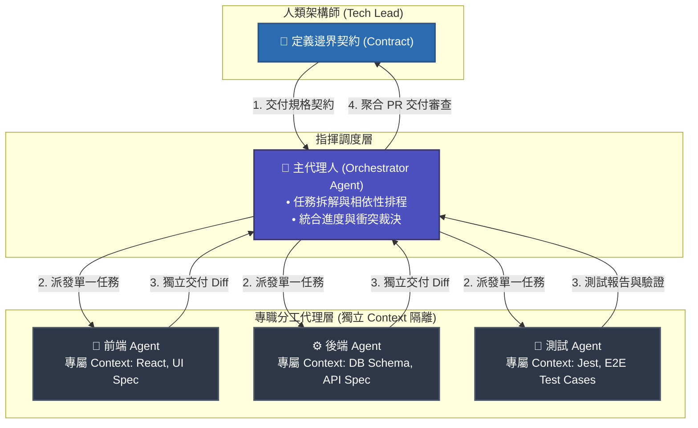
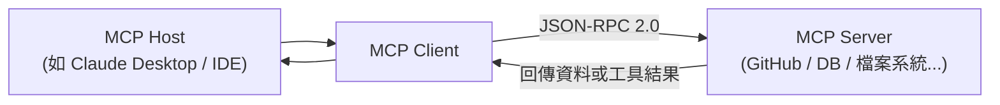
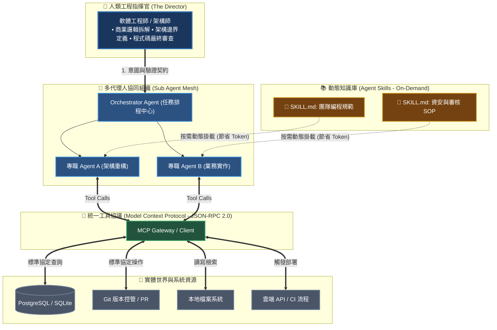

> 🔖 長話短說 🔖
>
> - **AI 的演進階段**：從 Copilot 的輔助補全，到 Vibe Coding 的規範驅動，再到現在多專職分工的 Sub Agent 團隊協作。
> - **Token 運用效能**：AI 真正的 Token 成本往往耗費在反覆的指令與限制上，因此 Skill 與 Tool 的索引機制成為 Token 使用效率最大化的關鍵。
> - **角色的根本性轉變**：工程師不再只是撰寫程式碼，而是要像架構師或監控者一樣，全面判斷 AI 團隊產出的商業價值與開發品質。
> - **慢下來思考**：面對每週更新的技術浪潮，應具備良好的全面思考與開發規範（如異動追蹤、文檔錄），避免系統在缺乏管控下胡亂發展。

過去需要前端、後端與測試多方協同數月才能打磨成型的系統骨架與全端業務 MVP，現在一個熟練掌握 Sub Agent 的資深工程師，在兩三週內就能獨立完成端到端驗證並具備交付水準。

這不是矽谷發表會上的誇大宣傳，而是每週都在真實軟體工程現場發生的產能重構。當程式碼的生成速度快到讓手指追不上，整個軟體行業的底層邏輯已經被徹底改寫：

**「軟體工程師」這個職位不會消失，但那個只會依照規格書把需求翻譯成 Code 的「人肉轉譯者」，正在以驚人的速度被時代淘汰。**

<!--more-->

本文將抽絲剝繭近三年 AI 開發工具的演進脈絡——從 Copilot 補全、Vibe Coding 意圖驅動，一路剖析到 Sub Agent 多代理協作與 MCP/Skill 的 Token 經濟學，為所有技術人描繪出一張清晰的「角色突圍藍圖」。

📝 **時間軸：AI 開發工具的演進** 📝

| 時間 | 事件 | 代表工具 / 模型 |
|---|---|---|
| 2021/06 | GitHub Copilot 開放技術預覽 | VS Code + Copilot (OpenAI Codex) |
| 2022/11 | ChatGPT 公開發布，一發引燄全球討論 | GPT-3.5 |
| 2023 年 | Claude 1/2、GPT-4 相繼推出，多文件協作登場 | Claude, GPT-4, Cursor IDE |
| 2025/02 | Andrej Karpathy 提出 Vibe Coding 概念 | Cursor, Windsurf, Claude Code |
| 2024/11 | Anthropic 發布 MCP 開放標準 | Claude Desktop, Zed, IDE 對接 MCP |
| 2025/10 | Anthropic 推出 Agent Skills 規範 | Claude Code + SKILL.md |

## 從單點輔助到技術顧問：ChatGPT 與 Copilot 的出現

在 AI 剛介入開發流程的初期，最先有感的是 Microsoft 的 GitHub Copilot 。

GitHub Copilot 的出現對工程師來說，更像是一個「超級自動補完」工具。它能根據當前檔案的上下文，預測你接下來要寫的幾行程式碼，這大大提升了撰寫樣板程式碼（Boilerplate code）的效率。

這時的 AI 的定位，比較像是 IDE 的 Plugin，只是個小小的助理。

隨後 ChatGPT 的問世，讓 AI 轉變為一個隨身且知識淵博的「技術顧問」。

這時，習慣將報錯訊息丟給它，讓 AI 協助分析問題的原因，或是請它解釋複雜的演算法。像 [AI 賦能開發：如何將 ChatGPT 作為 Pair Programming 夥伴提升編程效率](../develop-assistant-chatgpt/index.md) 這篇，就是我在這個時期的工作模式。

在這個階段，工程師具備的核心技能是 **Prompt Engineering** ——我們需要學習如何精確地描述需求。

甚至為了確保 AI 的思考模式與反應符合我們的期望，需要要求它扮演特定角色，從角色的角度提供資訊，並遵守我們給定的規則。例如要求 AI「扮演一名資深後端工程師」來獲取更專業的回答。

不過，這個時間的 AI 主要是處理單一檔案或有限的對話上下文，發揮的能力有限。

## AI 深度整合 IDE：從輔助插件到數位開發夥伴

對於整個專案的架構連貫性（Context Awareness）仍顯不足，這也促使後續以 AI 主的 IDE 工具的誕生，像是 Cursor、Windsurf 等等。

此時，工程師不再一個檔案、一個檔案地與 AI 互動，AI 能主動感知專案結構，成為工程師真正的數位夥伴。

這種與 IDE 高度整合，真正像是有一個夥伴、導師，與你一同協作，共同開發軟體。

這種從「單行補全」到「全域上下文感知（Full-Context Awareness）」的跨越，徹底改變了人機互動的介面。我們不再需要像人肉搬運工一樣手動複製報錯訊息；AI 開始像一位坐在你身旁的資深 Pair Programmer，在 IDE 內部直接理解專案拓樸。

| 演進階段 | 代表工具形態 | 工程師角色定位 | 核心瓶頸 / 挑戰 | 治理重心 |
| :--- | :--- | :--- | :--- | :--- |
| **第一階段：代碼補全** | GitHub Copilot | 打字員加速器 | 缺乏跨檔案上下文，容易瞎猜 | 語法熟練度、樣板代碼生成 |
| **第二階段：意圖驅動** | Cursor, Windsurf | 規範導演 (Vibe Director) | Context 視窗迅速飽和，Rules 檔案肥大 | System Prompt 與 Rules 治理 |
| **第三階段：專職代理** | Claude Code, Sub Agents | 團隊指揮官 / 架構稽核師 | Token 消耗失控、代理人通訊孤島 | MCP 協定、動態 Skill 模組化 |

## Vibe Coding 興起：從指令驅動到意圖導向

> 📝 **補充說明：Vibe Coding 的原始定義** 📝
>
> Vibe Coding 是 OpenAI 共同創辦人 Andrej Karpathy 在 2025 年 2 月 提出的概念。
> 透過向自然語言描述意圖（Intent），讓 AI 負責生成、測試與除錯。
>
> 開發者的核心價值轉變為「Vibe Director」，負責引導系統的最終呈現（Vibe），這要求開發者具備極強的功能拆解與邏輯驗證能力，而非僅是語法熟練度。

後來進入所謂的 **Vibe Coding** 階段。

對於非技術背景的使用者而言，Vibe Coding 確實帶來了前所未有的賦能——只要能把想法說清楚，哪怕不懂任何語法，也能在幾小時內搓出一個能跑的 Demo。

但最近技術社群也隨之出現了一種過度膨脹的盲目樂觀：有人靠著 AI 拼湊出雛形並上架銷售，便迫不及待地宣稱「軟體工程師已死，以後只要懂 Vibe 即可」。

然而，**身經百戰的架構師都心知肚明：原型（Prototype）到工業級產品（Production）的距離，從來不是程式碼能不能跑，而是系統在面對分散式死鎖、資安漏洞、資料一致性與百萬並發時的抗脆弱能力。**

Vibe Coding 解放的是「創意的實作門檻」，但它同時也製造了前所未有的「架構黑箱」。回到軟體工程師的視角，Vibe Coding 生成的程式碼如果缺乏架構約束，往往會演變成難以維護的「AI 義大利麵代碼（Spaghetti Code）」。因此，單純的意圖導向對嚴謹的企業級系統絕不可行，工程師的專業介入不減反增。

對工程師而言，使用上的挑戰在於，如何確保生成的程式碼不僅「看起來對」，還要符合既有的系統架構、效能指標以及複雜的商業邏輯。

所以單純 Vibe Coding 對工程師不可行，工程師仍然需要高度介入。

為此，軟體工程師為了讓產出的程式碼可控，我們透過 `System Prompt` 與 `Prompt` 給它大量的規範文件，也就是指示 AI 可以做什麼、不能做什麼。

使得工程師在實踐 Vibe Coding 時，往往需要撰寫極為詳盡的規範文件（如 `.CLAUDE.md` 或專案專屬的 `instructions.md`）與角色定義，以限制 AI 的發散行為，確保產出品質。

這種「以規則約束意圖」的過程，實際上是將原本編寫程式碼的精力，轉向了對系統邊界與邏輯規範的精準定義。

隨著專案規模越來越大，給 AI 的規範描述文件也越來越多，所使用的 **Token 數量**自然越來越高。

但 AI 本身的 **context window** 有其限制，`System prompt` 的規範的資料、摘要型資料壓縮所造成的資訊損失，使用額度（quota）的限制，容易造成 _目標還沒達成，當下時段的使用額度就已經達到上限，導致無法繼續使用_ 的問題。 

當然，若資源充足的人並不在此範圍內，但對多數人而言，這是一個實際存在的問題。

為此，我們將需求精細化，工程師與 AI 協作，將需求切分為多個任務、並建立 Checklist 來確保功能都有確時完成。

也許太多人這樣使用，後續直接出現類似的框架，自動來達成上述的動作，例如 [OpenSpec](https://github.com/Fission-AI/OpenSpec)、[Spec Kit](https://github.com/github/spec-kit)或是直接整合 IDE ，由 AWS 推出的 [Kiro](https://kiro.dev/)，都可以協助分析需求，任務拆分與實作。

但這樣，面對高複雜度，或是含有多種技術邊界的專案，這種「大而全」的單一代理模式開始暴露出效率與成本的雙重壓力。

要嘛，專案的開發規範，夾雜在每次的 Prompt，耗費大量 Token。或著是只有一個 Agent 在跑，AI 呼叫的額度次數，在重置前用不完的同時，還有大量工作在等待處理。

## Sub Agent 團隊協作：專職分工的多代理架構

於是開始有人思考，是否有辦法減少 Token 的使用量；或者同時執行多個 Agent，多工處理任。  

在這樣的背景下，多代理（Sub Agent）的概念便出現了。

Sub Agent 只要處理自己負責的事物，也只要載入對應的規範，就可以同時多工處理同一個專案。

彷彿在系統中自行組成一個團隊，這個團隊中的每個 Agent 各司其職、各有專長，有前端、有後端、有測試與寫文件的。

好處是分工明確，每個 agent 使用的 `system prompt` 也減少。

但相對地，每一個 sub-agent 在處理同個專案，意味著相同的專案資料，每個 sub-agent 都要傳一次，Token 的使用量也變得更加驚人。

> 📝 **備註：Sub Agent 發展時間線** 📝
>
> Sub Agent 多代理架構的模式在 2023 年隨機器學習社群開始廣泛討論，尤其是 LangChain、AutoGPT 等框架發展後。
>
> Anthropic 則於 2024 年後正式建置多代理階層式架構（Multi-agent Hierarchy）的模式，關鍵在於由主要的 Orchestrator 代理負責計劃與協調，各 Sub Agent 則負責執行專屬任務。
>
> 關鍵在於「上下文隔離 (Context Isolation)」。單一模型在處理複雜任務時，會因為 context 內夾雜太多不相關資訊而產生「Lost in the Middle」現象，導致注意力分散。
>
> Sub Agent 機制讓每個代理人只擁有該任務必要的「專一上下文 (Focused Context)」，不僅降低了單次調用的 Token 成本，也提升了 AI 回應的精確度與推論品質。

## MCP 通用協議：消弭資訊孤島的 AI 界面標準

在 AI 出現之前，已經有很多正在運行的系統，這些系統都有寶貴的資訊可以作為AI應用的資料來源，或是作為運用的工具

但各家有各種寫法變成要整合不易，Anthropic 提出的 MCP，這個類似 Adapter 的規則，打通了AI調用現成工具的路，讓 AI 能夠做到的事情變得更加廣泛。

圖示來源: [mcp是什麼？mcp server是什麼？mcp中文、意思、實例一次看懂\|數位時代 BusinessNext](https://www.bnext.com.tw/article/82706/what-is-mcp)

> 📝 **技術視角：MCP (Model Context Protocol)** 📝
>
> - **提出者**：[Anthropic](https://anthropic.com) (2024/11/25 正式發布)
> - **核心使命**：解決「資訊孤島 (Information Silos)」問題。MCP 是 AI 界的「USB-C Standard」，讓不同的 AI Host (IDE) 與 Data Sources (GitHub, DB) 透過統一協議 JSON-RPC 2.0 溝通，消弭重複開發客製整合的成本。
> - 相關網站: [MCP GitHub](https://github.com/modelcontextprotocol)、[MCP 官方文件](https://modelcontextprotocol.io/docs/getting-started/intro)

MCP 的出現，本質上是在建立一種「AI 界通用的外掛語言」。

在大型專案中，AI 最痛苦的不是不會寫程式，而是它活在一座「資訊孤島」裡。它不知道你資料庫裡的真實 Schema，也讀不到你本地的 Git 歷史。過去，我們要讓 AI 存取資料庫，得為它量身打造一套專屬的 API 連接器；要讓它讀行事曆，又得重寫一套。換個 IDE，一切就要重來。

**這就像你去便利商店結帳，口袋裡有悠遊卡、信用卡和現金。如果每個收銀台只認特定銀行的晶片，你買杯咖啡就要換三次隊。**

Anthropic 提出的 **MCP (Model Context Protocol)**，就是為整個 AI 生態裝上的「統一感應刷卡機」——它不管背後是 GitHub、PostgreSQL 還是本地檔案系統，全部透過統一的 JSON-RPC 2.0 協議進行標準化外掛。

當你對 AI 說：「幫我查一下這個月的支出，並整理成一份報告」時，背後的協同流程極其乾淨：

1. **識別意圖**：AI 判斷需要存取外部財務系統。
2. **發出標準調用**：AI 透過 MCP Client 發出工具調用請求（Tool Call）。
3. **安全獲取資料**：對應的 MCP Server 執行查詢並打包回傳資料。
4. **生成成果**：AI 取得真實數據後進行業務邏輯組裝。

整個過程中，AI 本身不需要知道後台複雜的資料庫驅動細節，只要對準協議輕輕一「嗶」，資料與工具就能瞬間打通。

透過使用 MCP，AI Agent 只要取得授權，就可以任意調用所有支援 MCP 的現成系統，

但只有密集使用 IDE 工具時會發現，只要使用頻率一高，很快就會碰到額度上限，必須休息一段時間。  

若與 AI 討論與 Retro 後，AI 會指出更有效使用 Prompt 的方式。

也會出現，你的使用方式中，吃掉大多數 Token 的，不是實際產出的內容，而是重覆給指示與限制，無論指令是否對此次 Prompt 有用或無用。

## Agent Skill 機制：極大化 Token 使用效率的指令插件

> 📝 **技術視角：Agent Skill 機制** 📝
>
> - **提出者**：[Anthropic](https://anthropic.com) (2025/10/16 推出，12/18 開放標準)
> - **核心使命**：針對重複性工作流程提供可複用的指令集。透過 `SKILL.md` 格式讓 Agent 僅在必要時動態載入（Context Injection），避免將所有工具規則預先灌入 Context，從而極大化節省 Token 並提升推論精準度。
> - 相關網址: [Agent Skill GitHub](https://github.com/anthropics/anthropic-quickstarts)

圖示來源: [Agent Skills - Claude API Docs](https://platform.claude.com/docs/zh-TW/agents-and-tools/agent-skills/overview)

Agent Skill 的核心思想非常優雅：**知識模組化與按需載入（On-Demand Context Injection）**。

在 Vibe Coding 時代，我們習慣把所有規範（編程規範、Git 流程、部署指令、資料庫規則）通通一股腦塞進 AI 的 System Prompt 裡。但這就像在現實生活中：

**你家裡請了一位全能管家，平時他只要負責打掃和收發郵件。但你卻逼他每天早上出門前，必須把厚達三百頁的員工手冊（包含怎麼辦十人家宴、怎麼處理壁爐火災、怎麼修剪罕見蘭花）全部默背一遍才准上工。** 

結果就是：這位管家一整天神經緊繃、大腦超載，真正要打掃時反而分心恍神。

在 AI 的世界裡，塞入越厚重的初始規範，AI 真正能用於「推理問題、理解業務需求」的有效注意力（Attention Bandwidth）就越被稀釋。

**Skill 機制徹底顛覆了這種暴力灌輸：** 

它把龐大的專案規範，拆解成書架上一本本薄薄的「專用外掛手冊（`SKILL.md`）」。AI 平時腦子裡只有輕量級的索引清單；當你說「幫我把這段代碼格式化」時，它才動態從書架抽下 `code-style.md` 翻閱，任務一旦結束就放回書架，絕不常駐佔用 Context。

> 💡 **核心洞察**：**真正的工程智慧不是讓 AI 記住更多，而是讓它在正確的微秒，只調用最精準的知識。**

## 工程師的價值重定義：開發者的角色蛻變

不論 MCP、SKILL 與 Sub Agent 哪一個先出現，我個人認為，它們的核心目的其實都是在讓 **Token 的使用效率最大化**。

這也讓人開始意識到，作為一個軟體開發從業人員，工程師的角色正在改變。

過去的軟體開發有明確的職能劃分：前端、後端、資安、測試、維運、專案管理。但在 AI 時代，這些界限正變得極度模糊。一個工程師在 AI 的協助下，可能需要同時具備網路架構、資訊安全、演算法、文件撰寫、甚至項目管理的全方位能力。

工程師不再只是單純開發系統，而是必須從更全面的角度，去控管與監控整個 AI 團隊所產生的結果。這個角度可能從架構面、維運運營面、商業價值面等等，用來判斷哪些事情值得做、優先做、如何做與完成完成與交付。

這並不意味著每項都要鑽研到頂尖，而是要具備「全職能通用」的廣度，透過 AI 或是個人的知識體系作為槓桿，你可以做得更好、更快、更廣，讓一個人的生產力涵蓋過去一整間資訊公司的職能需求。

這件事直接衝擊所有工程師，因為能否有效運用 AI，直接性的影響了工程師的產值以及能力的成長，造成工程師之間的能力，落差愈發的懸殊，也間接決定了工程師的價值。

此時工程師的價值，在於能否全面理解各種不同的層面，而不只是把功能實作出來。過去因為時間壓力而無法做到的事情，隨著 AI 的介入，會逐漸變成必須具備的基本功，例如：程式碼規範、[為什麼系統文件化很重要？從一次「找不到 IP 主機」的網路維運故障談文件價值](../../management/the-importance-of-information-documentation/index.md)、開發過程的異動追蹤等。即使不夠熟練，也一定要知道這些事情該如何進行。

> 💡 **開發筆記：工程師價值的典範轉移** 💡
>
> 傳統開發模式中，「實作能力」常被視為核心競爭力；但在 AI 協作時代，「架構設計」、「釐清問題的能力」變得更為關鍵。
>
> 工程師需要具備像「技術主管 (Tech Lead)」一樣的能力，去審視 AI 給出的程式碼是否符合安全性、可維護性以及業務邏輯的正確性。

### 現代 AI 輔助軟體工程協同全景拓撲 (The Modern AI Stack)

在這種典範轉移下，現代軟體工程不再是人與鍵盤的單打獨鬥，而是一套高度精密分工的**「人機協同架構網 (Human-Agent Mesh)」**：

### AI 浪潮下，初級工程師的處境與應對之道

AI 的發展對正要踏入職場的工程師來說，影響尤為明顯。

過去初級工程師最常做的事情——寫樣板程式碼、框架重構、簡單除錯、生成測試案例——這些 AI 如今幾乎都能做到。

打破這種局面的關鍵，已經不再是「寫得多快」，而是「想得多準」。具體來說，有兩個維度：

#### 知識的廣度與深度

AI 從不缺生成功能的能力，但它需要正確的方向。工程師提出問題的精準度，直接決定了 AI 能否給出有用的內容。

舉個例子：網頁顯示速度慢、系統效能不好時——

- **沒有基礎的工程師**只能說：「速度有點慢，幫我解決。」 AI 會自由發散，可能調整某個 API 的超時設定、增加快取、或隨意修改一些與問題瓶頸未必相關的地方。
- **具備電腦科學基礎的工程師**則可以說：「目前這支 API 的時間複雜度是 O(n²)，我認為瓶頸在演算法的設計上。」 AI 馬上就會有明確的方向，能配合你提出具體的改進方案。
- 對於前端場景同樣適用：「我認為是渲染節點數量太多，優化一下這部分的渲染次數。」遠比「頁面卡頓幫我優化」能提供更有效的協作空間。

也就是說，越能精準地指出問題所在，就越能有效且快速地解決問題。

#### 建立全局視野，像管理者一樣思考

在 AI 已能接手大量實作工作的時代，工程師應該將自己定位從「執行者」轉向「資源管理者」。

所有的工程決策，例如「要引入多少快取」、「要選哪套架構」、「要先優化哪一層」、「哪個功能必須實作」——本質上都是「資源的取捨」。

具備[多維度思考能力](../thinking-multi-dimensional-thinking-for-system-architecture/index.md)的視野，才能在這些取捨中做出正確的全局判斷。沒有全局觀的工程師，即使手中有再強的 AI，也只能在小地方打轉。

> 💬 **深度對話：AI 是一面認知的鏡子** 💬
>
> 「AI 的反應與產出，完全取決於使用者的知識認知。」

這是一句值得所有開發者深思的話。當使用者的知識匱乏時，AI 給出的回饋也會符合該匱乏的認知；只有當使用者具備高度的領域知識與邏輯深度，AI 才能真正作為乘數（Multiplier）發揮作用。

正如《知識的假象》(The Knowledge Illusion，或譯《無知的力量》) 一書中提到的概念：個人所擁有的知識其實非常有限，我們往往活在理解的錯覺中。在 AI 時代，承認「無知」並積極拓展知識的廣度與深度，才是避免被 AI 產出的「平庸內容」所限制的唯一出路。

## 面對技術浪潮的應對之道：心慢下來，思考先行

但從另一個角度來看，這樣的發展其實也令人感到不安。

對於持續關注 AI 發展的人來說，幾乎每個禮拜都會看到截然不同的變化。

從最早期 ChatGPT 的單一檔案開發管理，到後來的多檔案協作，再到瀏覽器整合，甚至到現在能即時呈現畫面並產生前端程式碼。

這些發展意味著變動速度會越來越快，但也正因如此，**心反而要慢下來**。  

圖片來源: <https://www.reddit.com/r/vibecodingmemes/comments/1l5j2lt/vibe_coding_be_like/>

如果沒有良好的全面思考，很容易看到一種情況：網路上許多看似玩笑式的 AI 開發案例，一開始像跑車，最後卻變成腳踏車。  
原因在於缺乏規範與整體理解，導致 AI 胡亂發展與調整系統，最終變得難以控制。

## 總結：從「敲鍵盤的打字員」到「定義邊界的架構指揮官」

回顧 AI 這三年的演進脈絡，從 Copilot 的輔助補全、Vibe Coding 的意圖解放，一路走到 Sub Agent 的組織協同與 MCP/Skill 的模組化生態，我們看見的表面上是工具的更迭，本質上卻是**「人類工程師認知槓桿的無限放大」**。

當程式碼的生成門檻無限降低，軟體工程的價值天平就發生了決定性的位移：

* 過去，厲害的工程師比的是「誰的語法熟、誰敲代碼快、誰記得最多 API」；
* 未來，卓越的架構師比的是**「誰能把模糊的業務痛點拆解成清晰的契約、誰能建立堅固的驗證防線、誰能調度一支由 Sub Agent 組成的數位軍隊」**。

不要害怕 AI 的高速演化，也不必焦慮每週推陳出新的技術名詞。心慢下來，把基本功紮穩在電腦科學本質、系統架構思維與商業價值洞察上。你將不再是被 AI 追趕的受害者，而是站在浪頭上指揮千軍萬馬的系統架構指揮官。

**「AI 不會淘汰工程師，但能指揮一支 Sub Agent 團隊的工程師，正在淘汰單打獨鬥的打字員。 我們的價值從來不在於敲擊鍵盤的速度，而在於定義系統邊界的格局。」**

---

## 附錄：AI 時代工程師個人轉型自查表 (Readiness Checklist)

面對 Sub Agent 與一人資訊公司的浪潮，把以下 5 個問題拿來拷問自己：

- [ ] **1. 從語法到架構**：我今天寫的程式碼，如果派給 AI 在 30 秒內生成，我能一眼看出它潛藏的架構隱患與效能瓶頸嗎？
- [ ] **2. 需求拆解力**：我能否把模糊的商業痛點，精確拆解成單一職責、邊界清楚的任務契約交給 Agent？
- [ ] **3. 工具槓桿率**：我是否已經開始建立屬於自己的「私有 MCP 與 Agent Skill 庫」，把團隊重複的 SOP 模組化？
- [ ] **4. 審查大腦頻寬**：當 5 個 Sub Agent 同時送上 PR 時，我是盲目按綠燈 Approve，還是具備自動化驗證手段（Validation Gate）保護系統？
- [ ] **5. 心態定力**：面對每週更新的 AI 新名詞，我是否能穿透炒作迷霧，看清背後「極大化 Token 效率與降低認知負載」的不變本質？

---
### 延伸閱讀

▶ 站內文章

- [為什麼系統文件化很重要？從一次「找不到 IP 主機」的網路維運故障談文件價值](../../management/the-importance-of-information-documentation/index.md)：關於開發規範與記錄的重要性實例。
- [開發實務對談：日誌 (Log) 記錄與錯誤處理 (Error Handling) 的最佳實踐](../log-and-error-handling-the-foundation-of-buildin-observable-systems/index.md)：工程師在實作中必須具備的品質守門員思維。
- [AI 賦能開發：如何將 ChatGPT 作為 Pair Programming 夥伴提升編程效率](../develop-assistant-chatgpt/index.md)：初探 AI 開發協作的實務應用。
- [如何建構系統架構？從單點到維度的軟體設計思考模型](../thinking-multi-dimensional-thinking-for-system-architecture/index.md)：提升全局視野與架構思維。

▶ 站外文章

- [What is Model Context Protocol (MCP)? How it simplifies AI integrations compared to APIs \| AI Agents That Work](https://norahsakal.com/blog/mcp-vs-api-model-context-protocol-explained/)
- [mcp是什麼？mcp server是什麼？mcp中文、意思、實例一次看懂\|數位時代 BusinessNext](https://www.bnext.com.tw/article/82706/what-is-mcp)