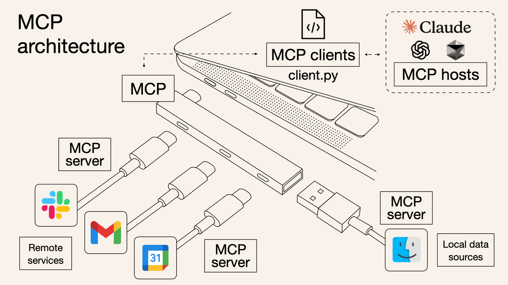
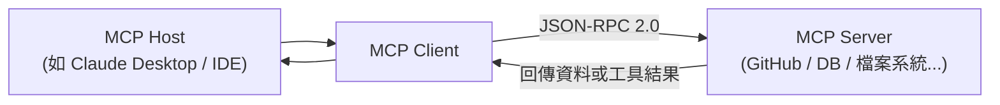
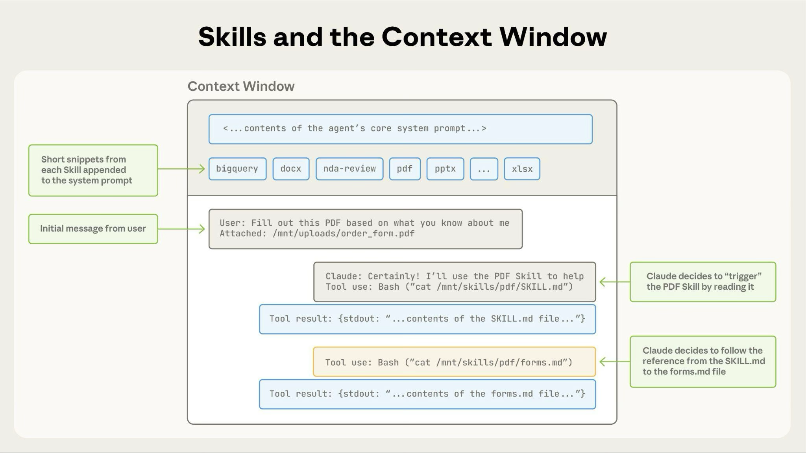
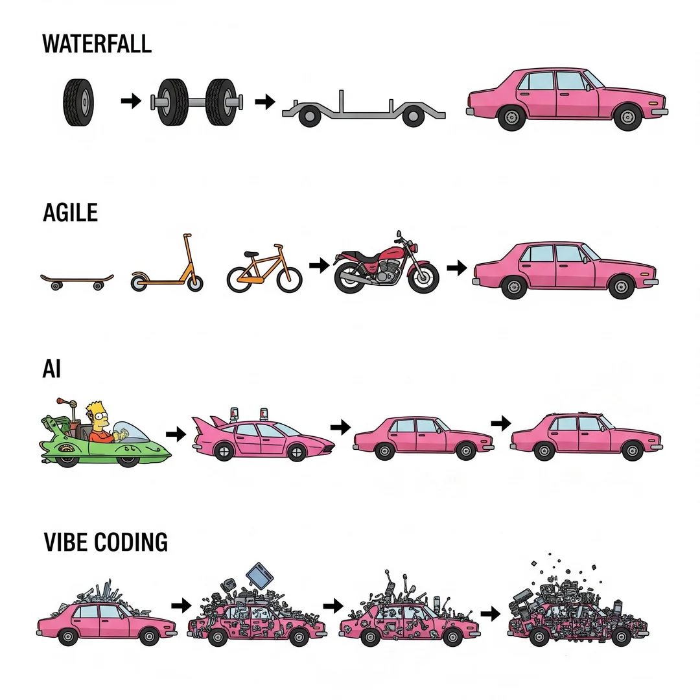

> 🔖 長話短說 🔖
>
> - **AI 的演進階段**：從 Copilot 的輔助補全，到 Vibe Coding 的規範驅動，再到現在多專職分工的 Sub Agent 團隊協作。
> - **Token 運用效能**：AI 真正的 Token 成本往往耗費在反覆的指令與限制上，因此 Skill 與 Tool 的索引機制成為 Token 使用效率最大化的關鍵。
> - **角色的根本性轉變**：工程師不再只是撰寫程式碼，而是要像架構師或監控者一樣，全面判斷 AI 團隊產出的商業價值與開發品質。
> - **慢下來思考**：面對每週更新的技術浪潮，應具備良好的全面思考與開發規範（如異動追蹤、文檔錄），避免系統在缺乏管控下胡亂發展。

<!--more-->

這兩三年對工程師來說，AI 的發展速度非常快。  

從一開始只是協助補完程式碼，例如 Copilot，到後來 Claude 這類模型可以實際協助撰寫程式碼，會很明顯感受到 AI 的能力正在快速提升。

📝 **時間軸：AI 開發工具的演進** 📝

| 時間 | 事件 | 代表工具 / 模型 |
|---|---|---|
| 2021/06 | GitHub Copilot 開放技術預覽 | VS Code + Copilot (OpenAI Codex) |
| 2022/11 | ChatGPT 公開發布，一發引燄全球討論 | GPT-3.5 |
| 2023 年 | Claude 1/2、GPT-4 相繼推出，多文件協作登場 | Claude, GPT-4, Cursor IDE |
| 2025/02 | Andrej Karpathy 提出 Vibe Coding 概念 | Cursor, Windsurf, Claude Code |
| 2024/11 | Anthropic 發布 MCP 開放標準 | Claude Desktop, Zed, IDE 對接 MCP |
| 2025/10 | Anthropic 推出 Agent Skills 規範 | Claude Code + SKILL.md |

## 從單點輔助到技術顧問：ChatGPT 與 Copilot 的出現

在 AI 剛介入開發流程的初期，最先有感的是 Microsoft 的 GitHub Copilot 。

GitHub Copilot 的出現對工程師來說，更像是一個「超級自動補完」工具。它能根據當前檔案的上下文，預測你接下來要寫的幾行程式碼，這大大提升了撰寫樣板程式碼（Boilerplate code）的效率。

這時的 AI 的定位，比較像是 IDE 的 Plugin，只是個小小的助理。

隨後 ChatGPT 的問世，讓 AI 轉變為一個隨身且知識淵博的「技術顧問」。

這時，習慣將報錯訊息丟給它，讓 AI 協助分析問題的原因，或是請它解釋複雜的演算法。像 [AI 賦能開發：如何將 ChatGPT 作為 Pair Programming 夥伴提升編程效率](../develop-assistant-chatgpt/index.md) 這篇，就是我在這個時期的工作模式。

在這個階段，工程師具備的核心技能是 **Prompt Engineering** ——我們需要學習如何精確地描述需求。

甚至為了確保 AI 的思考模式與反應符合我們的期望，需要要求它扮演特定角色，從角色的角度提供資訊，並遵守我們給定的規則。例如要求 AI「扮演一名資深後端工程師」來獲取更專業的回答。

不過，這個時間的 AI 主要是處理單一檔案或有限的對話上下文，發揮的能力有限。

## AI 深度整合 IDE：從輔助插件到數位開發夥伴

對於整個專案的架構連貫性（Context Awareness）仍顯不足，這也促使後續以 AI 主的 IDE 工具的誕生，像是 Cursor、Windsurf 等等。

此時，工程師不再一個檔案、一個檔案地與 AI 互動，AI 能主動感知專案結構，成為工程師真正的數位夥伴。

這種與 IDE 高度整合，真正像是有一個夥伴、導師，與你一同協作，共同開發軟體。

以我自已而言，最早是使用 GitHub Copilot，來協助開發程式，尤其是推論後續的程式碼功能，確實加快了開發速度。再接下來 ChatGPT 推出後，除了用來協助分析與整理文件外，也大量用在程式碼的異常問題除錯與陌生語法的查詢，例如我懶得寫或查詢 SQL 語法、或是正規表達式等，就會讓它協助產生。

後續也使用過 Cursor, Windsurf, Kiro, Antigravity 等 IDE, 這些 IDE 各有優點與特性，但後續因為模型不支援或是收費方式的種種因素，目前也沒有在使用。

現行使用的主力，還是以 VS Code + GitHub Copilot 與 Claude Code 兩者搭配使用。

## 什麼是 Vibe Coding？從指令驅動走向意圖導向

> 📝 **定義直答：Vibe Coding 的核心概念** 📝
>
> **Vibe Coding** 是由 OpenAI 共同創辦人 Andrej Karpathy 於 2025 年初提出的 AI 開發模式：開發者不再逐行手寫語法，而是以自然語言精確描述系統意圖（Intent），交由 AI 自動生成程式碼、執行測試與除錯，工程師轉型為引導系統架構與驗證品質的「導演（Vibe Director）」。開發者的核心價值從程式碼語法熟練度，轉化為功能拆解、系統架構把關與邏輯驗證能力。

後來進入所謂的 **Vibe Coding** 階段。

對於一般使用者來說，Vibe Coding 確實能讓他們在不具備軟體技術背景的情況下，快速產出符合需求的成品。這確實為許多人帶來新的希望與氣象，因為他們可以不用依賴軟體工程師的前提，刻畫出自己想要的軟體。

偷偷臭一下，有些人透過 Vibe Coding 刻劃出自己想要的軟體，並此作為產品賣出，就去貶低所有的工程師。就算有人給建議，也是反諷回去。我真的覺得可以不用這樣，在抬高自己的同時，貶低其他人。

回到軟體工程師的角度，Vibe Coding 雖然會自己產生相對的功能程式，但無法控制產出的程式碼符合軟體架構、可維護度、Code Style 等等。

對工程師而言，使用上的挑戰在於，如何確保生成的程式碼不僅「看起來對」，還要符合既有的系統架構、效能指標以及複雜的商業邏輯。

所以單純 Vibe Coding 對工程師不可行，工程師仍然需要高度介入。

為此，軟體工程師為了讓產出的程式碼可控，我們透過 `System Prompt` 與 `Prompt` 給它大量的規範文件，也就是指示 AI 可以做什麼、不能做什麼。

使得工程師在實踐 Vibe Coding 時，往往需要撰寫極為詳盡的規範文件（如 `.CLAUDE.md` 或專案專屬的 `instructions.md`）與角色定義，以限制 AI 的發散行為，確保產出品質。

這種「以規則約束意圖」的過程，實際上是將原本編寫程式碼的精力，轉向了對系統邊界與邏輯規範的精準定義。

隨著專案規模越來越大，給 AI 的規範描述文件也越來越多，所使用的 **Token 數量**自然越來越高。

但 AI 本身的 **context window** 有其限制，`System prompt` 的規範的資料、摘要型資料壓縮所造成的資訊損失，使用額度（quota）的限制，容易造成 _目標還沒達成，當下時段的使用額度就已經達到上限，導致無法繼續使用_ 的問題。  

當然，若資源充足的人並不在此範圍內，但對多數人而言，這是一個實際存在的問題。

為此，我們將需求精細化，工程師與 AI 協作，將需求切分為多個任務、並建立 Checklist 來確保功能都有確時完成。

也許太多人這樣使用，後續直接出現類似的框架，自動來達成上述的動作，例如 [OpenSpec](https://github.com/Fission-AI/OpenSpec)、[Spec Kit](https://github.com/github/spec-kit)或是直接整合 IDE ，由 AWS 推出的 [Kiro](https://kiro.dev/)，都可以協助分析需求，任務拆分與實作。

但這樣，面對高複雜度，或是含有多種技術邊界的專案，這種「大而全」的單一代理模式開始暴露出效率與成本的雙重壓力。

要嘛，專案的開發規範，夾雜在每次的 Prompt，耗費大量 Token。或著是只有一個 Agent 在跑，AI 呼叫的額度次數，在重置前用不完的同時，還有大量工作在等待處理。

## Sub Agent 團隊協作：專職分工的多代理架構

於是開始有人思考，是否有辦法減少 Token 的使用量；或者同時執行多個 Agent，多工處理任。  

在這樣的背景下，多代理（Sub Agent）的概念便出現了。

Sub Agent 只要處理自己負責的事物，也只要載入對應的規範，就可以同時多工處理同一個專案。

彷彿在系統中自行組成一個團隊，這個團隊中的每個 Agent 各司其職、各有專長，有前端、有後端、有測試與寫文件的。

好處是分工明確，每個 agent 使用的 `system prompt` 也減少。

但相對地，每一個 sub-agent 在處理同個專案，意味著相同的專案資料，每個 sub-agent 都要傳一次，Token 的使用量也變得更加驚人。

> 📝 **備註：Sub Agent 發展時間線** 📝
>
> Sub Agent 多代理架構的模式在 2023 年隨機器學習社群開始廣泛討論，尤其是 LangChain、AutoGPT 等框架發展後。
>
> Anthropic 則於 2024 年後正式建置多代理階層式架構（Multi-agent Hierarchy）的模式，關鍵在於由主要的 Orchestrator 代理負責計劃與協調，各 Sub Agent 則負責執行專屬任務。
>
> 關鍵在於「上下文隔離 (Context Isolation)」。單一模型在處理複雜任務時，會因為 context 內夾雜太多不相關資訊而產生「Lost in the Middle」現象，導致注意力分散。
>
> Sub Agent 機制讓每個代理人只擁有該任務必要的「專一上下文 (Focused Context)」，不僅降低了單次調用的 Token 成本，也提升了 AI 回應的精確度與推論品質。

## MCP 通用協議：消弭資訊孤島的 AI 界面標準

在 AI 出現之前，已經有很多正在運行的系統，這些系統都有寶貴的資訊可以作為AI應用的資料來源，或是作為運用的工具

但各家有各種寫法變成要整合不易，Anthropic 提出的 MCP，這個類似 Adapter 的規則，打通了AI調用現成工具的路，讓 AI 能夠做到的事情變得更加廣泛。

圖示來源: [mcp是什麼？mcp server是什麼？mcp中文、意思、實例一次看懂\|數位時代 BusinessNext](https://www.bnext.com.tw/article/82706/what-is-mcp)

> 📝 **技術視角：MCP (Model Context Protocol)** 📝
>
> - **提出者**：[Anthropic](https://anthropic.com) (2024/11/25 正式發布)
> - **核心使命**：解決「資訊孤島 (Information Silos)」問題。MCP 是 AI 界的「USB-C Standard」，讓不同的 AI Host (IDE) 與 Data Sources (GitHub, DB) 透過統一協議 JSON-RPC 2.0 溝通，消弭重複開發客製整合的成本。
> - 相關網站: [MCP GitHub](https://github.com/modelcontextprotocol)、[MCP 官方文件](https://modelcontextprotocol.io/docs/getting-started/intro)

MCP 的出現，本質上是在建立一種「通用的外掛語言」。對於工程師而言，過去要讓 AI 存取資料庫或遠端服務，通常得針對不同的開發環境重複開發整合；而 MCP 就是一套統一的標準，讓不同來源的資料與工具，都能被 AI 以同一種方式存取與使用。

### 一、生活中的對應情境

你去便利商店購物，口袋裡有現金、信用卡、悠遊卡。以前每個收銀台只接受特定一種付款方式，你得先確認哪台接受什麼，非常麻煩。

後來出現了統一的感應付款標準，不管你拿哪張卡、用哪支手機，對準感應區「嗶」一聲就能結帳——收銀台不需要知道背後是哪家銀行，只需要認識這套標準。

### 二、MCP 的情境

在 AI 的世界中，過去 AI 要查詢訂單記錄、存取行事曆、搜尋本地檔案，每一件事都需要工程師「量身訂製」一套連接方式，換個環境就得重做。

MCP 的出現就像那個統一的感應付款標準：工程師只需要把資料來源或工具包裝成符合 MCP 規格的「Server」，不管 AI 跑在哪個平台，都能直接「感應連線」取用。

### 三、AI 怎麼調用 MCP 工具

當你對 AI 說：「幫我查一下這個月的支出，並整理成一份報告」，AI 背後的執行是這樣的：

1. **判斷需求**：AI 理解這個任務需要存取財務紀錄，而財務紀錄在某個外部系統中。
2. **發出工具調用請求**：AI 主動發出一個請求，類似在說：「我需要呼叫『財務查詢工具』，請執行這個動作並把結果回傳給我。」
3. **等待工具回傳**：MCP Server 收到請求後，從對應的資料來源撈出資料，打包後回傳給 AI。
4. **組合結果**：AI 拿到真實數據後，才開始撰寫你要的整理報告。

整個過程中，AI 本身並沒有「儲存資料」，也不會「主動登入」任何系統。它只是在需要的時候，透過標準化的管道發出請求——就像你只需要把卡片靠近感應區，不需要知道後台的清算過程一樣。

透過使用 MCP，AI Agent 只要取得授權，就可以任意調用所有支援 MCP 的現成系統，

但只有密集使用 IDE 工具時會發現，只要使用頻率一高，很快就會碰到額度上限，必須休息一段時間。  

若與 AI 討論與 Retro 後，AI 會指出更有效使用 Prompt 的方式。

也會出現，你的使用方式中，吃掉大多數 Token 的，不是實際產出的內容，而是重覆給指示與限制，無論指令是否對此次 Prompt 有用或無用。

## Agent Skill 機制：極大化 Token 使用效率的指令插件

> 📝 **技術視角：Agent Skill 機制** 📝
>
> - **提出者**：[Anthropic](https://anthropic.com) (2025/10/16 推出，12/18 開放標準)
> - **核心使命**：針對重複性工作流程提供可複用的指令集。透過 `SKILL.md` 格式讓 Agent 僅在必要時動態載入（Context Injection），避免將所有工具規則預先灌入 Context，從而極大化節省 Token 並提升推論精準度。
> - 相關網址: [Agent Skill GitHub](https://github.com/anthropics/anthropic-quickstarts)

圖示來源: [Agent Skills - Claude API Docs](https://platform.claude.com/docs/zh-TW/agents-and-tools/agent-skills/overview)

Agent Skill 是將知識進行模組化與按需載入。

### 一、生活中的類比

你家裡請了一位全能管家，平時他已經知道該如何打掃、收發郵件，但這不代表他得把所有特殊狀況的規定（例如：怎麼辦十人家宴、怎麼處理壁爐火災、或是怎麼修剪罕見植物）隨時掛在嘴邊——這樣只會讓他工作時變得焦慮又分心。

### 二、Skill 的情境

在 AI 的世界中，Vibe Coding 時代我們習慣把所有規範一口氣塞進 AI 的系統指令裡，但這就像要管家每天早上把整本厚達三百頁的員工手冊全部背起來再開始工作。隨著規範越來越多，AI 真正能用於「理解任務、產出內容」的注意力就越來越少。

Skill 機制改變了這件事：規範被拆解成一本一本薄薄的「專用手冊」，各自放在書架上。AI 平時不需要理會它們，只有當任務需要時才去找對應的那本來讀。

### 三、AI 怎麼調用 Skill

當你對 AI 說：「幫我把這段程式碼整理成符合團隊規範的格式」，背後的執行是這樣的：

1. **識別需求**：AI 判斷這個任務需要「代碼風格規範」的知識，而不是部署流程或測試規則。
2. **尋找對應 Skill**：AI 掃描可用的 Skill 清單，找到對應的 `code-style.md` 手冊。
3. **動態載入**：只有這本手冊的內容會被讀進當下的工作記憶，其餘所有規範都不會佔用任何空間。
4. **精準執行**：AI 照著手冊進行整理，完成後這段記憶就結束，不會影響下一個任務。

這就是 Skill 的精髓：不是讓 AI 記得更多，而是讓它在對的時刻，只調用對的知識。

它能以極小的 Token 成本，提供索引式的資訊，讓 AI 在真正需要時再去看對應的內容。

## 工程師的價值重定義：開發者的角色蛻變

不論 MCP、SKILL 與 Sub Agent 哪一個先出現，我個人認為，它們的核心目的其實都是在讓 **Token 的使用效率最大化**。

這也讓人開始意識到，作為一個軟體開發從業人員，工程師的角色正在改變。

過去的軟體開發有明確的職能劃分：前端、後端、資安、測試、維運、專案管理。但在 AI 時代，這些界限正變得極度模糊。一個工程師在 AI 的協助下，可能需要同時具備網路架構、資訊安全、演算法、文件撰寫、甚至項目管理的全方位能力。

工程師不再只是單純開發系統，而是必須從更全面的角度，去控管與監控整個 AI 團隊所產生的結果。這個角度可能從架構面、維運運營面、商業價值面等等，用來判斷哪些事情值得做、優先做、如何做與完成完成與交付。

這並不意味著每項都要鑽研到頂尖，而是要具備「全職能通用」的廣度，透過 AI 或是個人的知識體系作為槓桿，你可以做得更好、更快、更廣，讓一個人的生產力涵蓋過去一整間資訊公司的職能需求。

這件事直接衝擊所有工程師，因為能否有效運用 AI，直接性的影響了工程師的產值以及能力的成長，造成工程師之間的能力，落差愈發的懸殊，也間接決定了工程師的價值。

此時工程師的價值，在於能否全面理解各種不同的層面，而不只是把功能實作出來。過去因為時間壓力而無法做到的事情，隨著 AI 的介入，會逐漸變成必須具備的基本功，例如：程式碼規範、[為什麼系統文件化很重要？從一次「找不到 IP 主機」的網路維運故障談文件價值](../../management/the-importance-of-information-documentation/index.md)、開發過程的異動追蹤等。即使不夠熟練，也一定要知道這些事情該如何進行。

> 💡 **開發筆記：工程師價值的典範轉移** 💡
>
> 傳統開發模式中，「實作能力」常被視為核心競爭力；但在 AI 協作時代，「架構設計」、「釐清問題的能力」變得更為關鍵。
>
> 工程師需要具備像「技術主管 (Tech Lead)」一樣的能力，去審視 AI 給出的程式碼是否符合安全性、可維護性以及業務邏輯的正確性。

### AI 浪潮下，初級工程師的處境與應對之道

AI 的發展對正要踏入職場的工程師來說，影響尤為明顯。

過去初級工程師最常做的事情——寫樣板程式碼、框架重構、簡單除錯、生成測試案例——這些 AI 如今幾乎都能做到。

打破這種局面的關鍵，已經不再是「寫得多快」，而是「想得多準」。具體來說，有兩個維度：

#### 知識的廣度與深度

AI 從不缺生成功能的能力，但它需要正確的方向。工程師提出問題的精準度，直接決定了 AI 能否給出有用的內容。

舉個例子：網頁顯示速度慢、系統效能不好時——

- **沒有基礎的工程師**只能說：「速度有點慢，幫我解決。」 AI 會自由發散，可能調整某個 API 的超時設定、增加快取、或隨意修改一些與問題瓶頸未必相關的地方。
- **具備電腦科學基礎的工程師**則可以說：「目前這支 API 的時間複雜度是 O(n²)，我認為瓶頸在演算法的設計上。」 AI 馬上就會有明確的方向，能配合你提出具體的改進方案。
- 對於前端場景同樣適用：「我認為是渲染節點數量太多，優化一下這部分的渲染次數。」遠比「頁面卡頓幫我優化」能提供更有效的協作空間。

也就是說，越能精準地指出問題所在，就越能有效且快速地解決問題。

#### 建立全局視野，像管理者一樣思考

在 AI 已能接手大量實作工作的時代，工程師應該將自己定位從「執行者」轉向「資源管理者」。

所有的工程決策，例如「要引入多少快取」、「要選哪套架構」、「要先優化哪一層」、「哪個功能必須實作」——本質上都是「資源的取捨」。

具備[多維度思考能力](../thinking-multi-dimensional-thinking-for-system-architecture/index.md)的視野，才能在這些取捨中做出正確的全局判斷。沒有全局觀的工程師，即使手中有再強的 AI，也只能在小地方打轉。

> 💬 **深度對話：AI 是一面認知的鏡子** 💬
>
> 「AI 的反應與產出，完全取決於使用者的知識認知。」

這是一句值得所有開發者深思的話。當使用者的知識匱乏時，AI 給出的回饋也會符合該匱乏的認知；只有當使用者具備高度的領域知識與邏輯深度，AI 才能真正作為乘數（Multiplier）發揮作用。

正如《知識的假象》(The Knowledge Illusion，或譯《無知的力量》) 一書中提到的概念：個人所擁有的知識其實非常有限，我們往往活在理解的錯覺中。在 AI 時代，承認「無知」並積極拓展知識的廣度與深度，才是避免被 AI 產出的「平庸內容」所限制的唯一出路。

## 面對技術浪潮的應對之道：心慢下來，思考先行

但從另一個角度來看，這樣的發展其實也令人感到不安。

對於持續關注 AI 發展的人來說，幾乎每個禮拜都會看到截然不同的變化。

從最早期 ChatGPT 的單一檔案開發管理，到後來的多檔案協作，再到瀏覽器整合，甚至到現在能即時呈現畫面並產生前端程式碼。

這些發展意味著變動速度會越來越快，但也正因如此，**心反而要慢下來**。  

圖片來源: <https://www.reddit.com/r/vibecodingmemes/comments/1l5j2lt/vibe_coding_be_like/>

如果沒有良好的全面思考，很容易看到一種情況：網路上許多看似玩笑式的 AI 開發案例，一開始像跑車，最後卻變成腳踏車。  
原因在於缺乏規範與整體理解，導致 AI 胡亂發展與調整系統，最終變得難以控制。

### 工程師與 AI 之間的協作模式

視為工具或協作夥伴，這在後續的開發與自我成長上，會產生很大的差異。

工程師有一個特質，就是會不斷地學習，尤其是身處在需求快速變動的資訊產業，更需要持續吸收新知。

## 個人小想法

觀察 AI 這三年的發展，其實很像在反映人類社會的變化。 但 AI 的演化速度，遠超出你我的想像。

一開始就像是在培養一個小孩的大腦，透過模型的更新，讓 AI 的思考與作業能力一同成長，最後逐漸具備獨立完成工作的能力。

當 AI 開始能夠「工作」之後，就會依據角色分工，負責各自專職的任務。  

這與人類在處理各種事務時非常相似：我們會先定位自己是什麼樣的人，然後從那個角度出發去行動。

因此，在一開始學習人們現實中做事方式的過程中，我們也必須替 AI 做好定位。  

就像人類做事需要規範一樣，我們會給 AI 各種限制，明確告訴它可以做什麼、不能做什麼，藉此來達成我們真正想要的目的。

### 延伸閱讀

▶ 站內文章

- [為什麼系統文件化很重要？從一次「找不到 IP 主機」的網路維運故障談文件價值](../../management/the-importance-of-information-documentation/index.md)：關於開發規範與記錄的重要性實例。
- [開發實務對談：日誌 (Log) 記錄與錯誤處理 (Error Handling) 的最佳實踐](../log-and-error-handling-the-foundation-of-buildin-observable-systems/index.md)：工程師在實作中必須具備的品質守門員思維。
- [AI 賦能開發：如何將 ChatGPT 作為 Pair Programming 夥伴提升編程效率](../develop-assistant-chatgpt/index.md)：初探 AI 開發協作的實務應用。
- [如何建構系統架構？從單點到維度的軟體設計思考模型](../thinking-multi-dimensional-thinking-for-system-architecture/index.md)：提升全局視野與架構思維。

▶ 站外文章

- [What is Model Context Protocol (MCP)? How it simplifies AI integrations compared to APIs \| AI Agents That Work](https://norahsakal.com/blog/mcp-vs-api-model-context-protocol-explained/)
- [mcp是什麼？mcp server是什麼？mcp中文、意思、實例一次看懂\|數位時代 BusinessNext](https://www.bnext.com.tw/article/82706/what-is-mcp)