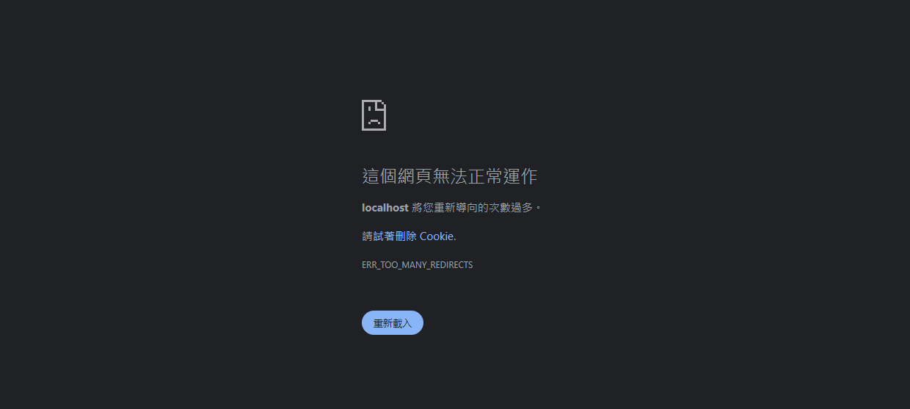
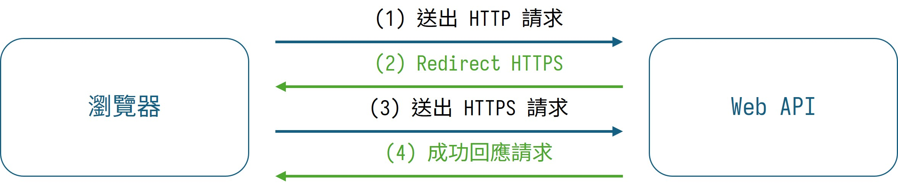
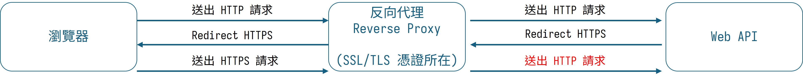

> 🔖 長話短說 🔖
> 
> 在 Reverse Proxy 與 Web API 的架構，若發生無限重定向的問題。請確認 Reverse Proxy 是否固定使用 HTTP 導向 Web API；或 Web API 強制將 HTTP 重定向到 HTTPS。

最近把使用 ASP.NET Core 寫的 Web API 掛到有反向代理(Reverse Proxy) 的系統架構。

明明 API 就只有單純的回傳資訊，但卻出現在瀏覽器出現 `ERR_TOO_MANY_REDIRECTS` 、Postman 出現 `Error: Exceeded maxRedirects. Probably stuck in a redirect loop`、或是 Insomnia 出現 `Error: Number of redirects hit maximum amount` 的錯誤訊息。

明眼人一看，就知道是 Redirect 重定向過多造成的錯誤。

而將新開發的 Web API 架設在使用反向代理(Reverse Proxy) 的環境時，遇到這個問題，就順手記錄下來。

<!--more-->



Ps. 個人習慣把`Redirection` 重定向，稱為轉導。所以在下面文章，會使用轉導的名詞。

## ASP.NET Core 預設的 Https Redirection

當我們建立 ASP.NET Core 的 Web API 專案時，專案一建立起來，就在 `program.cs` 內看到 `use.UseHttpsRedirection()` 這一行。

這行會讓使用 HTTP 的請求，強制轉導到 HTTPS。

```csharp
// Program.cs 的部份程式區塊

var app = builder.Build();

// Configure the HTTP request pipeline.
if (app.Environment.IsDevelopment())
{
    app.UseSwagger();
    app.UseSwaggerUI();
}

// 強制 HTTP -> HTTPS
app.UseHttpsRedirection();

app.UseAuthorization();

app.MapControllers();
```

## 轉導情境

### 正常: Web API 可接收 HTTP/HTTPS 的請求



當 Web API 收到 HTTP 請求後，因為 Web API 內有 HTTPS Redirection 的機制，會回應 Browser 使用 HTTPS 來訪問 API。

而 Web API 使用 HTTPS 請求後，就會進行 API 內的處理，並回應處理結果。

### 異常: Web API 在 Reverse Proxy 下，只能接收到 HTTP 請求



1. 當 Browser 對 Reverse Proxy 發出 HTTP 請求時，若 Reverse Proxy 沒有對 HTTP 請求阻擋或轉導時，會繼續將 HTTP 請求導向 Web API。
2. 此時，因為 Web API 內，使用 `UseHttpsRedirection` 強制將 HTTP Redirection HTTPS。Browser 會收到 Redirection 的回應。
3. Browser 再次對 Reverse Proxy 發出 HTTPS 請求。而 Reverse Proxy 的設定，在檢查與驗證 SSL/TLS 完成後，使用 HTTP 的方式，向 Web API 發出請求。
4. Web API 收到 HTTP 請求，再次透過 `UseHttpsRedirection` 強制將 HTTP Redirection HTTPS 。

在上述 3 與 4 的步驟，造成一直對 Web API 發送 HTTP 請求，而 Web API 不停的回應 Redirection HTTPS 的惡意循環。

在知道問題發生的原因後，排除問題的作法有兩種：

### 解法一：移除 UseHttpsRedirection (最快)

最簡單暴力的解法，就是直接拔掉 `program.cs` 裡的 `app.UseHttpsRedirection();`。反正 HTTPS 交給前端 Reverse Proxy 負責，Web API 就安分守己收 HTTP 即可。

### 解法二：使用 ForwardedHeadersMiddleware (官方推薦)

雖然拔除最快，但在某些需要知道 Client 端真實 Protocol 或 IP 的場景下 (例如產生完整 URL)，比較正統的做法是掛載 **ForwardedHeadersMiddleware**。

透過設定 `X-Forwarded-Proto` 標頭，讓 Kestrel 知道原始請求其實是 HTTPS：

```csharp
using Microsoft.AspNetCore.HttpOverrides;

// 在 app.UseHttpsRedirection() 之前加入
app.UseForwardedHeaders(new ForwardedHeadersOptions
{
    ForwardedHeaders = ForwardedHeaders.XForwardedFor | ForwardedHeaders.XForwardedProto
});
```

當然，前提是你的 Reverse Proxy (如 Nginx 或 IIS) 也要設定轉發 `X-Forwarded-Proto` 與 `X-Forwarded-For` 標頭。這能讓系統從「除錯解法」升級為「微軟官方推薦的最佳實踐」。

## 小結

哈哈，這個無限轉導的問題，造成的原因明明是 Web API 強制將 HTTP 轉導 HTTPS，但沒有確定反向代理的規則，搞的像是被反向代理綁架了一樣，怎麼請求都只能回傳 307。

仔細檢查，原來是 ASP.NET Core Web API 預設裝了個「你給我 HTTP ，我就重定向你用 HTTPS」的東西，跟反向代理那「我就只給你 HTTP ，你能咋地」的個性，碰撞出無限大的火花(意外)。

就算軟體再簡單，若沒有釐清系統內各服務的邊界規則，還是會在出乎意料外的地方絆倒。

---

> 💡 **互動時間**
> 你在設定系統架構時，有沒有被哪些微軟預設配置「聰明反被聰明誤」過？或是你現在是用 Nginx、IIS 還是 Traefik 當你的 Proxy？留言交流一下你的架構配置吧！
