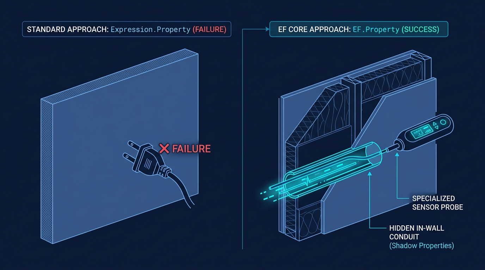

> 🔖 長話短說 🔖
>
> ℹ️ **系列導讀**：本文屬於「EF Core 實戰系列」，完整系統性教學請參見 [EF Core 實戰系列從指令到進階應用總整理](../ef-core-series-overview/index.md)。
>
> - **架構矛盾**：為了追求領域模型純粹，透過 T4 模板將 `ShopId`、`IsDeleted` 等欄位封裝為 Shadow Property（陰影屬性）；但試圖在 `HasQueryFilter` 透過動態 Expression Tree 進行全域過濾時，編譯雖然通過，執行時期卻直接噴出 `ArgumentException`。
> - **核心病灶**：Shadow Property 僅存在於 EF Core Model Metadata 中，C# CLR 實體類別中並無此屬性。直接呼叫 `Expression.Property` 會走標準反射尋找屬性，必然查無此屬性。
> - **讀取端解法**：改用 `Expression.Call` 動態呼叫 EF Core 內建的標記方法 `EF.Property<T>(entity, "PropertyName")`，讓 EF Core 查詢解譯器在轉譯 SQL 時自 Metadata 提取欄位。
> - **寫入端雙軌實踐**：傳統做法可直接在 `DbContext` 覆寫 `SaveChanges()`，透過 `entry.Property("PropertyName").CurrentValue` 指派陰影欄位；現代分層架構則推薦抽離為獨立的 `SaveChangesInterceptor`，達成業務模型與資料庫上下文徹底解耦。

在追求乾淨架構（Clean Architecture）與領域驅動設計（DDD）的過程中，很多架構師都會面臨一個兩難局面：

系統中存在大量非業務中繼欄位（例如多租戶識別碼 `ShopId`、軟刪除標記 `IsDeleted`、審計時間戳 `CreatedAt` 等）。若將這些欄位堂而皇之地掛在 POCO Entity 類別上，上層業務程式碼便隨處可見，甚至可能被開發者誤改。

初接觸的朋友常會問：「既然 C# 實體類別被剃除了這些屬性，EF Core 到底憑什麼知道資料庫有這些欄位？」答案在於 **Model Metadata（模型中繼資料）**：在資料庫層面，它依然是貨真價實的實體欄位（Physical Column）。當我們透過 T4 模板刻意不在 C# 類別宣告屬性時，Scaffold 引擎或開發者會在 `DbContext.OnModelCreating` 中透過 Fluent API（如 `entity.Property<int>("ShopId")`）向 EF Core 註冊。這讓欄位在 C# 業務模型中徹底「隱形」，卻在 EF Core 底層中繼資料中具備完整定義，由框架進行中繼管理。

因此，不少團隊會運用 [T4 CodeTemplate 客製化 Scaffold 模型生成](../dotnet-ef-core-customized-dbcontext-entity/index.md)，將這些欄位從實體類別中徹底排除，轉為 EF Core 的 **Shadow Property（陰影屬性）**。

緊接著，為了落實企業級存取防護，團隊又導入了 [EF Core 全域資料存取防護指南](../efcore-hasqueryfilter-and-savechanges-interceptor-guide/index.md) 中推薦的 **`HasQueryFilter`**，希望透過動態 Expression Tree 自動為所有實體掛上租戶或軟刪除過濾。

然而，當這兩種看似完美的設計在實務中相遇時，若直接套用常見的動態過濾器寫法，就會遇上一個讓人困惑的執行時期例外。

<!--more-->

## 踩雷現場：編譯綠燈，執行時期拋出例外

為了實現全自動動態掛載，開發者通常會在 `DbContext.OnModelCreating` 中遍歷所有實體，並直接套用標準的 Expression Tree 組合過濾條件：

```csharp
public partial class LabContext : DbContext
{
    partial void OnModelCreatingPartial(ModelBuilder modelBuilder)
    {
        var currentShopId = this.GetShopId();

        foreach (var entityType in modelBuilder.Model.GetEntityTypes())
        {
            var property = entityType.GetProperties()
                                     .SingleOrDefault(prop => prop.Name == "ShopId");

            if (property == null) continue;

            var parameter = Expression.Parameter(entityType.ClrType, "e");

            // ⚠️ 埋下地雷：直覺呼叫 Expression.Property
            var filterExpr = Expression.Equal(
                Expression.Property(parameter, property.Name),
                Expression.Constant(currentShopId));

            modelBuilder.Entity(entityType.ClrType)
                        .HasQueryFilter(Expression.Lambda(filterExpr, parameter));
        }
    }
}
```

這段程式碼在 Visual Studio 或 CI/CD Pipeline 建置時**完全沒有任何編譯錯誤**。

但當應用程式啟動、處理第一支查詢 API 時，系統立刻拋出以下致命例外：

```text
System.ArgumentException: Property 'ShopId' is not defined for type 'Lab.Models.Store'
   at System.Linq.Expressions.Expression.Property(Expression expression, String propertyName)
   at LabContext.OnModelCreatingPartial(ModelBuilder modelBuilder)
```

明明在 `entityType.GetProperties()` 裡確實找到了名為 `ShopId` 的屬性，為什麼 Expression Tree 卻指責「該屬性未定義」？

### 生活化降維比喻：白牆上的隱藏暗管

這就像你請裝潢水電工把客廳雜亂的電線全部封進了**「牆壁暗管（Shadow Property）」**裡，讓外觀維持純白極簡、看不到任何雜亂電線；

但是新來的物業保全（`HasQueryFilter`）在巡邏時，卻拿著一般住戶電器的標準三孔插頭（`Expression.Property`），試圖往平整光滑的白牆上硬插。保全當然找不到插座，只能當場崩潰警報。

要接通暗管裡的電流，保全不能使用一般插頭，而必須攜帶專門的**「暗管對接儀（`EF.Property`）」**，直接穿透牆面與內部的隱藏線路建立連線。



### 核心病灶解析

```mermaid
flowchart TD
    subgraph ErrorPath ["❌ 錯誤路徑：Expression.Property (標準 CLR 反射)"]
        E1["LINQ 查詢產生 Expression.Property(parameter, 'ShopId')"] --> E2[".NET 反射在 Store 類別尋找 public int ShopId"]
        E2 --> E3["[Store CLR 實體類別]<br/>(欄位已被封裝為陰影屬性，類別中無此 Property！)"]
        E3 --> E4["💥 拋出 ArgumentException:<br/>Property 'ShopId' is not defined for type 'Store'"]
    end

    subgraph CorrectPath ["✅ 正確路徑：Expression.Call + EF.Property (Model Metadata 橋接)"]
        C1["動態呼叫 EF.Property&lt;int&gt;(e, 'ShopId')"] --> C2["EF Core 查詢解譯管線 (Query Pipeline)"]
        C2 --> C3["自 DbContext Model Metadata 成功提取陰影欄位"]
        C3 --> C4["順利轉譯底層 SQL:<br/>WHERE s.ShopId = @currentShopId"]
    end

    classDef err fill:#ffeef0,stroke:#f85149,stroke-width:1px,color:#333
    classDef ok fill:#f0f7ff,stroke:#0969da,stroke-width:1.5px,color:#333

    class E1,E2,E3,E4 err
    class C1,C2,C3,C4 ok
```



1. **`Expression.Property` 的盲點**：底層依賴標準 .NET 反射去實體類別（`Store`）中尋找名為 `ShopId` 的 CLR Property。但因為該欄位早已被轉換為 Shadow Property，實體類別中根本不存在這個屬性。
2. **`EF.Property<T>` 的本質**：它是 EF Core 專門為 Shadow Property 設計的靜態標記方法。在一般 LINQ 查詢中我們常寫 `EF.Property<int>(x, "ShopId")`，這段程式碼不會真的執行方法本身，而是在查詢編譯時期被 EF Core 攔截，直接對映到底層資料庫的欄位名稱。
3. **通用相容性（Universal Compatibility）**：值得特別強調的是，`EF.Property<T>` 不僅能存取陰影屬性，**同樣能精確存取一般 CLR 公開屬性**！這意味著這套動態過濾機制具備高度的普適性，即便系統中某些舊表維持公開屬性、新表改為陰影屬性，也不需要額外撰寫分支判斷，一律透過 `EF.Property` 就能優雅通吃。

## 讀取端解法：運用 Expression.Call 召喚 EF.Property

既然不能走標準反射，我們就必須在 Expression Tree 中動態生成對 `EF.Property<TProperty>(entity, propertyName)` 的方法呼叫。

### 為什麼平常寫 LINQ 很簡單，這裡卻要組裝 Expression.Call？

初接觸動態過濾的朋友常會疑惑：「平常查資料時寫 `_context.Stores.Where(s => EF.Property<int>(s, "ShopId") == 1)` 只要一行，為什麼這裡要寫得這麼複雜？」

關鍵在於**編譯期強型別 vs 執行期動態掃描**：

- 平常寫 LINQ 時，C# 編譯器在編譯期就已經知道實體型別是 `Store`、欄位型別是 `int`，編譯器會自動幫我們把程式碼編譯成 Expression Tree。
- 但在 `OnModelCreating` 中，我們面對的是從資料庫動態掃描出來的數十個 Entity 實體。在編譯期我們無法預知實體型別與欄位型別，無法寫死強型別的泛型 Lambda，因此必須親手使用 `Expression.Call` 為 EF Core 組裝出呼叫 `EF.Property` 的語法節點。

以下是經過生產環境驗證、兼顧多租戶安全防護的完整實作：

```csharp
using System.Linq.Expressions;
using Microsoft.EntityFrameworkCore;

public partial class LabContext : DbContext
{
    private readonly ITenantProvider _tenantProvider;

    // 公開動態租戶屬性，供 EF Core 每次查詢時即時讀取
    public int CurrentShopId => _tenantProvider.GetCurrentShopId();

    public LabContext(DbContextOptions<LabContext> options, ITenantProvider tenantProvider)
        : base(options)
    {
        _tenantProvider = tenantProvider;
    }

    partial void OnModelCreatingPartial(ModelBuilder modelBuilder)
    {
        foreach (var entityType in modelBuilder.Model.GetEntityTypes())
        {
            var property = entityType.GetProperties()
                                     .SingleOrDefault(prop => prop.Name == "ShopId");

            if (property == null) continue;

            // 1. 建立參數表達式 (ParameterExpression)
            var parameter = Expression.Parameter(entityType.ClrType, "e");

            // 2. 動態建構 EF.Property<T>(e, property.Name)
            //    關鍵在於傳入 property.ClrType 作為泛型型別引數
            var shadowPropertyAccess = Expression.Call(
                typeof(EF),
                nameof(EF.Property),
                new[] { property.ClrType },
                parameter,
                Expression.Constant(property.Name));

            // 3. 建立動態成員存取：EF.Property<T>(e, "ShopId") == this.CurrentShopId
            // ⚠️ 關鍵：透過屬性存取 (MemberExpression) 繫結 DbContext 上的屬性，切勿使用 Expression.Constant！
            Expression currentShopProp = Expression.Property(
                Expression.Constant(this),
                nameof(CurrentShopId));

            // 若資料庫欄位為 Nullable (例如 int?)，需對齊左右兩側型別，避免 Expression.Equal 拋出運算子未定義例外
            if (property.ClrType != currentShopProp.Type)
            {
                currentShopProp = Expression.Convert(currentShopProp, property.ClrType);
            }

            var filterExpr = Expression.Equal(
                shadowPropertyAccess,
                currentShopProp);

            // 4. 動態套用 HasQueryFilter
            var lambda = Expression.Lambda(filterExpr, parameter);
            modelBuilder.Entity(entityType.ClrType).HasQueryFilter(lambda);
        }
    }
}
```

### 💡 動態組合的三大關鍵細節

1. **泛型型別參數必須精準匹配**：傳入 `new[] { property.ClrType }`，確保 `EF.Property<T>` 的型別引數與資料庫欄位的對映型別完全一致（例如 `int` 或 `Guid`），避免執行時期轉型失敗。若資料庫欄位為 Nullable（如 `int?`），需透過 `Expression.Convert` 將比較對象精確轉型對齊。
2. **共用同一個 ParameterExpression**：若需同時組合多個陰影條件（例如 `ShopId` 與 `IsDeleted`），務必確保傳入所有 `Expression.Call` 與最終 `Expression.Lambda` 的 `parameter` 變數是同一個實例，否則 EF Core 會拋出經典的 `NoNameParameter` 例外。
3. **⚠️ 致命避雷點：切勿使用 Expression.Constant 綁定動態租戶！**：  
   `OnModelCreating` 在應用程式生命週期中**預設只會執行一次**（模型會被快取在記憶體中）。若寫成 `Expression.Constant(currentShopId)`，第一位進站使用者的租戶 Id 就會被永遠寫死在快取中，導致後續所有其他店家的請求全部查出同一家店的資料，造成嚴重的跨租戶資料混淆與洩漏事故！務必如範例所示，透過 `Expression.Property(Expression.Constant(this), nameof(CurrentShopId))` 存取 DbContext 成員，EF Core 才會將其參數化為 `@__CurrentShopId_0`，在每次執行查詢時動態帶入當前請求的值。

## 寫入端防禦：陰影屬性的自動賦值與狀態維護（雙軌實作）

讀取端已經透過 `EF.Property` 完美轉譯，接下來是寫入端：既然實體類別上沒有這些 C# 屬性，開發者無法在業務層直接寫 `store.ShopId = currentShopId`。那麼在資料存檔時，我們該如何為陰影屬性自動賦值與更新軟刪除狀態？

在 EF Core 中，存取陰影屬性的核心關鍵在於 **`ChangeTracker`**——透過 `entry.Property("PropertyName").CurrentValue` 進行讀寫。

針對寫入端的架構整合，實務上有兩種常見實作途徑：

### 傳統直覺解法：在 DbContext 中覆寫 SaveChanges

對於尚未進行多專案拆分的中小型應用，或單一資料庫上下文的系統，最直接的方式是在 `DbContext` 中直接覆寫 `SaveChanges` 與 `SaveChangesAsync`：

```csharp
public partial class LabContext : DbContext
{
    public override int SaveChanges()
    {
        UpdateShadowProperties();
        return base.SaveChanges();
    }

    public override async Task<int> SaveChangesAsync(CancellationToken cancellationToken = default)
    {
        UpdateShadowProperties();
        return await base.SaveChangesAsync(cancellationToken);
    }

    private void UpdateShadowProperties()
    {
        var currentShopId = GetCurrentShopId();
        var now = DateTimeOffset.UtcNow;

        foreach (var entry in ChangeTracker.Entries())
        {
            // 1. 新增時設定 ShopId 與 CreatedAt
            if (entry.State == EntityState.Added)
            {
                if (entry.Metadata.FindProperty("ShopId") != null)
                {
                    entry.Property("ShopId").CurrentValue = currentShopId;
                }

                if (entry.Metadata.FindProperty("CreatedAt") != null)
                {
                    entry.Property("CreatedAt").CurrentValue = now;
                }
            }

            // 2. 修改時自動刷新 UpdatedAt
            if (entry.State == EntityState.Modified)
            {
                if (entry.Metadata.FindProperty("UpdatedAt") != null)
                {
                    entry.Property("UpdatedAt").CurrentValue = now;
                }
            }

            // 3. 刪除時就地轉換為軟刪除標記（採用屬性級更新，避免 Stub 實體未載入欄位被覆寫為 NULL）
            if (entry.State == EntityState.Deleted)
            {
                if (entry.Metadata.FindProperty("IsDeleted") != null)
                {
                    // ⚠️ 關鍵細節：先退回 Unchanged，避免發送全欄位 UPDATE
                    entry.State = EntityState.Unchanged;

                    var isDeletedProp = entry.Property("IsDeleted");
                    isDeletedProp.CurrentValue = true;
                    isDeletedProp.IsModified = true;

                    if (entry.Metadata.FindProperty("DeletedAt") != null)
                    {
                        var deletedAtProp = entry.Property("DeletedAt");
                        deletedAtProp.CurrentValue = now;
                        deletedAtProp.IsModified = true;
                    }
                }
            }
        }
    }
}
```

> 💡 **生產環境避雷提醒：為何不可直接將 entry.State 設為 Modified？**  
> 在實務開發中，透過 `_context.Remove(new Store { Id = id })` 附加只有主鍵的 Stub 實體進行刪除是極為常見的做法。若直接執行 `entry.State = EntityState.Modified`，EF Core 會把實體的所有未載入欄位（如店家名稱、地址等）視為變更，發送 SQL UPDATE 時直接將現有資料洗成 NULL 或預設值！改為先退回 `Unchanged` 再精準指定 `IsModified = true`，產生的 SQL 就只會更新軟刪除與時間戳欄位，達到生產級的安全防護。

#### 架構權衡與副作用分析

- **優點**：快速直覺，無需額外配置依賴注入，所有邏輯集中在 DbContext 內部。
- **副作用**：隨著欄位邏輯膨脹，`DbContext` 容易演變成包含過多審計職責的神類別（God Class），且若有多個 DbContext 時難以橫向共用。

### 現代架構推薦：抽離為獨立的 SaveChangesInterceptor

當系統走向 Clean Architecture、多類別庫分層，或採用 .NET 7 / 8 / 9+ 時，更推薦採用 **`SaveChangesInterceptor`（異動攔截器）**。這能讓資料庫上下文保持單純的模型定義，將橫切關注點完全解耦：

```csharp
using System;
using System.Threading;
using System.Threading.Tasks;
using Microsoft.EntityFrameworkCore;
using Microsoft.EntityFrameworkCore.Diagnostics;

namespace Infrastructure.Persistence.Interceptors;

public class ShadowPropertyInterceptor : SaveChangesInterceptor
{
    private readonly ITenantProvider _tenantProvider;

    public ShadowPropertyInterceptor(ITenantProvider tenantProvider)
    {
        _tenantProvider = tenantProvider;
    }

    public override InterceptionResult<int> SavingChanges(
        DbContextEventData eventData, 
        InterceptionResult<int> result)
    {
        UpdateShadowProperties(eventData.Context);
        return base.SavingChanges(eventData, result);
    }

    public override ValueTask<InterceptionResult<int>> SavingChangesAsync(
        DbContextEventData eventData, 
        InterceptionResult<int> result, 
        CancellationToken cancellationToken = default)
    {
        UpdateShadowProperties(eventData.Context);
        return base.SavingChangesAsync(eventData, result, cancellationToken);
    }

    private void UpdateShadowProperties(DbContext? context)
    {
        if (context == null) return;

        var currentShopId = _tenantProvider.GetCurrentShopId();
        var now = DateTimeOffset.UtcNow;

        foreach (var entry in context.ChangeTracker.Entries())
        {
            if (entry.State == EntityState.Added)
            {
                if (entry.Metadata.FindProperty("ShopId") != null)
                {
                    entry.Property("ShopId").CurrentValue = currentShopId;
                }

                if (entry.Metadata.FindProperty("CreatedAt") != null)
                {
                    entry.Property("CreatedAt").CurrentValue = now;
                }
            }

            if (entry.State == EntityState.Modified)
            {
                if (entry.Metadata.FindProperty("UpdatedAt") != null)
                {
                    entry.Property("UpdatedAt").CurrentValue = now;
                }
            }

            if (entry.State == EntityState.Deleted)
            {
                if (entry.Metadata.FindProperty("IsDeleted") != null)
                {
                    entry.State = EntityState.Unchanged;

                    var isDeletedProp = entry.Property("IsDeleted");
                    isDeletedProp.CurrentValue = true;
                    isDeletedProp.IsModified = true;

                    if (entry.Metadata.FindProperty("DeletedAt") != null)
                    {
                        var deletedAtProp = entry.Property("DeletedAt");
                        deletedAtProp.CurrentValue = now;
                        deletedAtProp.IsModified = true;
                    }
                }
            }
        }
    }
}
```

#### 容器整合：在 Program.cs 完成攔截器掛載

在 DI 容器中將攔截器註冊為 Scoped，並於 `AddDbContext` 時透過 `AddInterceptors` 掛載：

```csharp
builder.Services.AddScoped<ShadowPropertyInterceptor>();

builder.Services.AddDbContext<AppDbContext>((sp, options) =>
{
    var interceptor = sp.GetRequiredService<ShadowPropertyInterceptor>();
    options.UseSqlServer(builder.Configuration.GetConnectionString("DefaultConnection"))
           .AddInterceptors(interceptor);
});
```

無論採用哪種解法，核心思路都是一致的：**上層業務邏輯完全不需要宣告 `ShopId` 或 `IsDeleted`，實體類別保持絕對純粹；而底層在寫入時透過 ChangeTracker 為陰影欄位賦值，在讀取時由 `HasQueryFilter` 搭配 `EF.Property` 自動過濾，達成高內聚的讀寫協同防護機制。**

## 陰影屬性存取與過濾故障排查指南

在評估是否導入陰影屬性前，不少務實的工程師常會問：「在實體上明確寫一個 `public int ShopId { get; set; }` 只要 1 秒鐘，為什麼要大費周章用 T4 模板挖掉它，再寫一堆表達式樹與攔截器？這算不算過度設計？」

這本質上是**領域模型純粹度 vs 開發維護成本**的權衡：

- **適合採用陰影屬性的場景**：中大型團隊多人協同開發、企業級多租戶 SaaS、或是對資料審計有嚴格資安法規要求的系統。將租戶與審計欄位收進陰影屬性，能從架構層面杜絕開發者在業務程式碼中手動指派或誤改欄位的值。
- **建議保留公開屬性的場景**：團隊人數少（1~3人）、業務邏輯以快速 CRUD 為主、或是大量使用 Dapper 等輕量 ORM 混合查詢的系統。此時在實體保留明確屬性更直覺，排錯成本也更低。

當團隊同時運用 Shadow Property、Expression Tree 與攔截器時，若遭遇異常，可參照以下 If-Then 故障排查決策表快速定位病灶：

| 排查場景 / 異常現象 | 根本原因 | 推薦解決策略 (If-Then) | 關注重點與防呆 |
| :--- | :--- | :--- | :--- |
| **`Expression.Property` 拋出 `ArgumentException`** | 欄位已在 T4 轉為 Shadow Property，CLR 實體類別中無此公開屬性 | **改用 `Expression.Call` 搭配 `EF.Property<T>` 動態建構表達式** | 必須傳入正確的屬性型別引數 `new[] { prop.ClrType }` |
| **動態過濾拋出 `InvalidOperationException` (運算子未定義)** | 資料庫欄位為 Nullable（如 `int?`），與租戶提供者的強型別（`int`）未對齊 | **使用 `Expression.Convert` 將比較節點轉型對齊** | `Expression.Convert(currentShopProp, property.ClrType)` |
| **LINQ 轉譯拋出 `NoNameParameter` 例外** | 在同一個實體的多個條件中，各自宣告了不同的 `ParameterExpression` 實例 | **在整個迴圈中共用同一個 `ParameterExpression` 變數** | 確保傳入 `Expression.Call` 與 `Expression.Lambda` 為同一實例 |
| **軟刪除時未載入欄位被洗成 NULL** | 遇到 Stub 實體時直接指定 `entry.State = Modified`，導致整顆實體欄位被覆寫 | **先置為 `Unchanged`，再以屬性級 `IsModified = true` 精準更新** | 僅更新 `IsDeleted` 與 `DeletedAt`，保護未載入資料 |
| **寫入端存取時拋出 `InvalidOperationException`** | 實體並未包含該陰影屬性，直接硬呼叫 `entry.Property("X")` | **先透過 `entry.Metadata.FindProperty("X") != null` 防呆檢查** | 避免對不具備該欄位的實體盲目賦值 |
| **寫入端架構選型猶豫** | 單體小型專案 vs 現代分層架構的抉擇 | **小型專案選「覆寫 SaveChanges」；企業級分層選「SaveChangesInterceptor」** | 攔截器具備高內聚、隨插即用與單元測試友善優勢 |
| **批次操作 `ExecuteUpdate` 時陰影屬性未更新** | `ExecuteUpdate()` 與 `ExecuteDelete()` 直接下達 SQL，跳過 ChangeTracker | **需在 LINQ `SetProperty` 顯式指派，或交由資料庫層級 Trigger 作為最後一道防線** | 巨量批次更新屬於橫切旁路，攔截器不會觸發 |

## 💡 深入實戰的常見疑問 (FAQ)

這套結合「陰影屬性 ＋ 全域過濾 ＋ 攔截器」的架構在領域封裝上非常俐落，但在面對真實生產環境的極限邊界時，實務上我們常會遇到以下幾個深入的關鍵問題：

### Q1：當外鍵（Foreign Key）也是陰影屬性時，新增子關聯實體會不會外鍵衝突？

**實際遇到的狀況**：  
如果 `Order` 與 `OrderItem` 上的租戶外鍵 `ShopId` 都是陰影屬性，當我們在業務層建立關聯 `order.Items.Add(new OrderItem())` 時，子實體並沒有手動指定 `ShopId`，存檔時會不會拋出資料庫外鍵約束例外？

**原因解析與建議作法**：  
EF Core 的 ChangeTracker 具備**關聯外鍵自動修補（Relationship Fixup）**機制：

1. **導覽屬性關聯新增**：當主實體（`Order`）與子實體（`OrderItem`）以導覽屬性掛載時，攔截器為父實體賦予 `ShopId` 後，EF Core 在偵測變更並生成 SQL 時，會自動將外鍵值同步至已關聯的子實體陰影外鍵上，不會發生外鍵遺漏。
2. **單獨新增子實體**：若業務邏輯是直接單獨新增 `_context.OrderItems.Add(newItem)`，攔截器必須遍歷所有變更實體，確保為每個具備 `ShopId` 陰影欄位的實體統一補齊租戶值。

### Q2：Dapper 或原生 SQL（FromSqlRaw）能否存取陰影屬性？

**實際遇到的狀況**：  
很多團隊在微服務或 CQRS 架構中，採用「EF Core 負責寫入、Dapper 負責高效能讀取」。如果資料庫欄位被 EF Core 設為 Shadow Property，Dapper 還能查得到嗎？

**原因解析與建議作法**：  

- **資料庫層級**：在資料庫內部，該欄位是真實存在的實體欄位，原生 SQL 依然可以正常下達 `SELECT ShopId, Name FROM Stores`。
- **物件對映限制**：但若使用 Dapper 嘗試將查詢結果直接反序列化至該 C# 實體（`Store`），因為實體類別上沒有 `ShopId` 公開屬性，Dapper 的自動映射器會直接忽略該欄位。
- **建議作法**：對於混合 Dapper 的系統，強烈建議依循 CQRS 原則，為查詢端建立專屬的平鋪 DTO（例如 `StoreReadDto`），在 DTO 上宣告完整的公開屬性接收資料庫欄位，即可完美兼顧效能與封裝。

### Q3：每次 SaveChanges 遍歷 ChangeTracker 檢查 FindProperty，會不會有反射效能損耗？

**實際遇到的狀況**：  
當遇到單次請求需儲存上千筆資料的批次匯入情境，攔截器在迴圈中對每個 entry 呼叫 `entry.Metadata.FindProperty("ShopId")`，會不會造成嚴重的反射效能開銷？

**原因解析與建議作法**：  

- **Metadata 查詢極為輕量**：`entry.Metadata` 存取的是 EF Core 在應用程式啟動時已編譯好的唯讀 Model Metadata（內部由 Dictionary 字典快取索引），查詢時間複雜度為 $O(1)$，**並非耗時的 .NET Runtime Reflection**。
- **超大批次建議**：雖然查詢開銷極小，但在處理上萬筆資料的巨量寫入時，逐筆進入 ChangeTracker 本身就會佔用大量記憶體。此時建議改用 EF Core 7+ 的 `ExecuteUpdateAsync` 批次語法，或使用專門的 Bulk Insert 套件，直接在 SQL 端完成批次處理。

### Q4：如果是超級管理員需要切換分店檢視資料，該如何動態指定 ShopId？

**實際遇到的狀況**：  
一般店家登入時綁定自己的 `ShopId` 毫無懸念，但如果是總部主管登入後台，想要在下拉選單切換查看「台北分店」或「高雄分店」的營收，既然實體類別沒有 `ShopId` 屬性，該如何做到動態指定？

**原因解析與建議作法**：  
有兩種優雅實作途徑：

1. **上下文狀態動態切換**：在 `ITenantProvider` 中支援模擬切換功能（Impersonation），當管理員選擇分店時，將連線上下文的 `CurrentShopId` 動態重設為目標分店，全域過濾器便會自動過濾為該分店資料。
2. **顯式繞過全域過濾**：使用 `.IgnoreQueryFilters()` 關閉全域過濾，並在 LINQ 中透過 `EF.Property` 顯式指定條件：

   ```csharp
   // 總部主管顯式調閱指定分店
   var taipeiStores = await _context.Stores
       .IgnoreQueryFilters()
       .Where(s => EF.Property<int>(s, "ShopId") == targetShopId)
       .ToListAsync();
   ```

### Q5：資料庫暫時性故障重試（ExecutionStrategy）時，攔截器狀態機如何確保冪等性？

**實際遇到的狀況**：  
當 EF Core 配置了重試策略（如 `EnableRetryOnFailure()`），若交易提交時遇到短暫網路抖動，EF Core 會自動重新執行程式碼區塊。如果攔截器在第一次執行時已經將實體退回 `Unchanged` 並標記了 `IsDeleted = true`，重試再次觸發時，狀態會不會產生錯亂？

**原因解析與建議作法**：  
攔截器必須確保**狀態變更的冪等性（Idempotency）**：

- 在攔截器處理軟刪除前，先檢查陰影屬性的當前值。若 `entry.Property("IsDeleted").CurrentValue` 已經是 `true`，代表該實體已被轉換過，應跳過重複指派時間戳，避免更新時間被刷新為重試當下的時間點。
- 此外，若重試徹底失敗拋出並行衝突（`DbUpdateConcurrencyException`），建議遵循最佳實踐：放棄當前已受污染的 DbContext 實例，重新開啟乾淨的 Scope 重新載入最新狀態。

### Q6：`ExecuteDelete()` 與 `ExecuteUpdate()` 跳過 ChangeTracker，軟刪除與陰影屬性失效如何因應？

**實際遇到的狀況**：  
EF Core 7+ 推出的 `ExecuteDeleteAsync()` 與 `ExecuteUpdateAsync()` 能大幅提升巨量資料操作的效能，但它們會直接將 LINQ 翻譯為 SQL 語句發送至資料庫，完全繞過 ChangeTracker 與 SaveChanges 流程，導致攔截器根本不會被觸發，軟刪除防護直接穿透。

**原因解析與建議作法**：  

- **架構約束與封裝**：對於必須軟刪除的實體，在倉儲層或領域服務中禁止暴露直接的 `ExecuteDelete`，改為使用 `ExecuteUpdate(s => s.SetProperty(...))` 顯式將 `IsDeleted` 與 `DeletedAt` 寫入更新語句中。
- **資料庫 Trigger 作為最後防線**：在安全性要求極高的企業級系統中，可於資料庫層級針對關鍵資料表配置 `INSTEAD OF DELETE` 觸發器（Trigger），將所有物理刪除指令在資料庫底層就地改寫為 UPDATE 軟刪除，徹底杜絕任何管道的誤刪風險。

## 簡單總結

在軟體架構的權衡中，**「極致的領域封裝」往往伴隨著「基礎設施適配的複雜度」**。

好的封裝從來不是單純把欄位藏起來，而是清楚劃分職責邊界——讓上層業務邏輯專注於純粹的商業規則，眼不見為淨；讓底層基礎設施透明地掌控全局資料的生命週期與存取合規。

將維運中繼欄位轉換為 Shadow Property，確實能讓 POCO 領域模型維持高度清爽；但我們也必須清楚理解 EF Core 底層 Model Metadata 與 C# CLR 型別系統的落差。透過 **`EF.Property` 守住讀取端的動態查詢**，配合 **`SaveChangesInterceptor` 在寫入端精準標記異動屬性**，我們就能在享受乾淨架構的同時，依然為生產環境構築起兼具彈性與韌性的資料防護網。

### 📋 陰影屬性與全域防護健檢清單

- [ ] 動態建構 `HasQueryFilter` 時，是否已對 Shadow Property 改用 `Expression.Call(typeof(EF), nameof(EF.Property), ...)`？
- [ ] 傳入 `EF.Property` 的泛型型別引數是否與資料庫欄位的 CLR 型別完全一致？
- [ ] 若資料庫欄位為 Nullable（如 `int?`），動態比較條件是否已透過 `Expression.Convert` 確保左右兩側型別精準對齊？
- [ ] 多租戶動態過濾器是否使用 `Expression.Property(Expression.Constant(this), ...)` 成員存取，避免 Model 快取造成跨租戶資料混淆與洩漏事故？
- [ ] 動態組合多條件 Expression Tree 時，是否全迴圈共用同一個 `ParameterExpression` 實例，避免 `NoNameParameter` 例外？
- [ ] 寫入端軟刪除是否採用屬性級 `IsModified = true` 精準更新，防範只有主鍵的 Stub 實體未載入欄位被覆寫為 NULL？
- [ ] 寫入端是否已評估專案規模，合理選用「覆寫 SaveChanges」或「獨立 SaveChangesInterceptor」？
- [ ] 針對 `ExecuteDelete` 等繞過 ChangeTracker 的批次操作，是否已建立 Trigger 兜底防禦或團隊架構約束？

---

> 💡 **互動時間**
>
> 你在專案中使用過 EF Core 的 Shadow Property 嗎？在處理審計欄位或多租戶標記時，你們團隊傾向保留在 POCO 類別上作為明確屬性，還是偏好隱藏為陰影屬性維持領域模型純粹？歡迎在下方留言分享你的架構權衡！

## 延伸閱讀

▶ 站內相關文章

- [使用 T4 CodeTemplate 客制化 EFCore Scaffold 產出內容](../dotnet-ef-core-customized-dbcontext-entity/index.md)
- [EF Core 資料存取防護全攻略：從 HasQueryFilter 全域過濾到 SaveChangesInterceptor 軟刪除與審計實戰](../efcore-hasqueryfilter-and-savechanges-interceptor-guide/index.md)
- [Entity Framework Core (EF Core) 實戰系列：從指令工具到進階應用總整理](../ef-core-series-overview/index.md)

▶ 外部參考

- [Shadow Properties - EF Core | Microsoft Learn](https://learn.microsoft.com/en-us/ef/core/modeling/shadow-properties)
- [Global Query Filters - EF Core | Microsoft Learn](https://learn.microsoft.com/en-us/ef/core/querying/filters)
- [EF.Property Method - Microsoft Learn](https://learn.microsoft.com/en-us/dotnet/api/microsoft.entityframeworkcore.ef.property)
