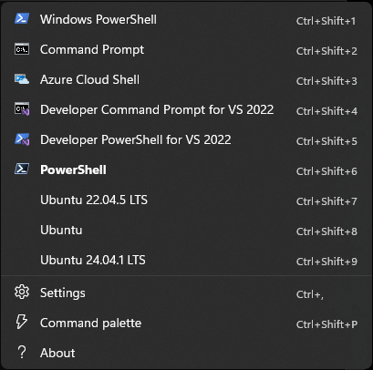
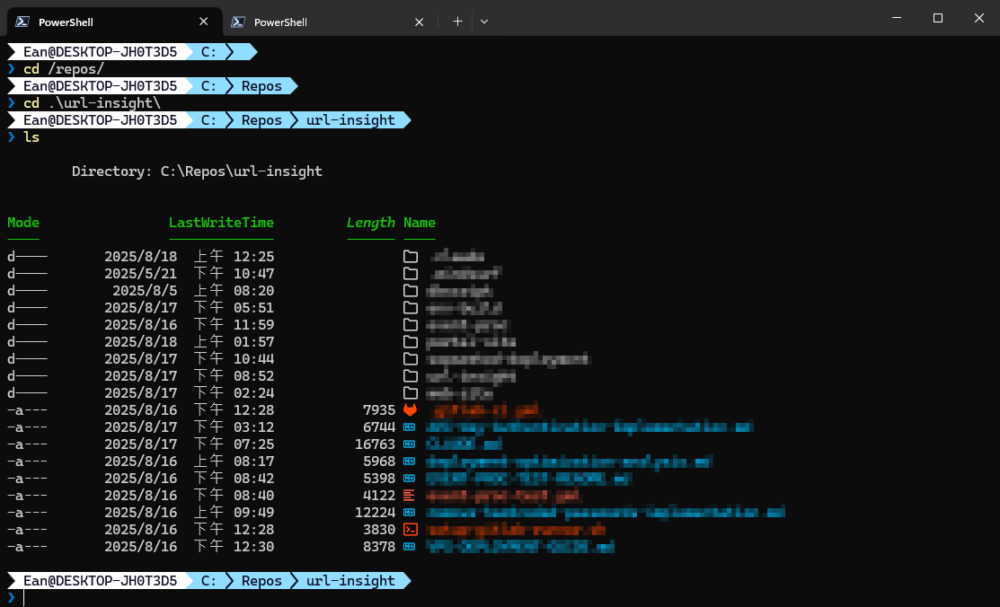
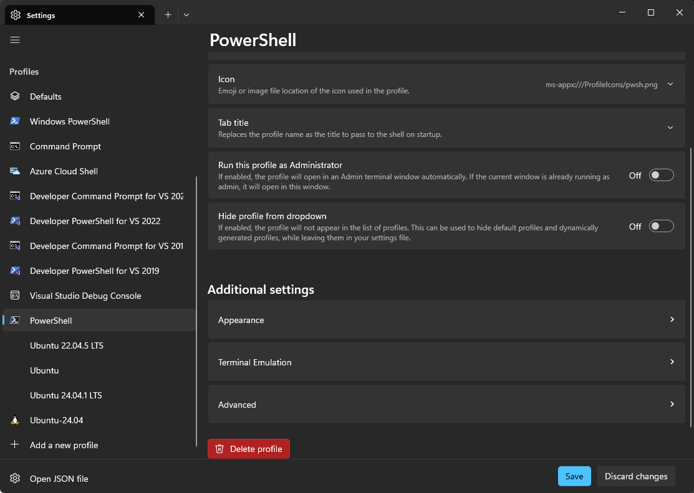
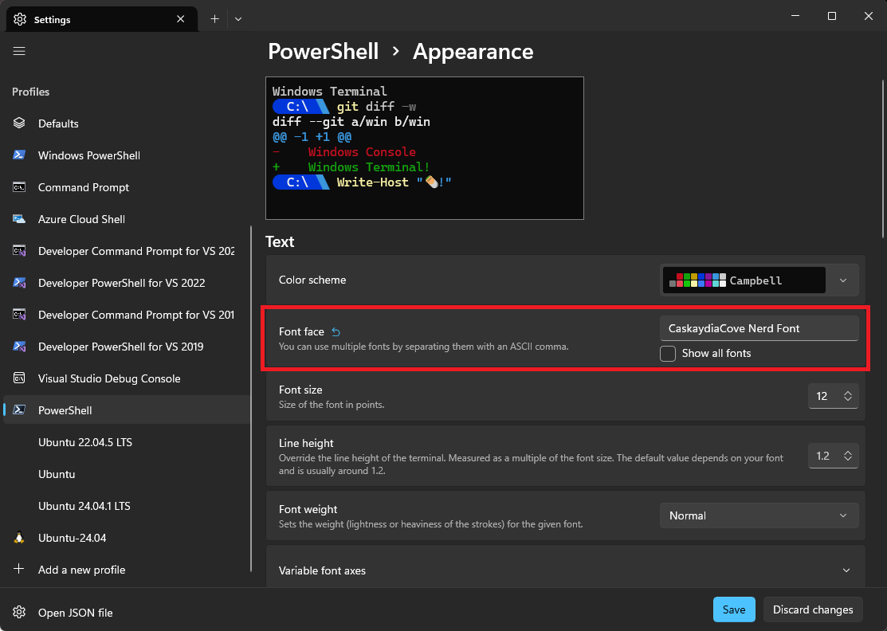

> 🔖 長話短說 🔖
> 
> 本文將引導你完成以下設定，快速打造現代化的 PowerShell 環境：
> 1.  使用 `winget` 一次性安裝 PowerShell 7、Windows Terminal、Oh My Posh 與 Nerd Font。
> 2.  設定 PowerShell 的 `$PROFILE`，讓終端機啟動時自動載入 Oh My Posh。
> 3.  在 Windows Terminal 中設定 Nerd Font 字型以正確顯示主題圖示。
> 4.  文末提供一個全自動安裝腳本，讓你一鍵完成所有設定。

以前看到使用 Mac 的同事的 Terminal 時，總覺得他們的視窗畫面很漂亮。

看到許多人的分享，使用 [Cmder](https://cmder.app/) 配合 [oh-my-zsh](https://ohmyz.sh/)，也可以在 Windows 中呈現個人喜歡的畫面。

後來，主力使用的 Terminal 改為 `Windows Terminal` 後，配合 `Poweshell 7` 後，在使用上沒有遇到特別的需求，沒有特別花心思去找尋相關的套件。

直到前陣子，無意中發現，有人分享 Windwos Terminal 與 [Oh My Posh](https://ohmyposh.dev/) 的設定，讓我忍不住在個人 Win11 的電腦，進行相關的設定。

## 套件的安裝與設定

在查找 Oh my posh 的安裝教學中，無意中發現，連 Microsoft 官方，都有設定的教程([Windows 終端機自訂提示設定 \| Microsoft Learn](https://learn.microsoft.com/zh-tw/windows/terminal/tutorials/custom-prompt-setup))，這算不算官方自已也在推薦。

隨著 CLI 使用習慣，讓我越來越懶的用 GUI 手動進行安裝。

最好可以一口氣，安裝或更新完成 `WindowsTerminal`、`PowerShell 7`、`OhMyPosh` 的套件。

在減少額外安裝作業的考量下，使用 Windows 內建的套件管理器 `winget` 來安裝所有需要的工具。

```powershell
# 安裝 Windows Terminal (支援多分頁與自訂外觀)
winget install --id Microsoft.WindowsTerminal --source winget -e

# 安裝 PowerShell 7 (新一代的命令列介面)
winget install --id Microsoft.PowerShell --source winget -e

# 安裝 Oh My Posh (強大的提示符主題引擎)
winget install JanDeDobbeleer.OhMyPosh -e
```

### Windows Terminal 設定

Windows Terminal 支援多個 Shell，像是 Windows PowerShell、PowerShell 等等的 shell。



個人期望開啟 Windows Terminal 時，開啟每一個分頁，預設使用 PowerShell。

必須到 Windows Terminal 的 Setting\Startup 中指定使用的 Shell。


### 設定 PowerShell 使用 Oh My Posh

接下來，就是要讓 Powershell 知道，每次啟用時，都要套用 Oh My Posh 的 Theme。

為此，必須去設定 Powershell 的 profile。

在 Shell 之中，使用以下的指令，呼叫  Notepad 開啟設定檔。

```powershell
notepad $PROFILE
```

⚠️ **注意**：如果出現錯誤訊息，提示找不到檔案，這代表你還沒有設定檔。請執行以下指令來建立一個新的設定檔，然後再重新執行 `notepad $PROFILE`。

```powershell
new-item -type file -path $profile -force
```

將以下這行程式碼複製，貼到 profile 檔案中，然後儲存並關閉。

讓 PowerShell 啟動時，就會進行 Oh My Posh 的初始化，並套用  `paradox.omp.json` 主題。

```powershell
oh-my-posh init pwsh --config "$env:POSH_THEMES_PATH\paradox.omp.json" | Invoke-Expression
```

完成設定後，重啟 Windows Terminal 後，畫面如下。



## 在 Windows Terminal 中，使用 Nerd Font

為了讓 Oh My Posh 的主題圖示能正確顯示，必須額外安裝支援 Nerd Font 的字型。

讓我們到 GitHub 中，去下載 Cascadia Code 的 Nerd Font ([Releases · microsoft/cascadia-code](https://github.com/microsoft/cascadia-code/releases))，這邊就不多描述手動進行字型的安裝了。

在文章記錄的當下，Cascadia Code 釋出最新版本為 `v2407.24.zip`，所以直接以此版本進行安裝。

```powershell
Invoke-WebRequest -Uri "https://github.com/microsoft/cascadia-code/releases/download/v2407.24/CascadiaCode-2407.24.zip" -OutFile "$env:TEMP\CascadiaCode-2407.24.zip"
Expand-Archive "$env:TEMP\CascadiaCode-2407.24.zip" "$env:TEMP\cc" -Force
$shell = New-Object -ComObject Shell.Application
$fonts = $shell.Namespace(0x14)
$fontFiles = Get-ChildItem "$env:TEMP\cc\ttf" -Filter "*.ttf"
$fonts.CopyHere("$env:TEMP\cc\ttf", 0x14)
Remove-Item "$env:TEMP\CascadiaCode-2407.24.zip", "$env:TEMP\cc" -Recurse -Force
```

### Windows Terminal 設定使用 Nerd Font

安裝完成 Cascadia Code 的 Nerd Font 

1.  開啟 Windows Terminal，點擊頂部標籤列右側的 **向下箭頭 (v)**，然後選擇 **「設定」** (或按 `Ctrl + ,`)。
2.  在左側的設定檔清單中，選擇 **「PowerShell」** (或是你預設的設定檔)。
3.  點擊 **「外觀」** 標籤頁。
4.  在 **「字型」** 的下拉選單中，找到並選擇 `CaskaydiaCove Nerd Font`。
5.  儲存設定後，重新開啟一個 PowerShell 分頁，你應該就能看到全新的提示符了！





## 自動安裝腳本

若不想分段進行安裝 CLI 的安裝、設定作業，可以使用以下的 `Powershell` 腳本，來自動進行安裝。

但安裝後，別忘了，還是要手動到 Windows Terminal 環境，進行設定。

```powershell
# install-ohmyposh.ps1

Write-Host "🚀 開始安裝作業" -ForegroundColor Cyan

# 1. 安裝所有必要工具
Write-Host "📦 正在安裝 Windows Terminal, PowerShell 7, Oh My Posh..."
winget install --id Microsoft.WindowsTerminal --source winget -e
winget install --id Microsoft.PowerShell --source winget -e
winget install JanDeDobbeleer.OhMyPosh -e

# 2. 明確設定 PowerShell 7 的 Profile 路徑
Write-Host "📝 正在設定 PowerShell 7 Profile..."

# 確保使用 PowerShell 7 的 profile 路徑
$pwsh7ProfilePath = "$env:USERPROFILE\Documents\PowerShell\Microsoft.PowerShell_profile.ps1"
$profileDir = Split-Path $pwsh7ProfilePath -Parent

# 建立目錄（如果不存在）
if (!(Test-Path $profileDir)) {
    New-Item -ItemType Directory -Path $profileDir -Force | Out-Null
    Write-Host "  - 已建立 PowerShell 7 Profile 目錄: $profileDir" -ForegroundColor Yellow
}

# 建立 Profile 檔案（如果不存在）
if (!(Test-Path $pwsh7ProfilePath)) {
    New-Item -ItemType File -Path $pwsh7ProfilePath -Force | Out-Null
    Write-Host "  - 已建立新的 PowerShell 7 Profile 檔案" -ForegroundColor Yellow
}

# 3. 設定 Oh My Posh 啟動指令
$content = @"
# Oh My Posh 設定
oh-my-posh init pwsh --config "`$env:POSH_THEMES_PATH\paradox.omp.json" | Invoke-Expression
"@

Set-Content -Path $pwsh7ProfilePath -Value $content -Encoding UTF8
Write-Host "  - 已將 Oh My Posh 啟動指令寫入 PowerShell 7 Profile" -ForegroundColor Green

# 4. 下載並安裝 Cascadia Code Nerd Font
Write-Host "📦 正在安裝 Cascadia Code Nerd Font..."

try {
    # 下載字體
    $fontUrl = "https://github.com/microsoft/cascadia-code/releases/download/v2407.24/CascadiaCode-2407.24.zip"
    $fontZip = "$env:TEMP\CascadiaCode-2407.24.zip"
    $fontExtractPath = "$env:TEMP\cc"
    
    Write-Host "  - 正在下載字體檔案..." -ForegroundColor Yellow
    Invoke-WebRequest -Uri $fontUrl -OutFile $fontZip
    
    Write-Host "  - 正在解壓縮..." -ForegroundColor Yellow
    Expand-Archive $fontZip $fontExtractPath -Force
    
    # 安裝字體
    Write-Host "  - 正在安裝字體..." -ForegroundColor Yellow
    $shell = New-Object -ComObject Shell.Application
    $fonts = $shell.Namespace(0x14)
    
    $fontFiles = Get-ChildItem "$fontExtractPath\ttf" -Filter "*.ttf"
    foreach ($fontFile in $fontFiles) {
        $fonts.CopyHere($fontFile.FullName, 0x14)
    }
    
    # 清理暫存檔案
    Remove-Item $fontZip, $fontExtractPath -Recurse -Force -ErrorAction SilentlyContinue
    Write-Host "  - 字體安裝完成" -ForegroundColor Green
}
catch {
    Write-Host "  ⚠️ 字體安裝失敗: $($_.Exception.Message)" -ForegroundColor Red
    Write-Host "  請手動下載安裝 Cascadia Code Nerd Font" -ForegroundColor Yellow
}

# 5. 顯示設定資訊
Write-Host "`n📋 設定摘要:" -ForegroundColor Cyan
Write-Host "  - PowerShell 7 Profile 位置: $pwsh7ProfilePath"
Write-Host "  - 使用主題: paradox"
Write-Host "  - 字體: Cascadia Code (Nerd Font)"

Write-Host "`n🎯 後續步驟:" -ForegroundColor Yellow
Write-Host "  1. 重新啟動 Windows Terminal"
Write-Host "  2. 確保 Windows Terminal 使用 PowerShell 7 作為預設 shell"
Write-Host "  3. 在 Windows Terminal 設定中將字體改為 'CascadiaCode NF'"

Write-Host "`n✅ 安裝完成！" -ForegroundColor Green
```

### 使用方式

1.  將腳本儲存為 `install-ohmyposh.ps1`。
2.  在 PowerShell 中，先執行以下指令來允許執行本地腳本：
    ```powershell
    Set-ExecutionPolicy RemoteSigned -Scope CurrentUser
    ```
3.  執行腳本：
    ```powershell
    .\install-ohmyposh.ps1
    ```

## 小結

在完成上述的設定作業後，就可以有一個美觀的 Terminal。

若對 Oh My Posh 的主題、Ferd Font 字型，想再進行更改，都有很大的自由發揮空間。

---

## 參考資料

▶ **外部文章**
*   [Nerd Fonts 官方網站](https://www.nerdfonts.com/font-downloads)
*   [在 Windows 終端機中設定 Powerline](https://learn.microsoft.com/zh-tw/windows/terminal/tutorials/custom-prompt-setup)
*   [Oh My Posh 官方文件](https://ohmyposh.dev/)
* [How to Install Nerd Fonts and Icons in PowerShell 7 on Windows 11 \| Blog](https://ardalis.com/install-nerd-fonts-terminal-icons-pwsh-7-win-11/)
