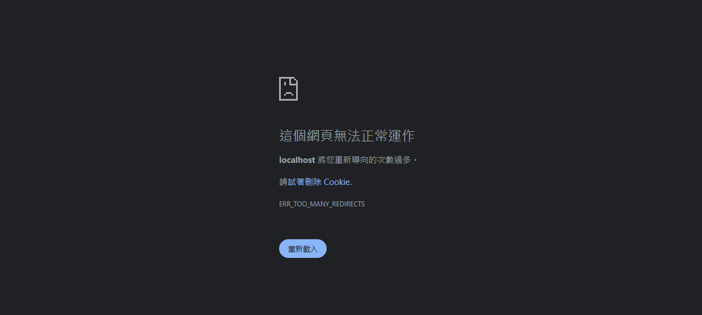

---
title: ASP.NET Core | 問題排除隨手記 - UseHttpsRedirection 造成的無限重定向異常
description: 排除 ASP.NET Core 無限重定向的問題。因系統架構限制 Web API 只能透過反向代理 (Reverse Proxy) 訪問，而反向代理使用 HTTP 訪問 Web API，但因為 Web API 中，使用 UseHttpsRedirection 強制重定向到 HTTPS。最終造成重定向次數過多的情形。
date: 2023-11-22T14:54:54+08:00
lastmod: 2023-11-27T23:32:55+08:00
tags:
  - ASP.NET
categories:
  - 開發雜談
  - 軟體開發
keywords:
  - ASP.NET Core
  - UseHttpsRedirection
  - "307"
  - ERR_TOO_MANY_REDIRECTS
  - 重定向
slug: use-https-redirection-cause-infinite-redirection
---

> 🔖 長話短說 🔖
> 
> 在 Reverse Proxy 與 Web API 的架構，若發生無限重定向的問題。請確認 Reverse Proxy 是否固定使用 HTTP 導向 Web API；或 Web API 強制將 HTTP 重定向到 HTTPS。

最近把使用 ASP.NET Core 寫的 Web API 掛到有反向代理(Reverse Proxy) 的系統架構。

明明 API 就只有單純的回傳資訊，但卻出現在瀏覽器出現 `ERR_TOO_MANY_REDIRECTS` 、Postman 出現 `Error: Exceeded maxRedirects. Probably stuck in a redirect loop`、或是 Insomnia 出現 `Error: Number of redirects hit maximum amount` 的錯誤訊息。

明眼人一看，就知道是 Redirect 重定向過多造成的錯誤。

而將新開發的 Web API 架設在使用反向代理(Reverse Proxy) 的環境時，遇到這個問題，就順手記錄下來。

<!--more-->


Ps. 個人習慣把`Redirection` 重定向，稱為轉導。所以在下面文章，會使用轉導的名詞。

## ASP.NET Core 預設的 Https Redirection

當我們建立 ASP.NET Core 的 Web API 專案時，專案一建立起來，就在 `program.cs` 內看到 `use.UseHttpsRedirection()` 這一行。

這行會讓使用 HTTP 的請求，強制轉導到 HTTPS。

```c#
// Program.cs 的部份程式區塊

var app = builder.Build();

// Configure the HTTP request pipeline.
if (app.Environment.IsDevelopment())
{
    app.UseSwagger();
    app.UseSwaggerUI();
}

// 強制 HTTP -> HTTPS
app.UseHttpsRedirection();

app.UseAuthorization();

app.MapControllers();
```

## 轉導情境

### 正常: Web API 可接收 HTTP/HTTPS 的請求


當 Web API 收到 HTTP 請求後，因為 Web API 內有 HTTPS Redirection 的機制，會回應 Broswer 使用 HTTPS 來訪問 API。

而 Web API 使用 HTTPS 請求後，就會進行 API 內的處理，並回應處理結果。

### 異常: Web API 在 Reverse Proxy 下，只能接收到 HTTP 請求


1. 當 Broswer 對 Reverse Proxy 發出 HTTP 請求時，若 Reverse Proxy 沒有對 HTTP 請求阻擋或轉導時，會繼續將 HTTP 請求導向 Web API。
2. 此時，因為 Web API 內，使用 `UseHttpsRedirections` 強制將 HTTP Redirection HTTPS。Broswer 會收到 Redirerction 的回應。
3. Browser 再次對 Reverse Proxy 發出 HTTPS 請求。而 Reverse Proxy 的設定，在檢查與驗證 SSL/TLS 完成後，使用 HTTP 的方式，向 Web API 發出請求。
4. Web API 收到 HTTP 請求，再次透過 `UseHttpsRedirections` 強制將 HTTP Redirection HTTPS 。

在上述 3 與 4 的步驟，造成一直對 Web API 發送 HTTP 請求，而 Web API 不停的回應 Redirection HTTPS 的惡意循環。

在知道問題發生的原因後，排除問題的作法就很容易。只要移除 `.UseHttpsRedirections` 的設定即可。

## 小結

哈哈，這個無限轉導的問題，造成的原因明明是 Web API 強制將 HTTP 轉導 HTTPS，但沒有確定反向代理的規則，搞的像是被反向代理綁架了一樣，怎麼請求都只能回傳 307。

仔細檢查，原來是 ASP.NET Core Web API 預設裝了個「你給我 HTTP ，我就重定向你用 HTTPS」的東西，跟反向代理那「我就只給你 HTTP ，你能咋地」的個性，碰撞出無限大的火花(意外)。

就算軟體再簡單，若沒有釐清系統內各服務的邊界規則，還是會在出乎意料外的地方絆倒。
